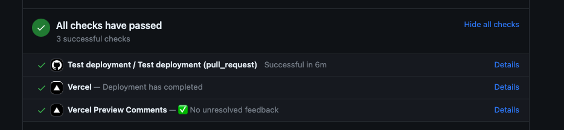
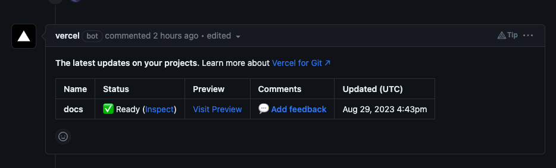

# Contributing to Flow Docs

Reading this document carefully will help you understand how to contribute your own content to the Flow Docs, and avoid problems along the way.

In most cases you should be able to iterate and deploy changes to your documentation with no to little involvement the engineering team that is maintaining the Flow Docs.

## Getting Prepared

Before diving into the contribution process, make sure you're set up for a smooth experience.

### Account Setup

To get started, you'll need a GitHub account. If you don't have one yet, no worries! Sign up [here](https://github.com). Once you have your account ready, you're all set to proceed.

## Contributing Your Content

The contribution process is designed to be straightforward and collaborative. Here's the basic workflow:

1. **Create a Pull Request:** Head over to the [onflow/docs](https://github.com/onflow/docs) repository and create a Pull Request into the `main` branch. This is where you'll submit your proposed changes.

1. **Validation and Preview:** Wait for the automated check runs to complete. Address any validation errors that pop up. You can also preview the changes using the provided link to ensure everything looks as intended.

1. **Merge and Publish:** Once your PR is ready and error-free, go ahead and merge it. Your updated documentation will promptly become accessible on [https://developers.flow.com](https://developer.flow.com)!

Note: Previews are built for each Git branch by Vercel workflow.

For additional assistance or integration support, feel free to request help in the `#devex-builders` channel on the [Flow Discord](https://discord.gg/flow) server.


## Updating Existing Content

Updating existing content is a seamless process:

1. Look for the "Edit this page" link at the bottom of each page, just before the footer.

    <Callout type="note" title="Here is what it looks like.">
    
    
    </Callout>

1. Clicking the link will take you directly to the source code of the page you're viewing.


## Adding New Content

Expanding the Flow Docs with new content is straightforward:

1. Markdown Mastery: To display content on the Flow Docs, use Markdown format. Markdown syntax resources are available for learning and reference:
    - [https://www.markdowntutorial.com/](https://www.markdowntutorial.com/)
    - [https://www.markdownguide.org/](https://www.markdownguide.org/)

1. From Google Docs to Markdown: While Markdown is perfect for single authors, Google Docs is more suited for collaborative writing. If you're using Google Docs, consider using [this browser plugin](https://workspace.google.com/marketplace/app/docs_to_markdown/700168918607) to generate Markdown files from your Google Docs documents.

    - [https://workspace.google.com/marketplace/app/docs_to_markdown/700168918607](https://workspace.google.com/marketplace/app/docs_to_markdown/700168918607)

## Adding category

Adding a new section/category is as easy as creating a new folder and populating it with Markdown files.

For instance, to add a `new toolchain`, the structure might look like this:
```
./docs/tools/toolchains
├── tools...
|   ├── toolchains    
|   |   ├── new-toolchain               // new section/category
|   |   |   ├── index.md
|   |   |   ├── _category_.yml
|   |   |   ├── page1.md
|   |   |   ├── page2.mdx
|   |   |   ├── dir1
|   |   |   |   ├── nested-page1.md
|   |   |   │   └── ...
|   |   │   └── ...

```

## `_category_`

`_category_` file is used to customize the category/section menu items content related to it.
Possible format:
- `_category_.json`
- `_category_.yml`
- `_category_.yaml`

Example using `.yml`:

```yaml _category_.yml
    label: Deploying Contracts
    position: 2
    customProps:
        icon: 🧱
        description: How to deploy smart contracts to mainnet and testnet

```

For more information refer to the [Official Docusaurus documentation](https://docusaurus.io/docs/sidebar/autogenerated#category-item-metadata)

## `index` file

The `index` page should contain links to the content inside of a category:
- list of available pages and categories
- short descriptions

Examples:

```markdown index.md
# Clients

## Go SDK

[Flow Go SDK](./flow-go-sdk/index.md) provides a set of packages for Go developers to build applications that interact with the Flow network.

## JavaScript (FCL)

[Flow Client Library (FCL)](./fcl-js/index.md) is a package used to interact with user wallets and the Flow blockchain.

<!-- ... Other sections ... -->

```


```markdown index.md
---
sidebar_position: 1
title: Tools
description: Essential tools for the Flow blockchain ecosystem
---

import DocCardList from '@theme/DocCardList';
import { isSamePath } from '@docusaurus/theme-common/internal';
import { useDocsSidebar } from '@docusaurus/plugin-content-docs/client';
import { useLocation } from '@docusaurus/router';

<DocCardList items={useDocsSidebar().items.filter(item => !isSamePath(item.href, useLocation().pathname))}/>

```

:::warning

The `index` page should only include information that is available elsewhere within the category's other pages.

:::

### Using DocCardList

Using `DocCardList` improves the layout of the index page:

:::note Example


:::

On the most pages you can use just `<DocCardList />` component imported from `'@theme/DocCardList'`

```markdown
import DocCardList from '@theme/DocCardList';

# Deployments

This section contains guides to deploying and testing smart contracts.

## All Sections
<DocCardList />

```

On the top level index category pages you have to use `useDocsSidebar` react hook to avoid rendering errors

```markdown
import DocCardList from '@theme/DocCardList';
import { isSamePath } from '@docusaurus/theme-common/internal';
import { useDocsSidebar } from '@docusaurus/plugin-content-docs/client';
import { useLocation } from '@docusaurus/router';

<DocCardList items={useDocsSidebar().items.filter(item => !isSamePath(item.href, useLocation().pathname))}/>
```

:::warning

If you use `<DocCardList/>` on the top level category index page (e.g. `./docs/tools/index.mdx`), Docusaurus will throw an error:

> useCurrentSidebarCategory() should only be used on category index pages.

:::

## SEO

Basic SEO metadata can be included in markdown `frontmatter`. The Flow Docs supports `title` and `description` metadata. If none is provided, a default will be applied.

Example `frontmatter`:

```markdown
---
title: "Hello World"
description: "A Great Document"
---
```

It is not required to supply this SEO metadata. Flow's in-house SEO experts will provide custom search-engine appropriate metadata for each page. Your custom metadata will be used in lieu of metadata supplied by our SEO experts.


## Page Content


### Images and Other Media

Include images and media using relative URLs within the `docs` folder. If your media is viewable in GitHub, then it should display on the Flow Docs.

For external media or URLs, use fully qualified URLs, eg:

``

The same rule applies to all other external media.

### Links

Linking to documents within the `docs` folder of your repo can be done in the standard way that is acceptable to GitHub, eg.

```
[link](./doc-two.md#hash-link)
```

Writing links in your documents is easy if you follow this rule-of-thumb: If it works in GitHub it should work on the Flow Docs, with one notable exception.

**Links to content outside the `docs` folder** in your repository, or elsewhere on the web must be in the form of a fully-qualified URL, eg:

```
[link](https://www.google.com)
```

:::tip

Use relative links directly to .md/.mdx files

:::

### Callouts

Many pages have callouts/admonitions. It is a slightly customized version of [standard admonitions](https://docusaurus.io/docs/markdown-features/admonitions)

Available types:
- `note` (also `secondary`)
- `tip` (also `success`)
- `info` (also `important`)
- `caution`
- `warning`
- `danger`

Example:
```markdown
:::tip

    Use relative links directly to .md/.mdx files

:::
```

### Code Reference

To include code from a file using a direct URL use `!from` operand inside a code block.

Example: 

#### By line number

````markdown
```cadence DepositFees.cdc
!from https://github.com/onflow/flow-core-contracts/blob/master/transactions/FlowServiceAccount/deposit_fees.cdc#L23
```
````

#### By line range

````markdown
```cadence DepositFees.cdc
!from https://github.com/onflow/flow-core-contracts/blob/master/transactions/FlowServiceAccount/deposit_fees.cdc#L23-L26
```
````

#### By snippet name / Region Tag

Specific blocks of code that are embedded in documentation are defined using `[START <snippet_name>]` and `[END <snippet_name>]` region tags.

```ruby
def create_bucket project_id:, bucket_name:
  # [START create_bucket]
  # project_id  = "Your Google Cloud project ID"
  # bucket_name = "Your Google Cloud Storage bucket name"

  require "google/cloud/storage"

  storage = Google::Cloud::Storage.new project: project_id

  bucket = storage.create_bucket bucket_name

  puts "Created bucket #{bucket.name}"
  # [END create_bucket]
end
```

and the reference would look like

````markdown
```ruby
!from https://github.com/emosei/ruby-docs-samples/blob/master/storage/buckets.rb#create_bucket
```
````

This method keeps your documentation synchronized with your codebase by pulling the latest code directly into your docs.

## Content Validation

Content is validated each time a PR is submitted to the `docs` repository.

Validation status is available in the **check run output** for your PR on GitHub.

Currently, the Flow Docs validates content using the following conditions:

- Do pages render without errors? This check accounts for errors in your markdown syntax.
- Are all links URLs valid? Broken links make for bad user experience.

Here is an example of check run output with successful validation.



### Dead Links Checks

The Flow Docs automatically scans relative links in *all your documents* when you submit changes to your docs. This is done to ensure that cross-links are valid, within your set of documentation.

## Content Previews

A special preview link is provided for content PRs as part of the GitHub PR check run.

Previews are generated against the **PR branch of the Flow Docs**, to ensure your content can be integrated with the latest updates to the Flow Docs itself.

Here is an example of preview output for changed documents in a PR



When you merge updates to documents in your PR, previews will deployed with a few minutes delay.
