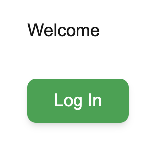
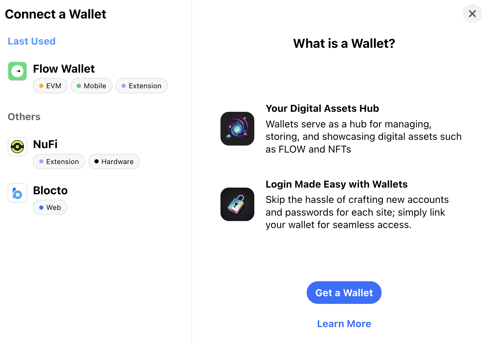

# Account Linking With NBA Top Shot

[Account Linking] is a powerful Flow feature that allows users to connect their wallets, enabling linked wallets to view and manage assets in one wallet with another. This feature helps reduce or even eliminate the challenges posed by other account abstraction solutions, which often lead to multiple isolated wallets and fragmented assets.


In this tutorial, you'll build a [simple onchain app] that allows users to sign in to your app with their Flow wallet and view [NBA Top Shot] Moments that reside in their [Dapper Wallet] without those users needing to sign in with Dapper.

## Objectives

After you complete this guide, you'll be able to:

- Pull your users' NBA Top Shot Moments into your Flow app without needing to transfer them out of their Dapper wallet.
- Retrieve and list all NFT collections in any child wallet linked to a given Flow address.
- Write a [Cadence] script to iterate through the storage of a Flow wallet to find NFT collections.
- Run Cadence Scripts from the frontend.

## Prerequisites

### Next.js and Modern Frontend Development

This tutorial uses [Next.js]. You don't need to be an expert, but it's helpful to be comfortable with development using a current React framework. You'll be on your own to select and use a package manager, manage Node versions, and other frontend environment tasks. If you don't have your own preference, you can just follow along with us and use [Yarn].

### Flow Wallet

You'll need a [Flow Wallet], but you don't need to deposit any funds.

## Moments NFTs

You'll need a [Dapper Wallet] that contains some Moments NFTs, such as [NBA Top Shot] Moments.

## Getting Started

This tutorial will use a [Next.js] project as the foundation of the frontend. Create a new project with:

```zsh
npx create-next-app@latest
```

We will use TypeScript and the App Router, in this tutorial.

Open your new project in the editor of your choice, install dependencies, and run the project.

```zsh
yarn install
yarn run dev
```

If everything works properly, you can navigate to `localhost:3000` and see the default [Next.js] page.

## Flow Cadence Setup

You'll need a few more dependencies to efficiently work with Cadence inside of your app.

### Flow CLI and Types

The [Flow CLI] contains a number of command-line tools for interacting with the Flow ecosystem. If you don't have it installed, you can add it with Brew (or using [other installation methods]):

```zsh
brew install flow-cli
```

After it's installed, initialize Flow in your `Next.js` project. From the root, run:

```zsh
flow init --config-only
```

The `--config-only` flag [initializes a project] with the just the config file. This allows the Flow CLI to interact with your project without adding adding the other files you want for most projects.

Next, you'll need to do a little bit of config work so that your project knows how to read Cadence files. Install the Flow Cadence Plugin:

```zsh
yarn add flow-cadence-plugin --dev
```

Finally, open `next.config.ts` and update it to use the plugin with Raw Loader:

```tsx
// next.config.ts
import type { NextConfig } from 'next';
import FlowCadencePlugin from 'flow-cadence-plugin';

const nextConfig: NextConfig = {
  webpack: (config) => {
    config.plugins.push(new FlowCadencePlugin());

    return config;
  },
};

export default nextConfig;
```

## Frontend Setup

We'll use the Flow Client Library [FCL] to manage blockchain interaction from the frontend. It's similar to `viem`, `ethers`, or `web3.js`, but works with the Flow blockchain and transactions and scripts written in Cadence.

```zsh
yarn add @onflow/fcl
```

Go ahead and install `dotenv` as well:

```
yarn add dotenv
```

### Provider Setup

You'll need a fair amount of boilerplate code to set up your provider. We'll provide it, but since it's not the purpose of this tutorial, we'll be brief on explanations. For more details, check out the [App Quickstart Guide].

Add `app/providers/AuthProvider.tsx`:

```tsx
'use client';
/* eslint-disable @typescript-eslint/no-explicit-any */

import { createContext, useContext, ReactNode } from 'react';
import useCurrentUser from '../hooks/use-current-user.hook';

interface State {
  user: any;
  loggedIn: any;
  logIn: any;
  logOut: any;
}

const AuthContext = createContext<State | undefined>(undefined);

interface AuthProviderProps {
  children: ReactNode;
}

const AuthProvider: React.FC<AuthProviderProps> = ({ children }) => {
  const [user, loggedIn, logIn, logOut] = useCurrentUser();

  return (
    <AuthContext.Provider
      value={{
        user,
        loggedIn,
        logIn,
        logOut,
      }}
    >
      {children}
    </AuthContext.Provider>
  );
};

export default AuthProvider;

export const useAuth = (): State => {
  const context = useContext(AuthContext);

  if (context === undefined) {
    throw new Error('useAuth must be used within a AuthProvider');
  }

  return context;
};
```

Then, add `app/hooks/use-current-user-hook.tsx`:

```tsx
import { useEffect, useState } from 'react';
import * as fcl from '@onflow/fcl';

export default function useCurrentUser() {
  const [user, setUser] = useState({ addr: null });

  const logIn = () => {
    fcl.authenticate();
  };

  const logOut = () => {
    fcl.unauthenticate();
  };

  useEffect(() => {
    fcl.currentUser().subscribe(setUser);
  }, []);

  return { user, loggedIn: user?.addr != null, logIn, logOut };
}
```

## .env

Add a `.env` to the root and fill it with:

```text
NEXT_PUBLIC_ACCESS_NODE_API="https://rest-mainnet.onflow.org"
NEXT_PUBLIC_FLOW_NETWORK="mainnet"
NEXT_PUBLIC_WALLETCONNECT_ID=<YOUR ID HERE>
```

:::warning

Don't forget to replace `<YOUR ID HERE>` with your own [Wallet Connect] app id!

:::

### Implement the Provider and Flow Config

Finally, open `layout.tsx`. TO start, import Flow dependencies and the AuthProvider:

```tsx
import flowJSON from '../flow.json';
import * as fcl from '@onflow/fcl';

import AuthProvider from './providers/AuthProvider';
```

Then add your Flow config:

```tsx
fcl
  .config({
    'discovery.wallet': 'https://fcl-discovery.onflow.org/authn',
    'accessNode.api': process.env.NEXT_PUBLIC_ACCESS_NODE_API,
    'flow.network': process.env.NEXT_PUBLIC_FLOW_NETWORK,
    'walletconnect.projectId': process.env.NEXT_PUBLIC_WALLETCONNECT_ID,
  })
  .load({ flowJSON });
```

:::warning

We're going to force some things client side to get this proof-of-concept working quickly. Use `Next.js` best practices for a production app.

:::

Add a `'use client';` directive to the top of the file and **delete** the import for Metadata and fonts, as well as the code related to them.

Finally, update the `<body>` to remove the font references and suppress hydration warnings:

```tsx
<body suppressHydrationWarning={true}>
```

Your code should be:

```tsx
// layout.tsx
'use client';
import './globals.css';
import flowJSON from '../flow.json';
import * as fcl from '@onflow/fcl';

import AuthProvider from './providers/AuthProvider';

fcl
  .config({
    'discovery.wallet': 'https://fcl-discovery.onflow.org/authn',
    'accessNode.api': process.env.NEXT_PUBLIC_ACCESS_NODE_API,
    'flow.network': process.env.NEXT_PUBLIC_FLOW_NETWORK,
    'walletconnect.projectId': process.env.NEXT_PUBLIC_WALLETCONNECT_ID,
  })
  .load({ flowJSON });

export default function RootLayout({
  children,
}: {
  children: React.ReactNode;
}) {
  return (
    <html lang="en">
      <body suppressHydrationWarning={true}>
        <AuthProvider>{children}</AuthProvider>
      </body>
    </html>
  );
}
```

### Add the Connect Button

Open `page.tsx` and clean up the demo code, leaving only the `<main>` block:

```tsx
import Image from 'next/image';

export default function Home() {
  return (
    <div className="grid grid-rows-[20px_1fr_20px] items-center justify-items-center min-h-screen p-8 pb-20 gap-16 sm:p-20 font-[family-name:var(--font-geist-sans)]">
      <main className="flex flex-col gap-8 row-start-2 items-center sm:items-start">
        <div>TODO</div>
      </main>
    </div>
  );
}
```

Add a `'use client';` directive, import the `useAuth` hook and instantiate it in the `Home` function:

```tsx
'use client';
import { useAuth } from './providers/AuthProvider';
```

```tsx
const { user, loggedIn, logIn, logOut } = useAuth();
```

Then add a button in the `<main>` to handle logging in or out:

```tsx
<main className="flex flex-col gap-8 row-start-2 items-center sm:items-start">
  <div>Welcome</div>
  <button
    onClick={loggedIn ? logOut : logIn}
    className="px-6 py-2 text-white bg-green-600 hover:bg-green-700 rounded-lg shadow-md transition duration-200 ease-in-out focus:outline-none focus:ring-2 focus:ring-green-500 sm:ml-auto"
  >
    {loggedIn ? 'Log Out' : 'Log In'}
  </button>
</main>
```

## Testing Pass

Run the app:

```zsh
yarn dev
```



Click `Log In` in the middle of the window and log in with your Flow wallet.



## Account Linking

Now that your app is set up, you can make use of [Account Linking] to to pull your NFTs from your Dapper Wallet, through your Flow Wallet, and into the app.

### Setting Up Account Linking

If you haven't yet, you'll need to [link your Dapper Wallet] to your Flow Wallet.

:::warning

The Dapper Wallet requires that you complete KYC before you can use Account Linking. While this may frustrate some members of the community, it makes it much easier for app developers to design onboarding rewards and bonuses that are less farmable.

:::

### Discovering the NFTs with a Script

With your accounts linked, your Flow Wallet now has a set of capabilities related to your Dapper Wallet and it can use those to view and even manipulate those NFTs and assets.

Before you can add a script that can handle this, you'll need to import the `HybridCustody` contract using the [Flow Dependency Manager]:

```zsh
flow dependencies install mainnet://d8a7e05a7ac670c0.HybridCustody
```

Choose `none` to skip deploying on the `emulator` and skip adding testnet aliases. There's no point, these NFTs are on mainnet!

You'll get a complete summary from the Dependency Manager:

```zsh
📝 Dependency Manager Actions Summary

🗃️ File System Actions:
✅️ Contract HybridCustody from d8a7e05a7ac670c0 on mainnet installed
✅️ Contract MetadataViews from 1d7e57aa55817448 on mainnet installed
✅️ Contract FungibleToken from f233dcee88fe0abe on mainnet installed
✅️ Contract ViewResolver from 1d7e57aa55817448 on mainnet installed
✅️ Contract Burner from f233dcee88fe0abe on mainnet installed
✅️ Contract NonFungibleToken from 1d7e57aa55817448 on mainnet installed
✅️ Contract CapabilityFactory from d8a7e05a7ac670c0 on mainnet installed
✅️ Contract CapabilityDelegator from d8a7e05a7ac670c0 on mainnet installed
✅️ Contract CapabilityFilter from d8a7e05a7ac670c0 on mainnet installed

💾 State Updates:
✅ HybridCustody added to emulator deployments
✅ Alias added for HybridCustody on mainnet
✅ HybridCustody added to flow.json
✅ MetadataViews added to flow.json
✅ FungibleToken added to flow.json
✅ ViewResolver added to flow.json
✅ Burner added to flow.json
✅ NonFungibleToken added to flow.json
✅ CapabilityFactory added to emulator deployments
✅ Alias added for CapabilityFactory on mainnet
✅ CapabilityFactory added to flow.json
✅ CapabilityDelegator added to emulator deployments
✅ Alias added for CapabilityDelegator on mainnet
✅ CapabilityDelegator added to flow.json
✅ CapabilityFilter added to emulator deployments
✅ Alias added for CapabilityFilter on mainnet
✅ CapabilityFilter added to flow.json
```

Add `app/cadence/scripts/FetchNFTsFromLinkedAccts.cdc`. In it, add this script. Review the inline comments to see what each step does:

```cadence
import "HybridCustody"
import "NonFungibleToken"
import "MetadataViews"

// This script iterates through a parent's child accounts,
// identifies private paths with an accessible NonFungibleToken.Provider, and returns the corresponding typeIds

access(all) fun main(addr: Address): AnyStruct {
  let manager = getAuthAccount<auth(Storage) &Account>(addr).storage.borrow<auth(HybridCustody.Manage) &HybridCustody.Manager>(from: HybridCustody.ManagerStoragePath)
    ?? panic ("manager does not exist")

  var typeIdsWithProvider: {Address: [String]} = {}
  var nftViews: {Address: {UInt64: MetadataViews.Display}} = {}

  let providerType = Type<auth(NonFungibleToken.Withdraw) &{NonFungibleToken.Provider}>()
  let collectionType: Type = Type<@{NonFungibleToken.CollectionPublic}>()

  for address in manager.getChildAddresses() {
    let acct = getAuthAccount<auth(Storage, Capabilities) &Account>(address)
    let foundTypes: [String] = []
    let views: {UInt64: MetadataViews.Display} = {}
    let childAcct = manager.borrowAccount(addr: address) ?? panic("child account not found")

    // Iterate through storage paths to find NFTs that are controlled by the parent account
    // To just find NFTs, check if thing stored is nft collection and borrow it as NFT collection and get IDs
    for s in acct.storage.storagePaths {
      // Iterate through capabilities
      for c in acct.capabilities.storage.getControllers(forPath: s) {
        if !c.borrowType.isSubtype(of: providerType){
          // If this doen't have providerType, it's not an NFT collection
          continue
        }

        // We're dealing with a Collection but we need to check if accessible from the parent account
        if let cap: Capability = childAcct.getCapability(controllerID: c.capabilityID, type: providerType) { // Part 1
          let providerCap = cap as! Capability<&{NonFungibleToken.Provider}>

          if !providerCap.check(){
            // If I don't have access to control the account, skip it.
            // Disable this check to do something else.
            //
            continue
          }

          foundTypes.append(cap.borrow<&AnyResource>()!.getType().identifier)
          typeIdsWithProvider[address] = foundTypes
          // Don't need to keep looking at capabilities, we can control NFT from parent account
          break
        }
      }
    }

    // Iterate storage, check if typeIdsWithProvider contains the typeId, if so, add to views
    acct.storage.forEachStored(fun (path: StoragePath, type: Type): Bool {

      if typeIdsWithProvider[address] == nil {
        return true
      }

      for key in typeIdsWithProvider.keys {
        for idx, value in typeIdsWithProvider[key]! {
          let value = typeIdsWithProvider[key]!

          if value[idx] != type.identifier {
              continue
          } else {
            if type.isInstance(collectionType) {
              continue
            }
            if let collection = acct.storage.borrow<&{NonFungibleToken.CollectionPublic}>(from: path) {
              // Iterate over IDs & resolve the Display view
              for id in collection.getIDs() {
                let nft = collection.borrowNFT(id)!
                if let display = nft.resolveView(Type<MetadataViews.Display>())! as? MetadataViews.Display {
                  views.insert(key: id, display)
                }
              }
            }
            continue
          }
        }
      }
      return true
    })
    nftViews[address] = views
  }
  return nftViews
}
```

:::warning

The above script is a relatively naive implementation. For production, you'll want to filter for only the collections you care about, and you will eventually need to add handling for very large collections in a wallet.

:::

### Running the Script and Displaying the NFTs

Add a component in `app/components` called `DisplayLinkedNFTs.cdc`.

In it, import dependencies from React and FCL, as well as the script you just added:

```tsx
import React, { useState, useEffect } from 'react';
import * as fcl from '@onflow/fcl';
import * as t from '@onflow/types';

import FetchNFTs from '../cadence/scripts/FetchNFTsFromLinkedAccts.cdc';
```

As we're using TypeScript, add some types as well to manage the data from the NFTs nicely. For now, just add them to this file:

```typescript
type Thumbnail = {
  url: string;
};

type Moment = {
  name: string;
  description: string;
  thumbnail: Thumbnail;
};

type MomentsData = {
  [momentId: string]: Moment;
};

type ApiResponse = {
  [address: string]: MomentsData;
};

interface AddressDisplayProps {
  address: string;
}
```

Then, add the function for the component:

```tsx
const DisplayLinkedNFTs: React.FC<AddressDisplayProps> = ({ address }) => {
  // TODO...

  return <div>Nothing here yet</div>;
};

export default DisplayLinkedNFTs;
```

In the function, add a state variable to store the data that the script retrieves:

```typescript
const [responseData, setResponseData] = useState<ApiResponse | null>(null);
```

Then, use `useEffect` to fetch the NFTs with the script and `fcl.query`:

```tsx
useEffect(() => {
  const fetchLinkedAddresses = async () => {
    if (!address) return;

    try {
      const cadenceScript = FetchNFTs;

      // Fetch the linked addresses
      const response: ApiResponse = await fcl.query({
        cadence: cadenceScript,
        args: () => [fcl.arg(address, t.Address)],
      });

      console.log(JSON.stringify(response, null, 2));

      setResponseData(response);
    } catch (error) {
      console.error('Error fetching linked addresses:', error);
    }
  };

  fetchLinkedAddresses();
}, [address]);
```

Return to `page.tsx`, import your new component, and add an instance of `<DisplayLinkedNFTs>` that passes in the user's address and is only displayed while `loggedIn`.

```tsx
{
  loggedIn && <DisplayLinkedNFTs address={user.addr} />;
}
```

### Testing

Run the app again. If you have linked your account and have NFTs in that account, you'll see them in the console!

### Displaying the Moments

Now that they're here, all that's left to do is display them nicely! Return to `DisplayLinkedNFTs.tsx`. Add a helper function to confirm each returned NFT matches the Moments format. You can update this to handle other NFTs you'd like to show as well.

:::warning

Remember, you'll also need to update the script in a production app to filter for only the collections you want, and handle large collections.

:::

```tsx
// Type-checking function to validate moment structure
// eslint-disable-next-line @typescript-eslint/no-explicit-any
const isValidMoment = (moment: any): moment is Moment => {
  const isValid =
    typeof moment.name === 'string' &&
    typeof moment.description === 'string' &&
    moment.thumbnail &&
    typeof moment.thumbnail.url === 'string';

  if (!isValid) {
    console.warn('Invalid moment data:', moment);
  }

  return isValid;
};
```

Next, add a rendering function with some basic styling:

```tsx
// Function to render moments with validation
const renderMoments = (data: ApiResponse) => {
  return Object.entries(data).map(([addr, moments]) => (
    <div
      key={addr}
      className="border border-gray-300 rounded-lg shadow-sm p-4 mb-6 bg-white"
    >
      <h4 className="text-lg font-semibold mb-4 text-gray-800">
        Linked Wallet: {addr}
      </h4>
      <div className="grid grid-cols-1 gap-4 md:grid-cols-2 lg:grid-cols-3">
        {Object.entries(moments).map(([momentId, moment]) =>
          isValidMoment(moment) ? (
            <div
              key={momentId}
              className="border border-gray-200 rounded-lg p-4 shadow hover:shadow-lg transition-shadow duration-200 bg-gray-50"
            >
              <h5 className="text-md font-bold text-blue-600 mb-2">
                {moment.name}
              </h5>
              <p className="text-sm text-gray-600 mb-4">{moment.description}</p>
              
            </div>
          ) : null,
        )}
      </div>
    </div>
  ));
};
```

Finally, update the `return` with some more styling and the rendered NFT data:

```tsx
return (
  <div className="p-6 bg-gray-100 min-h-screen">
    {address ? (
      <div className="max-w-4xl mx-auto">
        <h3 className="text-2xl font-bold text-gray-800 mb-4">Moments Data:</h3>
        <div>
          {responseData ? (
            renderMoments(responseData)
          ) : (
            <p className="text-gray-500">No Moments Data Available</p>
          )}
        </div>
      </div>
    ) : (
      <div className="text-center text-gray-500 mt-8">No Address Provided</div>
    )}
  </div>
);
```

### Further Polish

Finally, you can polish up your `page.tsx` to look a little nicer, and guide your users to the Account Linking process in the Dapper Wallet:

```tsx
'use client';
import DisplayLinkedNFTs from './components/DisplayLinkedNFTs';
import { useAuth } from './providers/AuthProvider';

export default function Home() {
  const { user, loggedIn, logIn, logOut } = useAuth();

  return (
    <div className="grid grid-rows-[auto_1fr_auto] items-center justify-items-center min-h-screen p-8 sm:p-20 bg-gray-100 font-sans">
      <main className="flex flex-col gap-8 row-start-2 items-center w-full max-w-5xl px-12 py-12 bg-white rounded-lg shadow-lg border border-gray-200">
        {/* Message visible for all users */}
        <p className="text-center text-gray-700 mb-4">
          Please link your Dapper wallet to view your NFTs. For more
          information, check the{' '}
          <a
            href="https://support.meetdapper.com/hc/en-us/articles/20744347884819-Account-Linking-and-FAQ"
            target="_blank"
            rel="noopener noreferrer"
            className="text-blue-600 hover:text-blue-800 underline"
          >
            Account Linking and FAQ
          </a>
          .
        </p>

        <div className="flex flex-col sm:flex-row sm:items-center sm:justify-between w-full gap-6">
          {/* Display user address or linked NFTs if logged in */}
          {loggedIn ? (
            <div className="text-lg font-semibold text-gray-800">
              Address: {user.addr}
            </div>
          ) : (
            <div className="text-lg font-semibold text-gray-800">
              Please log in to view your linked NFTs.
            </div>
          )}

          {/* Login/Logout Button */}
          <button
            onClick={loggedIn ? logOut : logIn}
            className="px-6 py-2 text-white bg-blue-600 hover:bg-blue-700 rounded-lg shadow-md transition duration-200 ease-in-out focus:outline-none focus:ring-2 focus:ring-blue-500 sm:ml-auto"
          >
            {loggedIn ? 'Log Out' : 'Log In'}
          </button>
        </div>

        {/* Display NFTs if logged in */}
        {loggedIn && <DisplayLinkedNFTs address={user.addr} />}
      </main>
    </div>
  );
}
```

Your app will now look like the [simple onchain app] demo!

## Conclusion

In this tutorial, you took your first steps towards building powerful new experiences that meet you customers where they are. They can keep their assets in the wallet associate with one app, but also give your app the ability to use them - seamlessly, safely, and beautifully!

## Reference Solution

:::warning

You **won't** save time if you skipo the the reference implementation. You'll learn much faster if you do the tutorials as presented!

Reference solutions are functional, but may not be optimal.

:::

[Reference Solution]

[Account Linking]: ./index.md
[NBA Top Shot]: https://nbatopshot.com
[simple onchain app]: https://nextjs-topshot-account-linking.vercel.app
[Dapper Wallet]: https://meetdapper.com
[Cadence]: https://cadence-lang.org/docs
[Next.js]: https://nextjs.org/docs/app/getting-started/installation
[Yarn]: https://yarnpkg.com
[Flow CLI]: ../../../build/tools/flow-cli/index.md
[other installation methods]: ../../../build/tools/flow-cli/install.md
[initializes a project]: ../../../build/tools/flow-cli/commands.md#init
[Flow Dependency Manager]: ../../../build/tools/flow-cli/dependency-manager.md
[FCL]: ../../../build/tools/clients/fcl-js/index.md
[App Quickstart Guide]: ../getting-started/index.md
[Wallet Connect]: https://cloud.walletconnect.com/sign-in
[Flow Wallet]: https://wallet.flow.com
[link your Dapper Wallet]: https://support.meetdapper.com/hc/en-us/articles/20744347884819-Account-Linking-and-FAQ
[Reference Solution]: https://github.com/briandoyle81/nextjs-topshot-account-linking
