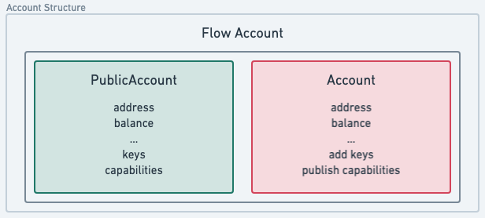
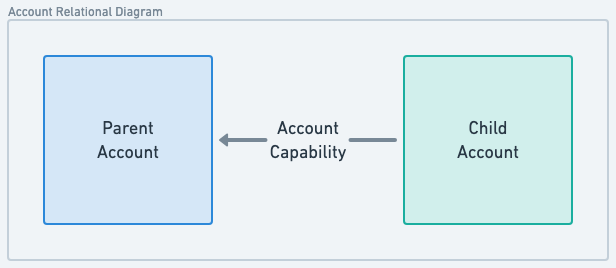
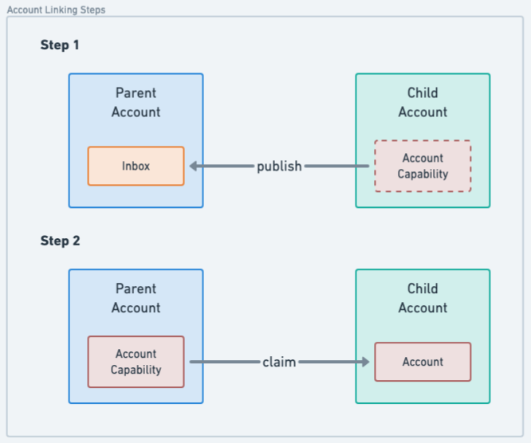
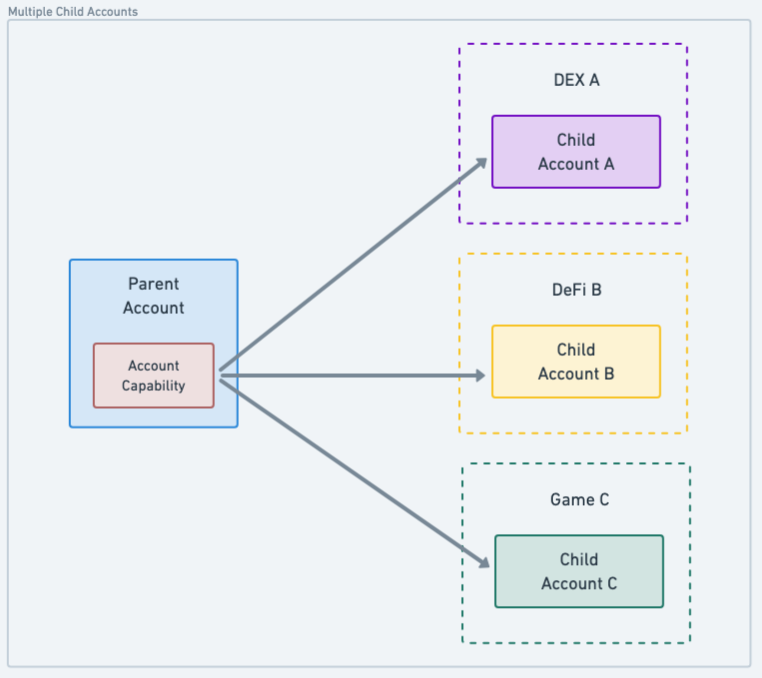

# Account Linking

Account linking is a unique Flow concept that enables sharing ownership over [accounts](../../../build/cadence/basics/accounts.md). In
order to understand how we can achieve that we must first understand how accounts on Flow are accessed.

Accounts on flow can be accessed in Cadence through two types, `PublicAccount` and `Account`. As the name implies the
`PublicAccount` type gives access to all public account information such as address, balance, storage capacity, etc.,
but doesn't allow changes to the account. The `Account` type (or more specifically, an
[entitled](https://cadence-lang.org/docs/language/access-control#entitlements) `&Account`) allows the same access as
`PublicAccount` but also allows changes to the account, including adding/revoking account keys, managing the deployed
contracts, as well as linking and publishing Capabilities.



## Accessing Account

Accessing `Account` allows for modification to account storage, so it's essential to safeguard this access by mandating
that transactions are signed by the account being accessed. [Account
entitlements](https://cadence-lang.org/docs/language/accounts/#performing-write-operations) enable for more granular
access control over the specific parts of the account that can be accessed from within the signed transaction. A
transaction can list multiple authorizing account it wants to access as part of the `prepare` section of the
transaction. Read more about transaction signing in the [transaction documentation](../../../build/cadence/basics/transactions.md).

Since access to the `Account` object enables state change, the idea of account ownership actually translates to the
ability to access the underlying account. Traditionally, you might consider this the same as having key access on an
account, but we'll see in just a minute how programmatic, ownership-level access is unlocked with [Capabilities on
Flow](https://cadence-lang.org/docs/language/capabilities).

## Account Capabilities

Before proceeding the reader will need a clear understanding of [Cadence
capabilities](https://cadence-lang.org/docs/language/capabilities) to follow this section. Advanced features such as
Account Capabilities are powerful but if used incorrectly can put your app or users at risk.

Cadence allows the creation of Capabilities to delegate access to account storage, meaning any account obtaining a valid
Ccapability to another account object in the storage can access it. This is a powerful feature on its own - accessing
another account programmatically without the need for an active key on the accessible account. The access to the object
can be limited when creating a Capability so only intended functions or fields can be accessed.

Account linking is made possible by the extension of Capabilities on the `Account` object itself. Similar to how storage
capabilities allow access to a value stored in an account's storage, `&Account` Capabilities allow delegated access to
the issuing `Account`. These Capabilities allow for access to key assignment, contract deployment, and other privileged
actions on the delegating `Account` - effectively sharing ownership of the account without ever adding or sharing a key.
This Capability can of course be revoked at any time by the delegating account.

### Creating Account Links

When referring to 'account linking' we mean that an `&Account` Capability is created by the parent account and published
to another account. The account owning the `&Account` Capability which was made available to another account is the child
account. The account in possession of the Capability given by the child account becomes its parent account.



A link between two existing accounts on Flow can be created in two steps:

1. A child account creates an `&Account` Capability and publishes it to the parent account.
2. The parent account, claims that Capability and can access the child's account through it.



These two steps are implemented in Cadence as two transactions:

****************\*\*\*\*****************Create capability****************\*\*\*\*****************

The account B creates and publishes the `&Account` Capability to the account A at the address `0x01`

```cadence
#allowAccountLinking

transaction {
    prepare(signer: auth(IssueAccountCapabilityController, PublishInboxCapability) &Account) {
        // Issue a fully-entitled account capability
        let capability = signer.capabilities
            .account
            .issue<auth(Storage, Contracts, Keys, Inbox, Capabilities) &Account>()
        // Publish the capability for the specified recipient
        signer.inbox.publish(capability, name: "accountCapA", recipient: 0x1)
    }
}
```

************\*\*\*\*************Claim capability************\*\*\*\*************

The account A claims the Capability published by account B.

```cadence
transaction {
    prepare(signer: auth(ClaimInboxCapability) &Account) {
        let capabilityName = "accountCapB"
        let providerAddress = 0x2
        // Claim the capability published by the account 0x2
        let capability = signer.inbox
            .claim<auth(Storage, Contracts, Keys, Inbox, Capabilities) &Account>(
                capabilityName,
                provider: providerAddress
            ) ?? panic(
                "Capability with name ".concat(capabilityName)
                .concat(" from provider ").concat(providerAddress.toString())
                .concat(" not found")
            )
        // Simply borrowing an Account reference here for demonstration purposes
        let accountRef = capability.borrow()!
    }
}
```

## What is account linking most useful for?

Account linking was specifically designed to enable smooth and seamless custodial onboarding of users to your Flow based
application without them first requiring a wallet to do so. This pattern overcomes both the technical hurdle, as well as
user's reluctance to install a wallet, opening access to Flow applications to every user. Users can experience an app
without any delay while still offering a path to self-sovreign ownership.

Naturally, users may expect to use their account with another application, or otherwise move assets stored in that
account elsewhere - at minimum from their wallet. When an app initially leverages account linking, the app creates the
account instead of the user and stores that user's specific state in the app-created account. At a later point, users
can take ownership of the app account providing they possess a full [Flow account](../../../build/cadence/basics/accounts.md), typically
by installing a wallet app.

Account linking enables users to possess multiple linked child accounts from different apps. Complexities associated
with accessing those child accounts are eliminated by abstracting access to them through the user's parent account.

:::info

Simply put, child accounts are accessed and can be treated as a seamless part of the parent account.

:::

All assets in the app account can now jump the walled garden to play in the rest of the Flow ecosystem. The user does
not need to rely on the custodial app to execute transactions moving assets from the child account as the parent account
already has access to the assets in the child account.



This shared control over the digital items in the in-app account enables users to establish real ownership of the items
beyond the context of the app, where they can use their parent account to view inventory, take the items to other apps
in the ecosystem, such as a marketplace or a game.

Most importantly, users are able to do this without the need to transfer the digital items between accounts, making it
seamless to continue using the original app while also enjoying their assets in other contexts.

## Security Considerations

Account linking is a _very_ powerful Cadence feature, and thus it must be treated with care. So far in this document,
we've discussed account linking between two accounts we own, even if the child account is managed by a third-party
application. But, we can't make the same trust assumptions about custodial accounts in the real world.

Creating an `&Account` Capability and publishing it to an account we don't own means we are giving that account full
access to our account. This should be seen as an anti-pattern.

:::warning

Creating an `&Account` Capability and sharing it with third-party account effectually the same as giving that person your
account's private keys.

:::

Because unfiltered account linking can be dangerous, Flow introduces the [`HybridCustody`
contract](./parent-accounts.md) that helps custodial applications regulate access while enabling parent accounts to
manage their many child accounts and assets within them.

## Hybrid Custody and Account Linking

Apps need assurances that their own resources are safe from malicious actors, so giving out full access might not be the
form they want. Using hybrid custody contracts, the app still maintains control of their managed accounts, but they can:

1. Share capabilities freely, with a few built-in controls over the types of capabilities that can be retrieved by
   parent accounts via helper contracts (the `CapabilityFactory`, and `CapabilityFilter`)
2. Share additional capabilities (public or private) with a parent account via a `CapabilityDelegator` resource

Learn more about it in the [Hybrid Custody documentation](./parent-accounts.md).

### Guides

- [Building Walletless Applications Using Child Accounts](./child-accounts.md) covers how apps can leverage Account
  Linking to create a seamless user experience and enable future self-custody.
- [Working With Parent Accounts](./parent-accounts.md) covers features enabled by the core `HybridCustody` contract to
  access child account assets from parent accounts. This is useful for apps like marketplaces or wallets that are
  working with accounts that have potential child accounts.

### Resources

- [Forum Post](https://forum.flow.com/t/hybrid-custody/4016) where core concepts were introduced and discussed.
- [GitHub repository](https://github.com/onflow/hybrid-custody) where `HybridCustody` core contracts and scripts are
  maintained. Check out the repository for more advanced script or transaction examples.
- [Example](https://github.com/jribbink/magic-link-hc-sample/) Account Linking project with
  [Magic](https://magic.link/).
- [Starter template](https://github.com/Niftory/niftory-samples/tree/main/walletless-onboarding) for
  [Niftory](https://niftory.com/) Account Linking API.
