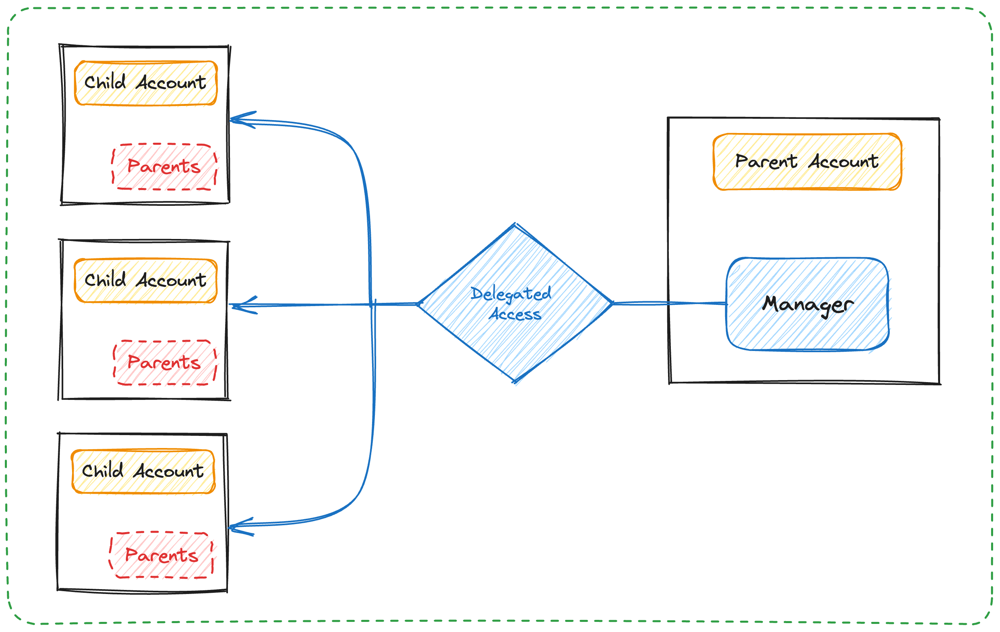

In this doc, we'll continue from the perspective of a wallet or marketplace app seeking to facilitate a unified account
experience, abstracting away the partitioned access between accounts into a single dashboard for user interactions on
all their owned assets.

## Objectives

- Understand the Hybrid Custody account model
- Differentiate between restricted child accounts and unrestricted owned accounts
- Get your app to recognize "parent" accounts along with any associated "child" accounts
- View Fungible and NonFungible Token metadata relating to assets across all of a user's associated accounts - their
  wallet-mediated "parent" account and any hybrid custody model "child" accounts
- Facilitate transactions acting on assets in child accounts

## Design Overview

:::info

TL;DR: An account's
[`HybridCustody.Manager`](https://github.com/onflow/hybrid-custody/blob/main/contracts/HybridCustody.cdc) is the entry
point for all of a user's associated accounts.

:::

The basic idea in the Hybrid Custody model is relatively simple. A parent account is one that has received delegated
(albeit restricted) access on another account. The account which has delegated authority over itself to the parent
account is the child account.

In the [Hybrid Custody Model](https://forum.flow.com/t/hybrid-custody/4016), this child account would have shared
access between the app - the entity which created and likely custodies the account - and the linked parent account.

How does this delegation occur? Typically when we think of shared account access in crypto, we think keys. However,
Cadence enables [accounts to link Capabilities on
themselves](https://cadence-lang.org/docs/language/accounts/capabilities#accountcapabilities) and issue those
Capabilities to other parties (more on [capability-based access
here](https://cadence-lang.org/docs/language/capabilities)).

This feature has been leveraged in an ecosystem standard so that apps can implement a hybrid custody model whereby the app
creates an account it controls, then later delegates access on that account to the user once they've authenticated with
their wallet.

All related constructs are used together in the [`HybridCustody`
contract](https://github.com/onflow/hybrid-custody/tree/main) to define the standard.

Parent accounts own a `Manager` resource which stores Capabilities to `ChildAccount` (restricted access) and
`OwnedAccount` (unrestricted access) resources, both of which are stored in any given child account.

Therefore, the presence of a `Manager` in an account implies there are potentially associated accounts for which the
owning account has delegated access. This resource is intended to be configured with a public Capability that enables
querying of an account's child account addresses via `getAccountAddresses()` and `getOwnedAccountAddresses()`. As you can
deduce from these two methods, there is a notion of "owned" accounts which we'll expand on in a bit.

A wallet or marketplace wishing to discover all of a user's accounts and assets within them can do so by first looking
to the user's `Manager`.

### Identifying Account Hierarchy

To clarify, insofar as the standard is concerned, an account is a parent account if it contains a `Manager` resource,
and an account is a child account if it contains at minimum an `OwnedAccount` or additionally a `ChildAccount` resource.

Within a user's `Manager`, its mapping of `childAccounts` points to the addresses of its child accounts in each key,
with corresponding values giving the `Manager` access to those accounts via corresponding `ChildAccount` Capability.



Likewise, the child account's `ChildAccount.parentAddress` (which owns a `Manager`) points to the user's account as its
parent address. This makes it easy to both identify whether an account is a parent, child, or both, and its associated
parent/child account(s).

`OwnedAccount` resources underly all account delegations, so can have multiple parents whereas `ChildAccount`s are 1:1.
This provides more granular revocation as each parent account has its own Capability path on which its access relies.

#### Restricted vs. Owned Accounts

It's worth noting here that `ChildAccount` Capabilities enable access to the underlying account according to rules
configured by the child account delegating access. The `ChildAccount` maintains these rules along with an `OwnedAccount`
Capability within which the `&Account` Capability is stored. Anyone with access to the surface level `ChildAccount`
can then access the underlying `Account`, but only according the pre-defined rule set. These rules are fundamentally
a list of Types that can/cannot be retrieved from an account.

The app developer can codify these rule sets on allowable Capability types in a
[`CapabilityFilter`](https://github.com/onflow/hybrid-custody/blob/main/contracts/CapabilityFilter.cdc) along with a
[`CapabilityFactory`](https://github.com/onflow/hybrid-custody/blob/main/contracts/CapabilityFactory.cdc) defining retrieval
patterns for those Capabilities. When delegation occurs, the developer would provide the `CapabilityFilter` and
`CapabilityFactory` Capabilities to an `OwnedAccount` resource which stores them in a `ChildAccount` resource. Then,
capabilities are created for the `OwnedAccount` and `ChildAccount` resource and are given to the specified parent
account.

So, if an app developer wants to enable Hybrid Custody but doesn't want to allow parent accounts to access FungibleToken
Vaults, for example, the app developer can codify rule sets enumerating allowable Capability types in a
`CapabilityFilter` along with a `CapabilityFactory` defining retrieval patterns for those Capabilities.

When delegation occurs, they would provide the `CapabilityFilter` and `CapabilityFactory` Capabilities to an
`OwnedAccount`. This `OwnedAccount` then wraps the given filter & factory Capabilities in a `ChildAccount` along with a
Capability to itself before publishing the new `ChildAccount` Capability for the specified parent account to claim.

:::info

Note that by enumerating allowable Types in your `CapabilityFilter.Filter` implementation, you're by default excluding
access to anything other than the Types you declare as allowable.

:::

As mentioned earlier, `Manager`s also maintain access to "owned" accounts - accounts which define unrestricted access as
they allow direct retrieval of encapsulated `&Account` Capabilities. These owned accounts, found in `Manager.ownedAccounts`,
are simply `OwnedAccount` Capabilities instead of `ChildAccount` Capabilities.


### Considerations

Do note that this construction does not prevent an account from having multiple parent accounts or a child account from
being the parent to other accounts. While initial intuition might lead one to believe that account associations are a
tree with the user at the root, the graph of associated accounts among child accounts may lead to cycles of association.

We believe it would be unlikely for a use case to demand a user delegates authority over their main account (in fact
we'd discourage such constructions), but delegating access between child accounts could be useful. As an example,
consider a set of local game clients across mobile and web platforms, each with self-custodied app accounts having
delegated authority to each other while both are child accounts of the user's main account.

Ultimately, it will be up to the implementing wallet/marketplace how far down the graph of account associations they'd
want to traverse and display to the user.

## Implementation

From the perspective of a wallet or marketplace app, some relevant things to know about the user are:

- Does this account have associated linked (child) accounts?
- What are those associated linked accounts, if any?
- What NFTs are owned by this user across all associated accounts?
- What are the balances of all FungibleTokens across all associated accounts?

And with respect to acting on the assets of child accounts and managing child accounts themselves:

- Accessing an NFT from a linked account's Collection
- Removing a linked account

## Examples

### Query Whether an Address Has Associated Accounts

This script will return `true` if a `HybridCustody.Manager` is stored and `false` otherwise

```cadence has_child_accounts.cdc
import "HybridCustody"

access(all) fun main(parent: Address): Bool {
    let acct = getAuthAccount<auth(BorrowValue) &Account>(parent)
    if let manager = acct.storage.borrow<&HybridCustody.Manager>(from: HybridCustody.ManagerStoragePath) {
        return manager.getChildAddresses().length > 0
    }
    return false
}
```

### Query All Accounts Associated with Address

The following script will return an array of addresses associated with a given account's address, inclusive of the
provided address. If a `HybridCustody.Manager` is not found, the script will revert.

```cadence get_child_addresses.cdc
import "HybridCustody"

access(all) fun main(parent: Address): [Address] {
    let acct = getAuthAccount<auth(Storage) &Account>(parent)
    let manager = acct.storage.borrow<&HybridCustody.Manager>(from: HybridCustody.ManagerStoragePath)
        ?? panic("manager not found")
    return  manager.getChildAddresses()
}
```

### Query All Owned NFT Metadata

While it is possible to iterate over the storage of all associated accounts in a single script, memory limits prevent
this approach from scaling well.

Since some accounts hold thousands of NFTs, we recommend breaking up iteration, utilizing several queries to iterate
over accounts and the storage of each account. Batching queries on individual accounts may even be required based on the
number of NFTs held.

1. Get all associated account addresses (see above)
2. Looping over each associated account address client-side, get each address's owned NFT metadata

For simplicity, we'll show a condensed query, returning NFT display views from all accounts associated with a given
address for a specified NFT Collection path.

```cadence get_nft_display_view_from_public.cdc
import "NonFungibleToken"
import "MetadataViews"
import "HybridCustody"

/// Returns resolved Display from given address at specified path for each ID or nil if ResolverCollection is not found
///
access(all)
fun getViews(_ address: Address, _ resolverCollectionPath: PublicPath): {UInt64: MetadataViews.Display} {

    let account: PublicAccount = getAccount(address)
    let views: {UInt64: MetadataViews.Display} = {}

    // Borrow the Collection
    if let collection = account.capabilities.borrow<&{NonFungibleToken.Collection}>(resolverCollectionPath) {
        // Iterate over IDs & resolve the view
        for id in collection.getIDs() {
            if let nft = collection.borrowNFT(id) {
                if let display = nft.resolveView(Type<MetadataViews.Display>()) as? MetadataViews.Display {
                    views.insert(key: id, display)
                }
            }
        }
    }

    return views
}

/// Queries for MetadataViews.Display each NFT across all associated accounts from Collections at the provided
/// PublicPath
///
access(all)
fun main(address: Address, resolverCollectionPath: PublicPath): {Address: {UInt64: MetadataViews.Display}} {

    let allViews: {Address: {UInt64: MetadataViews.Display}} = {
            address: getViews(address, resolverCollectionPath)
        }

    /* Iterate over any associated accounts */
    //
    let seen: [Address] = [address]
    if let managerRef = getAuthAccount<auth(BorrowValue) &Account>(address)
        .storage
        .borrow<&HybridCustody.Manager>(from: HybridCustody.ManagerStoragePath) {

        for childAccount in managerRef.getChildAddresses() {
            allViews.insert(key: childAccount, getViews(address, resolverCollectionPath))
            seen.append(childAccount)
        }

        for ownedAccount in managerRef.getOwnedAddresses() {
            if seen.contains(ownedAccount) == false {
                allViews.insert(key: ownedAccount, getViews(address, resolverCollectionPath))
                seen.append(ownedAccount)
            }
        }
    }

    return allViews
}
```

At the end of this query, the caller will have a mapping of `Display` views indexed on the NFT ID and grouped by account
Address. Note that this script does not take batching into consideration and assumes that each NFT resolves the
`MetadataViews.Display` view type.

### Query All Account FungibleToken Balances

Similar to the previous example, we recommend breaking up this task due to memory limits.

1. Get all linked account addresses (see above)
2. Looping over each associated account address client-side, get each address's owned FungibleToken Vault metadata

However, we'll condense both of these steps down into one script for simplicity:

```cadence get_all_vault_bal_from_storage.cdc
import "FungibleToken"
import "MetadataViews"
import "HybridCustody"

/// Returns a mapping of balances indexed on the Type of resource containing the balance
///
access(all)
fun getAllBalancesInStorage(_ address: Address): {Type: UFix64} {
    // Get the account
    let account = getAuthAccount<auth(BorrowValue) &Account>(address)
    // Init for return value
    let balances: {Type: UFix64} = {}
    // Track seen Types in array
    let seen: [Type] = []
    // Assign the type we'll need
    let balanceType: Type = Type<@{FungibleToken.Balance}>()
    // Iterate over all stored items & get the path if the type is what we're looking for
    account.forEachStored(fun (path: StoragePath, type: Type): Bool {
        if (type.isInstance(balanceType) || type.isSubtype(of: balanceType)) && !type.isRecovered {
            // Get a reference to the resource & its balance
            let vaultRef = account.borrow<&{FungibleToken.Balance}>(from: path)!
            // Insert a new values if it's the first time we've seen the type
            if !seen.contains(type) {
                balances.insert(key: type, vaultRef.balance)
            } else {
                // Otherwise just update the balance of the vault (unlikely we'll see the same type twice in
                // the same account, but we want to cover the case)
                balances[type] = balances[type]! + vaultRef.balance
            }
        }
        return true
    })
    return balances
}

/// Queries for FT.Vault balance of all FT.Vaults in the specified account and all of its associated accounts
///
access(all)
fun main(address: Address): {Address: {Type: UFix64}} {

    // Get the balance for the given address
    let balances: {Address: {Type: UFix64}} = { address: getAllBalancesInStorage(address) }
    // Tracking Addresses we've come across to prevent overwriting balances (more efficient than checking dict entries (?))
    let seen: [Address] = [address]

    /* Iterate over any associated accounts */
    //
    if let managerRef = getAuthAccount<auth(BorrowValue) &Account>(address)
        .storage
        .borrow<&HybridCustody.Manager>(from: HybridCustody.ManagerStoragePath) {

        for childAccount in managerRef.getChildAddresses() {
            balances.insert(key: childAccount, getAllBalancesInStorage(address))
            seen.append(childAccount)
        }

        for ownedAccount in managerRef.getOwnedAddresses() {
            if seen.contains(ownedAccount) == false {
                balances.insert(key: ownedAccount, getAllBalancesInStorage(address))
                seen.append(ownedAccount)
            }
        }
    }

    return balances
}
```

The above script returns a dictionary of balances indexed on the type and further grouped by account Address.

The returned data at the end of address iteration should be sufficient to achieve a unified balance of all Vaults of
similar types across all of a user's associated account as well as a more granular per account view.

You might consider resolving
[`FungibleTokenMetadataViews`](https://github.com/onflow/flow-ft/blob/master/contracts/FungibleTokenMetadataViews.cdc)
to aggregate more information about the underlying Vaults.

### Access NFT in Child Account from Parent Account

A user with NFTs in their child accounts will likely want to utilize said NFTs. In this example, the user will sign a
transaction with their authenticated account that retrieves a reference to a child account's
`NonFungibleToken.Provider`, enabling withdrawal from the child account having signed as the parent account.

```cadence withdraw_nft_from_child.cdc
import "NonFungibleToken"
import "FlowToken"
import "HybridCustody"

transaction(
    childAddress: Address,      // Address of the child account
    storagePath: StoragePath,   // Path to the Collection in the child account
    collectionType: Type,       // Type of the requested Collection from which to withdraw
    withdrawID: UInt64          // ID of the NFT to withdraw
    ) {

    let providerRef: auth(NonFungibleToken.Withdraw) &{NonFungibleToken.Provider}

    prepare(signer: auth(BorrowValue) &Account) {
        // Get a reference to the signer's HybridCustody.Manager from storage
        let managerRef = signer.storage.borrow<auth(HybridCustody.Manage) &HybridCustody.Manager>(
                from: HybridCustody.ManagerStoragePath
            ) ?? panic("Could not borrow reference to HybridCustody.Manager in signer's account at expected path!")

        // Borrow a reference to the signer's specified child account
        let account = managerRef
            .borrowAccount(addr: childAddress)
            ?? panic("Signer does not have access to specified child account")

        // Get the Capability Controller ID for the requested collection type
        let controllerID = account.getControllerIDForType(
                type: collectionType,
                forPath: storagePath
            ) ?? panic("Could not find Capability controller ID for collection type ".concat(collectionType.identifier)
                .concat(" at path ").concat(storagePath.toString()))

        // Get a reference to the child NFT Provider and assign to the transaction scope variable
        let cap = account.getCapability(
                controllerID: controllerID,
                type: Type<auth(NonFungibleToken.Withdraw) &{NonFungibleToken.Provider}>()
            ) ?? panic("Cannot access NonFungibleToken.Provider from this child account")

        // We'll need to cast the Capability - this is possible thanks to CapabilityFactory, though we'll rely on the relevant
        // Factory having been configured for this Type or it won't be castable
        let providerCap = cap as! Capability<auth(NonFungibleToken.Withdraw) &{NonFungibleToken.Provider}>
        self.providerRef = providerCap.borrow() ?? panic("Provider capability is invalid - cannot borrow reference")
    }

    execute {
        // Withdraw the NFT from the Collection
        let nft <- self.providerRef.withdraw(withdrawID: withdrawID)
        // Do stuff with the NFT
        // NOTE: Without storing or burning the NFT before scope closure, this transaction will fail. You'll want to
        //      fill in the rest of the transaction with the necessary logic to handle the NFT
        // ...
    }
}


```

At the end of this transaction, you withdrew an NFT from the specified account using an NFT `Provider` Capability. A
similar approach could get you any allowable Capabilities from a signer's child account.

### Revoking Secondary Access on a Linked Account

The expected uses of child accounts for progressive onboarding implies that they will be accounts with shared access. A
user may decide that they no longer want secondary parties to have access to the child account.

There are two ways a party can have delegated access to an account - keys and `&Account` Capability. With
`ChildAccount` mediated access, a user wouldn't be able to revoke anyone's access except for their own. With
unrestricted access via `OwnedAccount`, one could remove parents (`OwnedAccount.removeParent(parent: Address)`) thereby
unlinking relevant Capabilities and further destroying their `ChildAccount` and `CapabilityDelegator` resources.

For now, we recommend that if users want to revoke secondary access, they transfer any assets from the relevant child
account and remove it from their `Manager` altogether.

### Remove a Child Account

As mentioned above, if a user no longer wishes to share access with another party, it's recommended that desired assets
be transferred from that account to either their main account or other linked accounts and the linked account be removed
from their `HybridCustody.Manager`. Let's see how to complete that removal.

```cadence remove_child_account.cdc
import "HybridCustody"

transaction(child: Address) {
    prepare (acct: auth(BorrowValue) &Account) {
        let manager = acct.storage.borrow<auth(HybridCustody.Manage) &HybridCustody.Manager>(
                from: HybridCustody.ManagerStoragePath
            ) ?? panic("manager not found")
        manager.removeChild(addr: child)
    }
}
```

After removal, the signer no longer has delegated access to the removed account via their `Manager` and the caller is
removed as a parent of the removed child.

Note also that it's possible for a child account to remove a parent. This is necessary to give application developers
and ultimately the owners of these child accounts the ability to revoke secondary access on owned accounts.