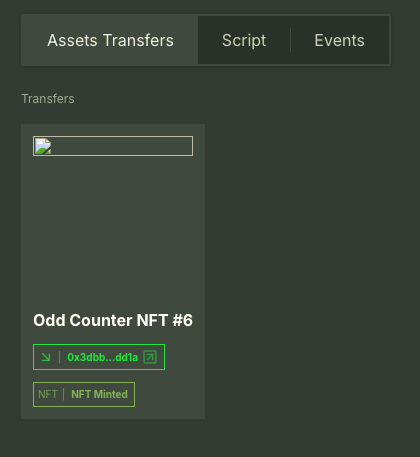

In this tutorial, you will **compose with someone else's contracts** on Flow testnet. You'll write a Cadence transaction that reads public state from a contract named `Counter` and only increments the counter when it is odd. Then you will extend the transaction to mint NFTs when the counter is odd, demonstrating how to compose multiple contracts in a single transaction. Everything runs against testnet using the Flow CLI and the dependency manager.

You can use transactions developed and tested this way from the frontend of your app.

:::info

We are importing the testnet `Counter` contract using the dependency manager. You are composing with a the public features of contract you do not own!

:::

## Objectives

After completing this guide, you will be able to:

- Configure the Flow CLI _dependency manager_ to import named contracts from **testnet**
- Write a Cadence **transaction** that reads and writes to a public contract you did not deploy
- Run the transaction on **testnet** with a funded account using the Flow CLI
- Extend the transaction to compose multiple public contracts (`Counter` + `ExampleNFT` + `NonFungibleToken`) without redeploying anything
- Set up NFT collections and mint NFTs conditionally based on on-chain state
- View transaction results and NFT transfers using Flowscan

## Prerequisites

- [Flow CLI installed]
- A **funded testnet account** to sign transactions  
  See **Create accounts** and **Fund accounts** in the Flow CLI super-commands:
  - Create: https://developers.flow.com/build/tools/flow-cli/super-commands#create-accounts
  - Fund: https://developers.flow.com/build/tools/flow-cli/super-commands#fund-accounts

## Getting Started

Create a [new project] with the [Flow CLI]:

```bash
flow init
```

Follow the prompts and create your project. You do **not** need to install any dependencies.

### Install dependencies

We will resolve imports **using string format** (`import "Counter"`) using the [dependency manager].

This is the recommended way of working with imports of already-deployed contracts. You should also use the CLI to create new files and add existing ones to `flow.json`.

:::warning

For this exercise, you need to **delete** the existing contract entry for `Counter` from your `flow.json`. You could also use an alias here, but this is simpler since you won't be deploying the `Counter` contract.

:::

You can install dependencies for already deployed contracts, whether yours or those deployed by others:

```bash
# Add a deployed instance of the Counter contract
flow dependencies install testnet://0x8a4dce54554b225d.Counter
```

Pick `none` for the deployment account as you won't need to redeploy these contracts.

Once installed with the dependency manager, Cadence imports like `import "Counter"` will resolve to the testnet address when sending transactions on testnet.

:::info

In Cadence, contracts are deployed to the account storage of the deploying address. Due to security reasons, the same private key produces different address on Cadence testnet and mainnet. One of the features of the dependency manager is to automatically select the right address for imports based on the network you're working on.

:::

---

## Compose with the public `Counter` contract

Review the `Counter` contract that's created as an example by `flow init`:

```cadence
access(all) contract Counter {

    access(all) var count: Int

    // Event to be emitted when the counter is incremented
    access(all) event CounterIncremented(newCount: Int)

    // Event to be emitted when the counter is decremented
    access(all) event CounterDecremented(newCount: Int)

    init() {
        self.count = 0
    }

    // Public function to increment the counter
    access(all) fun increment() {
        self.count = self.count + 1
        emit CounterIncremented(newCount: self.count)
    }

    // Public function to decrement the counter
    access(all) fun decrement() {
        self.count = self.count - 1
        emit CounterDecremented(newCount: self.count)
    }

    // Public function to get the current count
    view access(all) fun getCount(): Int {
        return self.count
    }
}
```

It's an example of a simple contract.

Unlike in Solidity, apps aren't limited to the functionality deployed in a smart contract. One of the ways you can expand your app is to write new transactions that call multiple functions in multiple contracts, with branching based on conditions and state, using a single call and a single signature. You don't need to deploy a new contract, use a proxy, or switch to V2.

In this simple example, imagine that you've already deployed a product that has thousands of users and is dependent on the `Counter` smart contract. After a time, you realize that a significant portion of your users only wish to use the `increment` feature if the current `count` is odd, to try and make the number be even.

In Cadence, this sort of upgrade is easy, even if you didn't anticipate the need at contract deployment.

All you need to do is to write a new [transaction] that **reads** the current count from `Counter` and **only increments** it if the value is odd.

Create a new [transaction] called `IncrementIfOdd` using the Flow CLI:

```bash
flow generate transaction IncrementIfOdd
```

Start by adding the code from the existing `IncrementCounter` [transaction]:

```cadence
import "Counter"

transaction {

    prepare(acct: &Account) {
        // Authorizes the transaction
    }

    execute {
        // Increment the counter
        Counter.increment()

        // Retrieve the new count and log it
        let newCount = Counter.getCount()
        log("New count after incrementing: ".concat(newCount.toString()))
    }
}
```

Then, modify it to handle the new feature:

```cadence
import "Counter"

transaction() {
  prepare(account: &Account) {}

  execute {
    // Get the current count from the Counter contract (public read)
    let currentCount = Counter.getCount()

    // Print the current count
    log("Current count: ".concat(currentCount.toString()))

    // If odd (remainder when divided by 2 is not 0), increment
    if currentCount % 2 != 0 {
      Counter.increment()
      log("Counter was odd, incremented to: ".concat(Counter.getCount().toString()))
    } else {
      log("Counter was even, no increment performed")
    }
  }
}
```

:::info

As with most blockchains, `log`s are not exposed or returned when transactions are run on testnet or mainnet, but they are visible in the console when you use the [emulator].

:::

### Run on testnet

You need a **funded** testnet account to sign the transaction. For development tasks, the CLI has [account commands] that you can use to create and manage your accounts.

Create and fund an account called `testnet-account`:

```bash
# If needed, create a testnet account (one-time)
flow accounts create --network testnet

# If needed, fund it (one-time)
flow accounts fund testnet-account
```

:::danger

As with other blockchain accounts, once the private key for an account is compromised, anyone with that key has complete control over an account and it's assets. **Never** put private keys directly in `flow.json`.

:::

Creating an account using the CLI automatically puts the private key in a `.pkey` file, which is already in `.gitignore`.

[Send the transaction] to testnet, signed with `testnet-account`:

```bash
flow transactions send cadence/transactions/IncrementIfOdd.cdc --signer testnet-account --network testnet
```

You should see logs that show the prior value and whether the increment occurred.

:::tip

This same transaction could be triggered **from an app** and **signed by a wallet** with a single user click. Your dApp would assemble and submit this exact Cadence transaction using your preferred client library, and the user's wallet would authorize it.

:::

---

## Extend with NFT Minting

Now let's take our composition to the next level by adding NFT minting functionality when the counter is odd. We'll use an example NFT contract that's already deployed on testnet.

This is a silly use case, but it demonstrates the complex use cases you can add to your apps, after contract deployment, and even if you aren't the author of any of the contracts!

### Install the NFT Contract

First, let's install the ExampleNFT contract dependency:

```bash
flow dependencies install testnet://012e4d204a60ac6f.ExampleNFT
```

:::warning

This repository uses different deployments for core contracts than those installed by the Flow CLI. If you previously installed core contract dependencies (like `NonFungibleToken`, `MetadataViews`, etc.) using the CLI, you should manually delete all `dependencies` except `Counter` from your `flow.json` file to avoid conflicts.

:::

### Understanding NFT Minting

Let's look at how NFT minting works with this contract. The [MintExampleNFT transaction] shows the pattern:

```cadence
import "ExampleNFT"
import "NonFungibleToken"

transaction(
    recipient: Address,
    name: String,
    description: String,
    thumbnail: String,
    creator: String,
    rarity: String
) {
    let recipientCollectionRef: &{NonFungibleToken.Receiver}

    prepare(signer: &Account) {
        self.recipientCollectionRef = getAccount(recipient)
            .capabilities.get<&{NonFungibleToken.Receiver}>(ExampleNFT.CollectionPublicPath)
            .borrow()
            ?? panic("Could not get receiver reference to the NFT Collection")
    }

    execute {
        ExampleNFT.mintNFT(
            recipient: self.recipientCollectionRef,
            name: name,
            description: description,
            thumbnail: thumbnail,
            creator: creator,
            rarity: rarity
        )
    }
}
```

You can copy this functionality and adapt it for our use case.

### Update the IncrementIfOdd Transaction

Now let's update our `IncrementIfOdd` transaction to mint an NFT when the counter is odd. You can either modify the existing transaction or create a new one:

```cadence
import "Counter"
import "ExampleNFT"
import "NonFungibleToken"

transaction() {
    let recipientCollectionRef: &{NonFungibleToken.Receiver}

    prepare(acct: &Account) {
        // Get the recipient's NFT collection reference
        self.recipientCollectionRef = getAccount(acct.address)
            .capabilities.get<&{NonFungibleToken.Receiver}>(ExampleNFT.CollectionPublicPath)
            .borrow()
            ?? panic("Could not get receiver reference to the NFT Collection")
    }

    execute {
        // Get the current count from the Counter contract (public read)
        let currentCount = Counter.getCount()

        // Print the current count
        log("Current count: ".concat(currentCount.toString()))

        // If odd (remainder when divided by 2 is not 0), increment and mint NFT
        if currentCount % 2 != 0 {
            Counter.increment()
            let newCount = Counter.getCount()
            log("Counter was odd, incremented to: ".concat(newCount.toString()))

            // Mint an NFT to celebrate the odd number
            ExampleNFT.mintNFT(
                recipient: self.recipientCollectionRef,
                name: "Odd Counter NFT #".concat(newCount.toString()),
                description: "This NFT was minted when the counter was odd!",
                thumbnail: "https://example.com/odd-counter.png",
                creator: "Counter Composer",
                rarity: "Rare"
            )
            log("Minted NFT for odd counter!")
        } else {
            log("Counter was even, no increment performed")
        }
    }
}
```

### Setup NFT Collection

Before you can mint NFTs, you need to set up an NFT collection in your account. Create a transaction to do this:

```bash
flow generate transaction SetupCollection
```

Add this content to the new transaction:

```cadence
import "ExampleNFT"
import "NonFungibleToken"
import "MetadataViews"

transaction {
    prepare(signer: auth(BorrowValue, IssueStorageCapabilityController, PublishCapability, SaveValue) &Account) {
        if signer.storage.borrow<&ExampleNFT.Collection>(from: ExampleNFT.CollectionStoragePath) != nil {
            return
        }

        let collection <- ExampleNFT.createEmptyCollection(nftType: Type<@ExampleNFT.NFT>())

        signer.storage.save(<-collection, to: ExampleNFT.CollectionStoragePath)

        let cap = signer.capabilities.storage.issue<&ExampleNFT.Collection>(ExampleNFT.CollectionStoragePath)
        signer.capabilities.publish(cap, at: ExampleNFT.CollectionPublicPath)
    }
}
```

Run the setup transaction:

```bash
flow transactions send cadence/transactions/SetupCollection.cdc --signer testnet-account --network testnet
```

### Test the Enhanced Transaction

Now run the enhanced transaction:

```bash
flow transactions send cadence/transactions/IncrementIfOdd.cdc --signer testnet-account --network testnet
```

You may need to run the regular `IncrementCounter` transaction first to get an odd number:

```bash
flow transactions send cadence/transactions/IncrementCounter.cdc --signer testnet-account --network testnet
```

### View Your NFT

Click the transaction link in the console to view the transaction in [testnet Flowscan]. After running the transaction **while the counter is odd**, you'll see an NFT in the `Asset Transfers` tab.

:::info

The broken image is expected. We didn't use a real URL in the example nft metadata.

:::



---

## Why this matters

- **No redeploys, no forks:** You composed your app logic with on-chain public contracts you do not control.
- **Cadence-first composition:** Transactions can include _arbitrary logic_ that calls into multiple contracts in one atomic operation with a single signature.
- **Production-ready path:** The same code path works from a CLI or a dApp frontend, authorized by a wallet.

## Conclusion

In this tutorial, you learned how to compose with multiple on-chain contracts using Cadence transactions. You built a transaction that conditionally interacts with a Counter contract based on its current state, and then extended it to mint NFTs when the counter is odd, demonstrating the power and flexibility of Cadence's composition model.

Now that you have completed the tutorial, you should be able to:

- Configure the Flow CLI _dependency manager_ to import named contracts from **testnet**
- Write a Cadence **transaction** that reads and writes to a public contract you did not deploy
- Run the transaction on **testnet** with a funded account using the Flow CLI
- Extend the transaction to compose multiple public contracts (`Counter` + `ExampleNFT` + `NonFungibleToken`) without redeploying anything
- Set up NFT collections and mint NFTs conditionally based on on-chain state
- View transaction results and NFT transfers using Flowscan

This approach gives you the freedom to build complex application logic that composes with any public contracts on Flow, making Cadence's composition model a powerful tool for developers building on Flow.

<!-- Reference-style links, will not render on page -->

[Flow CLI installed]: ../../../build/tools/flow-cli/install.md
[dependency manager]: ../../../build/tools/flow-cli/dependency-manager.md
[new project]: ../../../build/tools/flow-cli/flow.json/initialize-configuration
[Flow CLI]: ../../../build/tools/flow-cli/index.md
[transaction]: https://cadence-lang.org/docs/language/transactions
[account commands]: ../../../build/tools/flow-cli/commands#account-management
[Send the transaction]: ../../../build/tools/flow-cli/commands#send-transaction
[emulator]: ../../../build/tools/flow-cli/deployment/start-emulator
[MintExampleNFT transaction]: https://github.com/mfbz/flow-nft-tester/blob/main/cadence/transactions/MintExampleNFT.cdc
[testnet Flowscan]: https://testnet.flowscan.io/
