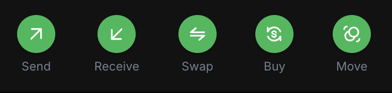
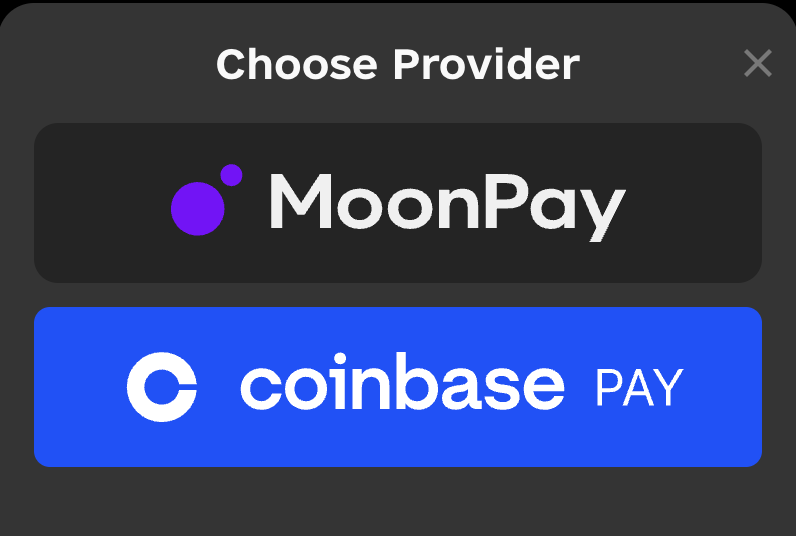

# Production Deployment

You've developed locally with the emulator, integrated external dependencies, built sophisticated transactions, implemented comprehensive testing, and created a frontend interface. Now it's time to take your application live and deploy it to Flow's public networks.

This tutorial will guide you through deploying your Counter application to both testnet and mainnet, ensuring your contracts and frontend work seamlessly in production environments. You'll learn the essential practices for managing live blockchain applications, from security considerations to monitoring and maintenance.

## What You'll Learn

After completing this tutorial, you'll be able to:

- **Deploy contracts to Flow testnet** with proper account setup and funding
- **Configure your application** for different network environments (emulator, testnet, mainnet)
- **Deploy to mainnet** with security best practices and production considerations
- **Update frontend configuration** to work with live networks
- **Implement monitoring and maintenance** practices for production applications
- **Understand the deployment pipeline** from development to production

**Prerequisites:** 

- Completed all previous tutorials ([Environment Setup], [Smart Contract Interaction], [Building a Frontend App])
- Counter contract and frontend app working locally
- Flow CLI installed and configured

## Deploy to Testnet

Testnet is Flow's public test network that mirrors mainnet functionality without using real FLOW tokens. It's the perfect environment to test your application in a live blockchain environment before committing to mainnet deployment.

### Understanding Flow Networks

Flow has several networks for different purposes:

- **Emulator**: Local development environment (what you've been using)
- **Testnet**: Public test network with free test tokens
- **Mainnet**: Production network with real FLOW tokens

Each network has its own:
- Access nodes and APIs
- Account addresses and contract deployments
- Token economics (free on testnet, real value on mainnet)

### Create a Testnet Account

First, you'll need a testnet account to deploy your contracts. You can create one using the Flow CLI:

```zsh
flow accounts create --network testnet
```

When prompted:
1. **Account name**: Enter `testnet-account`
2. **Select "Testnet" Network**

This creates a new account on testnet and adds it to your `flow.json` configuration. The CLI will show you the account address and save the private key locally.

### Fund Your Testnet Account

To deploy contracts and send transactions on testnet, you need FLOW tokens. Flow provides a faucet service to get free testnet tokens.

1. Visit the [Flow Testnet Faucet](https://faucet.flow.com/)
2. Enter your testnet account address
3. Complete any required verification (captcha, etc.)
4. Request tokens (you'll receive 1000 FLOW tokens)

This command automatically requests tokens from the testnet faucet for your account.

```zsh
flow accounts fund --network testnet testnet-account
```

**Verify Funding:**

Check your account balance:

```zsh
flow accounts list 
```

You should see your account details with a balance of FLOW tokens.

### Configure Testnet Deployment

Update your `flow.json` to include testnet deployment configuration. The NumberFormatter contract already exists on testnet, so you only need to deploy your Counter contract.

```zsh
flow config add deployment
```

Follow the prompts:
1. **Network**: `testnet`
2. **Account**: `testnet-account`  
3. **Contract**: `Counter`
4. **Deploy more contracts**: `yes`
5. **Contract**: `NumberFormatter`

Your `flow.json` should now include a testnet deployment section:

```json
{
  "deployments": {
		"emulator": {
			"default": [
				"Counter"
			],
			"emulator-account": [
				"NumberFormatter"
			]
		},
		"testnet": {
			"testnet-account": [
				"Counter",
				"NumberFormatter"
			]
		}
	}
}
```

### Deploy Counter Contract to Testnet

Deploy your Counter contract to the public testnet:

```zsh
flow project deploy --network testnet
```

You should see output similar to:

```zsh
Deploying 2 contracts for accounts: testnet-account

Counter -> 0x9942a81bc6c3c5b7 (d8fe130e5b2212a5c7b3c34fe6e74ede80c750bc4c57e57788e81b247dcd7fe0) 
NumberFormatter -> 0x9942a81bc6c3c5b7 (9a550aeefa5ede62cb95f0549084b2ab7abf3a493cf853d50c1c377a7be733b2) 

🎉 All contracts deployed successfully
```

### Test Your Testnet Deployment

Verify your contract works on testnet by running a script:

```zsh
flow scripts execute cadence/scripts/GetCounter.cdc --network testnet
```

You should see:
```zsh
Result: "0"
```

Test a transaction to increment the counter:

```zsh
flow transactions send cadence/transactions/IncrementCounter.cdc --network testnet --signer testnet-account
```

Run the script again to verify the increment worked:

```zsh
flow scripts execute cadence/scripts/GetCounter.cdc --network testnet
```

```zsh
Result: "1"
```

Perfect! Your Counter contract is now live on testnet and working correctly.

### Update Frontend for Testnet

Now update your Next.js application to connect to testnet instead of the emulator.

**Update `src/app/layout.tsx`:**

```tsx
'use client';

import { FlowProvider } from '@onflow/react-sdk';
import flowJson from '../flow.json';

export default function RootLayout({
  children,
}: {
  children: React.ReactNode;
}) {
  return (
    <html>
      <body>
        <FlowProvider
          config={{
            accessNodeUrl: 'access.devnet.nodes.onflow.org:9000',
            flowNetwork: 'testnet',
            discoveryWallet: '	https://fcl-discovery.onflow.org/testnet/authn',
          }}
          flowJson={flowJson}
        >
          {children}
        </FlowProvider>
      </body>
    </html>
  );
}
```

**Key Changes:**

- `accessNodeUrl`: Changed from localhost to Flow's testnet REST API
- `flowNetwork`: Changed from 'emulator' to 'testnet'  
- `discoveryWallet`: Updated to use testnet wallet discovery

### Test Your Testnet Frontend

Start your frontend application:

```bash
npm run dev
```

Visit `http://localhost:3000` and you should see:

1. **Counter value**: Displays the current count from your testnet contract
2. **Connect Wallet**: You can now connect using various Flow wallets (not just Dev Wallet)
3. **Increment functionality**: Transactions are sent to the live testnet
4. **Real transaction costs**: Small amounts of testnet FLOW are used for gas

**Important**: When connecting your wallet, make sure to:

- Switch your wallet to testnet network
- Use an account that has testnet FLOW tokens
- Confirm you're interacting with the correct contract address

## Deploy to Mainnet

Mainnet deployment is the final step in your application's journey. Unlike testnet, mainnet uses real FLOW tokens and serves real users, so additional security considerations and best practices are essential.

### Create a Mainnet Account

For mainnet, you'll need to acquire FLOW tokens through exchanges or other means, as there's no faucet.

**Option 1: Use Flow Wallet**

1. Download and install [Flow Wallet]
2. Create a new wallet and securely store your recovery phrase
3. Purchase FLOW tokens from a supported exchange
4. Transfer tokens to your Flow Wallet

**Option 2: Use Flow CLI**

```zsh
flow accounts create --network mainnet
```

When prompted:
1. **Account name**: Enter `mainnet-account`
2. **Select "Mainnet" Network**

### Acquire FLOW Tokens

You can purchase FLOW tokens from major exchanges like [Coinbase], [Moonpay], and [Binance].

You can also obtain FLOW directly from the Flow Wallet by clicking the "Buy" button in your account. 



Then click on a provider to purchase FLOW.



### Configure Mainnet Deployment

Add mainnet deployment configuration to your `flow.json`:

```zsh
flow config add deployment --network mainnet
```

Follow the prompts:
1. **Network**: `mainnet`
2. **Account**: `mainnet-account`  
3. **Contract**: `Counter`
4. **Deploy more contracts**: `yes`
5. **Contract**: `NumberFormatter`

Your `flow.json` should now include mainnet configuration:

```json
{
  "dependencies": {
    "NumberFormatter": {
      "source": "testnet://8a4dce54554b225d.NumberFormatter",
      "aliases": {
        "mainnet": "1654653399040a61",
        "testnet": "8a4dce54554b225d"
      }
    }
  },
  "deployments": {
		"emulator": {
			"default": [
				"Counter"
			],
			"emulator-account": [
				"NumberFormatter"
			]
		},
		"testnet": {
			"testnet-account": [
				"Counter",
				"NumberFormatter"
			]
		},
        "mainnet": {
            "mainnet-account": [
                "Counter",
				"NumberFormatter"
            ]
        }
	}
}
```

### Deploy to Mainnet

Deploy your Counter contract to mainnet:

```zsh
flow project deploy --network mainnet
```

**⚠️ Important**: This deployment costs real FLOW tokens and cannot be undone.

You should see output similar to:

```zsh
Deploying 2 contracts for accounts: mainnet-account

Counter -> 0xABC123DEF456789 (contract deployed successfully)
NumberFormatter -> 0x123456789ABC (contract deployed successfully)

🎉 All contracts deployed successfully
```

### Production Frontend Configuration

Create a production build of your frontend configured for mainnet:

**Update `src/app/layout.tsx` for production:**

```tsx
'use client';

import { FlowProvider } from '@onflow/react-sdk';
import flowJson from '../flow.json';

export default function RootLayout({
  children,
}: {
  children: React.ReactNode;
}) {
  return (
    <html>
      <body>
        <FlowProvider
          config={{
            accessNodeUrl: 'access.mainnet.nodes.onflow.org:9000',
            flowNetwork: 'mainnet',
            discoveryWallet: 'https://fcl-discovery.onflow.org/authn',
          }}
          flowJson={flowJson}
        >
          {children}
        </FlowProvider>
      </body>
    </html>
  );
}
```

Build your production frontend:

```bash
npm run build
```

<!-- Links -->

[Flow Wallet]: https://wallet.flow.com/
[Coinbase]: https://www.coinbase.com/en-in/how-to-buy/flow
[Moonpay]: https://www.moonpay.com/buy/flow
[Binance]: https://www.binance.com/en-IN/how-to-buy/flow