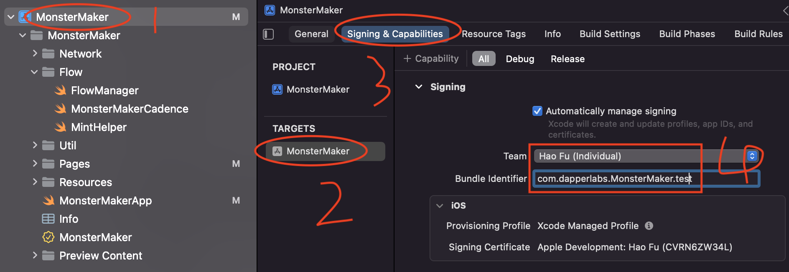
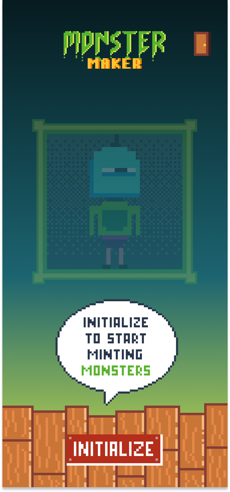
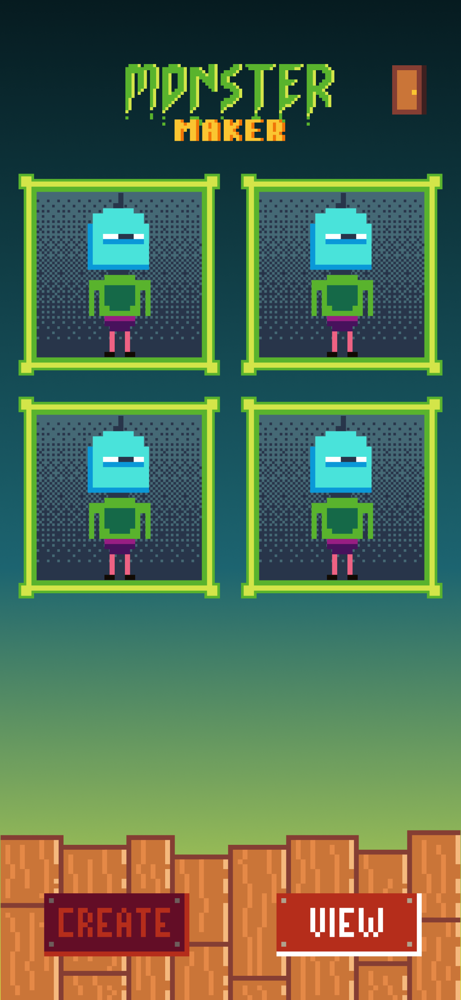

# Overview

The following documentation aims to educate you on building a native mobile application on Flow. It first presents Monster Maker, a starter project we've built to represent simple Flow mobile concepts. Next it presents various developer resources related to building mobile native Flow applications.

# Monster Maker


Monster Maker is a native iOS app that allows users to connect a wallet, sign a transaction to mint an NFT (a monster) and display their collection of NFTs (their monsters) within the app. It's meant to be a lightweight sample project to exemplify how to build a mobile native Flow project. If you're looking to build a native mobile application for Flow, exploring the Monster Maker code base first or even building off of it is a great way to get started.

<aside>
👉 ***Note** - We currently only have an iOS project for Monster Maker. That said an Android and web version of the same project is in active development.*

</aside>

## Github Repo

The Monster Maker Github Repo can be found here:

https://github.com/onflow/monster-maker

## Building to Device

Before you run Monster Maker on your device, please make sure you have installed the [Xcode14](https://apps.apple.com/au/app/xcode/id497799835?mt=12) from Mac App Store. Once you clone the repo, open the [MonsterMaker.xcodeproj](https://github.com/onflow/monster-maker/tree/main/iOS/MonsterMaker.xcodeproj) under the iOS folder.

Xcode should automatically setup the project for you. If you do see any error related to dependencies, run `Xcode Menu -> File -> Packages -> Reset Package Cache` to resolve the issue.

In the meantime, you can choose a simulator or your iPhone to run. For more detail here is the [official doc](https://developer.apple.com/documentation/xcode/running-your-app-in-simulator-or-on-a-device).
For run in real device, there are a few steps to deal with signing:

1. Add your apple account to the Xcode which can be accessed from `Xcode Menu -> Settings -> Add account`.
2. Change the Team to your Personal Apple account from the **Signing & Capabilities** under the project target menu. For more detail, please check the screenshot below.

   

## Connecting to a Wallet

To connect with wallets, there is native wallet discovery in the app. Once you click on connect, it will bring out the list of the wallets which support `HTTP/POST` or `WC/RPC` method.

### FCL Config

To make sure, the wallet can recognise your dApp, there is a few field you will need to config before connect to a wallet. The account proof config is optional. In addition, you will need to create a project id from [walletconnect](https://cloud.walletconnect.com/app) cloud before you can connect to the `WC/RPC` compatible wallet such as [Flow Wallet](https://wallet.flow.com/).

```swift
import FCL

// Config the App
let defaultProvider: FCL.Provider = .dapperPro
let defaultNetwork: Flow.ChainID = .testnet // or .mainnet

// Optinal: Config for account proof
let accountProof = FCL.Metadata.AccountProofConfig(appIdentifier: "Monster Maker")

// Config for WC/RPC compatible wallet
let walletConnect = FCL.Metadata.WalletConnectConfig(urlScheme: "monster-maker://", projectID: "12ed93a2aae83134c4c8473ca97d9399")

// Config basic dApp info
let metadata = FCL.Metadata(appName: "Monster Maker",
                            appDescription: "Monster Maker Demo App for mobile",
                            appIcon: URL(string: "https://i.imgur.com/jscDmDe.png")!,
                            location: URL(string: "https://monster-maker.vercel.app/")!,
                            accountProof: accountProof,
                            walletConnectConfig: walletConnect)
fcl.config(metadata: metadata,
           env: defaultNetwork,
           provider: defaultProvider)

// Import keywords replacement for cadence query and transaction
fcl.config
    .put("0xFungibleToken", value: "0x631e88ae7f1d7c20")
    .put("0xMonsterMaker", value: "0xfd3d8fe2c8056370")
    .put("0xMetadataViews", value: "0x631e88ae7f1d7c20")
    .put("0xTransactionGeneration", value: "0x44051d81c4720882")
```

### Open wallet discovery


In Monster Maker, the Connect button triggers opening of Wallet Discovery

For the wallet support `HTTP/POST`, it will use webview to show the following actions.

For the wallet support `WC/RPC`, it will use deep-link to the wallet for actions.

You can open the native wallet discovery to make the selection, but also you can connect to the specific wallet as well.

Here is the code snippet of it:

```swift
import FCL

// Open discovery view
fcl.openDiscovery()

// Or manual connect to specific wallet
try fcl.changeProvider(provider: provider, env: .testnet)
try await fcl.authenticate()
```

## Signing a Transaction



In Monster Maker, Initializing the NFT collection with the Initialize button triggers a transaction.

Similar to what we have on fcl-js, native sdk also use `query` and `mutate` for on-chain interactions. To request a signature from user, you can simply use `fcl.mutate` method. By default, the user will be the payer, proposer and authorizer, if you want to add custom authorizer please refer to the code from [Server](https://github.com/onflow/monster-maker/blob/main/server/pages/api/signAsMinter/index.ts) and [iOS](https://github.com/onflow/monster-maker/blob/main/iOS/MonsterMaker/Flow/MintHelper.swift) end.

```swift
guard let user = fcl.currentUser else {
    // Not signin
    return
}

let txId = try await fcl.mutate(
                            cadence: """
                                    transaction(test: String, testInt: Int) {
                                                   prepare(signer: &Account) {
                                                        log(signer.address)
                                                        log(test)
                                                        log(testInt)
                                                   }
                                               }
                                    """,
                            args: [
														.string("Hello"),
                            .int(10)
                           ],
                            gasLimit: 999,
                            authorizors: [user])

print("txId -> \(txId)")
```

## View NFT



The View page in Monster Maker exemplifies showing Monster Maker NFTs held by the connected wallet

During development, you always can query your NFT with `fcl.query`. Here is an example:

- Query cadence

  ```cadence
  import NonFungibleToken from 0xNonFungibleToken
      import MonsterMaker from 0xMonsterMaker
      import MetadataViews from 0xMetadataViews

      access(all) struct Monster {
          access(all) let name: String
          access(all) let description: String
          access(all) let thumbnail: String
          access(all) let itemID: UInt64
          access(all) let resourceID: UInt64
          access(all) let owner: Address
          access(all) let component: MonsterMaker.MonsterComponent

          init(
              name: String,
              description: String,
              thumbnail: String,
              itemID: UInt64,
              resourceID: UInt64,
              owner: Address,
              component: MonsterMaker.MonsterComponent
          ) {
              self.name = name
              self.description = description
              self.thumbnail = thumbnail
              self.itemID = itemID
              self.resourceID = resourceID
              self.owner = owner
              self.component = component
          }
      }

      access(all) fun getMonsterById(address: Address, itemID: UInt64): Monster? {

          if let collection = getAccount(address).capabilities.get<&MonsterMaker.Collection>(MonsterMaker.CollectionPublicPath).borrow() {

              if let item = collection.borrowMonsterMaker(id: itemID) {
                  if let view = item.resolveView(Type<MetadataViews.Display>()) {
                      let display = view as! MetadataViews.Display
                      let owner: Address = item.owner!.address!
                      let thumbnail = display.thumbnail as! MetadataViews.HTTPFile

                      return Monster(
                          name: display.name,
                          description: display.description,
                          thumbnail: thumbnail.url,
                          itemID: itemID,
                          resourceID: item.uuid,
                          owner: address,
                          component: item.component
                      )
                  }
              }
          }

          return nil
      }

      access(all) fun main(address: Address): [Monster] {
          let account = getAccount(address)
          let collectionRef = account.capabilities.get<&{NonFungibleToken.Collection}>(MonsterMaker.CollectionPublicPath).borrow()
          ?? panic("The account with address "
                  .concat(address.toString)
                  .concat(" does not have a NonFungibleToken Collection at ")
                  .concat(MonsterMaker.CollectionPublicPath.toString())
                  .concat(". Make sure the account address is correct and is initialized their account with a MonsterMaker Collection!"))

          let ids = collectionRef.getIDs()

          let monsters : [Monster] = []

          for id in ids {
              if let monster = getMonsterById(address: address, itemID: id) {
                  monsters.append(monster)
              }
          }

          return monsters
      }
  ```

```swift
let nftList = try await fcl.query(script: cadenceScript,
																		args: [.address(address)])
														.decode([NFTModel].self)
```

# External Resources

**FCL Swift**

FCL Swift is the iOS native SDK for FCL. This SDK is integrated into the Monster Maker sample.

https://github.com/Outblock/fcl-swift

**FCL Android**

FCL Android is the Android native SDK for FCL.

https://github.com/Outblock/fcl-android

**FCL Wallet Connect 2.0**

One of the easiest ways to connect to a wallet via a mobile native dApp is through Flow's new support for Wallet Connect 2.0. This is the pattern that Monster Maker uses to connect to the [Flow Wallet](https://wallet.flow.com/). For more information on FCL Wallet Connect 2.0, check out this page:

[FCL Wallet Connect](../../../build/tools/clients/fcl-js/wallet-connect.md)

**How to Build a Native iOS Dapp**

The Agile Monkeys has written a very comprehensive guide on how to build a native mobile application on iOS and interface with fcl-swift. Found here:

[How to Build a Native iOS Dapper](https://dev.to/theagilemonkeys/how-to-buid-a-native-ios-dapp-that-uses-the-flow-blockchain-as-the-backend-n9k)
[Source Code](https://github.com/jfsagasti/FlowNotes)
