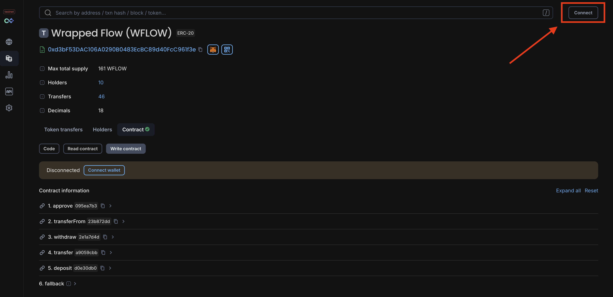
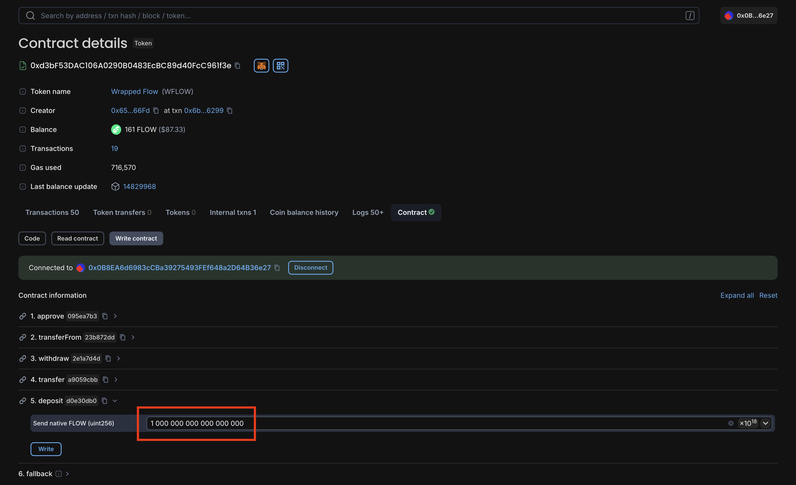
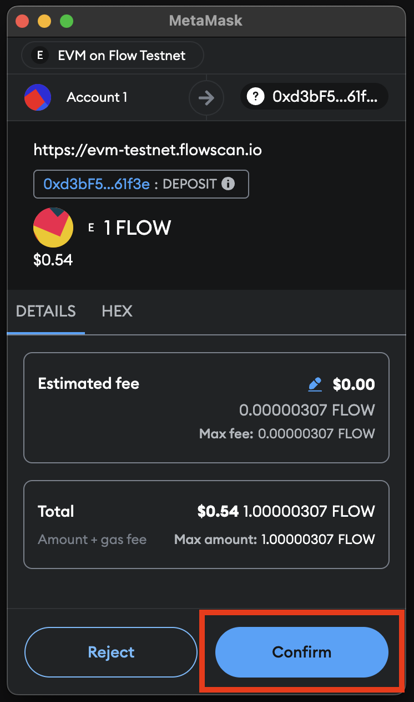
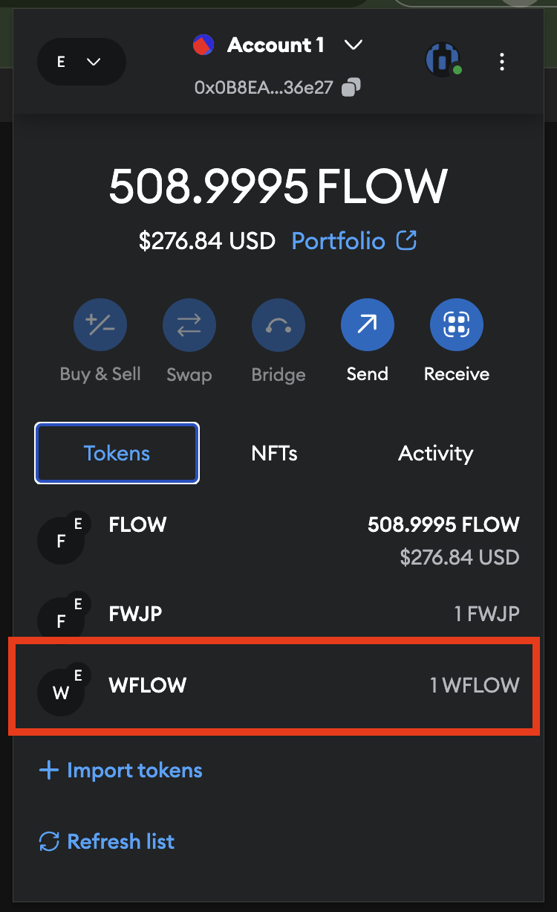
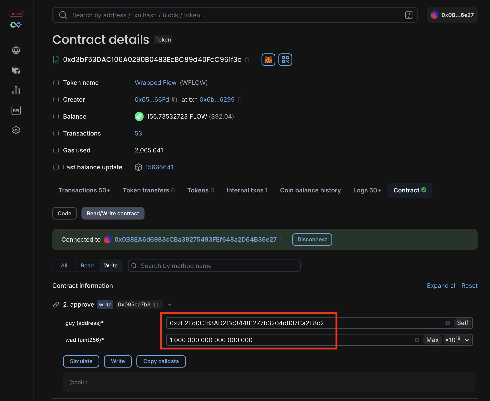
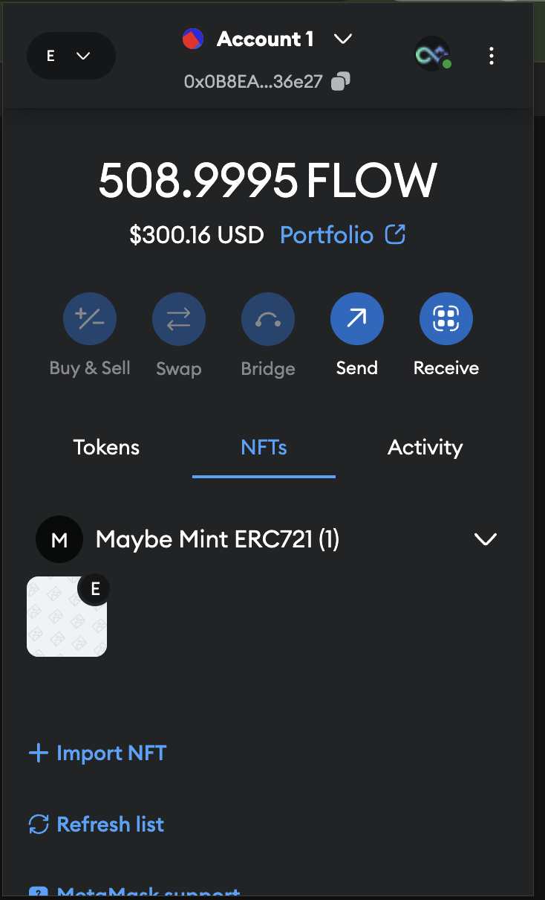
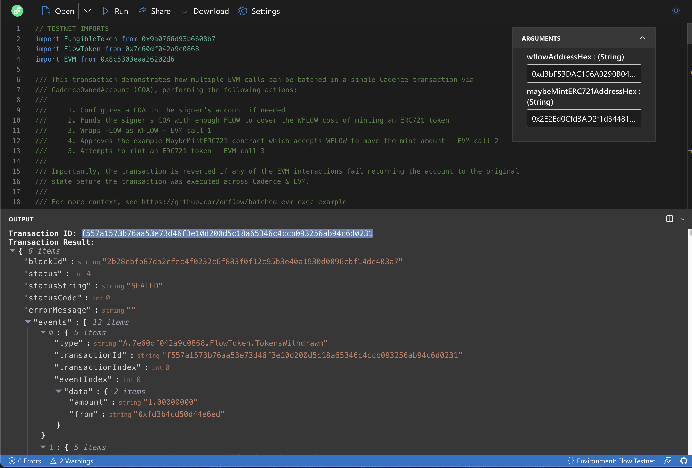
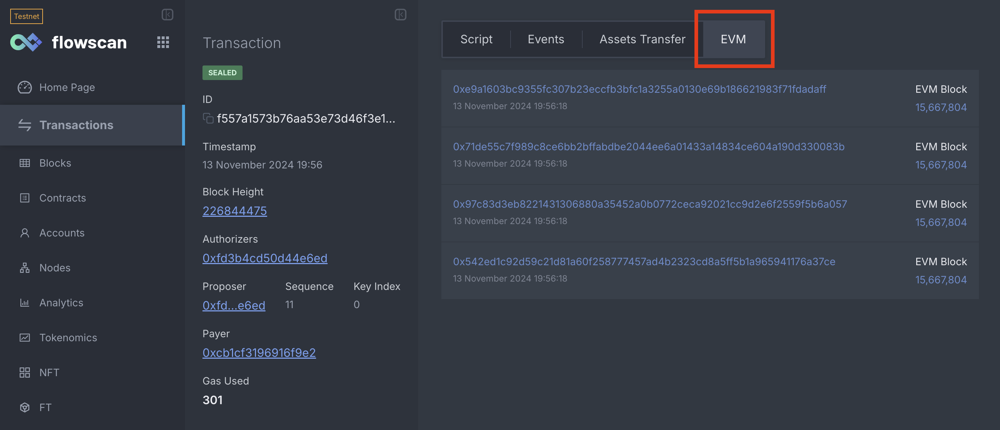

Integrating Cadence into EVM applications on Flow enables developers to leverage the best of both worlds. This guide
demonstrates how to batch EVM transactions using Cadence, allowing applications to embed multiple EVM transactions in a
single Cadence transaction while conditioning final execution on the success of all EVM transactions.

This feature can supercharge your EVM application by unlocking experiences otherwise impossible on traditional EVM
platforms.

## Objectives

After completing this guide, you'll be able to

- Construct a Cadence transaction that executes several EVM transactions such that if any EVM transaction fails, the
  entire set will revert
- Read and write from smart contract functions on [EVM Flowscan]
- Run a Cadence transaction from the browser using [Flow Runner]
- Install conceptual understanding of Cadence X EVM interactions
- Inspect multiple EVM transactions embedded in a Cadence transaction with [Flowscan] block explorer
- Write code that interacts with the EVM via a CadenceOwnedAccount (COA)

## Prerequisites

Before you dive in, make sure you have the following configured:

- [MetaMask] installed in your browser with an active account
- [Flow Wallet extension] installed in your browser with an active account
- Both wallets funded with Testnet FLOW. See the [Faucet guide] for more information.

## Overview

For the purposes of demonstration, this walkthrough will focus on relatively simple EVM operations in addition to first
creating a [Cadence-controlled EVM account (COA)]. Specifically, we will:

- Wrap FLOW as WFLOW
- Approve an ERC721 to transfer WFLOW in exchange for an NFT mint
- Mint an ERC721 token - this ERC721 has a 50% chance of failing (using [onchain VRF] to determine success)

These operations let us focus on the **core concepts** of this guide:

1. **Batching EVM transactions** using Cadence
2. **Conditioning execution** on the results of those EVM transactions.

However, using these same principles, you'll have the power to address more complex use cases. For instance, replace
wrapping FLOW with a DEX swap. Or instead of minting an ERC721, purchase an NFT listing from a marketplace. Combine
these two and suddenly you can purchase NFTs with any ERC20 token, all in a single Cadence transaction, reverting
everything if a single step fails.

The point is, while a simple use case, this guide will give you the tools to build much more complex and interesting
applications. So let's get started!

## Components

As mentioned in the [Overview], this guide involves three main actions:

- Wrapping FLOW as WFLOW
- Approving an ERC721 to transfer WFLOW in exchange for an NFT mint
- Minting an ERC721 token

Before interacting with these contracts, let's dig bit more into the components of this guide.

### Wrap FLOW as WFLOW

On Flow EVM, FLOW is the native currency and similar to other EVM platforms, the native currency is not accessible as an
ERC20 token. To interact with ERC20 contracts, you need to wrap FLOW as WFLOW (Wrapped FLOW). This is Flow's equivalent
of WETH on Ethereum.

:::tip

You can find WFLOW deployed to `0xd3bF53DAC106A0290B0483EcBC89d40FcC961f3e` on Flow [Testnet] & [Mainnet] and source
code in the [`@onflow/flow-sol-utils` repository].

:::

### Approve ERC721 Transfer

Our example `MaybeMintERC721` contract accepts WFLOW in exchange for minting an NFT. However, the contract cannot move
WFLOW without your permission. To allow the contract to move your WFLOW, you must approve the contract to transfer
enough of your WFLOW to mint the NFT.

### Mint ERC721 Token

Finally, we'll mint an ERC721 token using the `MaybeMintERC721` contract. This contract has a 50% chance of failing,
simulating a real-world scenario where purchasing an NFT might fail - say a listing was purchased before your
transaction was processed.

Importantly, if this transaction fails, we want to revert the entire sequence of transactions. After all, you wrapped
FLOW to WFLOW and approved the ERC721 transfer specifically to mint this NFT. If the mint fails, you want to unwind
everything. As we'll see shortly, this is where batching EVM transactions using Cadence is extremely powerful.

## Interacting with the Contracts

Before taking the easy route, let's first interact with the contracts individually to better understand the process and
status quo user experience. Realistically, this is your only option for completing the whole process on other EVM
platforms.

:::tip

Recall in [Prerequisites] that you need to have both [MetaMask] and [Flow Wallet extension] installed and funded with
Testnet FLOW. Make sure you've done so before proceeding.

:::

### Using MetaMask

#### 1. Wrap FLOW

Our first action will be to wrap enough FLOW to cover the cost of minting the `MaybeMintERC721` token. To do this, we'll
interact with the `WFLOW` contract on Testnet. There are a number of ways we could interact with this contract - Remix
IDE, Foundry's CLI, Hardhat, etc. - but for the purposes of this guide, we'll use the [Flowscan EVM block explorer].

Navigate to the WFLOW Testnet contract on Flowscan: [WFLOW]. Ensure you're on the `Write Contract` tab which allows you
to interact with the contract's mutating functions.

Before you can interact with the contract, you need to connect your MetaMask wallet to the [Flowscan EVM block
explorer]. Click the `Connect` button in the top right corner and follow the prompts to connect your MetaMask wallet.

:::warning

There are two **separate** block explorers for Flow - one for Cadence activity and another for EVM activity. This is
unique to Flow and is due to the fact that Cadence & EVM are separate runtimes, with EVM effectively emulated within
Cadence. This orientation - that of EVM running within Cadence - means that the Cadence-side explorer has visibility to
EVM transactions embedded within a Cadence transaction.

Practically, this means that any transactions ran using a Flow native account can be viewed on the Cadence explorer
while any transactions run using an EVM account can be viewed on the EVM explorer.

:::



Once connected, you should see your address in the top right corner and above the contract's functions.

Now we can wrap FLOW. Click on the `deposit` method which will drop down an input field for the amount of FLOW you want
to wrap. The mint amount for the `MaybeMintERC721` contract is 1 whole FLOW which in EVM terms is `1e18 wei` - `wei`
being the smallest unit of an EVM's native currency (inherited from Ethereum's units - more on Ether units [here]).

As shown below, put `1 000 000 000 000 000 000` in the input field for `deposit`.



You can now click the `Write` button to submit the transaction. Once MetaMask prompts you to sign the transaction, click
`Confirm` and give it a few seconds to process.

<div class="portrait-screenshot-wrapper">

</div>

Once confirmed, you should be able to see WFLOW balance in your tokens list in MetaMask - if not, you can click on
`Import Tokens` and paste the WFLOW contract address found on the Flowscan page and refresh your list.

<div class="portrait-screenshot-wrapper">

</div>

#### 2. Approve WFLOW Transfer

Now that you have your WFLOW, you'll need to approve the `MaybeMintERC721` contract to transfer your WFLOW. From the
same WFLOW page in Flowscan, click on the `approve` method. This time, you'll need to input the `MaybeMintERC721`
contract address - `0x2E2Ed0Cfd3AD2f1d34481277b3204d807Ca2F8c2` - and the amount of WFLOW you want to approve - again `1
000 000 000 000 000 000` WFLOW.



Click `Write` to submit the transaction. To be clear, this does not complete a transfer, but allows the
`MaybeMintERC721` contract to transfer your WFLOW on your behalf which will execute in the next step.

#### 3. Mint ERC721 Token

Finally, we'll attempt to mint the ERC721 token using the `MaybeMintERC721` contract. Navigate to the `MaybeMintERC721`
contract on Flowscan: [MaybeMintERC721].

Again, you'll be met with the contract functions on the `Write Contract` tab. Click on the `mint` function which takes
no arguments - just click on `Write` and then `Confirm` in the resulting MetaMask window.

This contract has a 50% chance of failing on mint using onchain randomness. If it fails, simply mint again until it
succeeds.

On success, you can click on your NFTs in MetaMask to see your newly minted token.

<div class="portrait-screenshot-wrapper">

</div>

#### Recap

This process is cumbersome and requires multiple transactions, each of which could fail. Given the intent of the process -
minting an NFT - if this were a case where the NFT was a limited edition or time-sensitive, you'd be left with WFLOW
wrapped and approved for transfer, but no NFT and would need to manually unwind the process.

Or you could just use Cadence to batch these transactions and revert everything if the mint fails. Let's do that.

### Using Flow Wallet

Before diving into the "how", let's execute the batched version of everything we just did using Flow Wallet. This will
give you a sense of the power of Cadence and the Flow blockchain.

The transaction below, like all Cadence transactions, is scripted, allowing us to execute a series of actions. It may
look like a lot at first, but we will break it down step by step in the following sections.

<details>

<summary>wrap_and_mint.cdc</summary>

```cadence
// TESTNET IMPORTS
import FungibleToken from 0x9a0766d93b6608b7
import FlowToken from 0x7e60df042a9c0868
import EVM from 0x8c5303eaa26202d6

/// This transaction demonstrates how multiple EVM calls can be batched in a single Cadence transaction via
/// CadenceOwnedAccount (COA), performing the following actions:
///
///     1. Configures a COA in the signer's account if needed
///     2. Funds the signer's COA with enough FLOW to cover the WFLOW cost of minting an ERC721 token
///     3. Wraps FLOW as WFLOW - EVM call 1
///     4. Approves the example MaybeMintERC721 contract which accepts WFLOW to move the mint amount - EVM call 2
///     5. Attempts to mint an ERC721 token - EVM call 3
///
/// Importantly, the transaction is reverted if any of the EVM interactions fail returning the account to the original
/// state before the transaction was executed across Cadence & EVM.
///
/// For more context, see https://github.com/onflow/batched-evm-exec-example
///
/// @param wflowAddressHex: The EVM address hex of the WFLOW contract as a String
/// @param maybeMintERC721AddressHex: The EVM address hex of the ERC721 contract as a String
///
transaction(wflowAddressHex: String, maybeMintERC721AddressHex: String) {

    let coa: auth(EVM.Call) &EVM.CadenceOwnedAccount
    let mintCost: UFix64
    let wflowAddress: EVM.EVMAddress
    let erc721Address: EVM.EVMAddress

    prepare(signer: auth(SaveValue, BorrowValue, IssueStorageCapabilityController, PublishCapability, UnpublishCapability) &Account) {
        /* COA configuration & assigment */
        //
        let storagePath = /storage/evm
        let publicPath = /public/evm
        // Configure a COA if one is not found in storage at the default path
        if signer.storage.type(at: storagePath) == nil {
            // Create & save the CadenceOwnedAccount (COA) Resource
            let newCOA <- EVM.createCadenceOwnedAccount()
            signer.storage.save(<-newCOA, to: storagePath)

            // Unpublish any existing Capability at the public path if it exists
            signer.capabilities.unpublish(publicPath)
            // Issue & publish the public, unentitled COA Capability
            let coaCapability = signer.capabilities.storage.issue<&EVM.CadenceOwnedAccount>(storagePath)
            signer.capabilities.publish(coaCapability, at: publicPath)
        }

        // Assign the COA reference to the transaction's coa field
        self.coa = signer.storage.borrow<auth(EVM.Call) &EVM.CadenceOwnedAccount>(from: storagePath)
            ?? panic("A CadenceOwnedAccount (COA) Resource could not be found at path ".concat(storagePath.toString())
                .concat(" - ensure the COA Resource is created and saved at this path to enable EVM interactions"))

        /* Fund COA with cost of mint */
        //
        // Borrow authorized reference to signer's FlowToken Vault
        let sourceVault = signer.storage.borrow<auth(FungibleToken.Withdraw) &FlowToken.Vault>(
                from: /storage/flowTokenVault
            ) ?? panic("The signer does not store a FlowToken Vault object at the path "
                    .concat("/storage/flowTokenVault. ")
                    .concat("The signer must initialize their account with this vault first!"))
        // Withdraw from the signer's FlowToken Vault
        self.mintCost = 1.0
        let fundingVault <- sourceVault.withdraw(amount: self.mintCost) as! @FlowToken.Vault
        // Deposit the mint cost into the COA
        self.coa.deposit(from: <-fundingVault)

        /* Set the WFLOW contract address */
        //
        // View the cannonical WFLOW contract at:
        // https://evm-testnet.flowscan.io/address/0xd3bF53DAC106A0290B0483EcBC89d40FcC961f3e
        self.wflowAddress = EVM.addressFromString(wflowAddressHex)

        /* Assign the ERC721 EVM Address */
        //
        // Deserialize the provided ERC721 hex string to an EVM address
        self.erc721Address = EVM.addressFromString(maybeMintERC721AddressHex)
    }

    pre {
        self.coa.balance().inFLOW() >= self.mintCost:
            "CadenceOwnedAccount holds insufficient FLOW balance to mint - "
            .concat("Ensure COA has at least ".concat(self.mintCost.toString()).concat(" FLOW"))
    }

    execute {
        /* Wrap FLOW in EVM as WFLOW */
        //
        // Encode calldata & set value
        let depositCalldata = EVM.encodeABIWithSignature("deposit()", [])
        let value = EVM.Balance(attoflow: 0)
        value.setFLOW(flow: self.mintCost)
        // Call the WFLOW contract, wrapping the sent FLOW
        let wrapResult = self.coa.call(
            to: self.wflowAddress,
            data: depositCalldata,
            gasLimit: 15_000_000,
            value: value
        )
        assert(
            wrapResult.status == EVM.Status.successful,
            message: "Wrapping FLOW as WFLOW failed: ".concat(wrapResult.errorMessage)
        )

        /* Approve the ERC721 address for the mint amount */
        //
        // Encode calldata approve(address,uint) calldata, providing the ERC721 address & mint amount
        let approveCalldata = EVM.encodeABIWithSignature(
                "approve(address,uint256)",
                [self.erc721Address, UInt256(1_000_000_000_000_000_000)]
            )
        // Call the WFLOW contract, approving the ERC721 address to move the mint amount
        let approveResult = self.coa.call(
            to: self.wflowAddress,
            data: approveCalldata,
            gasLimit: 15_000_000,
            value: EVM.Balance(attoflow: 0)
        )
        assert(
            approveResult.status == EVM.Status.successful,
            message: "Approving ERC721 address on WFLOW contract failed: ".concat(approveResult.errorMessage)
        )

        /* Attempt to mint ERC721 */
        //
        // Encode the mint() calldata
        let mintCalldata = EVM.encodeABIWithSignature("mint()", [])
        // Call the ERC721 contract, attempting to mint
        let mintResult = self.coa.call(
            to: self.erc721Address,
            data: mintCalldata,
            gasLimit: 15_000_000,
            value: EVM.Balance(attoflow: 0)
        )
        // If mint fails, all other actions in this transaction are reverted
        assert(
            mintResult.status == EVM.Status.successful,
            message: "Minting ERC721 token failed: ".concat(mintResult.errorMessage)
        )
    }
}

```

</details>

You can run the transaction at the following link using the community-developed Flow Runner tool: [`wrap_and_mint.cdc`].

This transaction takes two arguments:

- WFLOW contract address: `0xd3bF53DAC106A0290B0483EcBC89d40FcC961f3e`
- MaybeMintERC721 contract address: `0x2E2Ed0Cfd3AD2f1d34481277b3204d807Ca2F8c2`

Before running, ensure that the network section - bottom right corner - displays Testnet. If not, click and select
`Testnet` as your network and refresh. Once you've confirmed you're Flow Runner is targeting Testnet, copy these
addresses and paste them into the respective fields on the Flow Runner page. Click `Run` on the top left and follow the
prompts to connect your Flow Wallet and sign the transaction.

:::warning

Although we are running a manual transaction for the purposes of this walkthrough, you should always be careful to
review the transaction details before signing and submitting.

:::

Again, since the ERC721 has a 50% chance of failing, you may need to run the transaction multiple times until it
succeeds. However note that if the mint fails, the entire transaction will revert, unwinding the wrapped FLOW and
approval.

Again, since the ERC721 has a 50% chance of failure and the success of the transaction is conditioned on successfully
minting, your transaction may fail. If it does fail, importantly the entire transaction reverts, unwinding the wrapped
FLOW deposit and approval - the wrapping and approval transactions **do not execute** in the event of mint failure! This
is the main takeaway of this guide, that you embed a whole sequence of EVM transactions into one atomic operation using
Cadence and if the primary intent (or intents) does not execute, everything else is reverted as well.

In our case, you'll want to submit a transaction until one succeeds. Once you submit a successful transaction, you'll
see a transaction ID with event logs in the Flow Runner output. Let's take a closer look at the transaction and its
results in the Flowscan block explorer.



Copy your transaction ID and go to the Flowscan Testnet Cadence block explorer: [Flowscan Cadence].

Pasting your transaction ID into the search bar will show you the transaction details, including the Cadence script,
execution status, and event logs. Click on the `EVM` tab to view the EVM transactions batched in the Cadence
transaction.



Clicking on the transactions will open up the EVM transaction in Flowscan's EVM block explorer. If you view the EVM
transactions in order, you'll notice that they aggregate the same actions we took manually in the MetaMask section, but
this time in a single Cadence transaction!

## Breaking it Down

Now that we can relate to the pain of manually executing these transactions and we've seen the magic you can work with
Cadence, let's understand what's going on under the hood.

To recap, our Cadence transaction does the following, reverting if any step fails:

1. Wraps FLOW as WFLOW
2. Approves the `MaybeMintERC721` contract to move WFLOW
3. Attempts to mint a `MaybeMintERC721` token

But how does our Flow account interact with EVM from the Cadence runtime? As you'll recall from the [Interacting with
COA](./interacting-with-coa.md) guide, we use a Cadence-owned account (COA) to interact with EVM contracts from Cadence.

A COA is a [resource] providing an interface through which Cadence can interact with the EVM runtime. This is
importantly **_in addition_** to the traditional routes you'd normally access normal EVMs - e.g. via the JSON-RPC API.
And with this interface, we can take advantage of all of the benefits of Cadence - namely here scripted transactions and
conditional execution.

So in addition to the above steps, our transaction first configures a COA in the signer's account if one doesn't already
exist. It then funds the COA with enough FLOW to cover the mint cost, sourcing funds from the signing Flow account's
Cadence Vault. Finally, it wraps FLOW as WFLOW, approves the ERC721 contract to move the mint amount, and attempts to
mint the ERC721 token.

Let's see what each step looks like in the transaction code.

### COA Configuration

The first step in our transaction is to configure a COA in the signer's account if one doesn't already exist. This is
done by creating a new COA resource and saving it to the signer account's storage. A public Capability on the COA is
then issued and published on the signer's account, allowing anyone to deposit FLOW into the COA, affecting its EVM
balance.

```cadence
/* COA configuration & assignment */
//
let storagePath = /storage/evm
let publicPath = /public/evm
// Configure a COA if one is not found in storage at the default path
if signer.storage.type(at: storagePath) == nil {
    // Create & save the CadenceOwnedAccount (COA) Resource
    let newCOA <- EVM.createCadenceOwnedAccount()
    signer.storage.save(<-newCOA, to: storagePath)

    // Unpublish any existing Capability at the public path if it exists
    signer.capabilities.unpublish(publicPath)
    // Issue & publish the public, unentitled COA Capability
    let coaCapability = signer.capabilities.storage.issue<&EVM.CadenceOwnedAccount>(storagePath)
    signer.capabilities.publish(coaCapability, at: publicPath)
}

// Assign the COA reference to the transaction's coa field
self.coa = signer.storage.borrow<auth(EVM.Call) &EVM.CadenceOwnedAccount>(from: storagePath)
    ?? panic("A CadenceOwnedAccount (COA) Resource could not be found at path ".concat(storagePath.toString())
        .concat(" - ensure the COA Resource is created and saved at this path to enable EVM interactions"))
```

At the end of this section, the transaction now has an reference authorized with the `EVM.Call` [entitlement] to use in
the `execute` block which can be used call into EVM.

You can run a transaction that does just this step here: [`setup_coa.cdc`]

Since you ran the all-in-one transaction previously, your account already has a COA configured in which case the linked
transaction won't do anything. You can lookup your Testnet account's EVM address with the script below to confirm you
have a COA configured. Simply input your Testnet Flow address and click `Run`.

<iframe sandbox className="flow-runner-iframe" src="https://run.dnz.dev/snippet/beaa2849e4af2f17?colormode=dark&output=vertical&outputSize=100&network=testnet" width="100%" height="400px"></iframe>

### Funding the COA

Next, we fund the COA with enough FLOW to cover the mint cost. This is done by withdrawing FLOW from the signer's
FlowToken Vault and depositing it into the COA.

```cadence
/* Fund COA with cost of mint */
//
// Borrow authorized reference to signer's FlowToken Vault
let sourceVault = signer.storage.borrow<auth(FungibleToken.Withdraw) &FlowToken.Vault>(
        from: /storage/flowTokenVault
    ) ?? panic("The signer does not store a FlowToken Vault object at the path "
            .concat("/storage/flowTokenVault. ")
            .concat("The signer must initialize their account with this vault first!"))
// Withdraw from the signer's FlowToken Vault
self.mintCost = 1.0
let fundingVault <- sourceVault.withdraw(amount: self.mintCost) as! @FlowToken.Vault
// Deposit the mint cost into the COA
self.coa.deposit(from: <-fundingVault)
```

Taking a look at the full transaction, we can see an explicit check that the COA has enough FLOW to cover the mint cost
before proceeding into the transaction's `execute` block.

```cadence
pre {
    self.coa.balance().inFLOW() >= self.mintCost:
        "CadenceOwnedAccount holds insufficient FLOW balance to mint - "
        .concat("Ensure COA has at least ".concat(self.mintCost.toString()).concat(" FLOW"))
}
```

This isn't absolutely necessary as successive steps would fail on this condition, but helps provide enhanced error
messages in the event of insufficient funds.

You can run the above block in a transaction here which will move 1 FLOW from your account's Cadence FLOW balance to
your account's EVM balance, depositing it directly to your pre-configured COA: [`fund_coa.cdc`]

After running the linked transaction, you can check your COA's FLOW balance with the script below, just enter your COA's
EVM address (which you can get from the previous script). The resulting balance should be 1.0 (unless you've funded your
COA prior to this walkthrough).

<iframe sandbox className="flow-runner-iframe" src="https://run.dnz.dev/snippet/95e67e9e4cc182d6?colormode=dark&output=vertical&outputSize=100&network=testnet" width="100%" height="400px"></iframe>

### Setting our EVM Contract Targets

The last step in our transaction's `prepare` block is to deserialize the provided WFLOW and ERC721 contract addresses
from hex strings to EVM addresses.

```cadence
/* Set the WFLOW contract address */
//
// View the cannonical WFLOW contract at:
// https://evm-testnet.flowscan.io/address/0xd3bF53DAC106A0290B0483EcBC89d40FcC961f3e
self.wflowAddress = EVM.addressFromString(wflowAddressHex)

/* Assign the ERC721 EVM Address */
//
// Deserialize the provided ERC721 hex string to an EVM address
self.erc721Address = EVM.addressFromString(maybeMintERC721AddressHex)
```

### Wrapping FLOW as WFLOW

Next, we're on to the first EVM interaction - wrapping FLOW as WFLOW. This is done by encoding the `deposit()` function
call and setting the call value to the mint cost. The COA then calls the WFLOW contract with the encoded calldata, gas
limit, and value.

```cadence
/* Wrap FLOW in EVM as WFLOW */
//
// Encode calldata & set value
let depositCalldata = EVM.encodeABIWithSignature("deposit()", [])
let value = EVM.Balance(attoflow: 0)
value.setFLOW(flow: self.mintCost)
// Call the WFLOW contract, wrapping the sent FLOW
let wrapResult = self.coa.call(
    to: self.wflowAddress,
    data: depositCalldata,
    gasLimit: 15_000_000,
    value: value
)
assert(
    wrapResult.status == EVM.Status.successful,
    message: "Wrapping FLOW as WFLOW failed: ".concat(wrapResult.errorMessage)
)
```

Setting the value of the call transmits FLOW along with the call to the contract, accessible in solidity as `msg.value`.

:::tip

You'll notice a general pattern among all EVM calls in this transaction:

1. Encoding the calldata
2. Calling the contract
3. Asserting the call was successful

Here we're just interested in a successful call, but we could access return data if it were expected and relevant for
our Cadence transaction. This returned data is accessible from the `data` field on the `EVM.Result` object returned from
`coa.call(...)`. This data would then be decoded using `EVM.decodeABI(...)`. More on this in later guides.

:::

You can run the above code as a transaction here: [`wrap_flow.cdc`]

After running the transaction, your COA should have a WFLOW balance of 1.0 WFLOW. Confirm your WFLOW balance by running
the script below, providing your Flow account address, the WFLOW address of `0xd3bF53DAC106A0290B0483EcBC89d40FcC961f3e`
and your COA's EVM address (retrieved from a previous script):

<iframe sandbox className="flow-runner-iframe" src="https://run.dnz.dev/snippet/3faaf9b7069c1358?colormode=dark&output=vertical&outputSize=100&network=testnet" width="100%" height="800px"></iframe>

Since Solidity does not support decimal precision, the returned balance will look like a large number. In the case of
WFLOW, we can recover the decimals by shifting the decimal place 18 digits to the left. Your account should have `1`
WFLOW or `1000000000000000000` as returned.

:::warning

Note that the number of places to shift varies by ERC20 implementation -- the default value is 18, but it's not safe to
assume this value. You can check a token's decimal places by calling `ERC20.decimals()(uint8)`.

:::

### Approving the ERC721 Contract

Once the FLOW is wrapped as WFLOW, we approve the ERC721 contract to move the mint amount. This is done by encoding the
`approve(address,uint256)` calldata and calling the WFLOW contract with the encoded calldata.

```cadence
/* Approve the ERC721 address for the mint amount */
//
// Encode calldata approve(address,uint) calldata, providing the ERC721 address & mint amount
let approveCalldata = EVM.encodeABIWithSignature(
        "approve(address,uint256)",
        [self.erc721Address, UInt256(1_000_000_000_000_000_000)]
    )
// Call the WFLOW contract, approving the ERC721 address to move the mint amount
let approveResult = self.coa.call(
    to: self.wflowAddress,
    data: approveCalldata,
    gasLimit: 15_000_000,
    value: EVM.Balance(attoflow: 0)
)
assert(
    approveResult.status == EVM.Status.successful,
    message: "Approving ERC721 address on WFLOW contract failed: ".concat(approveResult.errorMessage)
)
```

You can run this approval using the transaction, passing the WFLOW address of
`0xd3bF53DAC106A0290B0483EcBC89d40FcC961f3e` and MaybeMintERC721 address of `0x2E2Ed0Cfd3AD2f1d34481277b3204d807Ca2F8c2`
: [`approve_maybe_mint_erc721.cdc`]

The linked transaction will perform the approval step, authorizing the ERC721 to transfer WFLOW to cover the mint cost
when `mint()` is called. Confirm the contract allowance by running the script below. Pass your Flow address, WFLOW
address, ERC721 address, and your COA's EVM address.

<iframe sandbox className="flow-runner-iframe" src="https://run.dnz.dev/snippet/37ccbfde5e523b42?colormode=dark&output=vertical&outputSize=100&network=testnet" width="100%" height="800px"></iframe>

The result is the amount of your WFLOW balance the ERC721 is allowed to transfer, which after the transaction should be
`1` WFLOW, or `1000000000000000000` as returned.

### Minting the ERC721 Token

Finally, we attempt to mint the ERC721 token. This is done by encoding the `mint()` calldata and calling the ERC721
contract with the encoded calldata. If the mint fails, the entire transaction is reverted.

```cadence
/* Attempt to mint ERC721 */
//
// Encode the mint() calldata
let mintCalldata = EVM.encodeABIWithSignature("mint()", [])
// Call the ERC721 contract, attempting to mint
let mintResult = self.coa.call(
    to: self.erc721Address,
    data: mintCalldata,
    gasLimit: 15_000_000,
    value: EVM.Balance(attoflow: 0)
)
// If mint fails, all other actions in this transaction are reverted
assert(
    mintResult.status == EVM.Status.successful,
    message: "Minting ERC721 token failed: ".concat(mintResult.errorMessage)
)
```

You can run the minting transaction here, passing the ERC721 address of `0x2E2Ed0Cfd3AD2f1d34481277b3204d807Ca2F8c2`:
[`mint.cdc`]

Again, this transaction may fail. But if you executed all the prior stepwise transactions according to the walkthrough,
you can try again until the mint succeeds. Recall that you can view your transaction details using Cadence [Flowscan]
which will also let you view the embedded EVM transactions in the `EVM` tab. Try it out, and see if you can figure out
how to get your minted NFT's URI with the script below.

<iframe sandbox className="flow-runner-iframe" src="https://run.dnz.dev/snippet/dbe4fb4e722f36d4?colormode=dark&output=vertical&outputSize=100&network=testnet" width="100%" height="800px"></iframe>

### Recap

All of the stepwise transactions you just executed are compiled in the first Cadence transaction we ran. Hopefully,
going through the process step by step illuminates the power and flexibility of Cadence, allowing you to write
transactions as simple or as complex as you want.

While lengthy transactions can be intimidating and even a bit verbose at times, the flexibility afforded by the language
means you are only limited by your imagination. Cadence transactions allow you to support the most streamlined of
experiences, incorporating as many contracts as needed to support your use case.

## Conclusion

In this guide, we've demonstrated how to batch EVM transactions using Cadence, allowing you to conditionally execute
multiple EVM transactions in a single Cadence transaction. While this guide focused on relatively simple EVM operations,
the principles can be applied to much more complex and interesting applications.

In the process, you learned how to:

- Read and write from smart contract functions on EVM Flowscan
- Run a Cadence transaction from the browser using [Flow Runner]
- Execute batched EVM transactions via a COA in a Cadence transaction
- Condition final transaction execution on success of all EVM transactions
- Inspect multiple EVM transactions embedded in a Cadence transaction with [Flowscan] block explorer

The biggest takeaway here isn't the specific actions taken in this walkthrough, but the overarching concept that you can
use **Cadence as an orchestration layer** to **extend existing EVM contracts**, creating unique user experiences with
the power **to differentiate your Web3 application**.

With these basics in hand, you're ready to start building more complex applications that leverage the power of Cadence
and the Flow blockchain. How will you use these features to build Web3's next killer app?

## Further Reading

Now that you've experienced the power of Cadence and EVM interactions firsthand, we recommend checking out the following
guides to deepen your understanding:

- [How Flow EVM Works] - Learn more about the Flow EVM and how it differs from traditional EVM platforms
- [Interacting with COAs] - Get a fuller picture of how Cadence interacts with EVM contracts via Cadence-owned accounts
- [Cadence Transactions] - Learn more about the Cadence transaction model

Ready to level up your Cadence skills? Take a look at [these Cadence tutorials].

<!-- Reference links -->

[EVM Flowscan]: https://evm.flowscan.io/
[Flow Runner]: https://run.dnz.dev/
[Flowscan]: https://www.flowscan.io/
[MetaMask]: https://metamask.io/download/
[Flow Wallet extension]: https://wallet.flow.com/download
[Faucet guide]: ../../ecosystem/faucets.md
[Cadence-controlled EVM account (COA)]: ./interacting-with-coa.md
[onchain VRF]: ../native-vrf/vrf-in-solidity.md
[Overview]: #overview
[Testnet]: https://evm-testnet.flowscan.io/token/0xd3bF53DAC106A0290B0483EcBC89d40FcC961f3e?tab=contract
[Mainnet]: https://evm.flowscan.io/token/0xd3bF53DAC106A0290B0483EcBC89d40FcC961f3e?tab=contract
[`@onflow/flow-sol-utils` repository]: https://github.com/onflow/flow-sol-utils
[Prerequisites]: #prerequisites
[Flowscan EVM block explorer]: https://www.evm-testnet.flowscan.io/
[WFLOW]: https://evm-testnet.flowscan.io/token/0xd3bF53DAC106A0290B0483EcBC89d40FcC961f3e?tab=write_contract
[here]: https://docs.soliditylang.org/en/v0.8.28/units-and-global-variables.html#ether-units
[MaybeMintERC721]: https://evm-testnet.flowscan.io/address/0x2E2Ed0Cfd3AD2f1d34481277b3204d807Ca2F8c2?tab=write_contract
[`wrap_and_mint.cdc`]: https://run.dnz.dev/snippet/c99b25e04a2d1f28
[Flowscan Cadence]: https://testnet.flowscan.io/
[resource]: https://cadence-lang.org/docs/solidity-to-cadence#resources
[entitlement]: https://cadence-lang.org/docs/language/access-control#entitlements
[How Flow EVM Works]: ../../build/evm/how-it-works.md
[Interacting with COAs]: ./interacting-with-coa.md
[Cadence Transactions]: ../../build/cadence/basics/transactions.md
[these Cadence tutorials]: https://cadence-lang.org/docs/tutorial/first-steps
[`setup_coa.cdc`]: https://run.dnz.dev/snippet/4ec75e1f4165fa05
[`fund_coa.cdc`]: https://run.dnz.dev/snippet/0e7370601bd9123b
[`wrap_flow.cdc`]: https://run.dnz.dev/snippet/9dbfb784da5300fb
[`approve_maybe_mint_erc721.cdc`]: https://run.dnz.dev/snippet/1b503d82f9a2c5a7
[`mint.cdc`]: https://run.dnz.dev/snippet/fd7c4dda536d006e
