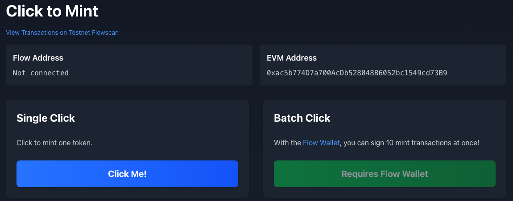
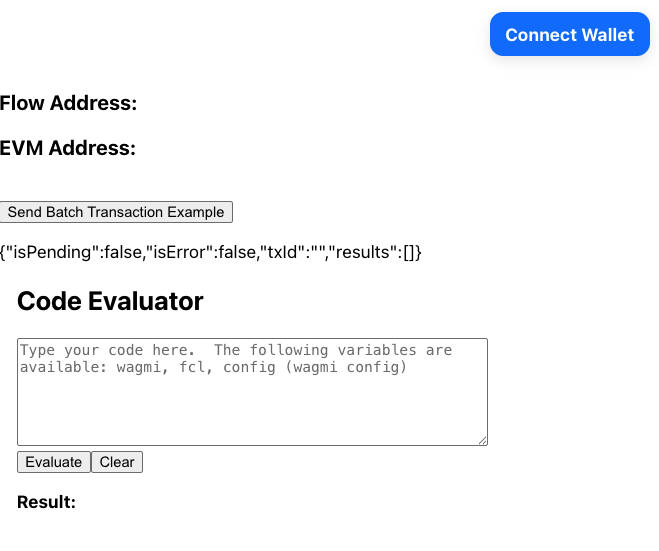
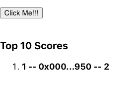

Ever since the launch of Flow EVM, it's been possible to _supercharge_ your EVM apps by using Flow Cadence features and contracts. Some benefits, such as [native VRF] and inexpensive gas without compromising security are built in and either easy or automatic to use. Others, such as the ability to use [Cadence] to [structure and call EVM transactions], are powerful but complicated to configure and use. They also require developers to manage concurrent connections to both networks.

[FLIP 316] improves the [Flow Client Library (FCL)] to support cross-VM functionality between Flow EVM and Flow Cadence.

For EVM developers, this means that you can use the familiar [wagmi], [viem], and [RainbowKit] stack you're used to, add FCL, and get features like **multi-call write** with one signature for users with a Cadence-compatible [wallet].

In this tutorial, you'll learn how to create [Click to Mint], a simple game that allows players to mint an ERC-20 token by clicking a button. With the power of Flow, they can also click a button, and **complete 10 separate transactions with just one approval!**



:::warning

The FCL functionality described in this tutorial is in alpha. Some steps may change. We'll keep the tutorial updated, but please [create an issue] or let us know on [Discord] if something isn't working for you.

:::

## Objectives

After completing this guide, you'll be able to:

- Build an app that seamlessly integrates Flow Cadence and Flow EVM connections
- Add Cadence features to your [Rainbowkit]/[wagmi]/[viem] app
- Utilize [Flow Client Library (FCL)] to enable multi-call contract writes to Flow EVM

## Prerequisites

### Next.js and Modern Frontend Development

This tutorial uses [Next.js]. You don't need to be an expert, but it's helpful to be comfortable with development using a current React framework. You'll be on your own to select and use a package manager, manage Node versions, and other frontend environment tasks. If you don't have your own preference, you can just follow along with us and use [npm].

### Solidity and Cadence Smart Contract Development

Apps using the hybrid approach can interact with both [Cadence] and [Solidity] smart contracts. You don't need to be an expert in either of these, but it's helpful to be familiar with how smart contracts work in at least one of these languages.

### Onchain App Frontends

We're assuming you're familiar with [wagmi], [viem], and [RainbowKit]. If you're coming from the Cadence, you might want to take a quick look at the getting started guides for these platforms. They're all excellent and will rapidly get you up to speed on how the EVM world commonly connects their apps to their contracts.

## Getting Started

For this tutorial, we'll be starting from a fork of the [FCL + RainbowKit + Wagmi Integration Demo] built by the team.

Fork the repo so you can push your work freely to your own copy, then follow the setup instructions.

## Project Overview

Open the cross-vm app scaffold in your editor, run it, and view the site in your browser:

```bash
npm run dev
```

You'll see:



Connect with a Cadence-compatible [wallet].

:::warning

In a production app, you'll want to manage this process carefully. Non-Cadence EVM wallets may be able to connect, but they will **not** be able to use any Cadence features.

:::

## Send Batch Transactions

The first demo built into this scaffold is **multi-call contract write**.

On Flow, this isn't an unstable experimental feature - it's a demonstration of the power of EVM + Cadence.

Click `Send Batch Transaction Example` and approve the transaction. You'll see three lines appear on the page, similar to:

```
{"isPending":false,"isError":false,"txId":"b3c2b8c86e68177af04324152d45d9de9c2a118ff8f090476b3a07e0c9554912","results":[{"hash":"0x46e923a08d9008632e3782ea512c4c590d4650ba58b3e8b49628f58e6adddaa9","status":"passed","errorMessage":""},{"hash":"0x52c82dc689cd5909519f8a90d0a1ec2e74192d7603fd3b5d33f7f4d54a618a84","status":"passed","errorMessage":""}]}
```

:::tip

Currently, the Flow wallet sponsors the fees for the compute units (equivalent of gas) for all transactions signed with the wallet on both testnet **and mainnet!**

:::

### Cadence Parent Transaction

The first line is the transaction id of the Flow Cadence transaction that calls **both** of the EVM transactions. Search for it in [Testnet Cadence Flowscan].

Cadence transactions are more complicated than those in Solidity contracts. Rather than being restricted to running functions present on the contract, they can run arbitrary code as long as the caller has access to all of the resources required by the transaction.

You can see the code of the transaction in the `Script` tab, but we've included it here for convenience:

```cadence
import EVM from 0x8c5303eaa26202d6

transaction(calls: [{String: AnyStruct}], mustPass: Bool) {

    let coa: auth(EVM.Call) &EVM.CadenceOwnedAccount

    // Borrow a reference to the EVM account that has the ability to sign transactions
    prepare(signer: auth(BorrowValue) & Account) {
        let storagePath = /storage/evm
        self.coa = signer.storage.borrow<auth(EVM.Call) &EVM.CadenceOwnedAccount>(from: storagePath)
            ?? panic("No CadenceOwnedAccount (COA) found at ".concat(storagePath.toString()))
    }

    // Iterate through the list of provided EVM transactions
    execute {
        for i, call in calls {
            let to = call["to"] as! String
            let data = call["data"] as! String
            let gasLimit = call["gasLimit"] as! UInt64
            let value = call["value"] as! UInt

            let result = self.coa.call(
                to: EVM.addressFromString(to),
                data: data.decodeHex(),
                gasLimit: gasLimit,
                value: EVM.Balance(attoflow: value)
            )

            if mustPass {
                assert(
                  result.status == EVM.Status.successful,
                  message: "Call index ".concat(i.toString()).concat(" to ").concat(to)
                    .concat(" with calldata ").concat(data).concat(" failed: ")
                    .concat(result.errorMessage)
                )
            }
        }
    }
```

In this case, it's checking that the caller of the Cadence transaction has permission to control to the EVM account, which is built in for [Cadence Owned Accounts]. The `execute` phase then iterates through the EVM transactions and uses the Cadence accounts own permissions to sign the EVM transactions.

The loop also handles a check for the optional flag to cancel all of the transactions if any one of them fails. **In other words, you could set up a 20 transaction arbitrage attempt and unwind everything if it fails at any step!**

### EVM Child Transactions

The next two lines show the transaction hashes for the EVM transactions. You can view this in [Testnet EVM Flowscan] by searching for the transaction hashes, the same as any other.

Look up both transactions.

The first is calling the `deposit()` function to wrap FLOW and move it to EVM.

The second is calling the ERC-20 `approve()` function to give another address the authority to spend those tokens.

For the demo, the code for this is hard-coded into `src/app/page.tsx`:

```tsx
const calls: EVMBatchCall[] = [
  {
    // Call deposit() function (wrap FLOW) on the token contract.
    address: '0xd3bF53DAC106A0290B0483EcBC89d40FcC961f3e', // Replace with your actual token contract address.
    abi: [
      {
        inputs: [],
        name: 'deposit',
        outputs: [],
        stateMutability: 'payable',
        type: 'function',
      },
    ],
    functionName: 'deposit',
    args: [], // deposit takes no arguments; value is passed with the call.
  },
  {
    // Call approve() function (ERC20 style) on the same token contract.
    address: '0xd3bF53DAC106A0290B0483EcBC89d40FcC961f3e', // Replace with your actual token contract address if needed.
    abi: [
      {
        inputs: [
          { name: 'spender', type: 'address' },
          { name: 'value', type: 'uint256' },
        ],
        name: 'approve',
        outputs: [{ name: '', type: 'bool' }],
        stateMutability: 'nonpayable',
        type: 'function',
      },
    ],
    functionName: 'approve',
    args: [
      '0x2E2Ed0Cfd3AD2f1d34481277b3204d807Ca2F8c2', // Spender address.
      BigInt('1000000000000000000'), // Approve 1 token (assuming 18 decimals).
    ],
  },
];
```

It's called with the `useBatchTransaction` hook via the `sendBatchTransaction(calls)` function.

## Code Evaluator

The demo also has an embedded code evaluator that you can use to experiment with snippets of code from `fcl` or `wagmi`.

For example:

```tsx
const user = await fcl.currentUser().snapshot();
return user.addr;
```

Will return your Cadence address. This snippet:

```tsx
const block = await fcl.block();
return block.height;
```

Returns the current Cadence VM block number.

## Calling Your Own Contract

Next, we'll update the starter to connect to and call functions in our own contract. For this, we'll use a simple [Button Clicker Contract]. You can deploy your own copy, or use the one deployed at [`0xA7Cf2260e501952c71189D04FAd17c704DFB36e6`].

## Set Up Contract Imports

:::info

The following steps assume deployment with Hardhat Ignition. If you are using a different deployment method, import the contract address and abi as appropriate.

:::

In your fork of the app, add a folder called `contracts` to the `src` folder. In it, copy over ['deployed_addresses.json`] from `ignition/deployments/chain-545` in the Button Clicker repo, and `ignition/deployments/chain-545/ClickTokenModule#ClickToken.json`.

Next, create a folder called `constants` and add a file called `contracts.ts` to it.

In it, import the contract artifact and addresses file, and create export a constant with this information.

```tsx
import ClickToken from '../contracts/ClickTokenModule#ClickToken.json';
import deployedAddresses from '../contracts/deployed_addresses.json';

export const clickToken = {
  abi: ClickToken.abi,
  address: deployedAddresses['ClickTokenModule#ClickToken'] as `0x${string}`,
};
```

## Build Traditional Functionality

This isn't a wagmi tutorial, so we'll give you some components to speed up the process. Add a folder called `components` inside `src` and add the following files.

`TheButton.tsx`

```tsx
'use client';

import { useAccount } from 'wagmi';
import { clickToken } from '../constants/contracts';

interface theButtonProps {
  // eslint-disable-next-line
  writeContract: Function;
  awaitingResponse: boolean;
  setAwaitingResponse: (value: boolean) => void;
}

export default function TheButton({
  writeContract,
  awaitingResponse,
  setAwaitingResponse,
}: theButtonProps) {
  const account = useAccount();

  function handleClick() {
    setAwaitingResponse(true);
    writeContract({
      abi: clickToken.abi,
      address: clickToken.address,
      functionName: 'mintTo',
      args: [account.address],
      gas: 45000,
    });
  }

  return (
    <>
      {!awaitingResponse && (
        <button
          onClick={handleClick}
          className="w-full py-4 px-8 text-2xl font-bold text-white bg-green-500 hover:bg-green-600 rounded-lg shadow-lg transition-transform transform active:scale-95"
        >
          Click Me!!!
        </button>
      )}
      {awaitingResponse && (
        <button className="disabled w-full py-4 px-8 text-2xl font-bold text-white bg-gray-500 rounded-lg shadow-lg">
          Please Wait...
        </button>
      )}
    </>
  );
}
```

`TopTenDisplay.tsx`

```tsx
import { useAccount, useReadContract } from 'wagmi';
import { clickToken } from '../constants/contracts';
import { useEffect, useState } from 'react';
import { useQueryClient } from '@tanstack/react-query';
import { formatUnits } from 'viem';

type scoreBoardEntry = {
  user: string;
  value: bigint;
};

interface TopTenDisplayProps {
  reloadScores: boolean;
  setReloadScores: (value: boolean) => void;
}

export default function TopTenDisplay({
  reloadScores,
  setReloadScores,
}: TopTenDisplayProps) {
  const [scores, setScores] = useState<scoreBoardEntry[]>([]);

  const account = useAccount();
  const queryClient = useQueryClient();

  const { data: scoresData, queryKey: getAllScoresQueryKey } = useReadContract({
    abi: clickToken.abi,
    address: clickToken.address as `0x${string}`,
    functionName: 'getAllScores',
  });

  useEffect(() => {
    if (scoresData) {
      const sortedScores = scoresData as scoreBoardEntry[];
      // Sort scores in descending order
      sortedScores.sort((a, b) => Number(b.value) - Number(a.value));

      setScores(sortedScores);
    }
  }, [scoresData]);

  useEffect(() => {
    if (reloadScores) {
      console.log('Reloading scores...');
      queryClient.invalidateQueries({ queryKey: getAllScoresQueryKey });
      setReloadScores(false);
    }
  }, [reloadScores]);

  function renderAddress(address: string) {
    return address?.slice(0, 5) + '...' + address?.slice(-3);
  }

  function renderTopTen() {
    if (scores.length === 0 || !account) {
      return (
        <ol>
          <li>Loading...</li>
        </ol>
      );
    }
    // Only display the top 10 scores.  If the user is in the top 10, bold the item with their score.  If not, show it at the bottom with their ranking number
    const topTen = scores.length > 10 ? scores.slice(0, 10) : scores;
    // myRank is my address's position in the array of scores, +1.  If it's not present, my rank is the length of the array
    const myRank =
      scores.findIndex((entry) => entry.user === account?.address) + 1 ||
      scores.length + 1;

    const topTenList = topTen.map((entry, index) => {
      return (
        <li key={entry.user + index + 1}>
          {entry.user === account.address ? (
            <strong>
              {index + 1} -- {renderAddress(entry.user)} --{' '}
              {formatUnits(entry.value, 18)}
            </strong>
          ) : (
            <>
              {index + 1} -- {renderAddress(entry.user)} --{' '}
              {formatUnits(entry.value, 18)}
            </>
          )}
        </li>
      );
    });

    // Append my score if myRank is > 10
    if (account?.address && (myRank > 10 || myRank > scores.length)) {
      topTenList.push(
        <li key={myRank}>
          <strong>
            {myRank} -- {renderAddress(account.address.toString())} --{' '}
            {myRank > scores.length
              ? 0
              : formatUnits(scores[myRank - 1].value, 18)}
          </strong>
        </li>,
      );
    }

    return <ol>{topTenList}</ol>;
  }

  return (
    <div>
      <h3>Top 10 Scores</h3>
      {renderTopTen()}
    </div>
  );
}
```

`Content.tsx`

```tsx
'use client';

import { useEffect, useState } from 'react';
import TopTenDisplay from './TopTenDisplay';
import {
  useWaitForTransactionReceipt,
  useWriteContract,
  useAccount,
} from 'wagmi';
import TheButton from './TheButton';

export default function Content() {
  const [reload, setReload] = useState(false);
  const [awaitingResponse, setAwaitingResponse] = useState(false);

  const account = useAccount();

  const { data, writeContract, error: writeError } = useWriteContract();

  const { data: receipt, error: receiptError } = useWaitForTransactionReceipt({
    hash: data,
  });

  useEffect(() => {
    if (receipt) {
      console.log('Transaction receipt:', receipt);
      setReload(true);
      setAwaitingResponse(false);
    }
  }, [receipt]);

  useEffect(() => {
    if (writeError) {
      console.error(writeError);
      setAwaitingResponse(false);
    }
  }, [writeError]);

  useEffect(() => {
    if (receiptError) {
      console.error(receiptError);
      setAwaitingResponse(false);
    }
  }, [receiptError]);

  return (
    <div className="card gap-1">
      {account.address && (
        <div className="mb-4">
          <TheButton
            writeContract={writeContract}
            awaitingResponse={awaitingResponse}
            setAwaitingResponse={setAwaitingResponse}
          />
        </div>
      )}
      <br />
      {<TopTenDisplay reloadScores={reload} setReloadScores={setReload} />}
    </div>
  );
}
```

Then, import and add `<Content />` to `page.tsx`:

```tsx
return (
  <>
    <div style={{ display: 'flex', justifyContent: 'flex-end', padding: 12 }}>
      <ConnectButton />
    </div>
    <h3>Flow Address: {flowAddress}</h3>
    <h3>EVM Address: {coa?.address}</h3>
    <br />
    <button onClick={() => sendBatchTransaction(calls)}>
      Send Batch Transaction Example
    </button>
    {<p>{JSON.stringify({ isPending, isError, txId, results })}</p>}
    <Content />
  </>
);
```

You'll now see the button and scoreboard from the contract. Test it out and earn a few points!



## Supercharge your EVM App With Cadence

Now let's supercharge it. With the power of Cadence, you can use multi-call write and give your users way more tokens with a single click and single signature!

For the first pass, we'll skip some organization best practices.

Import `clickToken` into `page.tsx` and update `calls` to instead call the `mint` function from the Button Clicker contract.

```tsx
const calls: EVMBatchCall[] = [
  {
    address: clickToken.address,
    abi: clickToken.abi as Abi,
    functionName: 'mintTo',
    args: [coa?.address],
  },
];
```

Try clicking the `Send Batch Transaction Example` button again. You'll have to **manually refresh** the page when the EVM transaction hash appears to see the score update. We haven't wired in the query invalidation yet.

Next, use some JavaScript to put 10 copies of the transaction call into the array:

```tsx
const calls: EVMBatchCall[] = Array.from({ length: 10 }, () => ({
  address: clickToken.address,
  abi: clickToken.abi as Abi,
  functionName: 'mintTo',
  args: [coa?.address],
}));
```

Click the button again and **manually** refresh page once the transaction hashes appear.

**You just minted 10 tokens from 10 transactions with one signature!**

## Improve the UI/UX

While we've got the batched transactions feature working, we've got a few flaws in the user experience that we'll need to resolve, and we should make this a bit nicer looking.

### Install Tailwind

:::warning

We initially tried getting an AI friend to install this for us and it got very confused. Next.js and Tailwind have both had a lot of change recently. As a result, the LLMs don't seem to have caught up just yet.

Do this part the old-fashioned way.

:::

The components we borrowed already use [Tailwind], so install it:

```bash
npm install tailwindcss @tailwindcss/postcss postcss
```

Then, in the root of the project, add `postcss.config.mjs` and add:

```tsx
const config = {
  plugins: {
    '@tailwindcss/postcss': {},
  },
};
export default config;
```

Then, add the following to the top of `src/styles/global.css`:

```css
@import 'tailwindcss';
```

Run the app and make sure you see some styling. It won't look nice yet. We'll help you reorganize the components and hook up state monitoring, but it will be up to you to style the app how you'd like. You can check out the [reference repo] for inspiration, but it's far from perfect or beautiful.

### Update State Display

The first thing we'll need to fix is that the user has to refresh the window manually to see the results of the batched transaction in the scoreboard. Start by moving the functionality in `page.tsx` into a new component, called `SuperButton.tsx`. Note that we're mimicking the pattern in `TheButton.tsx` where the blockchain state is managed in `Content.tsx` and we're passing in the relevant information and functions as props:

```tsx
'use client';

import { useAccount } from 'wagmi';
import { clickToken } from '../constants/contracts';
import { CallOutcome, EVMBatchCall } from '../hooks/useBatchTransaction';
import { Abi } from 'viem';

interface SuperButtonProps {
  flowAddress: string | null;
  awaitingResponse: boolean;
  setAwaitingResponse: (value: boolean) => void;
  sendBatchTransaction: (calls: EVMBatchCall[]) => void;
  isPending: boolean;
  isError: boolean;
  txId: string;
  results: CallOutcome[];
}

export default function SuperButton({
  flowAddress,
  awaitingResponse,
  setAwaitingResponse,
  sendBatchTransaction,
  isPending,
  isError,
  txId,
  results,
}: SuperButtonProps) {
  const account = useAccount();

  const calls: EVMBatchCall[] = Array.from({ length: 10 }, () => ({
    address: clickToken.address,
    abi: clickToken.abi as Abi,
    functionName: 'mintTo',
    args: [account?.address],
  }));

  function handleClick() {
    setAwaitingResponse(true);
    sendBatchTransaction(calls);
  }

  return (
    <div className="bg-blue-500 text-white p-4 m-4 rounded">
      <div>
        With the{' '}
        <a
          href="https://wallet.flow.com/"
          target="_blank"
          rel="noopener noreferrer"
        >
          Flow Wallet
        </a>
        , you can sign 10 mint transactions at once!
      </div>
      {!awaitingResponse && (
        <button
          disabled={!flowAddress}
          onClick={handleClick}
          className="w-full py-4 px-8 text-2xl font-bold text-white bg-blue-600 hover:bg-blue-700 rounded-lg shadow-lg transition-transform transform active:scale-95 disabled:bg-gray-400 disabled:cursor-not-allowed"
        >
          {flowAddress ? 'Mint 10 at Once!' : 'Requires Flow Wallet'}
        </button>
      )}
      {awaitingResponse && (
        <button
          className="w-full py-4 px-8 text-2xl font-bold text-white bg-gray-500 rounded-lg shadow-lg disabled:cursor-not-allowed"
          disabled
        >
          Please Wait...
        </button>
      )}
      {<p>{JSON.stringify({ isPending, isError, txId, results })}</p>}
    </div>
  );
}
```

You should end up with a vastly simplified `page.tsx`:

```tsx
import Content from '../components/Content';

function Page() {
  return (
    <>
      <Content />
    </>
  );
}

export default Page;
```

Next, update `Content.tsx`. First, add the decomposition of the `useBatchTransactions` hook that used to be in `page.tsx`. You'll keep blockchain-state-related code here, in a similar pattern to `useWriteTransaction`.

```tsx
import { useBatchTransaction } from '../hooks/useBatchTransaction';
```

```tsx
const { sendBatchTransaction, isPending, isError, txId, results } =
  useBatchTransaction();
```

You'll also need to move the `useEffect` that subscribes to the current user on the Cadence side:

```tsx
useEffect(() => {
  const unsub = fcl.currentUser().subscribe((user: CurrentUser) => {
    setFlowAddress(user.addr ?? null);
  });
  return () => unsub();
}, []);
```

Then, update the `useEffect` that waits for a `receipt` to also trigger if `results` is updated with the result of a batched transaction:

```tsx
useEffect(() => {
  if (receipt || results.length > 0) {
    console.log('Transaction receipt:', receipt);
    setReload(true);
    setAwaitingResponse(false);
  }
}, [receipt, results]);
```

Finally, reorganize the `return` into two side-by-side cards and put the new component in the right card:

```tsx
return (
  <div>
    <div className="flex justify-end p-3">
      <ConnectButton />
    </div>
    <h3>Flow Address: {flowAddress}</h3>
    <h3>EVM Address: {account?.address}</h3>
    <br />
    <div className="flex flex-row items-center justify-center">
      <div className="bg-green-500 text-white p-4 m-4 rounded">
        {account.address && (
          <div className="mb-4">
            <TheButton
              writeContract={writeContract}
              awaitingResponse={awaitingResponse}
              setAwaitingResponse={setAwaitingResponse}
            />
          </div>
        )}
        <br />
      </div>
      <SuperButton
        flowAddress={flowAddress}
        awaitingResponse={awaitingResponse}
        setAwaitingResponse={setAwaitingResponse}
        sendBatchTransaction={sendBatchTransaction}
        isPending={isPending}
        isError={isError}
        txId={txId}
        results={results}
      />
    </div>
    {<TopTenDisplay reloadScores={reload} setReloadScores={setReload} />}
  </div>
);
```

### Testing

Run the app and make sure it's working as expected, even if in a rather ugly fashion.

### Add UI Hints

With this kind of app, you're likely to have two types of users. Those that have upgraded to the [Flow Wallet] can take advantage of advanced features such as batched transactions, and those who haven't cannot.

It's up to you do design a comprehensive strategy for your app, but here, we can at least let users know what's going on. Add some explainer text, and configure the button to show an appropriate message and disable itself if the wallet won't support it.

```tsx
<div>
  With the <a href="https://flow.com/wallet" target="_blank" rel="noopener noreferrer">Flow Wallet</a>, you can sign 10 mint transactions at once!
</div>
<button disabled={!flowAddress} onClick={() => sendBatchTransaction(calls)}>
  {flowAddress ? 'Mint 10 at Once!' : 'Requires Flow Wallet'}
</button>
```

### Styling

It's up to you to make the app pretty. If you need inspiration, you can always check the [reference repo].

## Conclusion

In this tutorial, you reviewed the demo starter for building hybrid applications that utilize a common EVM stack and integrate with Flow Cadence. You then added functionality to interface with another contract that mints ERC-20 tokens. Finally, you supercharged your app by using the power of Cadence for EVM multi-call contract writes.

Now that you have completed the tutorial, you should be able to:

- Build an app that seamlessly integrates Flow Cadence and Flow EVM connections
- Add Cadence features to your [Rainbowkit]/[wagmi]/[viem] app
- Utilize [Flow Client Library (FCL)] to enable multi-call contract writes to Flow EVM

<!-- Relative links, will not render on page -->

[Cadence]: https://cadence-lang.org/docs
[Next.js]: https://nextjs.org/docs/app/getting-started/installation
[npm]: https://www.npmjs.com/
[Click to Mint]: https://clicktomint.vercel.app/
[create an issue]: https://github.com/onflow/docs/issues/new/choose
[Cadence]: https://cadence-lang.org
[Solidity]: https://soliditylang.org/
[native VRF]: ../native-vrf/vrf-in-solidity.md
[structure and call EVM transactions]: ./batched-evm-transactions.md
[FLIP 316]: https://github.com/onflow/flips/pull/317
[Flow Client Library (FCL)]: ../../build/tools/clients/fcl-js
[wagmi]: https://wagmi.sh/
[viem]: https://viem.sh/
[RainbowKit]: https://www.rainbowkit.com/
[wallet]: ../../ecosystem/wallets.md
[Discord]: https://discord.com/channels/613813861610684416/1162086721471647874
[FCL + RainbowKit + Wagmi Integration Demo]: https://github.com/jribbink/cross-vm-app
[FCL-JS]: https://github.com/onflow/fcl-js
[Testnet Cadence Flowscan]: https://testnet.flowscan.io
[Cadence Owned Accounts]: ../../build/cadence/basics/accounts.md
[Testnet EVM Flowscan]: https://evm-testnet.flowscan.io
[Button Clicker Contract]: https://github.com/briandoyle81/button-clicker-contract/blob/main/contracts/ClickToken.sol
[`0xA7Cf2260e501952c71189D04FAd17c704DFB36e6`]: https://evm-testnet.flowscan.io/address/0xA7Cf2260e501952c71189D04FAd17c704DFB36e6?tab=contract
[Tailwind]: https://tailwindcss.com/
[reference repo]: https://github.com/briandoyle81/cross-vm-app-1/tree/main
