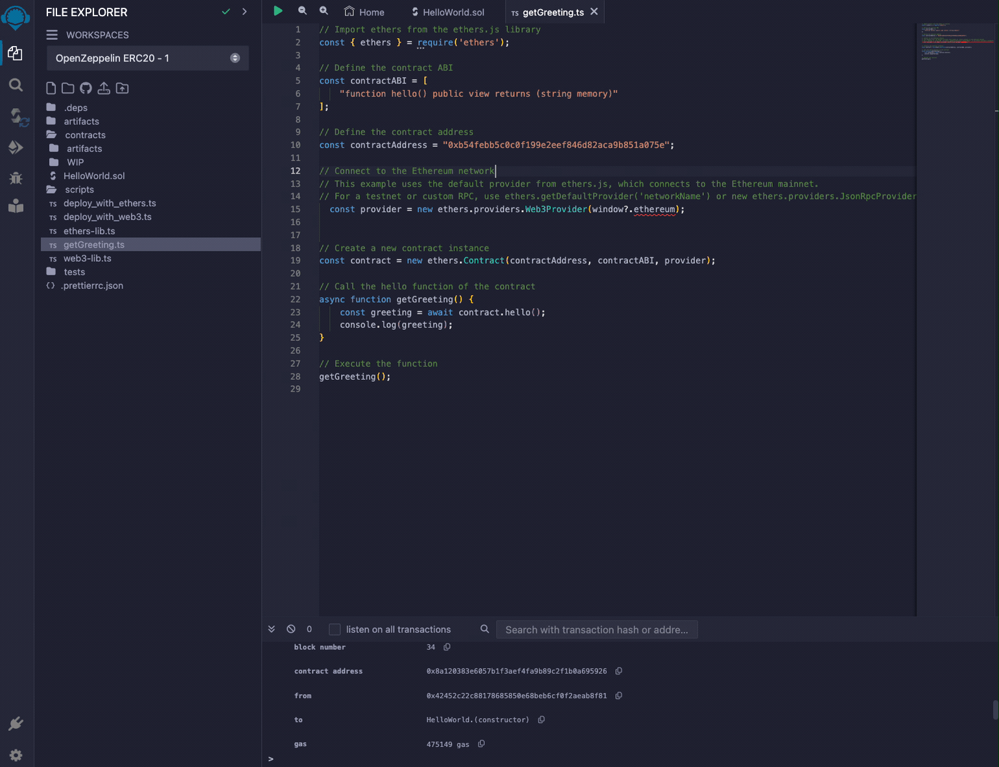

# Using Remix

Remix is an open-source, web-based development environment tailored for EVM decentralized finance (DeFi) contract development. It offers developers a comprehensive suite of tools to write, deploy, and test DeFi contracts in Solidity. For more information, visit [Remix](https://remix.ethereum.org/).

## Add the Flow network to MetaMask


Navigate to the [Using EVM] page to find the button to add the Flow network information to your metamask.

## Fund Your Flow Account

Navigate to the [Flow Testnet Faucet](https://faucet.flow.com/fund-account) to obtain FLOW tokens necessary to deploy a smart contract.

## Deploy a DeFi contract with Remix


### HelloWorld DeFi Contract

```solidity
// SPDX-License-Identifier: MIT
pragma solidity ^0.8.0;

contract HelloWorld {
    // Declare a public field of type string.
    string public greeting;

    // Constructor to initialize the greeting.
    // In Solidity, the constructor is defined with the "constructor" keyword.
    constructor() {
        greeting = "Hello, World!";
    }

    // Public function to change the greeting.
    // The "public" keyword makes the function accessible from outside the contract.
    function changeGreeting(string memory newGreeting) public {
        greeting = newGreeting;
    }

    // Public function that returns the greeting.
    // In Solidity, explicit return types are declared.
    function hello() public view returns (string memory) {
        return greeting;
    }
}


```

### Steps to deploy the HelloWorld DeFi contract

1. Create a file named `HelloWorld.sol`.
2. Select Solidity Compiler and compile `HelloWorld.sol`.
3. Select Deploy & Run Transactions.
4. Make sure to select `Injected Provider - Metamask` in Environment dropdown.
5. Deploy the `HelloWorld` DeFi contract.

## Calling the Deployed Smart Contract



### Using Ethers.js to Call the HelloWorld Smart Contract

1. Create a new `get-greeting.js` file under `scripts`.
2. Paste in the JavaScript code below.
3. Click on green play button to run.
4. Verify the greeting is "Hello World!".

```javascript
// Import ethers from the ethers.js library
const { ethers } = require('ethers');

// Define the contract ABI
const contractABI = ['function hello() public view returns (string memory)'];

// Define the contract address
const contractAddress = '0x8a120383e6057b1f3aef4fa9b89c2f1b0a695926';

// Connect to the Ethereum network
// This example uses the default provider from ethers.js, which connects to the Ethereum mainnet.
// For a testnet or custom RPC, use ethers.getDefaultProvider('networkName') or new ethers.providers.JsonRpcProvider(url)
const provider = new ethers.providers.Web3Provider(window?.ethereum);

// Create a new contract instance
const contract = new ethers.Contract(contractAddress, contractABI, provider);

// Call the hello function of the contract
async function getGreeting() {
  const greeting = await contract.hello();
  console.log(greeting);
}

// Execute the function
getGreeting();
```

Follow the steps below to change the greeting and retrieve the new greeting.

## Updating the deployed DeFi contract


1. Select the `HelloWorld.sol` file.
2. Select the `Deploy and Run Transaction` page.
3. Make sure to select `Injected Provider - Metamask` in Environment dropdown.
4. Type a new greeting in the text input next to `changeGreeting`.
5. Click `changeGreeting`.
6. Sign the Metamask transaction.
7. To verify the greeting changed, re-run the `get-greeting.js` script above.

<!-- Reference-style links, will not render on page. -->

[Using EVM]: ../../../build/evm/using.mdx