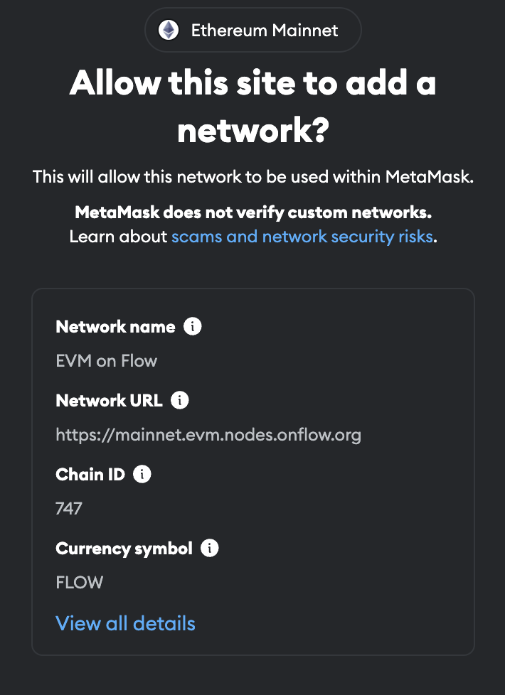

import BrowserOnly from '@docusaurus/BrowserOnly';
import { AddNetworkButton } from '@site/src/components/addNetworkButton';

# Wallets & Configurations

This document shows how to integrate the Flow Network programmatically with your dApp via MetaMask.

If you want to add it to your wallet now, click the buttons below, or follow the [manual process].

<BrowserOnly>
  {() => {
    // ******* If Chain Id changes, update the Chain ID in the AddNetworkButton component *******
    return <AddNetworkButton />;
  }}
</BrowserOnly>

## Metamask

To integrate additional networks into MetaMask can pose challenges for users who lack technical expertise and may lead to errors. If you simplify this process, you can greatly enhance user onboarding for your application. This guide demonstrates how to create a straightforward button within your frontend application to streamline the addition of the Flow network to MetaMask.

### EIP-3035 & MetaMask

[EIP-3035](https://eips.ethereum.org/EIPS/eip-3085) is an Ethereum Improvement Proposal that defines an RPC method for adding Ethereum-compatible chains to wallet applications. Since March 2021 MetaMask has implemented that EIP as part of their MetaMask [Custom Networks API](https://consensys.io/blog/connect-users-to-layer-2-networks-with-the-metamask-custom-networks-api).

### Flow Network configuration

To add the Flow Testnet network to Metamask, add the following network configuration:

```js
export const TESTNET_PARAMS = {
  chainId: '0x221',
  chainName: 'Flow',
  rpcUrls: ['https://testnet.evm.nodes.onflow.org'],
  nativeCurrency: {
    name: 'Flow',
    symbol: 'FLOW',
    decimals: 18,
  },
  blockExplorerUrls: ['https://evm-testnet.flowscan.io/']
};
```

### Add Flow network

To add this configuration to MetaMask, call the `wallet_addEthereumChain` method which is exposed by the web3 provider.

```js
function addFlowTestnet() {
  injected.getProvider().then((provider) => {
    provider
      .request({
        method: 'wallet_addEthereumChain',
        params: [TESTNET_PARAMS],
      })
      .catch((error: any) => {
        console.log(error);
      });
  });
}
```

The variable, `injected`, is initialized as a `web3-react/injected-connector` used to interface with MetaMask APIs. Usage for other popular web frameworks is similar.

The typical usage would be to expose this button if you get errors when attempting to connect to MetaMask (i.e. `Wrong Network` or `Error Connecting`).

### User Experience

Users of your app will need to first approve a connection to Metamask. After doing this, if you don't detect a successful Web3 network connection, you may present a dialog asking them to add the Flow network to their wallet.



After they approve, your app will be connected to the Flow network.

If you use this approach to add the Flow network to Metamask, you can avoid manual user data entry and ensure that users are ready to interact with your dApp!

{/* Reference-style links, does not render on page */}

[manual process]: ../../../build/evm/using.mdx
