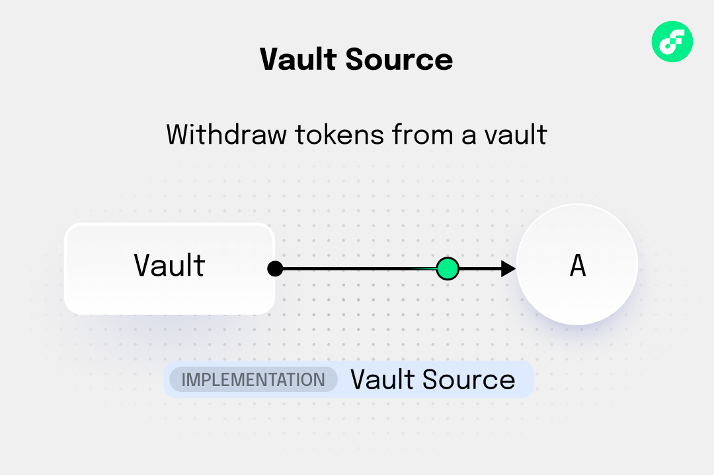
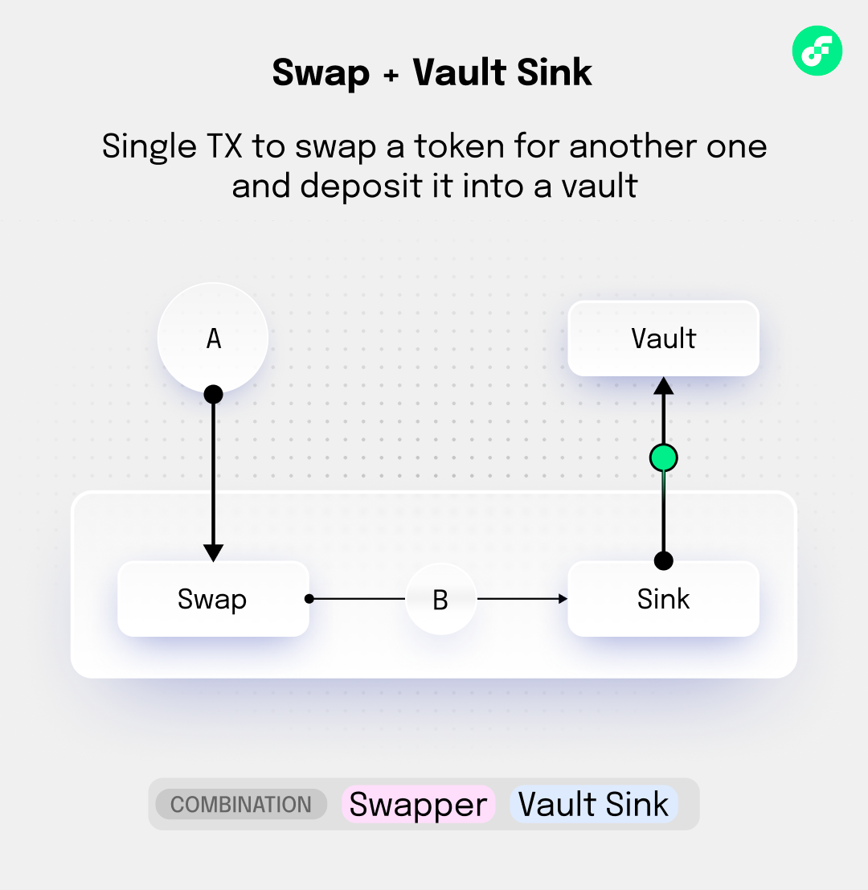
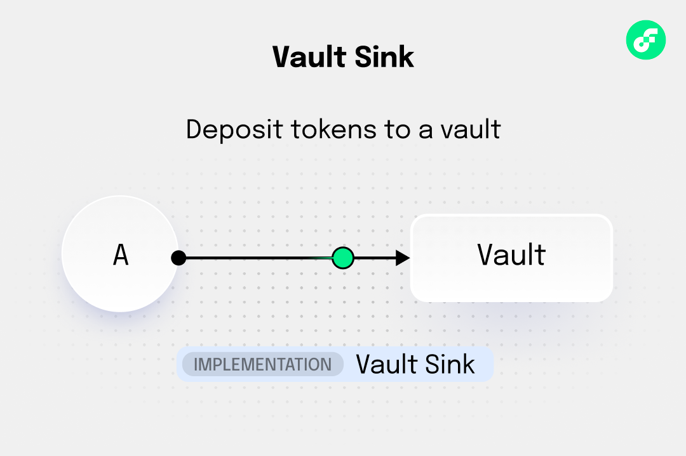
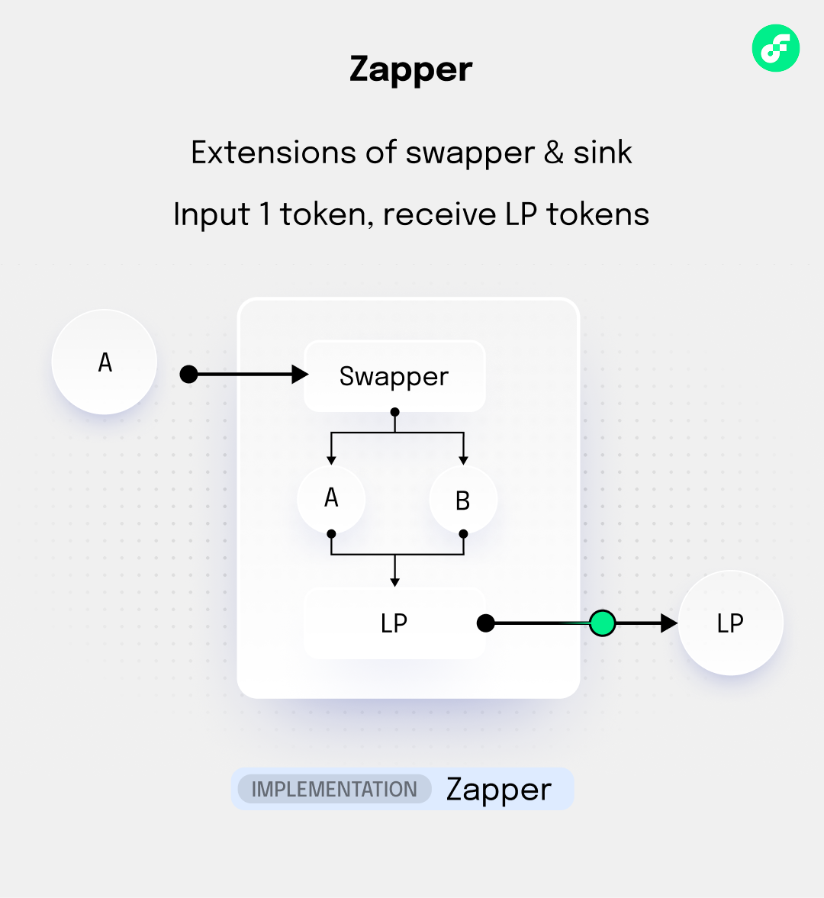
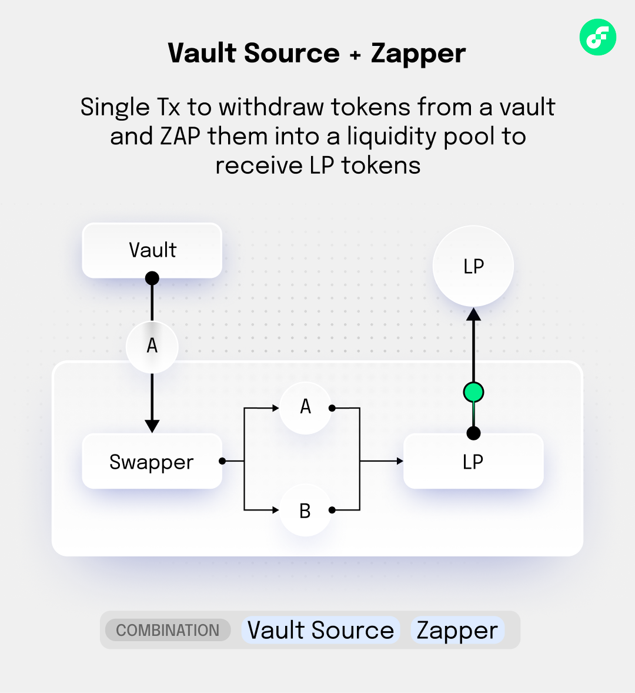

# Composing workflows with Flow Actions

:::warning

We are reviewing and finalizing Flow Actions in [FLIP 339]. The specific implementation may change as a part of this process.

We will update these tutorials, but you may need to refactor your code if the implementation changes.

:::

Flow Actions are designed to be **composable**, which means you can chain them together like LEGO blocks to build complex strategies. Each primitive has a standardized interface that works consistently across all protocols and eliminates the need to learn multiple APIs. This composability allows atomic execution of multi-step workflows within single transactions, ensuring either complete success or safe failure. When developers combine these primitives, they create sophisticated decentralized finance (DeFi) strategies like automated yield farming, cross-protocol arbitrage, and portfolio rebalancing. The [5 Flow Actions Primitives] are:

- **Source** → Provides tokens on demand by withdrawing from vaults or claiming rewards. Sources respect minimum balance constraints and return empty vaults gracefully when nothing is available.

- **Sink** → Accepts token deposits up to a specified capacity limit. Sinks perform no-ops rather than reverting when deposits exceed capacity, which allows smooth workflow execution.

- **Swapper** → Exchanges one token type for another through DEX trades or cross-chain bridges. Swappers support bidirectional operations and provide quote estimation for slippage protection.

- **PriceOracle** → Provides real-time price data for assets from external feeds or DEX prices. Oracles handle staleness validation and return nil for unavailable prices rather than failing.

- **Flasher** → Issues flash loans that must be repaid within the same transaction via callback execution. Flashers enable capital-efficient strategies like arbitrage and liquidations without requiring upfront capital.

## Learning objectives

After you complete this tutorial, you will be able to:

- Understand the key features of Flow Actions including atomic composition, weak guarantees, and event traceability.
- Create and use Sources to provide tokens from various protocols and locations.
- Create and use Sinks to accept tokens up to defined capacity limits.
- Create and use Swappers to exchange tokens between different types with price estimation.
- Create and use Price Oracles to get price data for assets with consistent denomination.
- Create and use Flashers to provide flash loans with atomic repayment requirements.
- Use UniqueIdentifiers to trace and correlate operations across multiple Flow Actions.
- Compose complex DeFi workflows by connecting multiple Actions in a single atomic transaction.

## Core Flow patterns

### Linear Flow (Source → Swapper → Sink)

The most common pattern

1. Get tokens
2. Convert them
3. Deposit them




**Example**: Claim rewards → Swap to different token → Stake in new pool.

### Bidirectional Flow (Source ↔ Sink)

Two-way operations where you can both deposit and withdraw.




**Example**: Vault operations with both deposit and withdrawal capabilities.

### Aggregated Flow (Multiple Sources → Aggregator → Sink)

Combine multiple sources for optimal results.

```
Source A → Aggregator → Sink
Source B ↗
Source C ↗
```

**Example**: Multiple DEX aggregators finding the best swap route.

## Common DeFi workflow combinations

### Single token to LP (Zapper)

**Goal**: Convert a single token into liquidity provider (LP) tokens in one transaction.

The **Zapper** is a specialized connector that combines swapper and sink functionality. It takes a single token input and outputs LP tokens by automatically handling the token splitting, swapping, and liquidity provision process.



**How it works:**

1. Takes single token A as input.
2. Splits it into two portions.
3. Swaps one portion to token B.
4. Provides liquidity with A + B to get LP tokens.
5. Returns LP tokens as output.

```cadence
// Zapper: Convert single FLOW token to FLOW/USDC LP tokens
let zapper = IncrementFiPoolLiquidityConnectors.Zapper(
    token0Type: Type<@FlowToken.Vault>(),     // Input token type
    token1Type: Type<@USDC.Vault>(),         // Paired token type
    stableMode: false,                       // Use volatile pricing
    uniqueID: nil
)

// Execute: Input 100 FLOW → Output FLOW/USDC LP tokens
let flowTokens <- flowVault.withdraw(amount: 100.0)
let lpTokens <- zapper.swap(nil, inVault: <-flowTokens)

// Now you have LP tokens ready for staking or further use
```

**Benefits:**

- **Simplicity**: Single transaction converts any token to LP position.
- **Efficiency**: Automatically calculates optimal split ratios.
- **Composability**: Output LP tokens work with any sink connector.

### Reward harvesting and conversion

**Goal**: Claim staking rewards and convert them to a stable token.

This workflow automatically claims accumulated staking rewards and converts them to a stable asset like USDC. It combines a rewards source, token swapper, and vault sink to create a seamless reward collection and conversion process.

**How it works:**

1. Claims pending rewards from a staking pool using user certificate.
2. Swaps the reward tokens (for example, FLOW) to stable tokens (for example, USDC).
3. Deposits the stable tokens to a vault with capacity limits.
4. Returns any unconverted tokens back to the user.

```cadence
// 1. Source: Claim rewards from staking pool
let rewardsSource = IncrementFiStakingConnectors.PoolRewardsSource(
    userCertificate: userCert,
    poolID: 1,
    vaultType: Type<@FlowToken.Vault>(),
    overflowSinks: {},
    uniqueID: nil
)

// 2. Swapper: Convert rewards to stable token
let swapper = IncrementFiSwapConnectors.Swapper(
    path: ["A.FlowToken", "A.USDC"],
    inVault: Type<@FlowToken.Vault>(),
    outVault: Type<@USDC.Vault>(),
    uniqueID: nil
)

// 3. Sink: Deposit stable tokens to vault
let vaultSink = FungibleTokenConnectors.VaultSink(
    max: 1000.0,
    depositVault: vaultCap,
    uniqueID: nil
)

// Execute the workflow
let rewards = rewardsSource.withdrawAvailable(1000.0)
let stableTokens = swapper.swap(nil, inVault: <-rewards)
vaultSink.depositCapacity(from: &stableTokens)
```

**Benefits:**

- **Risk Reduction**: Converts volatile reward tokens to stable assets.
- **Automation**: Single transaction handles claim, swap, and storage.
- **Capital Efficiency**: No manual intervention needed for reward management.

### Liquidity provision & yield farming

**Goal**: Convert single token to LP tokens for yield farming

This workflow takes a single token from your vault, converts it into liquidity provider (LP) tokens, and immediately stakes them for yield farming rewards. It combines vault operations, zapping functionality, and staking in one seamless transaction.

**How it works:**

1. Withdraws single token (for example, FLOW) from vault with minimum balance protection.
2. Uses Zapper to split token and create LP position (FLOW/USDC pair).
3. Stakes the resulting LP tokens in a yield farming pool.
4. Begins earning rewards on the staked LP position.

```cadence
// 1. Source: Provide single token (e.g., FLOW)
let flowSource = FungibleTokenConnectors.VaultSource(
    min: 100.0,
    withdrawVault: flowVaultCap,
    uniqueID: nil
)

// 2. Zapper: Convert to LP tokens
let zapper = IncrementFiPoolLiquidityConnectors.Zapper(
    token0Type: Type<@FlowToken.Vault>(),
    token1Type: Type<@USDC.Vault>(),
    stableMode: false,
    uniqueID: nil
)

// 3. Sink: Stake LP tokens for rewards
let stakingSink = IncrementFiStakingConnectors.PoolSink(
    staker: user.address,
    poolID: 2,
    uniqueID: nil
)

// Execute the workflow
let flowTokens = flowSource.withdrawAvailable(100.0)
let lpTokens = zapper.swap(nil, inVault: <-flowTokens)
stakingSink.depositCapacity(from: &lpTokens)
```

**Benefits:**

- **Yield Optimization**: Converts idle tokens to yield-generating LP positions.
- **Single Transaction**: No need for multiple manual steps or approvals.
- **Automatic Staking**: LP tokens immediately start earning rewards.

### Cross-VM bridge and swap

**Goal**: Bridge tokens from Cadence to EVM, swap them, then bridge back.

This workflow demonstrates Flow's unique cross-VM capabilities by bridging tokens from Cadence to Flow EVM, executing a swap using UniswapV2-style routing, and bridging the results back to Cadence. This allows access to EVM-based DEX liquidity while maintaining Cadence token ownership.

**How it works:**

1. Withdraws tokens from Cadence vault with minimum balance protection.
2. Bridges tokens from Cadence to Flow EVM environment.
3. Executes swap using UniswapV2 router on EVM side.
4. Bridges the swapped tokens back to Cadence environment.
5. Deposits final tokens to target Cadence vault.

```cadence
// 1. Source: Cadence vault
let cadenceSource = FungibleTokenConnectors.VaultSource(
    min: 50.0,
    withdrawVault: cadenceVaultCap,
    uniqueID: nil
)

// 2. EVM Swapper: Cross-VM swap
let evmSwapper = UniswapV2SwapConnectors.Swapper(
    routerAddress: EVM.EVMAddress(0x...),
    path: [tokenA, tokenB],
    inVault: Type<@FlowToken.Vault>(),
    outVault: Type<@USDC.Vault>(),
    coaCapability: coaCap,
    uniqueID: nil
)

// 3. Sink: Cadence vault for swapped tokens
let cadenceSink = FungibleTokenConnectors.VaultSink(
    max: nil,
    depositVault: usdcVaultCap,
    uniqueID: nil
)

// Execute the workflow
let cadenceTokens = cadenceSource.withdrawAvailable(50.0)
let evmTokens = evmSwapper.swap(nil, inVault: <-cadenceTokens)
cadenceSink.depositCapacity(from: &evmTokens)
```

**Benefits:**

- **Extended Liquidity**: Access to both Cadence and EVM DEX liquidity.
- **Cross-VM Arbitrage**: Exploit price differences between VM environments.
- **Atomic Execution**: All bridging and swapping happens in single transaction.

### Flash loan arbitrage

**Goal**: Borrow tokens, execute arbitrage, repay loan with profit.

This advanced strategy uses flash loans to execute risk-free arbitrage by borrowing tokens, exploiting price differences across multiple DEXs, and repaying the loan with interest while keeping the profit. The entire operation happens atomically within a single transaction.

**How it works:**

1. Borrows tokens via flash loan without collateral requirements.
2. Uses multi-swapper to find optimal arbitrage routes across DEXs.
3. Executes trades to exploit price differences.
4. Repays flash loan with fees from arbitrage profits.
5. Keeps remaining profit after loan repayment.

```cadence
// 1. Flasher: Borrow tokens for arbitrage
let flasher = IncrementFiFlashloanConnectors.Flasher(
    pairAddress: pairAddress,
    type: Type<@FlowToken.Vault>(),
    uniqueID: nil
)

// 2. Multi-swapper: Find best arbitrage route
let multiSwapper = SwapConnectors.MultiSwapper(
    inVault: Type<@FlowToken.Vault>(),
    outVault: Type<@FlowToken.Vault>(),
    swappers: [swapper1, swapper2, swapper3],
    uniqueID: nil
)

// 3. Execute arbitrage with callback
flasher.flashLoan(1000.0, callback: arbitrageCallback)
```

**Benefits:**

- **Zero Capital Required**: No upfront investment needed for arbitrage.
- **Risk-Free Profit**: Transaction reverts if arbitrage isn't profitable.
- **Market Efficiency**: Helps eliminate price discrepancies across DEXs.

## Advanced Wwrkflow combinations

### VaultSource + Zapper integration

**Goal**: Withdraw tokens from a vault and convert them to LP tokens in a single transaction.

This advanced workflow demonstrates the power of combining VaultSource with Zapper functionality to seamlessly convert idle vault tokens into yield-generating LP positions. The Zapper handles the complex process of splitting the single token and creating balanced liquidity.




**How it works:**

1. VaultSource withdraws tokens from vault while respecting minimum balance.
2. Zapper receives the single token and splits it optimally.
3. Zapper swaps a portion of token A to token B with internal DEX routing.
4. Zapper provides balanced liquidity (A + B) to the pool.
5. Returns LP tokens that represent the liquidity position.

```cadence
// 1. Create VaultSource with minimum balance protection
let vaultSource = FungibleTokenConnectors.VaultSource(
    min: 500.0,  // Keep 500 tokens minimum in vault
    withdrawVault: flowVaultCapability,
    uniqueID: nil
)

// 2. Create Zapper for FLOW/USDC pair
let zapper = IncrementFiPoolLiquidityConnectors.Zapper(
    token0Type: Type<@FlowToken.Vault>(),     // Input token (A)
    token1Type: Type<@USDC.Vault>(),         // Paired token (B)
    stableMode: false,                       // Use volatile pair pricing
    uniqueID: nil
)

// 3. Execute Vault Source → Zapper workflow
let availableTokens <- vaultSource.withdrawAvailable(maxAmount: 1000.0)
let lpTokens <- zapper.swap(quote: nil, inVault: <-availableTokens)

// Result: LP tokens ready for staking or further DeFi strategies
log("LP tokens created: ".concat(lpTokens.balance.toString()))
```

**Benefits:**

- **Capital Efficiency**: Converts idle vault tokens to yield-generating LP positions.
- **Automated Balancing**: Zapper handles optimal token split calculations automatically
- **Single Transaction**: Complex multi-step process executed atomically.
- **Minimum Protection**: VaultSource ensures vault never goes below safety threshold.

### Price-informed rebalancing

**Goal**: Create autonomous rebalancing system based on price feeds.

This sophisticated workflow creates an autonomous portfolio management system that monitors real-time price data to maintain target value ratios. The AutoBalancer combines price oracles, sources, and sinks to automatically rebalance positions when they deviate from target thresholds.

**How it works:**

1. Price oracle provides real-time asset valuations with staleness protection.
2. AutoBalancer tracks historical deposit values vs current market values.
3. When portfolio value exceeds upper threshold (120%), excess is moved to rebalance sink.
4. When portfolio value falls below lower threshold (80%), additional funds are sourced.
5. System maintains target allocation automatically without manual intervention.

```cadence
// Create autonomous rebalancing system
let priceOracle = BandOracleConnectors.PriceOracle(
    unitOfAccount: Type<@FlowToken.Vault>(),
    staleThreshold: 3600, // 1 hour
    feeSource: flowTokenSource,
    uniqueID: nil
)

let autoBalancer <- FlowActions.createAutoBalancer(
    vault: <-initialVault,
    lowerThreshold: 0.8,
    upperThreshold: 1.2,
    source: rebalanceSource,
    sink: rebalanceSink, 
    oracle: priceOracle,
    uniqueID: nil
)

autoBalancer.rebalance(force: false)  // Autonomous rebalancing
```

**Benefits:**

- **Autonomous Operation**: Maintains portfolio balance without manual intervention.
- **Risk Management**: Prevents excessive exposure through automated position sizing.
- **Market Responsive**: Adapts to price movements with real-time oracle data.
- **Threshold Flexibility**: Configurable upper/lower bounds for different risk profiles.

### Restake and compound strategy

**Goal**: Automatically compound staking rewards back into the pool.

This advanced compounding strategy maximizes yield by automatically claiming staking rewards and converting them back into LP tokens for re-staking. The workflow combines rewards claiming, zapping, and staking into a seamless compound operation that accelerates yield accumulation through reinvestment.

**How it works:**

1. PoolRewardsSource claims accumulated staking rewards from the pool.
2. Zapper receives the reward tokens and converts them to LP tokens.
3. SwapSource orchestrates the rewards → LP token conversion process.
4. PoolSink re-stakes the new LP tokens back into the same pool.
5. Compound interest effect increases overall position size and future rewards.

```cadence
// Restake rewards workflow  
let rewardsSource = IncrementFiStakingConnectors.PoolRewardsSource(
    poolID: 1, 
    staker: userAddress,
    vaultType: Type<@FlowToken.Vault>(),
    overflowSinks: {},
    uniqueID: nil
)

let zapper = IncrementFiPoolLiquidityConnectors.Zapper(
    token0Type: Type<@FlowToken.Vault>(),
    token1Type: Type<@USDC.Vault>(),
    stableMode: false,
    uniqueID: nil
)

let swapSource = SwapConnectors.SwapSource(
    swapper: zapper, 
    source: rewardsSource, 
    uniqueID: nil
)

let poolSink = IncrementFiStakingConnectors.PoolSink(
    staker: userAddress, 
    poolID: 1,
    uniqueID: nil
)

// Execute compound strategy
let lpTokens <- swapSource.withdrawAvailable(maxAmount: UFix64.max)
poolSink.depositCapacity(from: lpTokens)
```

**Benefits:**

- **Compound Growth**: Exponential yield increase through automatic reinvestment.
- **Gas Efficiency**: Single transaction handles claim, convert, and re-stake operations.
- **Set-and-Forget**: Automated compounding without manual intervention required.
- **Optimal Conversion**: Zapper ensures efficient reward token to LP token conversion.


## Safety best practices

### Always check capacity

Prevents transaction failures and allows graceful handling when sinks reach their maximum capacity limits. This is crucial for automated workflows that might encounter varying capacity conditions.

```cadence
// Check before depositing
if sink.depositCapacity(from: &vault) {
    sink.depositCapacity(from: &vault)
} else {
    // Handle insufficient capacity
}
```

### Validate balances

Ensures operations behave as expected and helps detect unexpected token loss or gain during complex workflows. Balance validation is essential for financial applications where token accuracy is critical.

```cadence
// Verify operations completed successfully
let beforeBalance = vault.balance
sink.depositCapacity(from: &vault)
let afterBalance = vault.balance

assert(afterBalance >= beforeBalance, message: "Balance should not decrease")
```

### Use graceful degradation

Prevents entire workflows from failing when individual components encounter issues. This approach allows robust strategies that can adapt to changing market conditions or temporary protocol unavailability.

```cadence
// Handle failures gracefully
if let result = try? operation.execute() {
    // Success path
} else {
    // Fallback or no-op
    log("Operation failed, continuing with strategy")
}
```

### Resource management

Proper resource cleanup prevents token loss and ensures all vaults are properly handled, even when transactions partially fail. This is critical in Cadence where you must explicitly manage resources.

```cadence
// Always clean up resources
let vault = source.withdrawAvailable(amount)
defer {
    // Ensure vault is properly handled
    if vault.balance > 0 {
        // Return unused tokens
        sourceVault.deposit(from: <-vault)
    }
}
```

## Testing your combinations

### Unit testing

Tests individual connectors in isolation to verify they respect their constraints and behave correctly under various conditions. This catches bugs early and ensures each component works as designed.

```cadence
// Test individual components
test("VaultSource should maintain minimum balance") {
    let source = VaultSource(min: 100.0, withdrawVault: vaultCap, uniqueID: nil)
    
    // Test minimum balance enforcement
    let available = source.minimumAvailable()
    assert(available >= 100.0, message: "Should maintain minimum balance")
}
```

### Integration testing

Validates that multiple connectors work together correctly in complete workflows. This ensures the composition logic is sound and identifies issues that only appear when components interact.

```cadence
// Test complete workflows
test("Reward harvesting workflow should complete successfully") {
    let workflow = RewardHarvestingWorkflow(
        rewardsSource: rewardsSource,
        swapper: swapper,
        sink: sink
    )
    
    let result = workflow.execute()
    assert(result.success, message: "Workflow should complete successfully")
}
```

### Simulation testing

Tests strategies under various market conditions using mock data to verify they respond appropriately to price changes, liquidity variations, and other market dynamics. This is essential for strategies that rely on external market data.

```cadence
// Test with simulated market conditions
test("Strategy should handle price volatility") {
    let strategy = ArbitrageStrategy(
        priceOracle: mockPriceOracle,
        swapper: mockSwapper
    )
    
    // Simulate price changes
    mockPriceOracle.setPrice(1.0)
    let result1 = strategy.execute()
    
    mockPriceOracle.setPrice(2.0)
    let result2 = strategy.execute()
    
    assert(result1 != result2, message: "Strategy should adapt to price changes")
}
```

## 📚 Next steps

Now that you understand basic combinations, explore:

1. **Advanced Strategies**: Complex multi-step workflows.
2. **Risk Management**: Advanced safety and monitoring techniques.
3. **Custom Connectors**: Building your own protocol adapters.

## Conclusion

In this tutorial, you learned how to combine Flow Actions primitives to create sophisticated workflows that leverage atomic composition, weak guarantees, and event traceability. You can now create and use Sources, Sinks, Swappers, Price Oracles, and Flashers, while utilizing UniqueIdentifiers to trace operations and compose complex atomic transactions.

Composability is the core strength of Flow Actions. These examples demonstrate how Flow Actions primitives can be combined to create powerful, automated workflows that integrate multiple protocols seamlessly. The framework's standardized interfaces enable developers to chain operations together like LEGO blocks, focusing on strategy implementation rather than protocol-specific integration details.

<!-- Relative links, will not render on page -->
[FLIP 339]: https://github.com/onflow/flips/pull/339/files
[5 Flow Actions Primitives]: intro-to-flow-actions.md