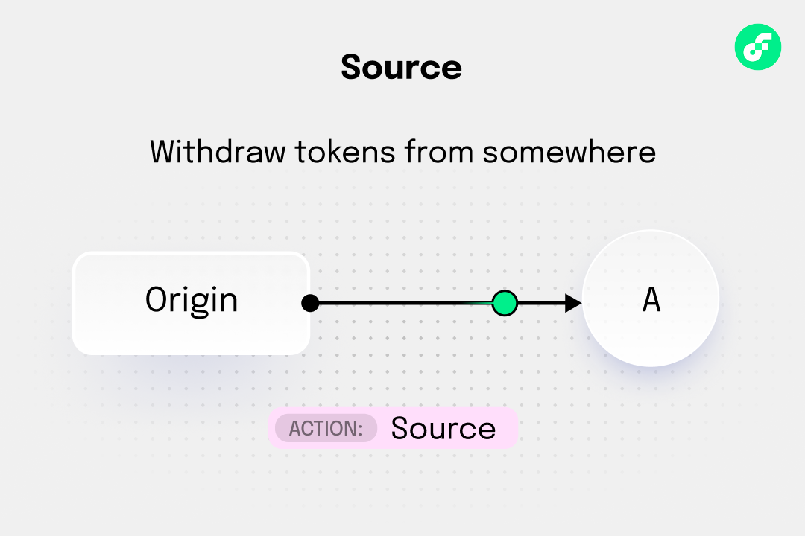
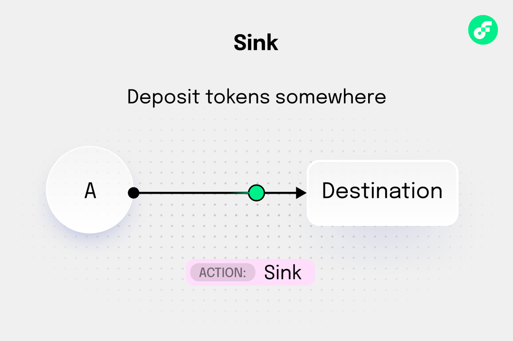
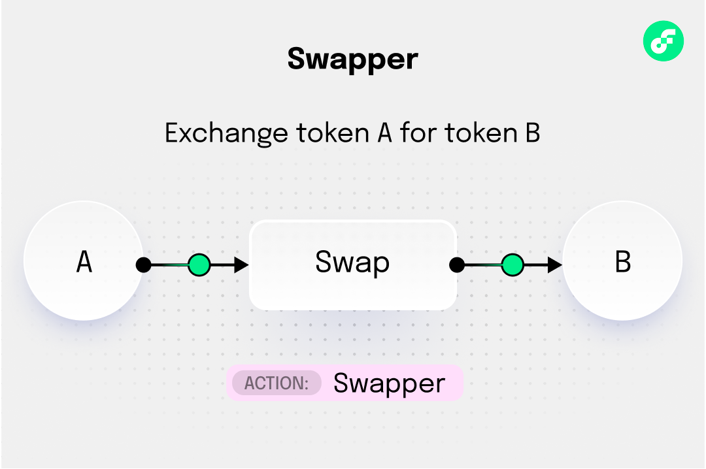
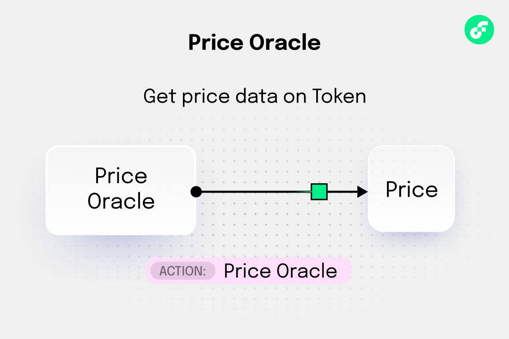
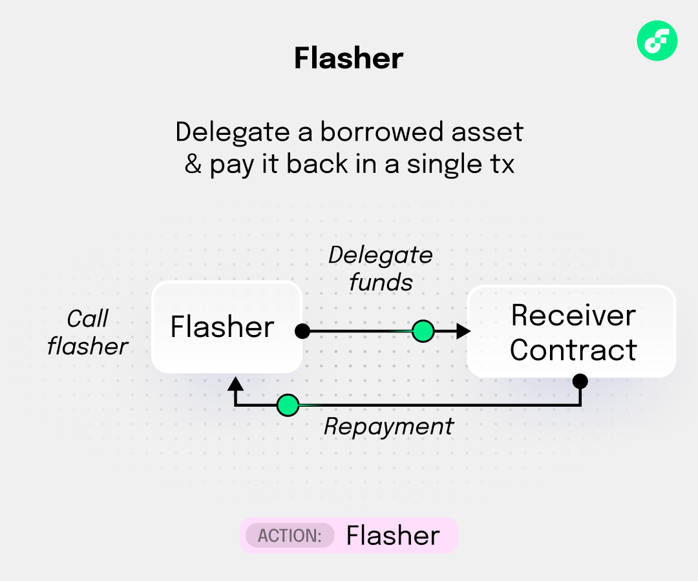

# Introduction to Flow Actions

:::warning

We are reviewing and finalizing Flow Actions in [FLIP 339]. The specific implementation may change as a part of this process.

We will update these tutorials, but you may need to refactor your code if the implementation changes.

:::

_Actions_ are a suite of standardized Cadence interfaces that allow developers to compose complex workflows, starting with decentralized finance (DeFi) workflows, by connecting small, reusable components. Actions provide a "LEGO" framework of blocks where each component performs a single operation (deposit, withdraw, swap, price lookup, flash loan) while maintaining composability with other components. This creates sophisticated workflows executable in a single atomic transaction.

By using Flow Actions, developers can remove large amounts of tailored complexity from building DeFi apps and can instead focus on business logic using nouns and verbs.

## Key features

- **Atomic Composition** - All operations complete or fail together.
- **Weak Guarantees** - Flexible error handling, no-ops when conditions aren't met.
- **Event Traceability** - UniqueIdentifier system for tracking operations.
- **Protocol Agnostic** - Standardized interfaces across different protocols.
- **Struct-based** - Lightweight, copyable components for efficient composition.

## Learning Objectives

After you complete this tutorial, you will be able to:

- Understand the key features of Flow Actions including atomic composition, weak guarantees, and event traceability
- Create and use Sources to provide tokens from various protocols and locations
- Create and use Sinks to accept tokens up to defined capacity limits
- Create and use Swappers to exchange tokens between different types with price estimation
- Create and use Price Oracles to get price data for assets with consistent denomination
- Create and use Flashers to provide flash loans with atomic repayment requirements
- Use UniqueIdentifiers to trace and correlate operations across multiple Flow Actions
- Compose complex DeFi workflows by connecting multiple Actions in a single atomic transaction

# Prerequisites

## Cadence programming language

This tutorial assumes you have a modest knowledge of [Cadence]. If you don't, you can follow along, but you'll get more out of it if you complete our [Cadence] tutorials. Most developers find it easier than other blockchain languages and it's not hard to pick up.

## Flow Action types

The first five Flow Actions implement five core primitives to integrate external DeFi protocols.

1. **Source**: Provides tokens on demand (for example, withdraw from vault, claim rewards, pull liquidity)



2. **Sink**: Accepts tokens up to capacity (for example, deposit to vault, repay loan, add liquidity)



3. **Swapper**: Exchanges one token type for another (for example, targeted DEX trades, multi-protocol aggregated swaps)



4. **PriceOracle**: Provides price data for assets (for example, external price feeds, DEX prices, price caching)



5. **Flasher**: Provides flash loans with atomic repayment (for example, arbitrage, liquidations)



## Connectors

[Connectors] create the bridge between the standardized interfaces of Flow Actions and the often customized and complicated mechanisms of different DeFi protocols. You can use existing connectors that other developers wrote, or create your own.

To instantiate Flow Actions, create an instance of the appropriate [struct] from a connector that provides the desired type of action connected to the desired DeFi protocol.

For more information, read the [connectors article].

## Token types

In Cadence, tokens that adhere to the [Fungible Token Standard] have types that work with type safety principles.

For example, you can find the type of $FLOW by running this script:

```cadence
import "FlowToken"

access(all) fun main(): String {
    return Type<@FlowToken.Vault>().identifier
}
```

You'll get:

```zsh
A.1654653399040a61.FlowToken.Vault
```

Many Flow Actions use these types to provide a safer method of working with tokens than an arbitrary address that may or may not be a token.

## Flow Actions

The following Flow Actions standardize **usage** patterns for common defi-related tasks. By working with them, you - or Artificial Intelligence (AI) agents - can more easily write transactions and functionality regardless of the myriad of different ways each protocol works to accomplish these tasks.

:::info

Defi protocols and tools operate very differently, which means the calls to instantiate the same kind of action connected to different protocols will vary by protocol and connector.

:::

### Source

A source is a primitive component that can supply a [vault] which contains the requested type and amount of tokens from something the user controls, or has authorized access to. This includes, but isn't limited to, personal vaults, accounts in protocols, and rewards.


You'll likely use one or more sources in any transactions using actions if the user needs to pay for something or otherwise provide tokens.

Sources conform to the `Source` [interface]:

```cadence
access(all) struct interface Source : IdentifiableStruct {
    /// Returns the Vault type provided by this Source
    access(all) view fun getSourceType(): Type
    /// Returns an estimate of how much can be withdrawn
    access(all) fun minimumAvailable(): UFix64
    /// Withdraws up to maxAmount, returning what's actually available
    access(FungibleToken.Withdraw) fun withdrawAvailable(maxAmount: UFix64): @{FungibleToken.Vault}
}
```

Every source is guaranteed to have the above functions and return types that allow you to get the type of vault that the source returns, get an estimate of how many tokens users may currently withdraw, and actually withdraw those tokens, up to the amount available.

Sources _degrade gracefully_ - If the requested amount of tokens is not available, they return the available amount. They always return a vault, even if that vault is empty.

To create a source, instantiate a struct that conforms to the `Source` interface corresponding to a given protocol [connector]. For example, to create a source from a generic vault, create a `VaultSource` from [`FungibleTokenConnectors`]:

```cadence
import "FungibleToken"
import "FungibleTokenConnectors"

transaction {

  prepare(acct: auth(BorrowValue) {
    let withdrawCap = acct.storage.borrow<auth(FungibleToken.Withdraw) {FungibleToken.Vault}>(
      /storage/flowTokenVault
    )

    let source = FungibleTokenConnectors.VaultSource(
      min: 0.0,
      withdrawVault: withdrawCap,
      uniqueID: nil
    )

    // Note: Logs are only visible in the emulator console
    log("Source created for vault type: ".concat(source.withdrawVaultType.identifier))
  }
}
```

### Sink

A sink is the opposite of a source - it's a place to send tokens, up to the limit of the capacity defined in the sink. As with any [resource], this process is non-destructive. Any remaining tokens remain in the vault that the source provides. They also have flexible limits, meaning the capacity can be dynamic.


Sinks adhere to the `Sink` [interface].

```cadence
access(all) struct interface Sink : IdentifiableStruct {
    /// Returns the Vault type accepted by this Sink
    access(all) view fun getSinkType(): Type
    /// Returns an estimate of remaining capacity
    access(all) fun minimumCapacity(): UFix64
    /// Deposits up to capacity, leaving remainder in the referenced vault
    access(all) fun depositCapacity(from: auth(FungibleToken.Withdraw) &{FungibleToken.Vault})
}
```

You create a sink similar how you create a source, which is to instantiate an instance of the appropriate `struct` from the [connector]. For example, to create a sink in a generic vault from, instantiate a `VaultSink` from [`FungibleTokenConnectors`]:

```cadence
import "FungibleToken"
import "FungibleTokenConnectors"

transaction {

  prepare(acct: &Account) {
    // Public, non-auth capability to deposit into the vault
    let depositCap = acct.capabilities.get<&{FungibleToken.Vault}>(
      /public/flowTokenReceiver
    )

    // Optional: specify a max balance the user's Flow Token vault should hold
    let maxBalance: UFix64? = nil // or UFix64(1000.0)

    // Optional: for aligning with Source in a stack
    let uniqueID = nil

    let sink = FungibleTokenConnectors.VaultSink(
      max: maxBalance,
      depositVault: depositCap,
      uniqueID: uniqueID
    )

    // Note: Logs are only visible in the emulator console
    log("VaultSink created for deposit type: ".concat(sink.depositVaultType.identifier))
  }
}
```

### Swapper

A swapper exchanges tokens between different types with support for bidirectional swaps and price estimation. Bi-directional means that they support swaps in both directions, which is necessary if an inner connector can't accept the full swap output balance.


They also contain price discovery to provide estimates for the amounts in and out via the [`{Quote}`] object, and the [quote system] allows price caching and execution parameter optimization.

Swappers conform to the `Swapper` [interface]:

```cadence
access(all) struct interface Swapper : IdentifiableStruct {
    /// Input and output token types - in and out token types via default `swap()` route
    access(all) view fun inType(): Type
    access(all) view fun outType(): Type

    /// Price estimation methods - quote required amount given some desired output & output for some provided input
    access(all) fun quoteIn(forDesired: UFix64, reverse: Bool): {Quote}
    access(all) fun quoteOut(forProvided: UFix64, reverse: Bool): {Quote}

    /// Swap execution methods
    access(all) fun swap(quote: {Quote}?, inVault: @{FungibleToken.Vault}): @{FungibleToken.Vault}
    access(all) fun swapBack(quote: {Quote}?, residual: @{FungibleToken.Vault}): @{FungibleToken.Vault}
}
```

To create a swapper, instantiate the appropriate `struct` from the appropriate connector. To create a swapper for [IncrementFi] with the [`IncrementFiSwapConnectors`], instantiate `Swapper`:

```cadence
import "FlowToken"
import "USDCFlow"
import "IncrementFiSwapConnectors"
import "SwapConfig"

transaction {
  prepare(acct: &Account) {
    // Derive the path keys from the token types
    let flowKey = SwapConfig.SliceTokenTypeIdentifierFromVaultType(vaultTypeIdentifier: Type<@FlowToken.Vault>().identifier)
    let usdcFlowKey = SwapConfig.SliceTokenTypeIdentifierFromVaultType(vaultTypeIdentifier: Type<@USDCFlow.Vault>().identifier)

    // Minimal path Flow -> USDCFlow
    let swapper = IncrementFiSwapConnectors.Swapper(
      path: [
        flowKey,
        usdcFlowKey
      ],
      inVault: Type<@FlowToken.Vault>(),
      outVault: Type<@USDCFlow.Vault>(),
      uniqueID: nil
    )

    // Example: quote how much USDCFlow you'd get for 10.0 FLOW
    let qOut = swapper.quoteOut(forProvided: 10.0, reverse: false)
    // Note: Logs are only visible in the emulator console
    log(qOut)

    // Example: quote how much FLOW you'd need to get 25.0 USDCFlow
    let qIn = swapper.quoteIn(forDesired: 25.0, reverse: false)
    // Note: Logs are only visible in the emulator console
    log(qIn)
  }
}
```

### Price oracle

A price [oracle] provides price data for assets with a consistent denomination. All prices are returned in the same unit and will return `nil` rather than reverting in the event that a price is unavailable. Prices are indexed by [Cadence type], requiring a specific Cadence-based token type for which to serve prices, as opposed to looking up an asset by a generic address.


You can pass an argument this `Type`, or any conforming fungible token type conforming to the interface to the `price` function to get a price.

The full [interface] for `PriceOracle` is:

```cadence
access(all) struct interface PriceOracle : IdentifiableStruct {
    /// Returns the denomination asset (e.g., USDCf, FLOW)
    access(all) view fun unitOfAccount(): Type
    /// Returns current price or nil if unavailable, conditions for which are implementation-specific
    access(all) fun price(ofToken: Type): UFix64?
}
```

To create a `PriceOracle` from [Band] with [`BandOracleConnectors`]:

:::info

You need to pay the oracle to get information from it. Here, we're using another Flow Action - a source - to fund getting a price from the oracle.

:::

```cadence
import "FlowToken"
import "FungibleToken"
import "FungibleTokenConnectors"
import "BandOracleConnectors"

transaction {

  prepare(acct: auth(IssueStorageCapabilityController) &Account) {
    // Ensure we have an authorized capability for FlowToken (auth Withdraw)
    let storagePath = /storage/flowTokenVault
    let withdrawCap = acct.capabilities.storage.issue<auth(FungibleToken.Withdraw) &{FungibleToken.Vault}>(storagePath)

    // Fee source must PROVIDE FlowToken vaults (per PriceOracle preconditions)
    let feeSource = FungibleTokenConnectors.VaultSource(
      min: 0.0,                   // keep at least 0.0 FLOW in the vault
      withdrawVault: withdrawCap, // auth withdraw capability
      uniqueID: nil
    )

    // unitOfAccount must be a mapped symbol in BandOracleConnectors.assetSymbols.
    // The contract's init already maps FlowToken -> "FLOW", so this is valid.
    let oracle = BandOracleConnectors.PriceOracle(
      unitOfAccount: Type<@FlowToken.Vault>(), // quote token (e.g. FLOW in BASE/FLOW)
      staleThreshold: 600,                     // seconds; nil to skip staleness checks
      feeSource: feeSource,
      uniqueID: nil
    )

    // Note: Logs are only visible in the emulator console
    log("Created PriceOracle; unit: ".concat(oracle.unitOfAccount().identifier))
  }
}
```

### Flasher

A flasher provides flash loans with atomic repayment requirements.


If you're not familiar with flash loans, imagine a scenario where you discovered an NFT listed for sale one one marketplace for 1 million dollars, then noticed an open bid to buy that same NFT for 1.1 million dollars on another marketplace.

In theory, you could make an easy 100k by buying the NFT on the first marketplace and then fulfilling the open buy offer on the second marketplace. There's just one big problem - You might not have 1 million dollars liquid just laying around for you to purchase the NFT!

Flash loans allow you to create one transaction during which you:

1. Borrow 1 million dollars.
2. Purchase the NFT.
3. Sell the NFT.
4. Repay 1 million dollars plus a small fee.

:::warning

This scenario may be a scam. A scammer could set up this situation as bait and cancel the buy order the instant someone purchases the NFT that is for sale. You'd have paid a vast amount of money for something worthless.

The great thing about Cadence transactions, with or without Actions, is that you can set up an atomic transaction where everything either works, or is reverted. Either you make 100k, or nothing happens except a tiny expenditure of gas.

:::

Flashers adhere to the `Flasher` interface:

```cadence
access(all) struct interface Flasher : IdentifiableStruct {
    /// Returns the asset type this Flasher can issue as a flash loan
    access(all) view fun borrowType(): Type
    /// Returns the estimated fee for a flash loan of the specified amount
    access(all) fun calculateFee(loanAmount: UFix64): UFix64
    /// Performs a flash loan of the specified amount. The callback function is passed the fee amount, a loan Vault,
    /// and data. The callback function should return a Vault containing the loan + fee.
    access(all) fun flashLoan(
        amount: UFix64,
        data: AnyStruct?,
        callback: fun(UFix64, @{FungibleToken.Vault}, AnyStruct?): @{FungibleToken.Vault} // fee, loan, data
    )
}
```

You create a flasher the same way as the other actions, but you'll need the address for a `SwapPair`. You can get that onchain at runtime. For example, to borrow $FLOW from [IncrementFi]:

```cadence
import "FungibleToken"
import "FlowToken"
import "USDCFlow"
import "SwapInterfaces"
import "SwapConfig"
import "SwapFactory"
import "IncrementFiFlashloanConnectors"

transaction {

  prepare(_ acct: &Account) {
    // Increment uses token *keys* like "A.1654653399040a61.FlowToken" (mainnet FlowToken)
    // and "A.f1ab99c82dee3526.USDCFlow" (mainnet USDCFlow).
    let flowKey = SwapConfig.SliceTokenTypeIdentifierFromVaultType(vaultTypeIdentifier: Type<@FlowToken.Vault>().identifier)
    let usdcFlowKey = SwapConfig.SliceTokenTypeIdentifierFromVaultType(vaultTypeIdentifier: Type<@USDCFlow.Vault>().identifier)

    // Ask the factory for the pair's public capability (or address), then verify it.
    // Depending on the exact factory interface you have, one of these will exist:
    //   - getPairAddress(token0Key: String, token1Key: String): Address
    //   - getPairPublicCap(token0Key: String, token1Key: String): Capability<&{SwapInterfaces.PairPublic}>
    //   - getPair(token0Key: String, token1Key: String): Address
    //
    // Try address first; if your factory exposes a different helper, swap it in.
    let pairAddr: Address = SwapFactory.getPairAddress(flowKey, usdcFlowKey)

    // Sanity-check: borrow PairPublic and verify it actually contains FLOW/USDCFlow
    let pair = getAccount(pairAddr)
      .capabilities
      .borrow<&{SwapInterfaces.PairPublic}>(SwapConfig.PairPublicPath)
      ?? panic("Could not borrow PairPublic at resolved address")

    let info = pair.getPairInfoStruct()
    assert(
      (info.token0Key == flowKey && info.token1Key == usdcFlowKey) ||
      (info.token0Key == usdcFlowKey && info.token1Key == flowKey),
      message: "Resolved pair does not match FLOW/USDCFlow"
    )

    // Instantiate the Flasher to borrow FLOW (switch to USDCFlow if you want that leg)
    let flasher = IncrementFiFlashloanConnectors.Flasher(
      pairAddress: pairAddr,
      type: Type<@FlowToken.Vault>(),
      uniqueID: nil
    )

    // Note: Logs are only visible in the emulator console
    log("Flasher ready on mainnet FLOW/USDCFlow at ".concat(pairAddr.toString()))

    flasher.flashloan(
      amount: 100.0
      data: nil
      callback: flashloanCallback
    )
  }
}

// Callback function passed to flasher.flashloan
access(all)
fun flashloanCallback(fee: UFix64, loan: @{FungibleToken.Vault}, data: AnyStruct?): @{FungibleToken.Vault} {
  log("Flashloan with balance of \(loan.balance) \(loan.getType().identifier) executed")
  return <-loan
}
```

## Identification and traceability

The `UniqueIdentifier` allows protocols to trace stack operations via Flow Actions interface-level events, identifying them by IDs. `IdentifiableResource` implementations should verify that access to the identifier is encapsulated by the structures they identify.

While you can create Cadence struct types in any context (including being passed in as transaction parameters), the authorized `AuthenticationToken` [capability] verifies that only those issued by the Flow Actions contract can be used in connectors, preventing forgery.

For example, to use a `UniqueIdentifier` in a source->swap->sink:

```cadence
import "FungibleToken"
import "FlowToken"
import "USDCFlow"
import "FungibleTokenConnectors"
import "IncrementFiSwapConnectors"
import "SwapConfig"
import "DeFiActions"

transaction {

  prepare(acct: auth(BorrowValue, IssueStorageCapabilityController, PublishCapability, SaveValue, UnpublishCapability) &Account) {
    // Standard token paths
    let storagePath = /storage/flowTokenVault
    let receiverStoragePath = USDCFlow.VaultStoragePath
    let receiverPublicPath = USDCFlow.VaultPublicPath

    // Ensure private auth-withdraw (for Source)
    let withdrawCap = acct.capabilities.storage.issue<auth(FungibleToken.Withdraw) &{FungibleToken.Vault}>(storagePath)

    // Ensure public receiver Capability (for Sink) - configure receiving Vault is none exists
    if acct.storage.type(at: receiverStoragePath) == nil {
      // Save the USDCFlow Vault
      acct.storage.save(<-USDCFlow.createEmptyVault(vaultType: Type<@USDCFlow.Vault>()), to: USDCFlow.VaultStoragePath)
      // Issue and publish public Capabilities to the token's default paths
      let publicCap = acct.capabilities.storage.issue<&USDCFlow.Vault>(storagePath)
        ?? panic("failed to link public receiver")
      acct.capabilities.unpublish(receiverPublicPath)
      acct.capabilities.unpublish(USDCFlow.ReceiverPublicPath)
      acct.capabilities.publish(cap, at: receiverPublicPath)
      acct.capabilities.publish(cap, at: USDCFlow.ReceiverPublicPath)
    }
    let depositCap = acct.capabilities.get<&{FungibleToken.Vault}>(receiverPublicPath)

    // Initialize shared UniqueIdentifier - passed to each connector on init
    let uniqueIdentifier = DeFiActions.createUniqueIdentifier()

    // Instantiate: Source, Swapper, Sink
    let source = FungibleTokenConnectors.VaultSource(
      min: 5.0,
      withdrawVault: withdrawCap,
      uniqueID: uniqueIdentifier
    )

    // Derive the IncrementFi token keys from the token types
    let flowKey = SwapConfig.SliceTokenTypeIdentifierFromVaultType(vaultTypeIdentifier: Type<@FlowToken.Vault>().identifier)
    let usdcFlowKey = SwapConfig.SliceTokenTypeIdentifierFromVaultType(vaultTypeIdentifier: Type<@USDCFlow.Vault>().identifier)

    // Replace with a real Increment path when swapping tokens (e.g., FLOW → USDCFlow)
    // e.g. ["A.1654653399040a61.FlowToken", "A.f1ab99c82dee3526.USDCFlow"]
    let swapper = IncrementFiSwapConnectors.Swapper(
      path: [flowKey, usdcFlowKey],
      inVault: Type<@FlowToken.Vault>(),
      outVault: Type<@USDCFlow.Vault>(),
      uniqueID: uniqueIdentifier
    )

    let sink = FungibleTokenConnectors.VaultSink(
      max: nil,
      depositVault: depositCap,
      uniqueID: uniqueIdentifier
    )

    // ----- Real composition (no destroy) -----
    // 1) Withdraw from Source
    let tokens <- source.withdrawAvailable(maxAmount: 100.0)

    // 2) Swap with Swapper from FLOW → USDCFlow
    let swapped <- swapper.swap(quote: nil, inVault: <-tokens)

    // 3) Deposit into Sink (consumes by reference via withdraw())
    sink.depositCapacity(from: &swapped as auth(FungibleToken.Withdraw) &{FungibleToken.Vault})

    // 4) Return any residual by depositing the *entire* vault back to user's USDCFlow vault
    //    (works even if balance is 0; deposit will still consume the resource)
    depositCap.borrow().deposit(from: <-swapped)

    // Optional: inspect that all three share the same ID
    log(source.id())
    log(swapper.id())
    log(sink.id())
  }
}
```

## Why `UniqueIdentifier` matters in FlowActions

The `UniqueIdentifier` is used to tag multiple FlowActions connectors as part of the **same logical operation**.  
By aligning the same ID across connectors (for example, Source → Swapper → Sink), you can:

### 1. Event correlation

- Every connector emits events tagged with its `UniqueIdentifier`.
- Shared IDs let you filter and group related events in the chain's event stream.
- Makes it easy to see that a withdrawal, swap, and deposit were part of **one workflow**.

### 2. Stack tracing

- When using composite connectors (for example, `SwapSource`, `SwapSink`, `MultiSwapper`), IDs allow you to trace the complete path through the stack.
- Helpful for debugging and understanding the flow of operations inside complex strategies.

### 3. Analytics and attribution

- Allows measuring usage of specific strategies or routes.
- Lets you join data from multiple connectors into a single logical "transaction" for reporting.
- Supports fee attribution and performance monitoring across multi-step workflows.

### Without a shared `UniqueIdentifier`

- Events from different connectors appear unrelated, even if they occurred in the same transaction.
- Harder to debug, track, or analyze multi-step processes.

## Conclusion

In this tutorial, you learned about Flow Actions, a suite of standardized Cadence interfaces that enable developers to compose complex DeFi workflows using small, reusable components. You explored the five core Flow Action types - Source, Sink, Swapper, PriceOracle, and Flasher - and learned how to create and use them with various connectors.

Now that you have completed this tutorial, you can:

- Understand the key features of Flow Actions including atomic composition, weak guarantees, and event traceability
- Create and use Sources to provide tokens from various protocols and locations
- Create and use Sinks to accept tokens up to defined capacity limits
- Create and use Swappers to exchange tokens between different types with price estimation
- Create and use Price Oracles to get price data for assets with consistent denomination
- Create and use Flashers to provide flash loans with atomic repayment requirements
- Use UniqueIdentifiers to trace and correlate operations across multiple Flow Actions
- Compose complex DeFi workflows by connecting multiple Actions in a single atomic transaction

<!-- Reference-style links, will not render on page. -->

[FLIP 339]: https://github.com/onflow/flips/pull/339/files
[Cadence]: https://cadence-lang.org/docs
[Fungible Token Standard]: https://developers.flow.com/build/cadence/guides/fungible-token
[Connectors]: ./connectors.md
[connector]: ./connectors.md
[connectors article]: ./connectors.md
[vault]: https://developers.flow.com/build/cadence/guides/fungible-token#vaults-on-flow
[interface]: https://cadence-lang.org/docs/language/interfaces
[resource]: https://cadence-lang.org/docs/language/resources
[IncrementFi]: https://app.increment.fi/swap?in=A.1654653399040a61.FlowToken&out=
[`IncrementFiSwapConnectors`]: https://github.com/onflow/FlowActions/blob/main/cadence/contracts/connectors/increment-fi/IncrementFiSwapConnectors.cdc
[`IncrementFiFlashloanConnectors`]: https://github.com/onflow/FlowActions/blob/main/cadence/contracts/connectors/increment-fi/IncrementFiFlashloanConnectors.cdc
[`FungibleTokenConnectors`]: https://github.com/onflow/FlowActions/blob/main/cadence/contracts/connectors/FungibleTokenConnectors.cdc
[oracle]: https://developers.flow.com/ecosystem/defi-liquidity/defi-contracts#oracles
[Band]: https://blog.bandprotocol.com/
[`BandOracleConnectors`]: https://github.com/onflow/FlowActions/blob/main/cadence/contracts/connectors/band-oracle/BandOracleConnectors.cdc
[Cadence type]: https://cadence-lang.org/docs/language/types-and-type-system/type-safety
[capability]: https://cadence-lang.org/docs/language/capabilities
