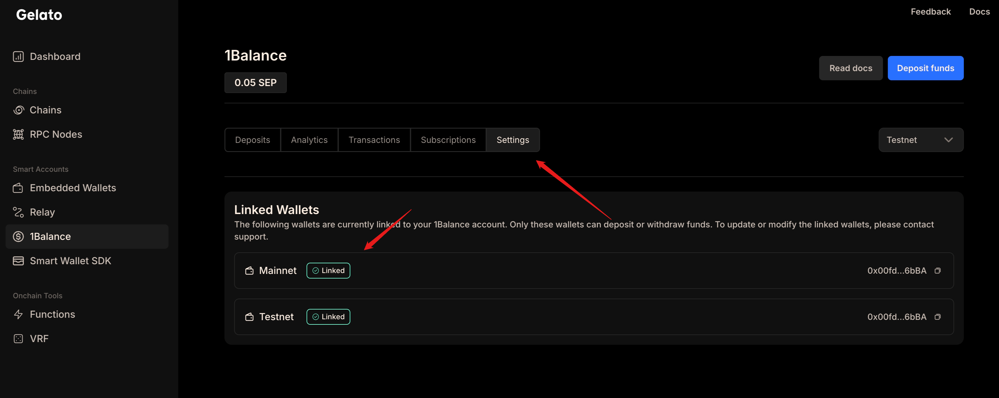
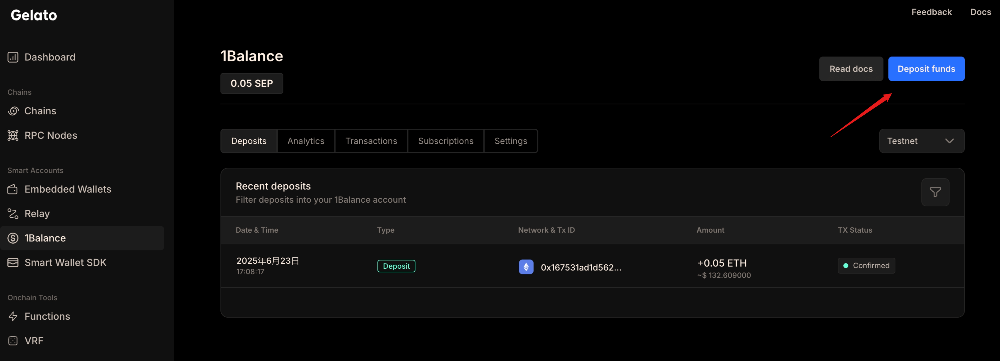
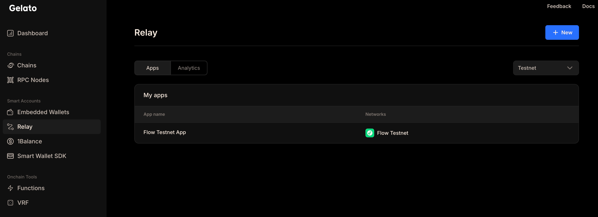
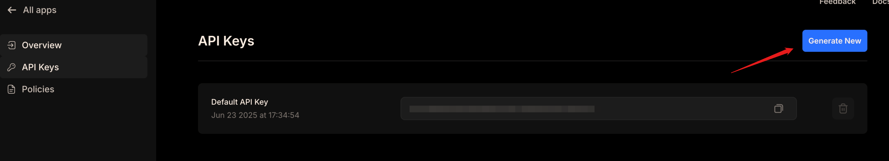

import Tabs from '@theme/Tabs';
import TabItem from '@theme/TabItem';

# Gelato Smart Wallet

Gas fees are one of the biggest barriers to blockchain adoption. Users often need to hold native tokens just to pay for transaction fees, which creates friction in onboarding and limits the types of applications that they can build. To solve this problem, Gelato Smart Wallet activates **gasless transactions** on Flow EVM through sponsored transactions.

With Gelato Smart Wallet, you can:
- **Eliminate gas fees** for your users by sponsoring their transactions.
- **Improve user experience** with seamless onboarding that doesn't require users to hold FLOW tokens.
- **Support EIP-7702** for enhanced smart wallet functionality.
- **Scale your dApp** by removing the cost barrier for user interactions.
- **Leverage Flow's low gas costs** to provide affordable sponsored transactions.

This tutorial will guide you through how to set up Gelato Smart Wallet to activate gasless transactions on Flow EVM. You'll learn how to configure the necessary API keys, fund your sponsorship account, and implement gasless transaction functionality in your applications.

:::info

This tutorial focuses on **EIP-7702** implementation with Gelato Smart Wallet on Flow EVM. EIP-7702 provides a streamlined experience for users. It maintains the same address as their EOA and adds smart wallet capabilities, which activates enhanced features like gasless transactions and improved user experience.

:::

## Objectives

After you complete this guide, you'll be able to:

- Configure a Gelato Smart Wallet account with proper API keys and funding setup.
- Implement gasless transaction functionality with the Gelato Smart Wallet SDK.
- Estimate and execute sponsored transactions on Flow EVM.
- Integrate EIP-7702 features for enhanced user experience.
- Troubleshoot common issues with Gelato Smart Wallet integration.

## Prerequisites to use Gelato Smart Wallet

You need to set up the following in the Gelato App to create a Gelato Sponsor API Key:

### Step 1. create your Gelato account

Sign up on the [Gelato App] to establish an account. This account is the foundation to set up relay tasks and manage gas sponsorships.

### Step 2. deposit funds into 1Balance

To use Gelato for sponsored transactions, you need to deposit funds into 1Balance as your target environment requires:

- Mainnets: Deposit USDC.
- Testnets: Deposit Sepolia ETH.

Click the `1Balance` tab to link your wallet first.



And then deposit some Sepolia ETH(SEP) testnet funds.



If you need to fund your account, you can use one of the following third-party faucets:

- [Google Cloud Sepolia Faucet]
- [Alchemy Sepolia Faucet]
- [Chainlink Sepolia Faucet]
- [Metamask Sepolia Faucet]

### Step 3. create a relay app

Select the `Relay` tab in the Gelato App and switch to the `Testnet` environment.

Now you can create a new _Relay App_ with the Flow EVM network.  
For Testnet, you can first allow `Any contract` to call your relay app.



:::warning

You'll need to add more information for your smart contracts at a later date.

When set to a specific contract instead of `Any contract`, the API keys will only allow sponsored transactions for calls to the designated methods within the ABI of that contract.

:::

### Step 4. Create or obtain an API key

After you create the Relay App, navigate to its dashboard to locate your Sponsor API Key.



This key links your Gelato setup with 1Balance for gas sponsorship.

Copy the API key to your clipboard.

## Send gasless transactions for your users

After you have created a Sponsor API Key and deposited funds into 1Balance, you can use gasless transactions features for your users.  

With the Gelato Smart Wallet SDK, developers can easily set up sponsored transactions for their applications in just a few simple steps, which allows seamless onboarding and interaction and doesn't require users to hold native tokens.

:::info

You can find the examples in the [Gelato Smart Wallet SDK] repository.

:::

### Step 1. Install all relevant dependencies

<Tabs>
  <TabItem value="pnpm" label="pnpm" default>
    ```bash
    pnpm add @gelatonetwork/smartwallet viem
    ```
  </TabItem>
  <TabItem value="bun" label="bun">
    ```bash
    bun add @gelatonetwork/smartwallet viem
    ```
  </TabItem>
  <TabItem value="yarn" label="yarn">
    ```bash
    yarn add @gelatonetwork/smartwallet viem
    ```
  </TabItem>
  <TabItem value="npm" label="npm">
    ```bash
    npm install @gelatonetwork/smartwallet viem
    ```
  </TabItem>
</Tabs>


### Step 2. set up a Smart Wallet account

Import required dependencies:

```ts
import { createGelatoSmartWalletClient, sponsored } from "@gelatonetwork/smartwallet";
import { gelato } from "@gelatonetwork/smartwallet/accounts";
import { createWalletClient, createPublicClient, http, type Hex } from "viem";
import { generatePrivateKey, privateKeyToAccount } from "viem/accounts";
import { flowTestnet } from "viem/chains";

// Create a public client for the Flow Testnet
const publicClient = createPublicClient({
  chain: flowTestnet,
  transport: http(),
});
```

You can set up a Smart Account as per your needs.  
After you create the `gelato` account, the Gelato Smart Account address will be the same as your EOA, which activates EIP-7702 features.

```ts
// Prepare a normal EOA account
const privateKey = (process.env.PRIVATE_KEY ?? generatePrivateKey()) as Hex;
const owner = privateKeyToAccount(privateKey);

// Wrap the EOA account into a Gelato Smart account
const account = await gelato({
  owner,
  client: publicClient,
});
```

Then you need to create a standard viem wallet client with the Gelato Smart Account.

```ts
const client = createWalletClient({
  account,
  chain: flowTestnet,
  transport: http()
});
```

After you have a standard viem wallet client, you can wrap it into a Gelato Smart Wallet client with the sponsor API key.

```ts
const sponsorApiKey = process.env.SPONSOR_API_KEY;
if (!sponsorApiKey) {
  throw new Error("SPONSOR_API_KEY is not set");
}

const swc = await createGelatoSmartWalletClient(client, {
  apiKey: sponsorApiKey
});
```

### Step 3. estimate or send a gasless transaction

Now you can estimate or send a gasless transaction with the Gelato Smart Wallet client.

To estimate the fee and gas for a gasless transaction, you can use the `estimate` method.

```ts
const response = await swc.estimate({
  payment: sponsored(sponsorApiKey),
  calls: [
    {
      to: "0xa8851f5f279eD47a292f09CA2b6D40736a51788E",
      data: "0xd09de08a",
      value: 0n
    }
  ]
});

console.log(`Estimated fee: ${formatEther(BigInt(response.fee.amount))} FLOW`);
console.log(`Estimated gas: ${JSON.stringify(response.gas)} GAS`);
```

To send a gasless transaction, you can use the `execute` method.

```ts
const results = await smartWalletClient.execute({
    payment : sponsored(sponsorApiKey),
    calls: [
      {
        to: "0xa8851f5f279eD47a292f09CA2b6D40736a51788E",
        data: "0xd09de08a",
        value: 0n
      }
    ]
});

console.log("userOp hash:", results?.id);
const txHash = await results?.wait();
console.log("transaction hash",txHash);
```

Or you can use `prepare` + `send` to send a gasless transaction.

```ts
const preparedCalls = await swc.prepare({
  payment: sponsored(sponsorApiKey),
  calls: [
    {
      to: "0xa8851f5f279eD47a292f09CA2b6D40736a51788E",
      data: "0xd09de08a",
      value: 0n
    }
  ]
});

// Other actions can be performed here

const results = await swc.send({
  preparedCalls
});

// You can listen for events from the Gelato Smart Wallet client
results.on("submitted", (status: GelatoTaskStatus) => {
  console.log(`Transaction submitted: ${status.transactionHash}`);
});
results.on("success", async (status: GelatoTaskStatus) => {
  console.log(`Transaction successful: ${status.transactionHash}`);
});
results.on("error", (error: Error) => {
  console.error(`Transaction failed: ${error.message}`);
});
```

---

## Conclusion

In this tutorial, you successfully integrated Gelato Smart Wallet to activate gasless transactions on Flow EVM. You learned how to set up the necessary infrastructure, configure API keys, fund sponsorship accounts, and implement gasless transaction functionality in your applications. The implementation demonstrates how Flow's low gas costs combined with Gelato's sponsored transaction infrastructure can create seamless user experiences that eliminate the friction of gas fees.

Now that you have completed the tutorial, you should be able to:

- Configure a Gelato Smart Wallet account with proper API keys and funding setup.
- Implement gasless transaction functionality with the Gelato Smart Wallet SDK.
- Estimate and execute sponsored transactions on Flow EVM.
- Integrate EIP-7702 features for enhanced user experience.
- Troubleshoot common issues with Gelato Smart Wallet integration.

The combination of Flow's efficient gas prices and Gelato's sponsored transaction infrastructure opens up new possibilities for you to build user-friendly dApps. When you eliminate the need for users to hold native tokens for gas fees, you can create onboarding experiences that rival traditional Web2 applications and maintain the security and transparency of blockchain technology.

[Gelato App]: https://app.gelato.cloud/
[Google Cloud Sepolia Faucet]: https://cloud.google.com/application/web3/faucet/ethereum/sepolia
[Alchemy Sepolia Faucet]: https://www.alchemy.com/faucets/ethereum-sepolia
[Chainlink Sepolia Faucet]: https://faucets.chain.link/sepolia
[Metamask Sepolia Faucet]: https://docs.metamask.io/developer-tools/faucet/
[Gelato Smart Wallet SDK]: https://github.com/gelatodigital/smartwallet/tree/master/examples
