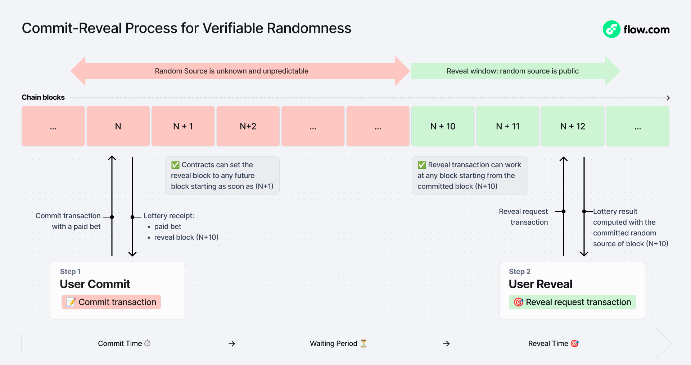
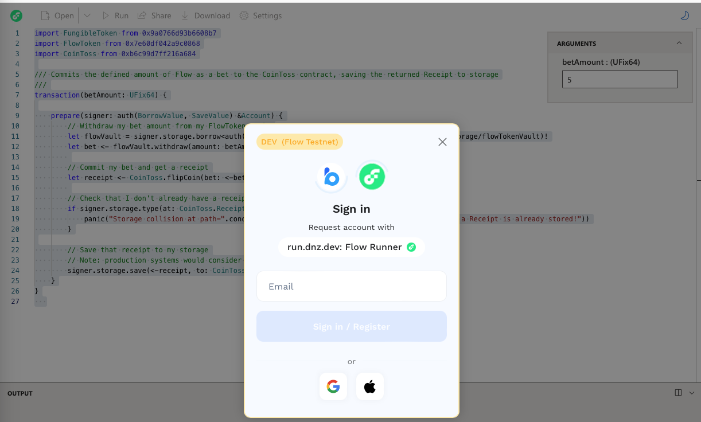

# Secure Randomness with Commit-Reveal in Cadence

Randomness is a critical component in blockchain applications. It allows fair and unpredictable outcomes for use cases like gaming, lotteries, and cryptographic protocols. 

The most basic approach that you can use to generate a random number on EVM chains is to use block hashes, which combines the block hash with a user-provided seed and hashes them together. You can use the hash that results as a pseudo-random generator seed. However, this approach has limitations. A validator that influences the random source used to compute transactions can manipulate the block hash. The block proposer can decide what to include into a block and can iterate through different combinations until they find a favorable random source.

[Chainlink VRF][chainlink-vrf] is a popular tool that improves on this. It provides another approach you can use to generate provably random values on Ethereum and other blockchains. It relies on a decentralized oracle network to deliver cryptographically secure randomness from off-chain sources. However, this dependence on external oracles introduces several weaknesses, such as cost, latency, and scalability concerns.

In contrast, Flow offers a simpler and more integrated approach with its native onchain Randomness Beacon at the protocol level, which eliminates reliance on external oracles and the need to sidestep their associated risks.

In addition to instant randomness that is available to any transaction (via `revertibleRandom` function), Flow provides a solution to the problem of a user who reverts a transaction with an unfavorable outcome. Commit-Reveal schemes on Flow also rely on protocol-native secure randomness and they fix the issue of post-selection by trustless users. Commit-Reveal tools on Flow can be used within both Cadence and  Consumer Decentralized Finance (DeFi) contracts. This tutorial focuses on Cadence.

## Objectives

By the end of this guide, you will be able to:

- Deploy a Cadence smart contract on the Flow blockchain.
- Implement commit-reveal pattern for randomness to ensure fairness.
- Interact with onchain randomness features on Flow.
- Build and test the Coin Toss game with the Flow Testnet.

## Prerequisites

You'll need the following:

- Flow Testnet Account: an account on the Flow Testnet with test FLOW tokens to deploy contracts and execute transactions (for example, via [Flow Faucet][flow-faucet]).
- Flow CLI or Playground: the Flow CLI or Flow Playground to deploy and test contracts (install via [Flow Docs][flow-docs]).

## Overview

In this guide, we will explore how to use a commit-reveal scheme based on the Flow Random Beacon to achieve secure, non-revertible randomness. This mechanism mitigates post-selection attacks, where participants attempt to reject unfavorable random outcomes after they are revealed.

To illustrate this concept, we will build a Coin Toss game on Flow, which demonstrates how smart contracts can leverage a commit-reveal scheme for fair, tamper-resistant results.



### What is the Coin Toss Game?

The Coin Toss Game is a decentralized betting game that showcases the commit-reveal pattern. Players place bets and don't know the random outcome, which ensures fairness and resistance to manipulation.

The game consists of two distinct phases:

1. Commit Phase - To place a bet, the player sends Flow tokens to the contract. The contract records the commitment to use a future random value from the Flow Random Beacon. The player receives a Receipt, which they will use to reveal the result later.
2. Reveal Phase - When the random value becomes available in the `RandomBeaconHistory` contract, the player submits their Receipt to determine the outcome:
   - If the result is 0, the player wins and receives double their bet.
   - If the result is 1, the player loses, and their bet remains in the contract.

### Why use a Commit-Reveal scheme?

Similarly to revertible randomness, Commit-Reveal inherits the security of Flow native randomness beacon:

- Ensures security - The Flow Random Beacon provides cryptographically unpredictable and non-biased randomness.
- Ensure fairness - The Flow Random Beacon uses a Verifiable Random Function (VRF) under the hood which allows any external client or user to verify that randoms were generated fairly.
- Reduces reliance on external oracles - The randomness is generated natively onchain, and avoids additional complexity, third party risk and cost.

In addition, commit-reveal patterns solve the issue of revertible randoms:

- Prevents user manipulation - Players cannot evaluate the outcome and choose to revert the transaction if they do not like the result.
- 


:::info

One of the powers of Cadence transactions is that a developer can set post-conditions that must be true, or the transaction will revert. This is very useful for scenarios such as to guarantee a user receives their purchase in a complex and multi-step transaction, but it also means that they can set conditions to reject the transaction.  In an instant-win lottery, this would allow users to test large numbers of tickets for a win without purchase price payment.

:::

## Build the Coin Toss contract

In this section, we'll walk through how to construct the `CoinToss.cdc` contract, which contains the core logic for the Coin Toss game. To function properly, the contract relies on support contracts and a proper deployment setup.

This tutorial will focus specifically on how to write and understand the `CoinToss.cdc` contract, while you can find additional setup details in the [original GitHub repo][github-repo].

### Step 1: Define the `CoinToss.cdc` contract

Let's define our `CoinToss.cdc` and bring the other supporting contracts.

```cadence
import "Burner"
import "FungibleToken"
import "FlowToken"

import "RandomConsumer"

access(all) contract CoinToss {
    /// The multiplier used to calculate the winnings of a successful coin toss
    access(all) let multiplier: UFix64
    /// The Vault used by the contract to store funds.
    access(self) let reserve: @FlowToken.Vault
    /// The RandomConsumer.Consumer resource used to request & fulfill randomness
    access(self) let consumer: @RandomConsumer.Consumer

    /* --- Events --- */
    access(all) event CoinFlipped(betAmount: UFix64, commitBlock: UInt64, receiptID: UInt64)
    access(all) event CoinRevealed(betAmount: UFix64, winningAmount: UFix64, commitBlock: UInt64, receiptID: UInt64)
}
```

### Step 2: Implement the commit phase with `flipCoin`

Let's define the first step in our scheme; the commit phase. We do this through a `flipCoin` public function. In this method, the caller commits a bet. The contract takes note of a future block height and bet amount and returns a `Receipt` resource, which the former uses to reveal the coin toss result and determine their winnings.

```cadence
access(all) fun flipCoin(bet: @{FungibleToken.Vault}): @Receipt {
        let request <- self.consumer.requestRandomness()
        let receipt <- create Receipt(
                betAmount: bet.balance,
                request: <-request
            )
        self.reserve.deposit(from: <-bet)

        emit CoinFlipped(betAmount: receipt.betAmount, commitBlock: receipt.getRequestBlock()!, receiptID: receipt.uuid)

        return <- receipt
    }
```

### Step 3: Implement the reveal phase With `revealCoin`

Now we implement the reveal phase with the `revealCoin` function. Here, the caller provides the Receipt they recieve at commitment. The contract then "flips a coin" and `_randomCoin()` provides the Receipt's contained Request. The reveal step is possible only when the protocol random source at the committed block height becomes available.

If result is 1, the user loses, but if it's 0, the user doubles their bet. Note that the caller could condition the revealed transaction, but they've already provided their bet amount, so there's no loss for the contract if they do.

```cadence
access(all) fun revealCoin(receipt: @Receipt): @{FungibleToken.Vault} {
        let betAmount = receipt.betAmount
        let commitBlock = receipt.getRequestBlock()!
        let receiptID = receipt.uuid

        let coin = self._randomCoin(request: <-receipt.popRequest())

        Burner.burn(<-receipt)

        // Deposit the reward into a reward vault if the coin toss was won
        let reward <- FlowToken.createEmptyVault(vaultType: Type<@FlowToken.Vault>())
        if coin == 0 {
            let winningsAmount = betAmount * self.multiplier
            let winnings <- self.reserve.withdraw(amount: winningsAmount)
            reward.deposit(
                from: <-winnings
            )
        }

        emit CoinRevealed(betAmount: betAmount, winningAmount: reward.balance, commitBlock: commitBlock, receiptID: receiptID)

        return <- reward
    }
```

The final version of `CoinToss.cdc` will look like [this contract code][coin-toss-contract-code].

## Test CoinToss on Flow Testnet

To make things easy, we've already deployed the `CoinToss.cdx` contract for you at this address: [0xb6c99d7ff216a684][coin-toss-contract]. We'll walk through how to place a bet and reveal the result with [run.dnz][run-dnz], a Flow-friendly tool similar to Ethereum's Remix.

### Place a bet with flipCoin

First, you'll submit a bet to the CoinToss contract. To do this, you'll withdraw Flow tokens and store a receipt. Here's how to get started:

1. Open Your Dev Environment: head to [run.dnz][run-dnz].
2. Enter the Transaction Code: paste the following Cadence code into the editor:

```cadence
import FungibleToken from 0x9a0766d93b6608b7
import FlowToken from 0x7e60df042a9c0868
import CoinToss from 0xb6c99d7ff216a684

/// Commits the defined amount of Flow as a bet to the CoinToss contract, saving the returned Receipt to storage
///
transaction(betAmount: UFix64) {

    prepare(signer: auth(BorrowValue, SaveValue) &Account) {
        // Withdraw my bet amount from my FlowToken vault
        let flowVault = signer.storage.borrow<auth(FungibleToken.Withdraw) &FlowToken.Vault>(from: /storage/flowTokenVault)!
        let bet <- flowVault.withdraw(amount: betAmount)

        // Commit my bet and get a receipt
        let receipt <- CoinToss.flipCoin(bet: <-bet)

        // Check that I don't already have a receipt stored
        if signer.storage.type(at: CoinToss.ReceiptStoragePath) != nil {
            panic("Storage collision at path=".concat(CoinToss.ReceiptStoragePath.toString()).concat(" a Receipt is already stored!"))
        }

        // Save that receipt to my storage
        // Note: production systems would consider handling path collisions
        signer.storage.save(<-receipt, to: CoinToss.ReceiptStoragePath)
    }
}
```

3. Set Your Bet: a window will appear that asks for the `betAmount`. Enter a value (such as 1.0 for 1 Flow token) and submit.
4. Execute the Transaction: click "Run," and a WalletConnect window will appear. Choose Blocto, sign in with your email, and click "Approve" to send the transaction to Testnet.



5. Track it: You can take the transaction id to [FlowDiver][flow-diver][.io] to have a full view of everything about this `FlipCoin` transaction.

### Reveal the coin toss result

Let's reveal the outcome of your coin toss to see if you've won. This step uses the receipt from your bet, so ensure you use the same account that placed the bet. Here's how to do it:

1. Return to your Dev Environment: Open [run.dnz][run-dnz] again.
2. Enter the Reveal Code. Paste the following Cadence transaction into the editor:

```cadence
import FlowToken from 0x7e60df042a9c0868
import CoinToss from 0xb6c99d7ff216a684

/// Retrieves the saved Receipt, redeems it to reveal the coin toss result, and deposits the winnings with any luck
///
transaction {

    prepare(signer: auth(BorrowValue, LoadValue) &Account) {
        // Load my receipt from storage
        let receipt <- signer.storage.load<@CoinToss.Receipt>(from: CoinToss.ReceiptStoragePath)
            ?? panic("No Receipt found in storage at path=".concat(CoinToss.ReceiptStoragePath.toString()))

        // Reveal by redeeming my receipt - fingers crossed!
        let winnings <- CoinToss.revealCoin(receipt: <-receipt)

        if winnings.balance > 0.0 {
            // Deposit winnings into my FlowToken Vault
            let flowVault = signer.storage.borrow<&FlowToken.Vault>(from: /storage/flowTokenVault)!
            flowVault.deposit(from: <-winnings)
        } else {
            destroy winnings
        }
    }
}
```

After we run this transaction, we reveal the result of the coin flip and it's 1! It means we haven't won anything this time, but we'll try again!

You can find the full transaction used for this example, with its result and events, at [FlowDiver.io/tx/][flow-diver-tx].

## Conclusion

The commit-reveal scheme, implemented within the context of the Flow Randomness Beacon, provides a robust solution to generate secure and non-revertible randomness in decentralized applications. When developers leverage this mechanism, they can ensure that their applications are:

- Fair: outcomes remain unbiased and unpredictable.
- Resistant to post-selection: protects against trustless users who cannot reverse their commitments.

The CoinToss game serves as a practical example of these principles in action. Now that you've walked through its implementation, you've seen firsthand how straightforward yet effective this approach can be, as it balances simplicity for developers with robust security for users. As blockchain technology advances, it's essential that you embrace such best practices to create a decentralized ecosystem that upholds fairness and integrity, which empowers developers to innovate with confidence.

This tutorial has equipped you with hands-on experience and key skills:

- You deployed a Cadence smart contract on the Flow blockchain.
- You implemented commit-reveal to ensure fairness.
- You interacted with onchain randomness features on Flow.
- You built and tested the Coin Toss game with the Flow Testnet.

When you harness the built-in randomness capabilities on Flow, you can create engaging, user-centric experiences without grappling with the complexities or limitations of external systems. This knowledge empowers you to create secure, scalable, and fair decentralized applications.

[chainlink-vrf]: https://docs.chain.link/vrf
[flow-faucet]: https://faucet.flow.com/fund-account
[flow-docs]: https://developers.flow.com
[flow-diver]: https://testnet.flowdiver.io/
[github-repo]: https://github.com/onflow/random-coin-toss
[.io]: https://testnet.flowdiver.io/tx/9c4f5436535d36a82d4ae35467b37fea8971fa0ab2409dd0d5f861f61e463d98
[run-dnz]: https://run.dnz.dev/
[coin-toss-contract]: https://contractbrowser.com/A.b6c99d7ff216a684.CoinToss
[coin-toss-contract-code]: https://github.com/onflow/random-coin-toss/blob/main/contracts/CoinToss.cdc
[flow-diver-tx]: https://testnet.flowdiver.io/tx/a79fb2f947e7803eefe54e48398f6983db4e0d4d5e217d2ba94f8ebdec132957
