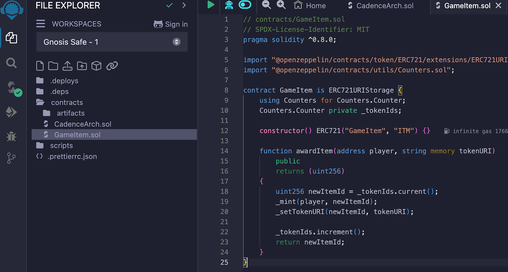
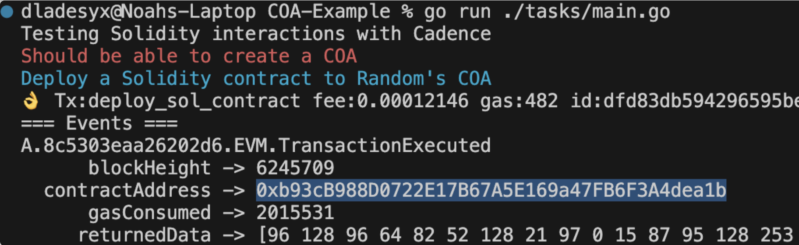
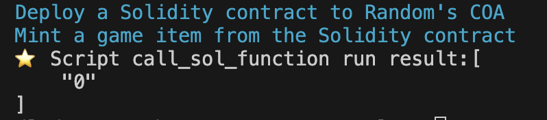

# Deploy a Solidity Contract using Cadence

## Why Solidity And Cadence?

Solidity powers Ethereum's vast ecosystem, with a deep library of contracts like ERC721s for NFTs and a huge developer base. Deploying Solidity contracts on Flow's EVM layer leverages Flow's consensus for lower fees, quicker transactions, and slick asset handling, while giving you access to additional tools, including native VRF.

Imagine gaming NFTs minted cheaper, DeFi logic ported without rewrites, or Ethereum projects tapping Flow's scalable, user-first design. Flow EVM runs Solidity natively, and Cadence bridges the gap—letting you reuse trusted contracts while unlocking Flow's edge.

## Objectives

After completing this guide, you'll be able to:

- Deploy a Solidity contract on Flow EVM using Cadence
- Call functions on this contract from the Cadence side

## Prerequisites:

- NodeJs and NPM (must be installed - follow [this guide][node-npm-install])
- Go
- Flow Command Line Interface (Flow CLI) (must be installed - follow [this guide][flow-cli-install])
- Remix (can be accessed online - available at [Remix][remix])
- Overflow (must be installed - install via Go with `go get github.com/bjartek/overflow/v2`)
- Cadence Owned Account (COA) (must be created - follow [this guide][coa-guide] to set up)

For this guide, we're using Remix for Solidity contract compilation and Overflow for running Cadence transactions on Flow EVM. To deploy a Solidity contract using Cadence, you'll need a Cadence Owned Account; the guide linked above explains how to create one.

## High-Level Walkthrough

At a high level, this guide walks you through deploying a Solidity contract on the Flow blockchain's EVM layer using Cadence in three main steps:

1. Compile the Solidity Contract: You'll start by taking a Solidity contract (like an ERC721 for NFTs) and compiling it into bytecode using Remix, an online Ethereum development tool. This bytecode is the machine-readable version of your contract, ready to be deployed.

2. Deploy to Flow EVM with Cadence: Next, you'll set up a local environment with tools like Overflow and the Flow CLI. Using a Cadence transaction, you'll deploy the bytecode to Flow's EVM layer via a Cadence Owned Account (COA), bridging the two ecosystems seamlessly.

3. Interact from Cadence: Finally, you'll use a Cadence script to call a function on your deployed Solidity contract—like minting an NFT—demonstrating how Cadence can interact with Ethereum-style logic on Flow.

This process leverages Ethereum's robust contract library and Flow's efficient, user-friendly blockchain, opening up a world of cross-platform possibilities—all in a few straightforward steps.

## Step 1: Compile the Solidity Contract

Start by compiling your Solidity contract to get its bytecode. For this example, use OpenZeppelin's ERC721 contract for tracking game items. Here's how to do it in Remix:

1. Open Remix: Go to [Remix][remix] in your browser.
2. Create a New File: In the Remix file explorer, click the "+" button and name the file (e.g., `GameItem.sol`).
3. Paste the Contract Code: Copy the OpenZeppelin ERC721 contract code (e.g., from [this example][coa-guide]) and paste it into the new file.
4. Compile the Contract:
   - Select the appropriate Solidity compiler version (e.g., 0.8.x) in the "Solidity Compiler" tab.
   - Click "Compile GameItem.sol".
5. Copy the Bytecode:
   - Go to the "Compilation Details" (or "Bytecode" section after compilation).
   - Copy the "object" field under the bytecode section.



6. Save the Bytecode:
   - From your project's root directory, create a folder named `bytecode`.
   - Inside it, create a file called `GameItem.js`.
   - Paste the bytecode into `GameItem.js` as a string (e.g., `module.exports = "0x..."`).

Here's the Cadence transaction we'll use later to deploy this bytecode on Flow EVM:

```cadence
import "EVM"

transaction(code: String, pathId: Int) {
    let coa: auth(EVM.Deploy) &EVM.CadenceOwnedAccount

    prepare(signer: auth(Storage) &Account) {
        let coaPath = StoragePath(identifier: signer.address.toString().concat("EVM_").concat(pathId.toString()))!
        self.coa = signer.storage.borrow<auth(EVM.Deploy) &EVM.CadenceOwnedAccount>(
            from: coaPath) ?? panic("Could not borrow reference to the COA!")
    }

    execute {
        self.coa.deploy(code: code.decodeHex(), gasLimit: 15000000, value: EVM.Balance(attoflow: 0))
    }
}
```

## Step 2: Set Up Your Environment and Deploy the Contract

To run the transactions and tests, we'll use [Overflow][overflow]. Follow these steps to set up and deploy:

1. Initialize a Go Project:
   - Open your terminal and navigate to your project's root directory.
   - Run: `go mod init flow/tutorials` to create a Go module.
2. Install Overflow:
   - Run: `go get github.com/bjartek/overflow/v2` to install the Overflow package.
3. Create the Task File:
   - In the root directory, create a folder called `tasks`.
   - Inside `tasks`, create a file named `main.go`.
   - Paste the following Go code into `main.go`:

```go
package main

import (
    "fmt"
    "io/ioutil"
    "log"
    . "github.com/bjartek/overflow/v2"
    "github.com/fatih/color"
)

func readJSFile(filePath string) (string, error) {
    content, err := ioutil.ReadFile(filePath)
    if err != nil {
        return "", err
    }
    return string(content), nil
}

func main() {
    filePath := "bytecode/GameItem.js"
    jsContent, err := readJSFile(filePath)
    if err != nil {
        log.Fatalf("Error reading JavaScript file: %v", err)
    }
    o := Overflow(
        WithGlobalPrintOptions(),
        WithNetwork("testnet"),
    )

    color.Red("Should be able to create a COA")
    o.Tx("create_COA",
        WithSigner("gamer"),
    ).Print()

    color.Cyan("Deploy a Solidity contract to Random's COA")
    o.Tx("deploy_sol_contract",
        WithSigner("gamer"),
        WithArg("code", jsContent),
        WithArg("pathId", 0),
    ).Print()
}
```

4. Run the Deployment:
   - From the terminal, navigate to the root directory.
   - Run: `go run ./tasks/main.go`.
   - This will:
     - Create a Cadence Owned Account (COA) for the "gamer" account.
     - Deploy the Solidity contract using the bytecode from `GameItem.js`.
5. Verify the Deployment:
   - Check the terminal output for the deployed contract address (e.g., `0xb93cB988D0722E17B67A5E169a47FB6F3A4dea1b`).
   - Visit the [Flow EVM Testnet Scanner][testnet-scanner] and search for the address to confirm the deployment.



Note: The "gamer" account (e.g., `0xb995271139c0126f`) is a Testnet account. The `pathId` (set to `0`) corresponds to the COA slot. If you've created multiple COAs, increment `pathId` (e.g., `1`, `2`) accordingly.

## Step 3: Call a Function on the Deployed Contract

Now, let's call the `awardItem` function from the deployed ERC721 contract using this Cadence script:

1. Cadence Script Preparation:
   Use the following Cadence script to call the contract function:

```cadence
import "EVM"

access(all)
fun main(hexEncodedAddress: String, address: Address, pathId: UInt64): [AnyStruct] {
    let account = getAuthAccount<auth(Storage) &Account>(address)
    let coaPath = StoragePath(identifier: address.toString().concat("EVM_").concat(pathId.toString()))!
    let coa = account.storage.borrow<auth(EVM.Call) &EVM.CadenceOwnedAccount>(
        from: coaPath
    ) ?? panic("Could not borrow reference to the COA!")
    let addressBytes = hexEncodedAddress.decodeHex().toConstantSized<[UInt8; 20]>()!

    let callResult = coa.call(
        to: EVM.EVMAddress(bytes: addressBytes),
        data: EVM.encodeABIWithSignature(
            "awardItem(address,string)",
            [EVM.addressFromString("000000000000000000000002A16A68E971e4670B"), "{name: gamerz}"]
        ),
        gasLimit: 15000000,
        value: EVM.Balance(attoflow: 0)
    )

    return EVM.decodeABI(types: [Type<UInt256>()], data: callResult.data)
}
```

2. Update the Go File:
   Open `tasks/main.go` and add the following code at the end of the `main` function (replace the `hexEncodedAddress` with your deployed contract address):

```go
color.Cyan("Mint a game item from the Solidity contract")
o.Script("call_sol_function",
    WithArg("hexEncodedAddress", "b93cB988D0722E17B67A5E169a47FB6F3A4dea1b"),
    WithArg("address", "gamer"),
    WithArg("pathId", 0),
).Print()
```

3. Run the Script:

   - In the terminal, run: `go run ./tasks/main.go` again.
   - This executes the Cadence script, calling `awardItem` to mint an NFT.

4. Check the Result:
   - The terminal will display the token ID of the newly minted NFT (e.g., a UInt256 value).
   - See the screenshot below for an example output:



The terminal output shows the unique token ID that was generated when minting the game item through the Solidity contract using Cadence.

<Callout type="info">
The `awardItem` function is called with a test address and a string parameter. In a real-world scenario, you would replace these with actual wallet addresses and more meaningful metadata.
</Callout>

## Conclusion

Deploying a Solidity contract within a Cadence environment on the Flow blockchain is not only feasible but also presents an exciting opportunity for you to harness the strengths of both programming languages. Throughout this guide, you've navigated the critical steps involved in the deployment process, from compiling your Solidity contract using Remix to executing transactions with Overflow and Cadence scripts. By completing this guide, you've achieved the following:

- Deployed a Solidity contract on Flow EVM using Cadence: You compiled and deployed your Solidity contract to Flow's EVM layer via a Cadence transaction.
- Called functions from Cadence: You used a Cadence script to mint an NFT by invoking the `awardItem` function on your deployed contract.

As blockchain technology continues to evolve, adopting these best practices is crucial for fostering a secure and trustworthy ecosystem. This empowers you to innovate while staying true to the core principles of decentralization and fairness.

[node-npm-install]: https://docs.npmjs.com/downloading-and-installing-node-js-and-npm
[flow-cli-install]: https://developers.flow.com/tools/flow-cli/install
[remix]: https://remix.ethereum.org/
[coa-guide]: https://developers.flow.com/evm/cadence/interacting-with-coa

[overflow]: https://github.com/bjartek/overflow]
[testnet-scanner]: https://evm-testnet.flowscan.io/
