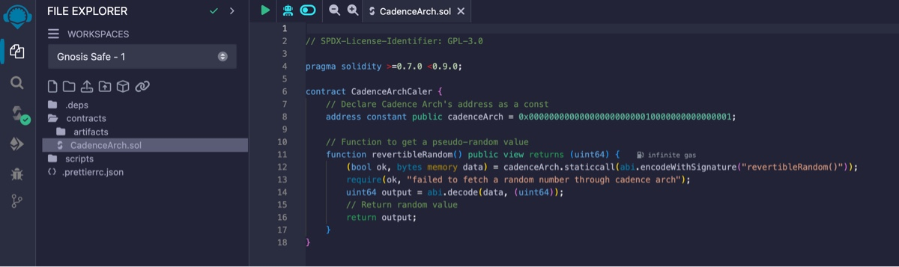

## Introduction

Flow provides secure, native onchain randomness that developers can leverage through Cadence Arch, a precompiled contract available on the Flow EVM environment. This guide walks you through how Solidity developers can use Cadence Arch to access Flow's verifiable randomness using Solidity.

### What is Cadence Arch?

[Cadence Arch] is a precompiled smart contract that allows Solidity developers on Flow EVM to interact with Flow's randomness and other network features like block height. This contract can be accessed using its specific address, and Solidity developers can make static calls to retrieve random values and other information.

## Prerequisites

- Basic Solidity knowledge
- Installed Metamask extension
- Remix IDE for compilation and deployment
- Flow EVM Testnet setup in Metamask

## Network information for Flow EVM

See [Network information] for more details.

## Steps to connect Flow EVM testnet to metamask

See [Wallets & Configurations] for more details.

## Solidity commit reveal

Make sure you review the Solidity version of the [commit reveal] to learn more about Flow EVM's native secure randomness through a simple demonstration.

## Obtaining testnet FLOW

You can fund your account with testnet FLOW using the [Flow Faucet].

Enter your Flow-EVM testnet address, and you'll receive testnet FLOW tokens to interact with smart contracts.

## Solidity code example: retrieving random numbers

The following is a simple Solidity contract that interacts with the Cadence Arch contract to retrieve a pseudo-random number:

```solidity
// SPDX-License-Identifier: GPL-3.0
pragma solidity >=0.7.0 <0.9.0;

contract CadenceArchCaller {
    // Address of the Cadence Arch contract
    address constant public cadenceArch = 0x0000000000000000000000010000000000000001;

    // Function to fetch a pseudo-random value
    function revertibleRandom() public view returns (uint64) {
        // Static call to the Cadence Arch contract's revertibleRandom function
        (bool ok, bytes memory data) = cadenceArch.staticcall(abi.encodeWithSignature("revertibleRandom()"));
        require(ok, "Failed to fetch a random number through Cadence Arch");
        uint64 output = abi.decode(data, (uint64));
        // Return the random value
        return output;
    }
}
```

### Explanation of the contract

1. **Cadence Arch Address**:

   The `cadenceArch` variable stores the address of the Cadence Arch precompiled contract (`0x0000000000000000000000010000000000000001`), which is constant across Flow EVM.

2. **Revertible Random**:

   The `revertibleRandom()` function makes a static call to the `revertibleRandom<uint64>()` function to fetch a pseudo-random number. If the call is successful, it decodes the result as a `uint64` random value.

## Deploying and testing the contract

### Compile and deploy the contract

1. Open Remix IDE.
2. Create a new file and paste the Solidity code above.

   

3. Compile the contract by selecting the appropriate Solidity compiler version (0.8.x).

   

4. Connect Remix to your Metamask wallet (with Flow EVM testnet) by selecting **Injected Web3** as the environment.

   

5. Deploy the contract.

   

### Call revertibleRandom

After deployment, you can interact with the contract to retrieve a random number.

Call the `revertibleRandom()` function in the left sidebar on the deployed contract. This fetches a pseudo-random number generated by Flow's VRF.


The result will be a `uint64` random number generated on Flow EVM.

## Generating random numbers in a range

For use-cases like games and lotteries, it's useful to generate a random number within a specified range, the following example shows how to get a value between a min and max number.

```solidity
// SPDX-License-Identifier: GPL-3.0
pragma solidity >=0.7.0 <0.9.0;

contract RandomInRange {
    address constant public cadenceArch = 0x0000000000000000000000010000000000000001;

    // Generate a random number between min and max
    function getRandomInRange(uint64 min, uint64 max) public view returns (uint64) {
        // Static call to the Cadence Arch contract's revertibleRandom function
        (bool ok, bytes memory data) = cadenceArch.staticcall(abi.encodeWithSignature("revertibleRandom()"));
        require(ok, "Failed to fetch a random number through Cadence Arch");
        uint64 randomNumber = abi.decode(data, (uint64));

        // Return the number in the specified range
        return (randomNumber % (max + 1 - min)) + min;
 }
}
```

:::warning

The above code is susceptible to the [modulo bias], particularly if the random number range is not a multiple of your desired range. To avoid this, you can use a more complex algorithm like rejection sampling, an example for which is provided in [this repository].

:::

## Secure randomness with commit-reveal scheme in Solidity

The **`revertibleRandom()`** function can be directly used to generate a pseudo-random number. However, in certain situations, especially involving untrusted callers, this function exposes a vulnerability: the ability of a transaction to **revert after seeing the random result**.

**The Issue with Using `revertibleRandom()` Directly**

- When an untrusted party calls a contract function that uses `revertibleRandom()`, they receive the random number **during the transaction execution**.
- **Post-selection** is the ability of the caller to abort the transaction if the random outcome is unfavorable. In this case, the user could choose to revert the transaction (for example, if they lose a bet) and attempt to call the function again in hopes of a better outcome.
- This can lead to a form of _transaction reversion attack_, where the randomness can be exploited by repeatedly attempting transactions until a favorable result is obtained.

## Further reading

For further details on Flow's randomness and secure development practices, check out the [Flow Randomness Documentation].

You can also view an example in both Solidity and Cadence of a [random coin toss implentation] using the VRF.

_This documentation was contributed by [Noah Naizir] a community developer._

<!-- Relative links. Will not render on the page -->

[Cadence Arch]: https://github.com/onflow/flips/blob/main/protocol/20231116-evm-support.md#cadence-arch
[Flow EVM Testnet RPC]: https://testnet.evm.nodes.onflow.org/
[Flow EVM Testnet Explorer]: https://evm-testnet.flowscan.io/
[Flow Faucet]: https://testnet-faucet.onflow.org/fund-account
[modulo bias]: https://research.kudelskisecurity.com/2020/07/28/the-definitive-guide-to-modulo-bias-and-how-to-avoid-it/
[this repository]: https://github.com/onflow/random-coin-toss
[Flow Randomness Documentation]: https://developers.flow.com/build/cadence/advanced-concepts/randomness
[random coin toss implentation]: https://github.com/onflow/random-coin-toss
[Noah Naizir]: https://x.com/noah_overflow
[Network information]: ../../build/evm/quickstart.md#network-information
[Wallets & Configurations]: ../../blockchain-development-tutorials/evm/setup/integrating-metamask.mdx
[commit reveal]: https://github.com/onflow/random-coin-toss/blob/main/solidity/src/CoinToss.sol