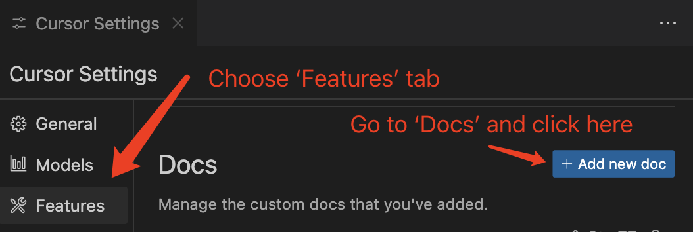
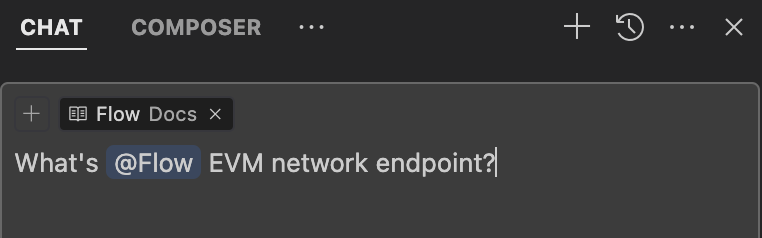

# Indexing Flow Documentation in Cursor

[Cursor] is an AI code editor that makes it easy to write code while building Flow apps. To get the most accurate and helpful responses when developing Flow applications, you need to index the relevant Flow documentation within Cursor. This guide walks you through setting up comprehensive Flow knowledge in your Cursor environment.

## Prerequisites

- [Cursor] installed on your system
- Active internet connection for documentation indexing
- Cursor Pro subscription (recommended for full documentation access)

## Documentation Sources

For optimal Flow development assistance, you'll want to index three key documentation sources:

1. **Flow Developer Documentation** - Official Flow blockchain and tooling documentation
2. **Cadence Language Documentation** - Complete Cadence programming language reference
3. **Flow Data Sources** - Comprehensive, auto-generated knowledge base with current practices

## Installation Steps

### Step 1: Access Documentation Settings

1. Open Cursor and navigate to **Settings** (or press `Cmd/Ctrl + ,`)
2. Go to **Features > Docs** 
3. Click **"+ Add new doc"** to begin adding documentation sources



### Step 2: Add Flow Developer Documentation

1. In the URL field, enter: `https://developers.flow.com/tools`
   - **Note**: Use the `/tools` endpoint as it properly indexes all Flow documentation
   - Cursor will automatically detect and crawl the entire Flow documentation site
2. Set the name as **"Flow"**
3. Click **"Confirm"** to add the documentation
4. Wait for the indexing process to complete


### Step 3: Add Cadence Language Documentation

1. Click **"+ Add new doc"** again
2. Enter the Cadence documentation URL: `https://cadence-lang.org/docs/`
3. Set the name as **"Cadence"**
4. Click **"Confirm"** to add the documentation
5. Allow time for indexing to complete

### Step 4: Add Flow Data Sources

1. Click **"+ Add new doc"** once more
2. Enter the Flow Data Sources URL: `https://github.com/onflow/Flow-Data-Sources/blob/main/merged_docs/all_merged.md`
3. Set the name as **"Flow Data Sources"**
4. Click **"Confirm"** to add the documentation

:::caution Resource Requirements

The Flow Data Sources file is very large and comprehensive. For older development machines or those with limited resources, consider using the [essentials merged file] instead:
`https://github.com/onflow/Flow-Data-Sources/blob/main/merged_docs/essentials_merged.md`

:::

### Step 5: Verify Indexing

1. Monitor the indexing progress in the **Docs** section of Cursor settings
2. Wait for all three documentation sources to show as "Indexed" or "Ready"
3. Indexing time varies depending on your internet connection and system performance

## Using Indexed Documentation

Once indexing is complete, you can reference the documentation in your Cursor prompts:

### Reference Syntax

- `@Flow` - Reference Flow developer documentation
- `@Cadence` - Reference Cadence language documentation  
- `@Flow Data Sources` - Reference the comprehensive Flow knowledge base



### Example Usage

```
@Flow How do I deploy a contract to Flow Testnet?

@Cadence What's the syntax for creating a resource in Cadence?

@Flow Data Sources How do I implement a marketplace for NFTs with royalties?
```

## Best Practices

### When to Use Each Source

- **@Flow**: Use for Flow-specific concepts, tools, CLI commands, network information, and ecosystem questions
- **@Cadence**: Use for Cadence programming language syntax, features, patterns, and code examples  
- **@Flow Data Sources**: Use for complex questions, advanced patterns, comprehensive tutorials, or when other sources don't provide satisfactory results

### Prompt Optimization

- **Be Specific**: Detailed prompts yield more accurate and relevant responses
- **Combine Sources**: Use multiple references for cross-VM applications (`@Flow` and `@Cadence`)
- **Context Matters**: Include relevant project context in your prompts
- **Verify Results**: Use documentation to validate AI-generated code and ensure best practices

### Example Combined Usage

```
Using @Flow and @Cadence, help me create a transaction that deploys an NFT contract and mints the first token, then show me how to call this from a React app using FCL.
```

## Troubleshooting

### Common Issues and Solutions

**Documentation Not Indexed**:
- Verify all URLs are correct and accessible
- Check your internet connection stability
- Try re-adding the documentation source

**Outdated Information**:
- Refresh documentation by removing and re-adding sources
- Clear Cursor's cache if available in settings
- Update to the latest version of Cursor

**Slow or Failed Indexing**:
- Ensure stable internet connection
- Try indexing during off-peak hours
- For Flow Data Sources, switch to the essentials merged file if needed

**Inaccurate AI Responses**:
- Verify the documentation sources are properly indexed
- Try more specific prompts with clear context
- Cross-reference responses with official documentation

### Getting Help

If you continue experiencing issues:

1. Check the [Cursor documentation] for additional troubleshooting steps
2. Verify that all documentation URLs are accessible in your browser
3. Contact Cursor support through their official channels
4. Consider using alternative documentation sources if specific URLs are problematic

## Maintaining Your Setup

### Regular Maintenance

- **Refresh Periodically**: Re-index documentation monthly to ensure current information
- **Monitor Updates**: Stay aware of major Flow or Cadence documentation updates
- **Clean Up**: Remove unused documentation sources to improve performance

### Team Collaboration

For development teams:
- Share the same documentation configuration across team members
- Document your specific setup in your project README
- Consider creating team-specific documentation sources for internal patterns and practices

By following this setup guide, you'll have comprehensive Flow and Cadence documentation available directly within Cursor, enabling more accurate AI assistance and faster development workflows.

<!-- Reference-style links, will not render on page. -->

[Cursor]: https://www.cursor.com/
[Cursor documentation]: https://docs.cursor.com/
[essentials merged file]: https://github.com/onflow/Flow-Data-Sources/blob/main/merged_docs/essentials_merged.md