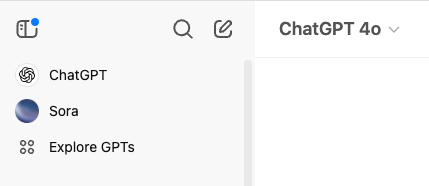

# Use Flow Knowledge Base in ChatGPT

[ChatGPT] is an AI assistant developed by [OpenAI] that can help with tasks such as writing, coding, and answering questions. It adapts to context and user input to provide relevant, conversational responses. ChatGPT can be integrated into developer tools or workflows to assist with documentation, debugging, and productivity.

This guide walks you through creating a **Custom GPT** using ChatGPT that can reference the [Flow Data Sources] file to answer questions.

<div style={{ position: 'relative', paddingBottom: '56.25%', height: 0, overflow: 'hidden', maxWidth: '100%' }}>
  <iframe 
    style={{ position: 'absolute', top: 0, left: 0, width: '100%', height: '100%' }}
    src="https://www.youtube.com/embed/Lu6KrNvGthI" 
    title="YouTube video player" 
    frameborder="0" 
    allow="accelerometer; autoplay; clipboard-write; encrypted-media; gyroscope; picture-in-picture" 
    allowfullscreen
  ></iframe>
</div>

:::warning

You'll need a [ChatGPT Plus subscription] to use the **Custom GPT** feature.

:::

## 📍 Step 1: Open the "Explore GPTs" Section

1. Log in to [ChatGPT].
2. In the sidebar on the left, click **Explore GPTs**.



---

## 📍 Step 2: Click "Create a GPT"

1. In the **Explore GPTs** screen, click the **"Create"** button in the top-right corner.


---

## 📍 Step 3: Walk Through the GPT Builder

ChatGPT will now guide you through a conversation to set up your custom GPT. First, drag and drop the [Flow Data Sources All Merged] file into the prompt.

### Suggested Prompt

```text
I want to make a GPT called FlowGPT that uses the linked file as it's primary source.  This file changes, so it should reference the live file at least once a day:  https://github.com/onflow/Flow-Data-Sources/blob/main/merged_docs/all_merged.md
```

---

## 📍 Step 4: Configure the GPT's Name and Instructions

ChatGPT may ask you to customize or verify:

- **Name and description** of your GPT
- **Instructions**: Tell it how to behave and what to prioritize (e.g., always reference the uploaded document)
- **Capabilities**: Enable file browsing, code interpreter, or DALL·E if needed

We've found it helpful to suggest:

```text
Please imagine you are a fast and smart junior developer who is eager to help and has memorized all the information in the linked file
```

Please let us know if you find any other useful customization prompts!

---

## 📍 Step 5: Test Your GPT

Once the GPT is built, you'll be taken to a preview chat window. Test it by asking a few questions based on your uploaded document.

---

## 📍 Step 6: Save and Publish (Optional)

When you're ready:

- Click **"Update & Save"** to finalize
- You can choose to keep it **private** or make it **public**

---

## ✅ That's it!

You've now created a custom GPT that references your uploaded file as a primary source. You can update the file or instructions later if needed.

<!-- Reference-style links, will not render on page. -->

[ChatGPT]: https://chatgpt.com/
[OpenAI]: https://openai.com/
[ChatGPT Plus subscription]: https://chat.openai.com
[Flow Data Sources]: ../flow-data-sources.md
[Flow Data Sources All Merged]: https://github.com/onflow/Flow-Data-Sources/blob/main/merged_docs/all_merged.md
