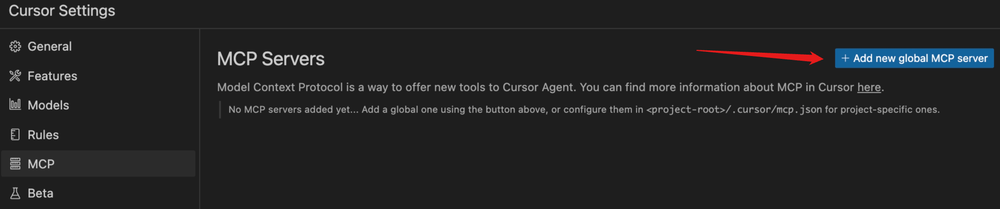
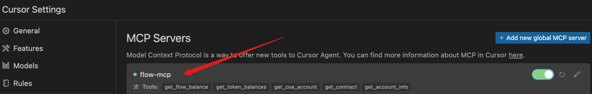
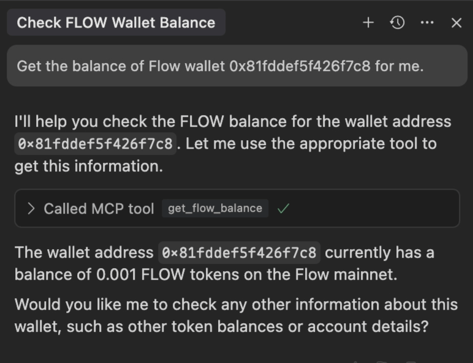
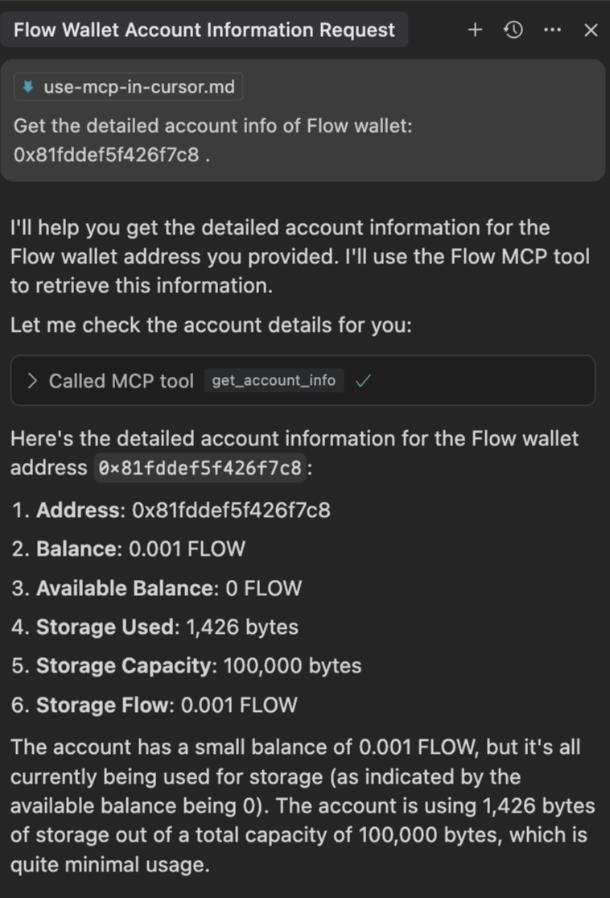
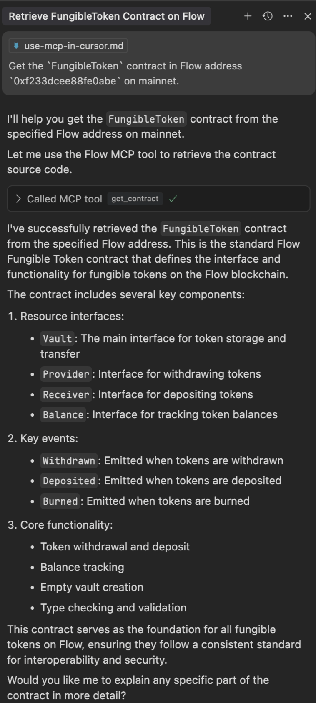

# Use Flow MCP in Cursor

<div style={{ position: 'relative', paddingBottom: '56.25%', height: 0, overflow: 'hidden', maxWidth: '100%' }}>
  <iframe 
    style={{ position: 'absolute', top: 0, left: 0, width: '100%', height: '100%' }}
    src="https://www.youtube.com/embed/itRSTL2co-0" 
    title="YouTube video player" 
    frameborder="0" 
    allow="accelerometer; autoplay; clipboard-write; encrypted-media; gyroscope; picture-in-picture" 
    allowfullscreen
  ></iframe>
</div>

Adding Flow MCP to Cursor gives you powerful AI-driven tools directly inside your code editor. It allows Cursor's AI to understand, query, and interact with Flow blockchain data and smart contracts through a standard protocol called the Model Context Protocol (MCP).

Specifically, it lets you:

- Ask the AI in Cursor to fetch onchain data such as account balances, account information, or contract source code without leaving your editor.
- Speed up development by letting AI perform blockchain queries that would normally require manual steps.
- Improve context for AI assistance by allowing Cursor to pull real blockchain data when needed.
- Automate routine Flow tasks using tools exposed by the MCP server.
- Prototype and debug faster with direct access to live blockchain information.

This tutorial will guide you through setting up and using Flow MCP in [Cursor] to enhance your Flow blockchain development experience with AI assistance.

## Learning objectives

After you complete this tutorial, you should be able to:

- Configure Cursor to connect with the Flow MCP server using the MCP protocol.
- Install and launch the Flow MCP server locally through Cursor.
- Identify when Flow MCP tools successfully load and are ready inside Cursor.
- Use Flow MCP tools to retrieve blockchain data such as account balances, account details, and contract source code.
- Troubleshoot common setup and connectivity issues between Cursor and Flow MCP.

## Prerequisites

- [Cursor] - the AI code editor.
- [Flow MCP GitHub Repository] - the Flow MCP server repository.

## Installation

1. Open Cursor Settings and go to the "MCP" tab.

   

2. Configure the MCP configuration file in Cursor:

   The MCP configuration file is located at the following location based on your operating system:

   - macOS: `~/Library/Application Support/Claude/mcp.json`
   - Windows: `%APPDATA%/Claude/mcp.json`
   - Linux: `~/.config/Claude/mcp.json`

   Add the following configuration:

   ```json
   {
     "mcpServers": {
       "flow-mcp": {
         "command": "npx",
         "args": ["-y", "@outblock/flow-mcp"]
       }
     }
   }
   ```

3. Restart Cursor to load the new MCP configuration.

   You need to wait for the MCP server to start. After it's ready, a green spot appears in the left side of `flow-mcp` server name label, and all tools for Flow MCP display.

   

## How to use Flow MCP in Cursor

### Check Flow balance



### View account information



### Get contract source code



## Troubleshooting

If you encounter any issues:

1. Ensure the MCP server is properly installed.
2. Verify the configuration file is in the correct location.
3. Check that the paths in the configuration are correct.
4. Try restarting Cursor.
5. Check the console for any error messages.

## Additional Resources

- [Flow MCP GitHub Repository]
- [Cursor Documentation]
- [Flow Documentation]

## Support

For issues or questions:

- Open an issue on the [Flow MCP GitHub Repository].
- Join the [Flow Discord] community.

[Cursor]: https://www.cursor.com/
[Flow MCP GitHub Repository]: https://github.com/outblock/flow-mcp
[Cursor Documentation]: https://cursor.sh/docs
[Flow Documentation]: https://developers.flow.com/
[Flow Discord]: https://discord.gg/flow
