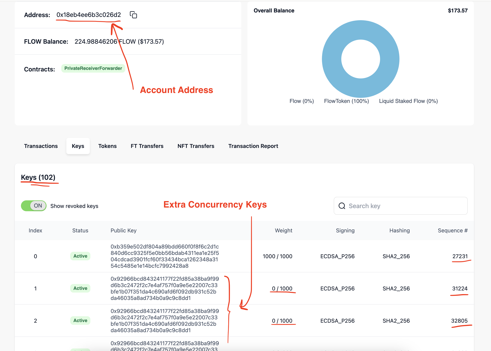

# Executing Concurrent Transactions from a Single Account

Flow is designed for the consumer internet scale and is one of the fastest blockchains in the world. Transaction traffic on deployed contracts can be categorized into two groups:

1. **User Transactions:** This includes transactions that are initiated by users. Examples of this include:
   - Buying or selling NFTs
   - Transferring tokens
   - Swapping tokens on DEXs
   - Staking or unstaking tokens

   In this category, every transaction originates from a different account and is sent to the Flow network from a different machine. Developers are not required to do anything special to scale for this category, other than making sure their logic is mostly onchain and their systems (like frontend, backend, etc.) can scale if they become bottlenecks. Flow handles scaling for this category as part of the protocol.

2. **System Transactions:** This includes any transactions that are initiated by the app backend or various tools. Examples of this category include:
   - Minting 1000s of tokens from a single Minter
   - Creating a Transaction worker for custodians
   - Runnig maintenance jobs and batch operations

   In this category, many transactions originate from the same account and are sent to the Flow network from the same machine. Scaling transactions from a single account can be tricky. This guide is focused on this type of scaling.

In this guide, we'll explore how to execute concurrent transactions from a single account on Flow using multiple proposer keys.

Please note that this guide only applies to non-EVM transactions as for EVM transactions you can use any EVM-compatible strategy to scale.

## Problem

Blockchains use sequence numbers, aka nonces, per transaction to prevent [replay attacks](https://en.wikipedia.org/wiki/Replay_attack) and enable users to specify transaction ordering. The Flow network expects a specific sequence number for each incoming transaction and it will reject the transaction if the sequence number is not the exact next number. This will be problematic to scaling because if you send multiple transactions there's no guarantee that the order they will be executed will match the order that they were sent. This is core to Flow's MEV resistance as transaction ordering is randomized per block. When an out-of-order transaction is received by the network, an error message like this will be returned:
```
* checking sequence number failed: [Error Code: 1007] invalid proposal key: public key X on account 123 has sequence number 7, but given 6
```
Our goal is to run several concurrent transactions without running into the above error. While designing our solution, we must consider the following:

- **Reliability:** We ideally like to avoid local sequence number management as it's error prone. In a local sequence number implementation, the sender has to know which error types increase the sequence number and which do not. For example, network issues do not increase the sequence number, but application errors do. Additionally, if the sender is out of sync with the network, multiple transactions can fail.

  The most reliable way to manage sequence numbers is to ask the network what the latest number is before signing and sending a transaction.

- **Scalability:** Having several workers manage the same sequence number can lead to coupling and synchroniztion issues. We would like to decouple our workers so they can work independantly.

- **Queue Support:** Guaranteeing no errors means that the system needs to know when it is at capacity. Extra transactions should be queued up and executed when there is enough throughput to do so. Fire and forget strategies are not reliable with arbitrary traffic since they don't know when they are at capacity.

## Solution

Flow's transaction model introduces a new role called the proposer. Each Flow transaction is signed by 3 roles: authorizer, proposer, and payer. The proposer key is used to determine the sequence number for the transaction. In this way, the sequence number is decoupled from the transaction authorizer and can be scaled independently. You can learn more about this [here](https://developers.flow.com/build/basics/transactions#proposal-key).

We can leverage this concept to build the ideal system transaction architecture:

* Flow accounts can have multiple keys. We can assign a different proposer key to each worker, so that each worker can manage its own sequence number independently from other workers.

* Each worker can guarantee the correct sequence number by fetching the latest sequence number from the network. Since workers use different proposer keys, they will not conflict with each other or run into synchronization issues.

* Each worker grabs a transaction request from the incoming requests queue, signs it with it's assigned proposer key, and sends it to the network. The worker will remain busy until the transaction is finalized by the network.

* When all workers are busy, the incoming requests queue will hold the remaining requests until there is enough capacity to execute them.

* We can further optimize this by re-adding the same key multiple times to the same account. This way, we can avoid generating new cryptographic keys for each worker. These new keys can have 0 weight since they never authorize transactions.

Here's a screenshot of how such an [account](https://www.flowdiver.io/account/0x18eb4ee6b3c026d2?tab=keys) can look like:



You can see that the account has extra weightless keys for proposal with their own independent sequence numbers.

In the next section, we'll demonstrate how to implement this architecture using the Go SDK.

## Example Implementation

An example implementation of this architecture can be found in this [Go SDK Example](https://github.com/onflow/flow-go-sdk/blob/master/examples/transaction_scaling/main.go).

This example deploys a simple `Counter` contract:

```cadence
access(all) contract Counter {

    access(self) var count: Int

    init() {
        self.count = 0
    }

    access(all) fun increase() {
        self.count = self.count + 1
    }

    access(all) view fun getCount(): Int {
        return self.count
    }
}
```

The goal is to hit the `increase()` function 420 times concurrently from a single account. By adding 420 concurrency keys and using 420 workers, we should be able to execute all these transactions roughly at the same time.

Please note that you need to create a new testnet account to run this example. You can do this by running the following command:

```bash
flow keys generate
```

You can create a new testnet account with the generated link with the [faucet](https://testnet-faucet.onflow.org/create-account).

When the example starts, we'll deploy the `Counter` contract to the account and add 420 proposer keys to it:

```cadence
transaction(code: String, numKeys: Int) {

    prepare(signer: auth(AddContract, AddKey) &Account) {
        // deploy the contract
        signer.contracts.add(name: "Counter", code: code.decodeHex())

        // copy the main key with 0 weight multiple times
        // to create the required number of keys
        let key = signer.keys.get(keyIndex: 0)!
        var count: Int = 0
        while count < numKeys {
            signer.keys.add(
                publicKey: key.publicKey,
                hashAlgorithm: key.hashAlgorithm,
                weight: 0.0
            )
            count = count + 1
        }
    }
}
```

We will then proceed to run the workers concurrently, grabbing a transaction request from the queue and executing it:

```go
// populate the job channel with the number of transactions to execute
txChan := make(chan int, numTxs)
for i := 0; i < numTxs; i++ {
    txChan <- i
}

startTime := time.Now()

var wg sync.WaitGroup
// start the workers
for i := 0; i < numProposalKeys; i++ {
    wg.Add(1)

    // worker code
    // this will run in parallel for each proposal key
    go func(keyIndex int) {
        defer wg.Done()

        // consume the job channel
        for range txChan {
            fmt.Printf("[Worker %d] executing transaction\n", keyIndex)

            // execute the transaction
            err := IncreaseCounter(ctx, flowClient, account, signer, keyIndex)
            if err != nil {
                fmt.Printf("[Worker %d] Error: %v\n", keyIndex, err)
                return
            }
        }
    }(i)
}

close(txChan)

// wait for all workers to finish
wg.Wait()
```

The next important bit is the `IncreaseCounter` function. This function will execute the `increase()` function on the `Counter` contract. It will fetch the latest sequence number from the network, sign the transaction with the correct proposer key, and send it to the network.

```go
// Increase the counter by 1 by running a transaction using the given proposal key
func IncreaseCounter(ctx context.Context, flowClient *grpc.Client, account *flow.Account, signer crypto.Signer, proposalKeyIndex int) error {
	script := []byte(fmt.Sprintf(`
		import Counter from 0x%s

		transaction() {
			prepare(signer: &Account) {
				Counter.increase()
			}
		}

	`, account.Address.String()))

	tx := flow.NewTransaction().
		SetScript(script).
		AddAuthorizer(account.Address)

	// get the latest account state including the sequence number
	account, err := flowClient.GetAccount(ctx, flow.HexToAddress(account.Address.String()))
	if err != nil {
		return err
	}
	tx.SetProposalKey(
		account.Address,
		account.Keys[proposalKeyIndex].Index,
		account.Keys[proposalKeyIndex].SequenceNumber-1,
	)

	return RunTransaction(ctx, flowClient, account, signer, tx)
}
```

Note that the above code is executed concurrently for each worker. Since each worker is operating on a different proposer key, they will not conflict with each other or run into synchronization issues.

Lastly, `RunTransaction` is a helper function that sends the transaction to the network and waits for it to be finalized. Please note that the proposer key sequence number is set in `IncreaseCounter` before calling `RunTransaction`.

```go
// Run a transaction and wait for it to be sealed. Note that this function does not set the proposal key.
func RunTransaction(ctx context.Context, flowClient *grpc.Client, account *flow.Account, signer crypto.Signer, tx *flow.Transaction) error {
	latestBlock, err := flowClient.GetLatestBlock(ctx, true)
	if err != nil {
		return err
	}
	tx.SetReferenceBlockID(latestBlock.ID)
	tx.SetPayer(account.Address)

	err = SignTransaction(ctx, flowClient, account, signer, tx)
	if err != nil {
		return err
	}

	err = flowClient.SendTransaction(ctx, *tx)
	if err != nil {
		return err
	}

	txRes := examples.WaitForSeal(ctx, flowClient, tx.ID())
	if txRes.Error != nil {
		return txRes.Error
	}

	return nil
}
```

Running the example will run 420 transactions at the same time:

```bash
→ cd ./examples
→ go run ./transaction_scaling/main.go
.
.
.
Final Counter: 420
✅ Done! 420 transactions executed in 11.695372059s
```

It takes roughly the time of 1 transaction to run all 420 without any errors.