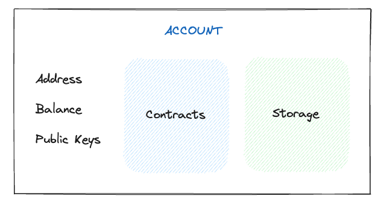
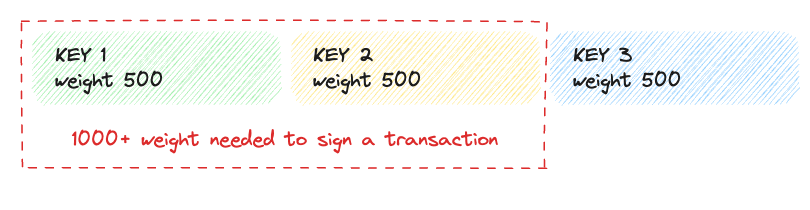
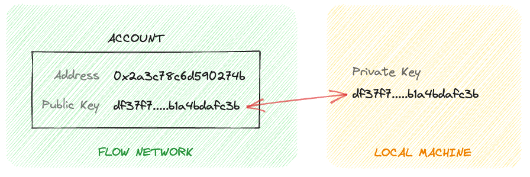
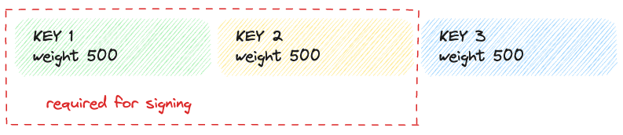
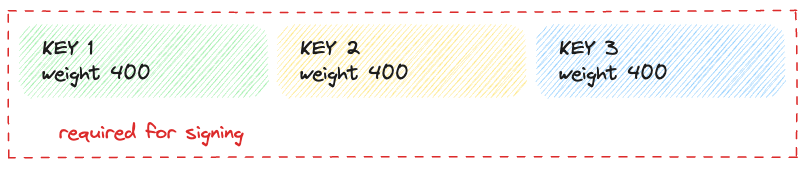
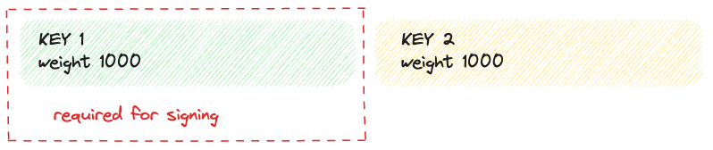

:::info

Are you an EVM developer looking for information about EVM Accounts on Flow? If so, check out the EVM specific documentation [here](../../../build/evm/accounts.md)

:::

# Accounts

An account on Flow is a record in the chain state that holds the following information:

- Address: unique identifier for the account.
- Public Keys: public keys authorized on the account.
- Code: Cadence contracts deployed to the account.
- Storage: area of the account used to store resource assets.

Accounts and their keys are needed to sign transactions that change the Flow blockchain state. To execute a transaction, a small amount of Flow, called a ["Fee"] must be paid by the account or subsidized by a wallet or service. Flow allocates a [fixed amount of storage] to each account to save data structures and Resources. An account may also contain contract code which transactions and scripts can interact with to query or mutate the state of the blockchain.

A simple representation of an account:



## Address

A Flow address is represented as 16 hex-encoded characters (usually prefixed with `0x` to indicate hex encoding). Unlike Bitcoin and Ethereum, Flow addresses are not derived from cryptographic public keys. Instead, each Flow address is assigned by the Flow protocol via an onchain deterministic sequence. The sequence uses an error detection code to guarantee that all addresses differ with at least two hex characters. This makes typos that result in accidental loss of assets impossible.

This decoupling is a unique advantage of Flow, as it allows for multiple public keys to be associated with one account, or for a single public key to be used across several accounts.

## Balance

Each Flow account created on Mainnet will by default [hold a Flow vault that holds a balance and is part of the FungibleToken standard]. This balance is used to pay for [transaction fees and storage fees].

:::warning

The minimum amount of FLOW an account can have is **0.001**.

:::

This minimum storage fee is provided by the account creator and covers the cost of storage up to 100kB of data in perpetuity. This fee is applied only once and can be "topped up" to add additional storage to an account. The minimum account reservation ensures that most accounts won't run out of storage capacity if anyone deposits anything (like an NFT) to the account.

### Maximum available balance

Due to the storage restrictions, there is a maximum available balance that user can withdraw from the wallet. The core contract [`FlowStorageFees`] provides a function to retrieve that value:

```cadence
import "FlowStorageFees"

access(all) fun main(accountAddress: Address): UFix64 {
  return FlowStorageFees.defaultTokenAvailableBalance(accountAddress)
}
```

Alternatively developers can use `availableBalance` property of the `Account`

```cadence
access(all) fun main(address: Address): UFix64 {
  let acc = getAccount(address)
  let balance = acc.availableBalance

  return balance
}

```

## Contracts

An account can optionally store multiple [Cadence contracts]. The code is stored as a human-readable UTF-8 encoded string which makes it easy for anyone to inspect the contents.

## Storage

Each Flow account has an associated storage and capacity. The account's storage used is the byte size of all the data stored in the account's storage. An account's [storage capacity is directly tied to the balance of Flow tokens] an account has. An account can, without any additional cost, use any amount of storage up to its storage capacity. If a transaction puts an account over storage capacity or drops an account's balance below the minimum 0.001 Flow tokens, that transaction fails and reverts.

## Account **keys**

Flow accounts can be configured with multiple public keys that are used to control access. Owners of the associated private keys can sign transactions to mutate the account's state.

During account creation, public keys can be provided which will be used when owners interact with the account. You can send a transaction to add, remove, or revoke account keys. This is radically different from blockchains like Ethereum where an account is tied to a single public/private key pair.

Each account key has a weight that determines the signing power it holds.

:::warning

A transaction is not authorized to access an account unless it has a total signature weight greater than or equal to **1000**, the weight threshold.

:::

For example, an account might contain three keys, each with 500 weight:



This represents a 2-of-3 multi-sig quorum, in which a transaction is authorized to access the account if it receives signatures from _at least_ two out of three keys.

An account key contains the following attributes:

- **ID** used to identify keys within an account.
- **Public Key** raw public key (encoded as bytes).
- **Signature algorithm** (see below).
- **Hash algorithm** (see below).
- **Weight** integer between 0-1000.
- **Revoked** whether the key has been revoked or it's active.
- **Sequence Number** is a number that increases with each submitted transaction signed by this key.

### Signature and hash algorithms

The signature and hashing algorithms are used during the transaction signing process and can be set to certain predefined values.

There are two curves commonly used with the ECDSA algorithm, secp256r1 ([OID 1.2.840.10045.3.1.7], also called the "NIST P-256." this curve is common for mobile secure enclave support), and secp256k1 ([OID 1.3.132.0.10], the curve used by "Bitcoin"). Be sure to double-check which parameters you use before you register a key, because if you present a key that uses one of the curves under the code and format of the other, an error will occur.

| Algorithm | Curve     | ID              | Code |
| --------- | --------- | --------------- | ---- |
| ECDSA     | P-256     | ECDSA_P256      | 2    |
| ECDSA     | secp256k1 | ECDSA_secp256k1 | 3    |

_Note that the codes listed here are for the signature algorithms as used by the node API, and they are different from the ones [defined in Cadence]_

| Algorithm | Output Size | ID       | Code |
| --------- | ----------- | -------- | ---- |
| SHA-2     | 256         | SHA2_256 | 1    |
| SHA-3     | 256         | SHA3_256 | 3    |

Both hashing and signature algorithms are compatible with each other, so you can freely choose from the set.

### **Locked / keyless accounts**

An account on Flow doesn't require keys in order to exist, but this makes the account immutable since no transaction can be signed that can change the account. This can be useful if we want to freeze an account contract code and it elegantly solves the problem of when you have multiple account types (as that is the case for Ethereum).



To achieve keyless accounts, you can remove a public key from an account signing with that same key and repeat that action until an account has no keys left. You can also create a new account that has no keys assigned. With account linking, you can also have a child account that has no keys, but that the parent controls.

:::danger

Be careful when you remove keys from an account, because after an account's total key weights sum to less than 1000, it can no longer be modified.

:::

### **Multi-sig accounts**

To create a multi-signature account, you can manage the account keys and their corresponding weight. To repeat, in order to sign a transaction the keys used to sign it must have weights that sum up to at least 1000. With this information, we can easily see how we can achieve the following cases:

#### 2-of-3 multi-sig quorum



#### 3-of-3 multi-sig quorum



#### 1-of-2 signature



### Key format

We support ECDSA with the curves `P-256` and `secp256k1`. For these curves, the public key is encoded into 64 bytes as `X||Y` where `||` is the concatenation operator.

- `X` is 32 bytes and is the big endian byte encoding of the `x`-coordinate of the public key padded to 32, i.e. `X=x_31||x_30||...||x_0` or `X = x_31*256^31 + ... + x_i*256^i + ... + x_0`.
- `Y` is 32 bytes and is the big endian byte encoding of the `y`-coordinate of the public key padded to 32, i.e. `Y=y_31||y_30||...||y_0` or `Y = y_31*256^31 + ... + y_i*256^i + ... + y_0`

## Account creation

To create accounts on the Flow blockchain, we call a special [create account Cadence function]. After an account is created, we can associate a new key with that account. Of course, all that can be done within a single transaction. Keep in mind that there is an account creation fee that needs to be paid. Account creation fees are relatively low, and we expect that wallet providers and exchanges will cover the cost when a user converts fiat to crypto for the first time.

For development purposes, [you can use Flow CLI to easily create emulator, testnet and mainnet accounts]. The account creation fee is paid by a funding wallet, so you don't need a pre-existing account to create it.

### **Key generation**

You should generate keys in a secure manner, and take different levels of caution for each key's purpose. 

:::warning

Anyone who obtains access to a private key can modify the account the key is associated with (assuming it has enough weight). Be very careful how you store the keys.

:::

For secure production keys, we suggest that you use key management services such as [Google key management] or [Amazon KMS], which are also supported by our CLI and SDKs. Those services are mostly great when integrated into your application. However, for personal use, you can securely use any [existing wallets] as well as a [hardware Ledger wallet].

## Service accounts

### Flow Service Account

The Service Account is a special account in Flow that has special permissions to manage system contracts. It is able to mint tokens, set fees, and update network-level contracts.

### Tokens  and fees

The Service Account has administrator access to the FLOW token smart contract, so it has authorization to mint and burn tokens. It also has access to the transaction fee smart contract and can adjust the fees charged for transactions execution on Flow.

### Network management

The Service Account administers other smart contracts that manage various aspects of the Flow network, such as epochs and (in the future) validator staking auctions.

### Governance

Besides its special permissions, the Service Account is an account like any other in Flow. The service account is currently controlled by a smart contract governed by the Flow community. No single entity has the ability to unilaterally execute a transaction from the service account because it requires four signatures from controlling keys. The Flow foundation only controls three of the keys and the others are controlled by trusted community members and organizations.

## Accounts retrieval

You can use the Flow Command Line Interface (CLI) to get account data. To do this, run the following command:

```sh
flow accounts get 0xf919ee77447b7497 -n mainnet
```

Find [more about the command in the CLI docs].

Accounts can be obtained from the access node APIs, currently, there are two gRPC and REST APIs. You can find more information about them here:

**gRPC API** [building-on-flow/nodes/access-api#accounts]

**REST API** [http-api#tag/Accounts]

There are multiple SDKs implementing the above APIs for different languages:

**Javascript SDK** [tools/clients/fcl-js]

**Go SDK** [tools/clients/flow-go-sdk]

Find a list of all SDKs here: [tools/clients]

<!-- Relative links, will not render on page -->

["Fee"]: ./fees.md
[fixed amount of storage]: ./fees.md#storage
[hold a Flow vault that holds a balance and is part of the FungibleToken standard]: ./flow-token.md
[transaction fees and storage fees]: ./fees.md
[`FlowStorageFees`]: ../core-contracts/05-flow-fees.md#flowstoragefees
[Cadence contracts]: https://cadence-lang.org/docs/language/contracts
[storage capacity is directly tied to the balance of Flow tokens]: ./fees.md#storage
[OID 1.2.840.10045.3.1.7]: http://oid-info.com/get/1.2.840.10045.3.1.7
[OID 1.3.132.0.10]: http://oid-info.com/get/1.3.132.0.10
[defined in Cadence]: https://cadence-lang.org/docs/language/crypto#signing-algorithms
[create account Cadence function]: https://cadence-lang.org/docs/language/accounts#account-creation
[you can use Flow CLI to easily create emulator, testnet and mainnet accounts]: ../../../build/tools/flow-cli/accounts/create-accounts.md
[Google key management]: https://cloud.google.com/security-key-management 
[Amazon KMS]: https://docs.aws.amazon.com/AmazonRDS/latest/UserGuide/Overview.Encryption.Keys.html
[existing wallets]: ../../../ecosystem/wallets.md
[hardware Ledger wallet]: ../../../ecosystem/wallets.md)
[more about the command in the CLI docs]: ../../../build/tools/flow-cli/accounts/get-accounts.md
[building-on-flow/nodes/access-api#accounts]: ../../../protocol/access-onchain-data/index.md#accounts
[http-api#tag/Accounts]: /http-api#tag/Accounts
[tools/clients/fcl-js]: ../../../build/tools/clients/fcl-js/index.md
[tools/clients/flow-go-sdk]: ../../../build/tools/clients/flow-go-sdk/index.md
[tools/clients]: ../../../build/tools/clients/index.md