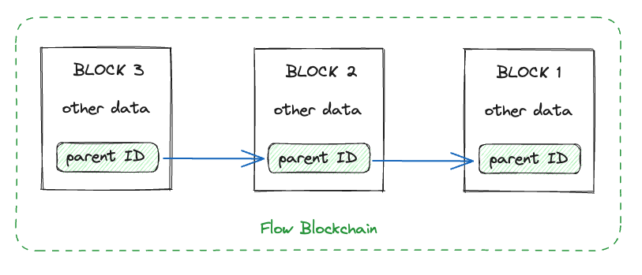
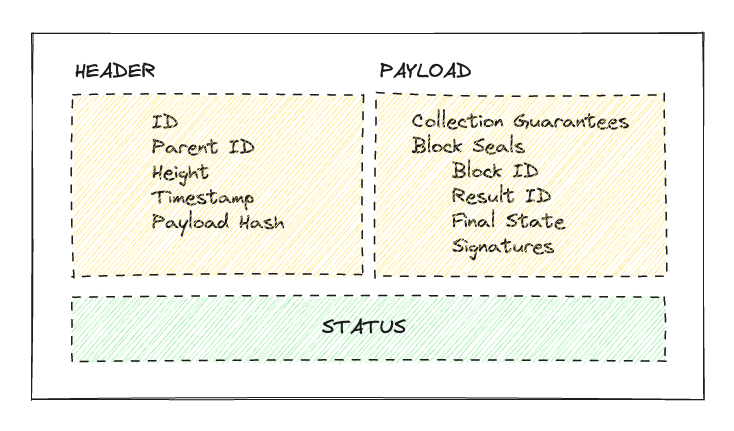
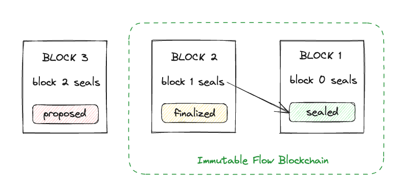

# Blocks

## Overview

Blocks are entities that make up the Flow blockchain. Each block contains a list of [transactions](./transactions.md) that were executed and as a result, changed the global blockchain state. Each block is identified by a unique ID which is a cryptographic hash of the block contents. Block also includes a link to the parent block ID creating a linked list of blocks called the Flow blockchain.

The unique block ID serves as proof of the block contents which can be independently validated by any observer. Interesting cryptographic properties of the hash that make up the block ID guarantee that if any change is made to the block data it would produce a different hash and because blocks are linked, a different hash would break the link as it would no longer be referenced in the next block.

A very basic representation of blocks is:



Blocks are ordered starting from the genesis block 0 up to the latest block. Each block contains an ordered list of transactions. This is how the Flow blockchain preserves the complete history of all the changes made to the state from the beginning to the current state.

Each block contains more data which is divided into **block header** and **block payload**. There are many representations of block data within the Flow protocol. APIs, node types, and specific components within the node may view a block from differing perspectives. For the purpose of this documentation, we will talk about block data we expose through APIs to the clients.



### Block Header

The Block header contains the following fields:

- **ID** represents the block's unique identifier, which is derived from the hashing block header including the payload hash. The algorithm used on Flow to hash the content and get an identifier is SHA3 256. This ID is a commitment to all the values in the block staying the same.
- **Parent ID** is a link to the previous block ID in the list making up the blockchain.
- **Height** is the block sequence number, where block 0 was the first block produced, and each next block increments the value by 1.
- **Timestamp** is the timestamp at which this block was proposed by the consensus node. Depending on your use case this time might not be accurate enough, [read more about measuring time on the Flow blockchain](https://cadence-lang.org/docs/measuring-time#time-on-the-flow-blockchain).
- **Payload Hash** represents the payload hash that is included when producing the ID of the block. Payload hash is calculated by taking Merkle root hashes of collection guarantees, seals, execution receipts, and execution results and hashing them together. More on each of the values in the block payload section.

### Block Payload

The block payload contains the following fields:

- **Collection Guarantees** is a list of collection IDs with the signatures from the collection nodes that produced the collections. This acts as a guarantee by collection nodes that [transaction data](./transactions.md) in the collection will be available on the collection node if requested by other nodes at a later time. Flow purposely skips including transaction data in a block, making blocks as small as possible, and the production of new blocks by consensus nodes fast, that is because consensus nodes have to sync the proposed block between nodes, and that data should be the smallest possible. The consensus nodes don't really care what will a transaction do as long as it's valid, they only need to define an order of those transactions in a block.
- **Block Seals** is the attestation by verification nodes that the transactions in a previously executed block have been verified. This seals a previous block referenced by the block ID. It also references the result ID and execution root hash. It contains signatures of the verification nodes that produced the seal.

## Lifecycle and Status

Block status is not a value stored inside the block itself but it represents the lifecycle of a block. We derive this value based on the block inclusion in the Flow blockchain and present it to the user as it acts as an important indicator of the finality of the changes the block contains.

Here we'll give an overview of the different phases a block goes through. [More details can be found in the whitepaper](https://flow.com/technical-paper). Also, a lot of the block states are not necessarily important to the developer but only important to the functioning of the Flow blockchain.

New blocks are constantly being proposed even if no new transactions are submitted to the network. Consensus nodes are in charge of producing blocks. They use a consensus algorithm (an implementation of HotStuff) to agree on what the new block will be. A block contains the ordered list of collections and each collection contains an ordered list of transactions. This is an important fact to reiterate. A block serves as a list of transitions to the Flow state machine. It documents, as an ordered list, all the changes transactions will make to the state.

A block that is [agreed upon by the consensus nodes using an implementation of HotStuff consensus algorithm](https://arxiv.org/pdf/2002.07403.pdf) to be the next block is **finalized**. This means the block won't change anymore and it will next be executed by the execution node. Please be careful because until a block is **sealed** the changes are not to be trusted. After verification nodes validate and agree on the correctness of execution results, a block is sealed and consensus nodes will include these seals in the new block.

In summary, a block can be either **finalized** which guarantees transactions included in the block will stay the same and will be executed, and **sealed** which means the block execution was verified.



## Block Retrieval

You can use the Flow CLI to get the block data by running:

```sh
flow blocks get latest -network mainnet
```

Find [more about the command in the CLI docs](../../../build/tools/flow-cli/get-flow-data/get-blocks.md).

Blocks can be obtained from the access node APIs, currently, there are two gRPC and REST APIs. You can find more information about them here:

[**gRPC Block API**](../../../networks/access-onchain-data/index.md#blocks)

[**REST Block API**](/http-api#tag/Blocks)

There are multiple SDKs implementing the above APIs for different languages:

[**Javascript SDK**](../../../build/tools/clients/fcl-js/index.md)

[**Go SDK**](../../../build/tools/clients/flow-go-sdk/index.md)

Find a list of all SDKs [here](../../../build/tools/clients/index.md)
