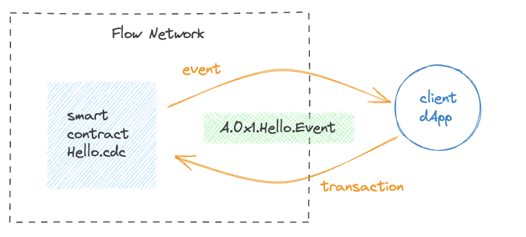

# Events

Flow events are special values that are emitted on the network during the execution of a Cadence program and can be observed by off-chain observers.

Events are defined as Cadence code and you should [read Cadence documentation](https://cadence-lang.org/docs/language/events) to understand how to define them.

Since transactions don't have return values you can leverage events to broadcast certain changes the transaction caused. Clients listening on Flow networks (apps) can listen to these events being emitted and react.



There are two types of events emitted on the Flow network:

- Core events
- User-defined events

Events consist of the **event name** and an optional **payload**.


## Core Events

Core events are events emitted directly from the FVM (Flow Virtual Machine). The events have the same name on all networks and do not follow the same naming as user-defined events (they have no address).

A list of events that are emitted by the Flow network is:

| Event Name                  | Description                                                             |
| --------------------------- | ----------------------------------------------------------------------- |
| flow.AccountCreated         | Event that is emitted when a new account gets created.                  |
| flow.AccountKeyAdded        | Event that is emitted when a key gets added to an account.              |
| flow.AccountKeyRemoved      | Event that is emitted when a key gets removed from an account.          |
| flow.AccountContractAdded   | Event that is emitted when a contract gets deployed to an account.      |
| flow.AccountContractUpdated | Event that is emitted when a contract gets updated on an account.       |
| flow.AccountContractRemoved | Event that is emitted when a contract gets removed from an account.     |
| flow.InboxValuePublished    | Event that is emitted when a Capability is published from an account.   |
| flow.InboxValueUnpublished  | Event that is emitted when a Capability is unpublished from an account. |
| flow.InboxValueClaimed1     | Event that is emitted when a Capability is claimed by an account.       |

For more details [on the core events, you can read Cadence reference documentation](https://cadence-lang.org/docs/language/core-events).

## User-defined events

Events that are defined inside contracts and when emitted follow a common naming schema. The schema consists of 4 parts:

```cadence
A.{contract address}.{contract name}.{event type}
```

An example event would look like:


The first `A` means the event is originating from a contract, which will always be the case for user-defined events. The contract address as the name implies is the location of a contract deployed on the Flow network. Next, is the name of the contracted event originates from, and last is the event type defined in the contract.

There is an unlimited amount of events that can be defined on Flow, but you should know about the most common ones.

### Fungible Token Events

All fungible token contracts, including [The FLOW Token contract](../../../build/cadence/core-contracts/03-flow-token.md),
use the [fungible token standard on Flow](../../../build/cadence/core-contracts/02-fungible-token.md).
As with any contract, the standard emits events when interacted with.
When any fungible token is transferred, standard events are emitted.
You can find a lot of details on the events emitted in the [Fungible Token documentation](../../../build/cadence/core-contracts/02-fungible-token.md).

The most common events are when tokens are transferred which is accomplished with two actions: withdrawing tokens from the payer and depositing tokens in the receiver. Each of those actions has a corresponding event:

**Withdraw Tokens**

Event name: `FungibleToken.Withdrawn`

```cadence
event Withdrawn(type: String,
                amount: UFix64,
                from: Address?,
                fromUUID: UInt64,
                withdrawnUUID: UInt64,
                balanceAfter: UFix64)
```

Mainnet event: `A.f233dcee88fe0abe.FungibleToken.Withdrawn`

Testnet event: `A.9a0766d93b6608b7.FungibleToken.Withdrawn`

**Deposit Tokens**

```cadence
event Deposited(type: String,
                amount: UFix64,
                to: Address?,
                toUUID: UInt64,
                depositedUUID: UInt64,
                balanceAfter: UFix64)
```

Event name: `FungibleToken.Deposited`

Mainnet event: `A.f233dcee88fe0abe.FungibleToken.Deposited`

Testnet event: `A.9a0766d93b6608b7.FungibleToken.Deposited`

### **Fee Events**

Since fees are governed by a contract deployed on the Flow network, that contract also emits events when fees are deducted.

Charging fees consists of a couple of steps:

- Calculate and deduct fees
- Withdraw Flow tokens from the payer account
- Deposit Flow tokens to the fees contract

These events are very common since they accommodate all transactions on Flow. Each fee deduction will result in three events: the withdrawal of Flow tokens, the deposit of Flow tokens, and the fee deduction.

An example of fee events:

```yml
Events:
  - Index: 0
    Type: A.f233dcee88fe0abe.FungibleToken.Withdrawn
    Tx ID: 1ec90051e3bc74fc36cbd16fc83df08e463dda8f92e8e2193e061f9d41b2ad92
    Values:
      - type (String): '1654653399040a61.FlowToken.Vault'
      - amount (UFix64): 0.00000100
      - from (Address?): b30eb2755dca4572

  - Index: 1
    Type: A.f233dcee88fe0abe.FungibleToken.Deposited
    Tx ID: 1ec90051e3bc74fc36cbd16fc83df08e463dda8f92e8e2193e061f9d41b2ad92
    Values:
      - type (String): '1654653399040a61.FlowToken.Vault'
      - amount (UFix64): 0.00000100
      - to (Address?): f919ee77447b7497

  - Index: 2
    Type: A.f919ee77447b7497.FlowFees.FeesDeducted
    Tx ID: 1ec90051e3bc74fc36cbd16fc83df08e463dda8f92e8e2193e061f9d41b2ad92
    Values:
      - amount (UFix64): 0.00000100
      - inclusionEffort (UFix64): 1.00000000
      - executionEffort (UFix64): 0.00000000
```
