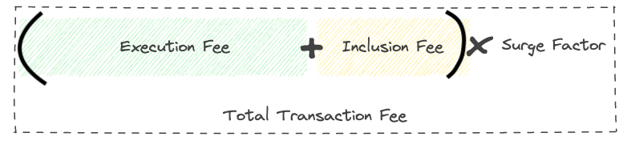
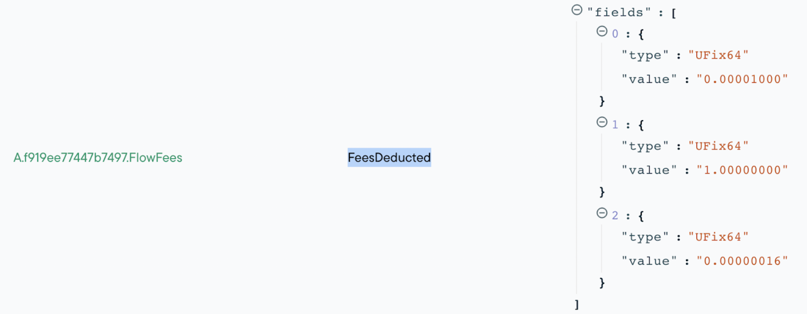

:::info

Are you an EVM developer looking for information about EVM Accounts on Flow? If so, check out the EVM specific documentation [here](../../../build/evm/fees.md)

:::

# Fees

## Transaction Fees

A transaction fee is a cost paid in Flow by the payer account and is required for a transaction to be included in the Flow blockchain. Fees are necessary for protecting the network against spam/infinite running transactions and to provide monetary incentives for participants that make up the Flow network.

A transaction fee is paid regardless of whether a transaction succeeds or fails. If the payer account doesn't have sufficient Flow balance to pay for the transaction fee, the transaction will fail. We can limit the transaction fee to some extent by providing the gas limit value when submitting the transaction.

### Understanding the need for transaction fees

Segmented transaction fees are essential to ensure fair pricing based on the impact on the network. For instance, more heavy operations will require more resources to process and propagate transactions. Common operations, however, will stay reasonably priced.

Fees will improve the overall security of the network by making malicious actions (eg spam) on the network less viable.

The unique Flow architecture is targeted at high throughput. It makes it easier to have slack in the system, so short spikes can be handled more gracefully.

### **Fee Structure**

Each transaction fee consists of three components: execution fee, inclusion fee, and network surge factor.



**Execution Fee**

The execution effort for a transaction is determined by the code path the transaction takes and the actions it does. The actions that have an associated execution effort cost can be separated into four broad buckets:

- Normal lines of cadence, loops, or function calls
- Reading data from storage, charged per byte read
- Writing data to storage, charged per byte written
- Account creation

| Transaction Type                                   | Estimated cost (FLOW) |
| -------------------------------------------------- | --------------------- |
| FT transfer                                        | 0.00000185            |
| Mint a small NFT (heavily depends on the NFT size) | 0.0000019             |
| Empty Transaction                                  | 0.000001              |
| Add key to an account                              | 0.000001              |
| Create 1 Account                                   | 0.00000315            |
| Create 10 accounts                                 | 0.00002261            |
| Deploying a contract that is ~50kb                 | 0.00002965            |

**Inclusion Fee**

The inclusion effort of a transaction represents the work needed for:

- Including the transaction in a block
- Transporting the transaction information from node to node
- Verifying transaction signatures

Right now, the inclusion effort is always 1.0 and the inclusion effort cost is fixed to `0.000001`.

**Surge Factor**

In the future, a network surge will be applied when the network is busy due to an increased influx of transactions required to be processed or a decrease in the ability to process transactions. Right now, the network surge is fixed to `1.0`.

Currently, both the inclusion fee and surge factor don't represent any significant Flow fees. Keep in mind this can change in the future.

**Estimating transaction costs**

Cost estimation is a two-step process. First, you need to gather the execution effort with either the emulator, on testnet, or on mainnet. Second, you use the execution effort for a transaction to calculate the final fees using one of the JavaScript or Go FCL SDKs.

## Storage

Flow's approach to storage capacity is a bit similar to some banks' pricing models, where maintaining a minimum balance prevents monthly account fees. Here, the amount of data in your account determines your minimum balance. If you fall below the minimum balance, you cannot transact with your account, except for deposits or deleting data. The essence of storage fee model is that it ensures data availability without continuously charging fees for storage, while also preventing abuses that could burden the network's storage resources. This distinction between current state and blockchain history is crucial for understanding storage requirements and limitations.

Each Flow account has associated storage used. The account's storage used is the byte size of all the data stored in the account's storage. Accounts also have a storage capacity, which is directly tied to the amount of Flow tokens an account has. The account can, without any additional cost, use any amount of storage up to its storage capacity.

:::warning

If a transaction puts an account over storage capacity, that transaction fails and is reverted. Likewise, if a transaction would drop an account's balance below 0.001 Flow tokens, which is the minimum an account can have, the transaction would also fail.

:::

**Storage Capacity**

The storage capacity of an account is dictated by the amount of FLOW it has.

:::danger

The **minimum amount of FLOW an account can have is 0.001**. This minimum is provided by the account creator at account creation.

:::

The minimum account reservation ensures that most accounts won't run out of storage capacity if anyone deposits anything (like an NFT) to the account.

Currently, the amount required to store 100 MB in account storage is 1 Flow.


Please note that storing data in an account on Flow doesn't charge tokens from the account, it just makes sure you will keep the tokens as a reserve. Once the storage is freed up you can transfer the Flow tokens.

### Storage Capacity of the Payer

The storage capacity of the Payer of a transaction is generally computed the same way as the capacity of any other account, however, the system needs to account for the transaction fees the payer will incur at the end of the transaction. The final transaction fee amount is not fully known at this step, only when accounts are checked for storage compliance. If their storage used is more than their storage capacity, the transaction will fail.

Because of this, the payer's balance is conservatively considered to be lower by the maximum possible transaction fees, when checking for storage compliance. The maximum transaction fee of a specific transaction is the transaction fee as if the transaction would have used up all of its execution effort limit.

### Storage Used

All data that is in an account's storage counts towards storage used. Even when an account is newly created it is not empty. There are already some items in its storage:

- Metadata that marks that the account exists.
- An empty FLOW vault, and stored receiver capability.
- Public keys to the account if the account was created with keys.
- Smart contracts deployed on the account if the account was created with contracts.
- The value of the account's storage used as an unsigned integer.

Adding additional keys, smart contracts, capabilities, resources, etc. to the account counts towards storage used.

Data stored on the Flow blockchain is stored in a key-value ledger. Each item's key contains the address that owns the item and the path to the item. An account can have many keys, therefore flow considers the account key items are stored with. This means that the storage used by each item is the byte length of the item plus the byte length of the item's key.

### Maximum available balance

Due to the storage restrictions, there is a maximum available balance that user can withdraw from the wallet. The core contract [`FlowStorageFees`](../core-contracts/05-flow-fees.md#flowstoragefees) provides a function to retrieve that value:

```cadence
import "FlowStorageFees"

access(all) fun main(accountAddress: Address): UFix64 {
  return FlowStorageFees.defaultTokenAvailableBalance(accountAddress)
}
```

Alternatively developers can use `availableBalance` property of the `Account`

```cadence
access(all) fun main(address: Address): UFix64 {
  let acc = getAccount(address)
  let balance = acc.availableBalance

  return balance
}

```

## Practical Understanding of Fees

**Using Flow Emulator**

You can start the [emulator using the Flow CLI](../../../build/tools/emulator/index.md#running-the-emulator-with-the-flow-cli). Run your transaction and take a look at the events emitted:

```shell
0|emulator | time="2022-04-06T17:13:22-07:00" level=info msg="⭐  Transaction executed" computationUsed=3 txID=a782c2210c0c1f2a6637b20604d37353346bd5389005e4bff6ec7bcf507fac06
```

You should see the `computationUsed` field. Take a note of the value, you will use it in the next step.

**On testnet or mainnet**

Once a transaction is completed, you can use an explorer like [Flowscan](https://flowscan.io/) to review the transaction details and events emitted. For Flowscan, you can open the transaction in question and look for the event `FeesDeducted` from the [`FlowFees`](https://github.com/onflow/flow-core-contracts/blob/master/contracts/FlowFees.cdc) contract:



In the event data on the right side, you will see a set of fields representing [the fees for a specific transaction.](https://github.com/onflow/flow-core-contracts/blob/master/contracts/FlowFees.cdc#L14):

- Total Fees Paid
- Inclusion Effort
- Execution Effort

Take a note of the last value in the list - the `executionEffort` value. You will use it in the next step.

### Calculating final costs

The cost for transactions can be calculated using the following FCL scripts on mainnet/testnet respectively.

**On mainnet**

```cadence
import FlowFees from 0xf919ee77447b7497
access(all) fun main(
  inclusionEffort: UFix64,
  executionEffort: UFix64
): UFix64 {
  return FlowFees.computeFees(inclusionEffort: inclusionEffort, executionEffort: executionEffort)
}
```

**On testnet**

```cadence
import FlowFees from 0x912d5440f7e3769e
access(all) fun main(
  inclusionEffort: UFix64,
  executionEffort: UFix64
): UFix64 {
  return FlowFees.computeFees(inclusionEffort: inclusionEffort, executionEffort: executionEffort)
}
```

## Configuring execution limits

FCL SDKs allow you to set the execution effort limit for each transaction. Based on the execution effort limit determined in the previous step, you should set a reasonable maximum to avoid unexpected behavior and protect your users. The final transaction fee is computed from the actual execution effort used up to this maximum.

> **Note**: Keep in mind that the limits are not for the final fees that the user will have to pay. The limits are for the execution efforts specifically.

It is important to set a limit that isn't too high or too low. If it is set too high, the payer needs to have more funds in their account before sending the transaction. If it is too low, the execution could fail and all state changes are dropped.

**Using FCL JS SDK**

You need to set the `limit` parameter for the `mutate` function, for example:

```js
import * as fcl from "@onflow/fcl"

const transactionId = await fcl.mutate({
  cadence: `
    transaction {
      execute {
        log("Hello from execute")
      }
    }
  `,
  proposer: fcl.currentUser,
  payer: fcl.currentUser,
  limit: 100
})

const transaction = await fcl.tx(transactionId).onceExecuted();
console.log(transaction;)
```

**Using FCL Go SDK**

You need to call the `SetComputeLimit` method to set the fee limit, for example:

```go
import (
    "github.com/onflow/flow-go-sdk"
    "github.com/onflow/flow-go-sdk/crypto"
)

var (
    myAddress    flow.Address
    myAccountKey flow.AccountKey
    myPrivateKey crypto.PrivateKey
)

tx := flow.NewTransaction().
    SetScript([]byte("transaction { execute { log(\"Hello, World!\") } }")).
    SetComputeLimit(100).
    SetProposalKey(myAddress, myAccountKey.Index, myAccountKey.SequenceNumber).
    SetPayer(myAddress)
```

### Maximum transaction fees of a transaction

The maximum possible fee imposed on the payer for a transaction can be calculated as the **inclusion cost plus the execution cost**. The execution cost is the fee calculated for running the transaction based on the [execution effort limit maximum specified](#configuring-execution-limits).

The payer will never pay more than this amount for the transaction.

## Optimizing Cadence code to reduce effort

Several optimizations can lead to reduced execution time of transactions. Below is a list of some practices. This list is not exhaustive but rather exemplary.

**Limit functions calls**

Whenever you make function calls, make sure these are absolutely required. In some cases, you might be able to check prerequisites and avoid additional calls:

```cadence
for obj in sampleList {
   /// check if call is required
   if obj.id != nil {
      functionCall(obj)
   }
}
```

**Limit loops and iterations**

Whenever you want to iterate over a list, make sure it is necessary to iterate through all elements as opposed to a subset. Avoid loops to grow in size too much over time. Limit loops when possible.

```cadence
// Iterating over long lists can be costly
access(all) fun sum(list: [Int]): Int {
 var total = 0
 var i = 0
 // if list grows too large, this might not be possible anymore
 while i < list.length {
   total = total + list[i]
 }
 return total
}

// Consider designing transactions (and scripts) in a way where work can be "chunked" into smaller pieces
access(all) fun partialSum(list: [Int], start: Int, end: Int): Int {
 var partialTotal = 0
 var i = start
 while i < end {
   partialTotal = partialTotal + list[i]
 }
 return partialTotal
}
```

**Understand the impact of function calls**

Some functions will require more execution efforts than others. You should carefully review what function calls are made and what execution they involve.

```cadence
// be aware functions that call a lot of other functions
// (or call themselves) might cost a lot
access(all) fun fib(_ x: Int): Int {
 if x == 1 || x== 0 {
   return x
 }
 // + 2 function calls each recursion
 return fib(x-1) + fib(x-2)
}

// consider inlining functions with single statements, to reduce costs
access(all) fun add(_ a: Int, _ b: Int): Int {
 // single statement; worth inlining
 return a + b
}
```

**Avoid excessive load and save operations**

Avoid costly loading and storage operations and [borrow references](https://cadence-lang.org/docs/design-patterns#avoid-excessive-load-and-save-storage-operations-prefer-in-place-mutations) where possible, for example:

```cadence
transaction {

    prepare(acct: auth(BorrowValue) &Account) {

        // Borrows a reference to the stored vault, much less costly operation that removing the vault from storage
        let vault <- acct.storage.borrow<&ExampleToken.Vault>(from: /storage/exampleToken)

        let burnVault <- vault.withdraw(amount: 10)

        destroy burnVault

        // No `save` required because we only used a reference
    }
}
```

> **Note**: If the requested resource does not exist, no reading costs are charged.

**Limit accounts created per transaction**

Creating accounts and adding keys are associated with costs. Try to only create accounts and keys when necessary.

**Check user's balance before executing transactions**

You should ensure that the user's balance has enough balance to cover the highest possible fees. For FT transfers, you need to cover the amount to transfer in addition to the highest possible fees.

## Educating users

Wallets will handle the presentation of the final transaction costs but you can still facilitate the user experience by educating them within your application.

If your user is using self-custody wallets, they may have to pay the transaction and want to understand the fees. Here are some suggestions.

**Explain that costs can vary depending on the network usage**

Suggested message: "Fees improve the security of the network. They are flexible to ensure fair pricing based on the impact on the network."

**Explain that waiting for the network surge to pass is an option**

Inevitably, network surges will cause higher fees. Users who might want to submit a transaction while the network usage is surging should consider sending the transaction at a later time to reduce costs.

**Explain that the wallet might not allow the transaction due to a lack of funds**

If dynamic fees increase to the highest possible level, the user's fund might not be enough to execute the transaction. Let the users know that they should either add funds or try when the network is less busy.

## How to learn more

There are several places to learn more about transaction fees:

- [FLIP-660](https://github.com/onflow/flow/pull/660)
- [FLIP-753](https://github.com/onflow/flow/pull/753)
- [Flow Fees Contract](https://github.com/onflow/flow-core-contracts/blob/master/contracts/FlowFees.cdc)

> **Note**: If you have thoughts on the implementation of transaction fees on Flow, you can [leave feedback on this forum post](https://forum.flow.com/t/variable-transaction-fees-are-coming-to-flow/2941).

## FAQs

**When will the fee update go into effect?**

The updates were rolled out with the [Spork on April 6, 2022](../../../networks/node-ops/node-operation/past-upgrades#mainnet-17), and were enabled on [June 1st](https://forum.flow.com/t/permissionless-contract-deployment-progress/2981) during the [weekly epoch transition](https://github.com/onflow/service-account/tree/main/transactions/set-execution-effort-weights/2022/jun-1).

**Why are fees collected even when transactions fail?**

Broadcasting and verifying a transaction requires execution, so costs are deducted appropriately.

**What execution costs are considered above average?**

There is no average for execution costs. Every function will vary significantly based on the logic implemented. You should review the optimization best practices to determine if you could reduce your costs.

**Do hardware wallets like Ledger support segmented fees?**

Yes.

**What is the lowest execution cost?**

The lowest execution cost is 1. This means your transaction included one function call or loop that didn't read or write any date.

**Can I determine how much a transaction will cost on mainnet without actually paying?**

You can estimate the costs in a two-way process: 1) determine execution costs for transactions (emulator or testnet) and 2) use an FCL SDK method to calculate the final transaction fees.

**How accurate will testnet fees be to mainnet fees?**

Final fees are determined by the surge factor on the network. The surge factor for the testnet will be different from the factor for the mainnet, so you need to expect a variation between mainnet and testnet estimates.

**I use Blocto and I haven't paid any fees yet. Why is that?**

That is because Blocto is acting as the payer for transactions. Self-custody wallets may have the user pay the transaction. Additionally, apps can sponsor the transaction if they choose.

**Why would the same transaction have different fees when executed for different accounts?**

Execution costs, among other things, include the cost to read data from account storage and since the data stored varies from account to account, so does the execution costs, and subsequently the transaction fees.

Additional Details:

- The most expensive operations in Cadence are reading and writing to storage. This isn't punitive! Every read needs to be sent to all Verification nodes for verification (with Merkel proofs), and every write requires a path of Merkel hashes to be updated. Reading and writing to storage is inherently expensive on any blockchain.
- The way data is stored in accounts is as a tree (the hint is in the name "atree" :wink:). So, the more elements in the account, the more levels of the tree, and therefore the more nodes of that tree that need to be read and updated. So, looking at the byte size of an account is a decent proxy for figuring out how much it's going to cost.
- Because it's a tree, the cost of reads and writes grows with log(n), but does scale.
- atree has an update queued up for [Crescendo](https://flow.com/upgrade/crescendo) that will improve this. The previous version erred on the side of adding new levels to the tree (to keep the code simple), while the new version tries to pack more data at each level. This should result in fewer levels for the same byte size. Additionally, it includes a more compact encoding leading to a reduction in the byte size of most accounts.
- Even with these improvements, this relationship is likely to remain indefinitely. The bigger the account, the more bookkeeping the nodes have to do, which will result in somewhat larger tx fees.
