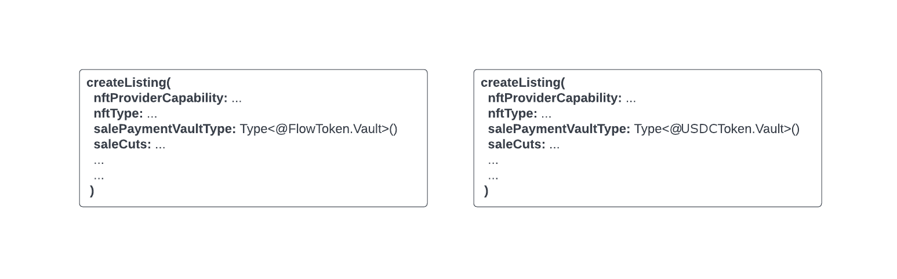

# NFT Storefront Smart Contract

The NFT Storefront contracts implement a standard way to list NFTs for sale and buy them from listings. `NFTStorefrontV2` is the more powerful and full-featured version, so developers and users are encouraged to use it instead of `NFTStorefront` or their own implementation.

Source: [NFTStorefrontV2.cdc]

| Network                   | Contract Address     |
| ------------------------- | -------------------- |
| Emulator                  | `0xf8d6e0586b0a20c7` |
| Cadence Testing Framework | `0x0000000000000001` |
| Testnet                   | `0x2d55b98eb200daef` |
| Mainnet                   | `0x4eb8a10cb9f87357` |

Source: [NFTStorefront.cdc]

| Network | Contract Address     |
| ------- | -------------------- |
| Testnet | `0x94b06cfca1d8a476` |
| Mainnet | `0x4eb8a10cb9f87357` |

## Primer

The `NFTStorefrontV2` contract lets you create a _non-custodial Resource (NFT) marketplace_ on the FLOW blockchain.

`NFTStorefrontV2` makes it simple for Sellers to list NFTs in dApp specific marketplaces. dApp developers leverage the APIs provided by the contract to manage listings for sale and to transact NFT trades.


Developers should use the `NFTStorefrontV2` to create their marketplace and to alloq p2p purchases. The diagram below shows how dApps can facilitate the creation of NFT listings for different marketplaces and how marketplaces can filter their listings.

Listings made through a specific dApp storefront can be simultaneously listed on 3rd party marketplaces beyond that dApp. Well known 3rd party marketplaces listen for compatible NFT listing events, which allows the automation of listings into their marketplace dashboards.


With the `NFTStorefrontV2`, marketplaces can instantly and easily tap into the vibrant FLOW NFT ecosystem and allow NFT holders to list their NFTs and allows creator royalties.

Marketplaces then interact with seller storefronts directly to process an NFT trade. Flow's account based model ensures that NFTs listed for sale always reside in the Seller account until traded, regardless of how many Listings are posted across any number of marketplaces, for the same NFT.


## Functional overview

A general purpose sale support contract for NFTs that implement the Flow [`NonFungibleToken`] standard. Each account that wants to list NFTs for sale creates a `Storefront` resource to store in their account and lists individual sales within that Storefront as listings. There is usually one Storefront per account held at the `/storage/NFTStorefrontV2`.

Each listing can define one or more sale cuts taken out of the sale price to go to one or more addresses. Listing fees, royalties, or other considerations can be paid with sale cuts. Also, the listing can include a commission as one of these sale cuts is paid to whoever facilitates the purchase.

Listings can have an optional list of marketplace [receiver capabilities] used to receive the commission after the seller fulfills the listing. An NFT may be listed in one or more listings, and the validity of each listing can easily be checked.

Interested parties can globally track listing events onchain and filter by NFT types, IDs and other characteristics to determine which to make available for purchase within their own marketplace UIs."

## Sell NFTs

`NFTStorefrontV2` offers a generic process for creating the listing for an NFT. It provides all the essential APIs to manage those listings independently.

Many marketplaces create a single storefront resource to manage different individual listings. We recommend that you create the listing under the user-owned storefront resource to make it trustless and platform-independent. Users should possess the `Storefront` resource under their account to create the listing using the storefront contract.

## Create a successful listing with the NFTStorefrontV2 contract.

As recommended above, the first step is to create and store the [Storefront resource] in the user account with the [setup_account] transaction.

The next step is to create a listing under the newly-created storefront resource. If the user (repetitive) already holds the storefront resource, then use the current resource. The seller can come with multiple requirements to list their NFTs, and we try our best to cover most of them below.

### **Scenario 1:** Sell NFTs that correspond to more than one cryptocurrency, such as FLOW, USDC etc.

The `NFTStorefrontV2` contract doesn't support an NFT sale for multiple different currencies with a single listing. However, to achieve this, you can create multiple listings for the same NFT for each different currency.

**Example -** Alice wants to sell a kitty and is open to receive FLOW and USDC



A seller puts an NFT on sale, a process called listing. To create a listing with the [sell_item] transaction, the seller provides some required details to list an NFT, such as the receiving currency type, and the [Capability] from where the network deducts the NFT. For more information, see [`createListing`].

To receive a different currency, the seller must provide a different **Receiver currency type** , such as `salePaymentVaultType`. As depicted in the above diagram, there are two listing formations with almost the same inputs. The only differentiator is the `salePaymentVaultType` parameter that needs to be different when the seller creates duplicate NFT listings with different sale currency types.

### **Scenario 2:** Peer-to-Peer (p2p) listing of NFT: A listing anyone can fulfill.

dApps can leverage the **NFTStorefrontV2** to facilitate a listing's creation for the seller independent of any marketplace. dApps or marketplaces can list those listings on their platforms, or seller can settle it p2p.

The seller can use [sell_item] transaction to create a p2p listing. To do this, they provide the `marketplacesAddress` with an empty array. The seller can provide [commission] to the facilitator of sale, which can also act as a discount if the facilitator and the purchaser are the same.

### **Scenario 3:** The seller wants to list its NFT in different marketplaces.

`NFTStorefrontV2` offers two different ways to do it.

- The seller can create a listing and provide the `marketplacesAddress` that it wants to have a listing on with the [sell_item] transaction.

  Marketplaces can listen to `ListingAvailable` events and check whether their address is included in the `commissionReceivers` list; If yes, the marketplace would be rewarded during the successful fulfilment of the listing.

  Example - Bob wants to list on marketplace 0xA, 0xB & 0xC and will offer 10% commission on the sale price of the listing to the marketplaces.

  

- Another way to accomplish this is to create separate listings for each marketplace on which a user wants their listing with the [sell_item_with_marketplace_cut] transaction. In this case, the marketplace would earn one part of the [`saleCut`] as an incentive. It appends the marketplace saleCut in the `saleCuts` array when it creates the listing.

### Considerations

1. **Ghost listings -** _Ghost listings are listings which don't have an underlying NFT in the seller's account. However, the listing is still available for buyers to attempt to purchase_. StorefrontV2 is not immune to ghost listings. Usually, ghost listings will cause a purchaser's transaction to fail, which is annoying but isn't a significant problem. Ghost listings become a problem for the seller when the listed NFT comes back to the seller's account after its original sale. The ghost listing will no longer be invalid when it comes back, and anyone can purchase it even if the seller doesn't want to sell it at that price anymore.

:::info

_We recommend that marketplaces and p2p dApps create an off-chain notification service that tells their users (sellers) to remove the listings if they don't hold the NFT anymore in the same account._

:::

2. **Expired listings -** `NFTStorefrontV2` introduces a safety measure to specify that a listing will expire after a certain period that can be set during the creation so no one can purchase the listing anymore. It is not a fool-proof safety measure, but it does give some safe ground to the sellers for the ghost listings & stale listings.

:::info
 
 _We recommended for marketplaces and p2p dApps not to show the expired listings on their dashboards._

 :::

## Purchase NFTs

To purchase NFTs through the `NFTStorefrontV2` is simple. The buyer has to provide the payment vault and the `commissionRecipient` , if applicable, during the purchase. p2p dApps don't need any intermediaries to facilitate the purchase of listings. [`purchase`] API offered by the `Listing` resource gets used to facilitate the purchase of NFT.

During the listing purchase, all saleCuts are paid automatically. This also includes royalty distribution for that NFT, if applicable. If the vault provided by the buyer lacks sufficient funds, then the transaction will fail.

### Considerations

1. **Auto cleanup -** `NFTStorefrontV2` offers a unique ability to do auto cleanup of duplicate listings during a purchase. It comes with a drawback if one NFT has thousands of duplicate listings. It will become the bottleneck during purchases one of the listings as it will likely trigger an out-of-compute error.

:::info

   _We recommended NOT to have more than 50 duplicate listings of any given NFT._

:::

2. **Unsupported receiver capability** - A common pitfall during the purchase of an NFT that some saleCut receivers don't have a supported receiver capability because that entitled sale cut would transfer to first valid sale cut receiver. However, it can be partially solved if you provide the generic receiver with the [`FungibleTokenSwitchboard`] contract and add all the currency capabilities the beneficiary wants to receive. For more information about the `FungibleTokenSwitchboard`, see [Fungible Token Switchboard]

## Allow creator royalties for NFTs

The `NFTStorefrontV2` contract optionally supports royalty payments to the minter account for secondary resales of that NFT after the original sale. Marketplaces decide for themselves whether to support creator royalties when they validate listings for sale eligibility. We encourage all marketplaces to support creator royalties and support community creators in the **FLOW** ecosystem.

If a seller's NFT supports the [Royalty Metadata View] standard, then marketplaces can honor royalties payments at time of purchase. `NFTStorefrontV2` dynamically calculates the royalties owed at the time of listing creation and applies it as a saleCut of the listing at the time of purchase.

```cadence
// Check whether the NFT implements the MetadataResolver or not.
if nft.getViews().contains(Type<MetadataViews.Royalties>()) {
	// Resolve the royalty view
    let royaltiesRef = nft.resolveView(Type<MetadataViews.Royalties>())
        ?? panic("Unable to retrieve the royalties view for the NFT with type "
           .concat(nft.getType().identifier).concat(" and ID ")
           .concat(nft.id.toString()).concat(".")
	// Fetch the royalties.
	let royalties = (royaltiesRef as! MetadataViews.Royalties).getRoyalties()

	// Append the royalties as the salecut
    for royalty in royalties {
        self.saleCuts.append(NFTStorefrontV2.SaleCut(receiver: royalty.receiver, amount: royalty.cut * effectiveSaleItemPrice))
        totalRoyaltyCut = totalRoyaltyCut + royalty.cut * effectiveSaleItemPrice
    }
}
```

You can view a complete transaction in [sell_item].

saleCut only supports a single token receiver type and therefore beneficiaries of a `saleCut` can also only receive the token type used for the purchase. To support different token types for saleCuts, we recommend that you use the [`FungibleTokenSwitchboard`] contract. The contract defines a generic receiver for fungible tokens which itself handles routing of tokens to the respective vault for that token type. You can learn more about this in [Fungible Token Switchboard].

## Allow marketplace commissions for NFT sales

`NFTStorefrontV2` allows optional commissions on trades for marketplaces which require it as a condition to list a NFT for sale. The seller sets commission and commission receivers during initial listing creation. At time of purchase, the commission amount is paid once only to the commission receiver that matches the marketplace receiver address which facilitated the sale.

For NFT listings in marketplaces which don't require commission, you can set commission receivers as `nil`. If you set the buyer of the NFT and `commissionRecipient` to `nil`, it applies a discount for the buyer.

.

## APIs and events offered by NFTStorefrontV2

## Resource Interface `ListingPublic`

```cadence
resource interface ListingPublic {
    access(all) fun borrowNFT(): &NonFungibleToken.NFT?
    access(all) fun purchase(
          payment: @FungibleToken.Vault,
          commissionRecipient: Capability<&{FungibleToken.Receiver}>?,
      ): @NonFungibleToken.NFT
    access(all) fun getDetails(): ListingDetail
    access(all) fun getAllowedCommissionReceivers(): [Capability<&{FungibleToken.Receiver}>]?
}
```

An interface that provides a useful public interface to a Listing.

### Functions

#### **fun `borrowNFT()`**

```cadence
fun borrowNFT(): &NonFungibleToken.NFT?
```

This will assert in the same way as the NFT standard borrowNFT() if the NFT is absent, for example if it has been sold via another listing.

---

#### **fun `purchase()`**

```cadence
fun purchase(payment FungibleToken.Vault, commissionRecipient Capability<&{FungibleToken.Receiver}>?): NonFungibleToken.NFT
```

Facilitates the purchase of the listing by providing the payment vault and the commission recipient capability if there is a non-zero commission for the given listing. Respective saleCuts are transferred to beneficiaries and funtion return underlying or listed NFT.

---

#### **fun `getDetails()`**

```cadence
fun getDetails(): ListingDetails
```

Fetches the details of the listings.

---

#### **fun `getAllowedCommissionReceivers()`**

```cadence
fun getAllowedCommissionReceivers(): [Capability<&{FungibleToken.Receiver}>]?
```

Fetches the allowed marketplaces capabilities or commission receivers for the underlying listing. If it returns `nil`, then commission is up for grabs by anyone.

---

## Resource `Storefront`

```cadence
resource Storefront {
    access(all) fun createListing(
            nftProviderCapability: Capability<&{NonFungibleToken.Provider, NonFungibleToken.CollectionPublic}>,
            nftType: Type,
            nftID: UInt64,
            salePaymentVaultType: Type,
            saleCuts: [SaleCut],
            marketplacesCapability: [Capability<&{FungibleToken.Receiver}>]?,
            customID: String?,
            commissionAmount: UFix64,
            expiry: UInt64
         ): UInt64
    access(all) fun removeListing(listingResourceID: UInt64)
    access(all) fun getListingIDs(): [UInt64]
    access(all) fun getDuplicateListingIDs(nftType: Type, nftID: UInt64, listingID: UInt64): [UInt64]
    access(all) fun cleanupExpiredListings(fromIndex: UInt64, toIndex: UInt64)
    access(all) fun borrowListing(listingResourceID: UInt64): &Listing{ListingPublic}?
}
```

A resource that allows its owner to manage a set of listings, and anyone to interact with them in order to query their details and purchase the NFTs that they represent.

Implemented Interfaces:

- `StorefrontManager`
- `StorefrontPublic`

### Initializer

```cadence
fun init()
```

### Functions

#### **fun `createListing()`**

```cadence
fun createListing(nftProviderCapability Capability<&{NonFungibleToken.Provider, NonFungibleToken.CollectionPublic}>, nftType Type, nftID UInt64, salePaymentVaultType Type, saleCuts [SaleCut], marketplacesCapability [Capability<&{FungibleToken.Receiver}>]?, customID String?, commissionAmount UFix64, expiry UInt64): UInt64
```

insert
Create and publish a listing for an NFT.

---

#### **fun `removeListing()`**

```cadence
fun removeListing(listingResourceID UInt64)
```

removeListing
Remove a listing that has not yet been purchased from the collection and destroy it.

---

#### **fun `getListingIDs()`**

```cadence
fun getListingIDs(): [UInt64]
```

getListingIDs
Returns an array of the listing resource IDs that are in the collection.

---

#### **fun `getDuplicateListingIDs()`**

```cadence
fun getDuplicateListingIDs(nftType Type, nftID UInt64, listingID UInt64): [UInt64]
```

getDuplicateListingIDs
Returns an array of listing IDs that are duplicates of the given `nftType` and `nftID`.

---

#### **fun `cleanupExpiredListings()`**

```cadence
fun cleanupExpiredListings(fromIndex UInt64, toIndex UInt64)
```

cleanupExpiredListings
Iterate over the provided range of indexes to clean up the expired listings.

---

#### **fun `borrowListing()`**

```cadence
fun borrowListing(listingResourceID: UInt64): &{ListingPublic}?
```

borrowListing
Returns a read-only view of the listing for the given listingID if it is contained by this collection.

---

## Resource Interface `StorefrontPublic`

```cadence
resource interface StorefrontPublic {
    access(all) fun getListingIDs(): [UInt64]
    access(all) fun getDuplicateListingIDs(nftType: Type, nftID: UInt64, listingID: UInt64): [UInt64]
    access(all) fun cleanupExpiredListings(fromIndex: UInt64, toIndex: UInt64)
    access(all) fun borrowListing(listingResourceID: UInt64): &Listing{ListingPublic}?
    access(all) fun cleanupPurchasedListings(listingResourceID: UInt64)
    access(all) fun getExistingListingIDs(nftType: Type, nftID: UInt64): [UInt64]
}
```

StorefrontPublic
An interface to allow listing and borrowing listings, and purchase items via listings in a Storefront.

### Functions

#### **fun `getListingIDs()`**

```cadence
fun getListingIDs(): [UInt64]
```

getListingIDs 
Returns an array of the listing resource IDs that are in the collection

---

#### **fun `getDuplicateListingIDs()`**

```cadence
fun getDuplicateListingIDs(nftType Type, nftID UInt64, listingID UInt64): [UInt64]
```

getDuplicateListingIDs 
Returns an array of listing IDs that are duplicates of the given nftType and nftID.

---

#### **fun `borrowListing()`**

```cadence
fun borrowListing(listingResourceID UInt64): &Listing{ListingPublic}?
```

borrowListing 
Returns a read-only view of the listing for the given listingID if it is contained by this collection.

---

#### **fun `cleanupExpiredListings()`**

```cadence
fun cleanupExpiredListings(fromIndex UInt64, toIndex UInt64)
```

cleanupExpiredListings 
 Iterates over the provided range of indexes to clean up the expired listing.

---

#### **fun `cleanupPurchasedListings()`**

```cadence
fun cleanupPurchasedListings(listingResourceID: UInt64)
```

cleanupPurchasedListings
Allows anyone to remove already purchased listings.

---

#### **fun `getExistingListingIDs()`**

```cadence
fun getExistingListingIDs(nftType Type, nftID UInt64): [UInt64]
```

getExistingListingIDs
Returns an array of listing IDs of the given `nftType` and `nftID`.

---

## Events

**event `StorefrontInitialized`**

```cadence
event StorefrontInitialized(storefrontResourceID: UInt64)
```

A Storefront resource was created. Consumers can now expect events from this Storefront. We do not specify an address: we cannot and should not. Created resources do not have an owner address, and may be moved after creation in ways we cannot check. `ListingAvailable` events can be used to determine the address of the owner of the Storefront at the time of the listing but only at that precise moment in that precise transaction. If the seller moves the Storefront while the listing is valid, that is on them.

---

**event `StorefrontDestroyed`**

```cadence
event StorefrontDestroyed(storefrontResourceID: UInt64)
```

A Storefront has been destroyed. Event consumers can now stop processing events from this Storefront. We do not specify an address.

---

**event `ListingAvailable`**

```cadence
event ListingAvailable(storefrontAddress: Address, listingResourceID: UInt64, nftType: Type, nftUUID: UInt64, nftID: UInt64, salePaymentVaultType: Type, salePrice: UFix64, customID: String?, commissionAmount: UFix64, commissionReceivers: [Address]?, expiry: UInt64)
```

Above event gets emitted when a listing is created and added to a Storefront resource. The Address values here are valid when the event is emitted, but the state of the accounts they refer to may change outside of the `NFTStorefrontV2` workflow, so be careful to check when you use them.

---

**event `ListingCompleted`**

```cadence
event ListingCompleted(listingResourceID: UInt64, storefrontResourceID: UInt64, purchased: Bool, nftType: Type, nftUUID: UInt64, nftID: UInt64, salePaymentVaultType: Type, salePrice: UFix64, customID: String?, commissionAmount: UFix64, commissionReceiver: Address?, expiry: UInt64)
```

The listing was resolved. It was either purchased, removed or destroyed.

---

**event `UnpaidReceiver`**

```cadence
event UnpaidReceiver(receiver: Address, entitledSaleCut: UFix64)
```

A entitled receiver wasn't paid during the sale of the NFT.

---

**Holistic process flow diagram of NFTStorefrontV2 -**


<!-- Relative-style links.  Does not render on the page -->

[NFTStorefrontV2.cdc]: https://github.com/onflow/nft-storefront/blob/main/contracts/NFTStorefrontV2.cdc
[NFTStorefront.cdc]: https://github.com/onflow/nft-storefront/blob/main/contracts/NFTStorefront.cdc
[`NonFungibleToken`]: https://github.com/onflow/flow-nft/blob/master/contracts/NonFungibleToken.cdc
[receiver capabilities]: https://cadence-lang.org/docs/language/capabilities
[Storefront resource]: #resource-storefront
[setup_account]: https://github.com/onflow/nft-storefront/blob/main/transactions/setup_account.cdc
[sell_item]: https://github.com/onflow/nft-storefront/blob/main/transactions/sell_item.cdc
[Capability]: https://cadence-lang.org/docs/language/capabilities
[`createListing`]: #fun-createlisting
[Fungible Token Switchboard]: https://github.com/onflow/flow-ft#fungible-token-switchboard
[commission]: #enabling-marketplace-commissions-for-nft-sales
[sell_item_with_marketplace_cut]: https://github.com/onflow/nft-storefront/blob/main/transactions/sell_item_with_marketplace_cut.cdc
[`saleCut`]: https://github.com/onflow/nft-storefront/blob/160e97aa802405ad26a3164bcaff0fde7ee52ad2/contracts/NFTStorefrontV2.cdc#L104
[`purchase`]: #fun-purchase
[`FungibleTokenSwitchboard`]: https://github.com/onflow/flow-ft/blob/master/contracts/FungibleTokenSwitchboard.cdc
[Royalty Metadata View]: https://github.com/onflow/flow-nft/blob/21c254438910c8a4b5843beda3df20e4e2559625/contracts/MetadataViews.cdc#L335
