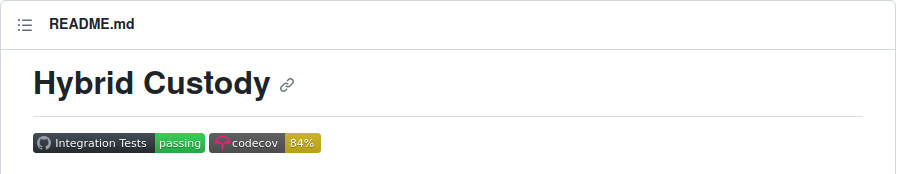
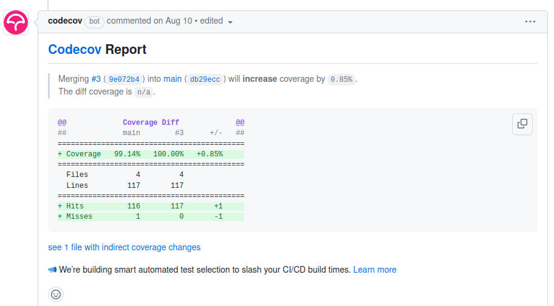

# Testing Smart Contracts

Testing is an essential part of smart contract development to ensure the correctness and reliability of your code. The Cadence Testing Framework provides a convenient way to write tests for your contracts, scripts and transactions which allows you to verify the functionality and correctness of your smart contracts.

> For a layered approach to when and why to use emulator, forked integration, and testnet, see the strategy guide: [Testing Strategy on Flow].

## Install Flow CLI

The [Flow CLI] is the primary tool for developing, testing, and deploying smart contracts to the Flow network.

If you haven't installed the Flow CLI yet and have [homebrew](https://brew.sh/) installed, simply run `brew install flow-cli`. Alternatively, refer to the Flow CLI [installation instructions].

## Create a new project

In your preferred code editor, create a new directory for your project and navigate to it in the terminal. Then initialize a new Flow project by running the command `flow init`. This will create a `flow.json` config file that contains the [project's configuration].

```bash
mkdir test-cadence
cd test-cadence
flow init
```

## Write a simple smart contract

In your code editor, create a new file called `calculator.cdc` and add the following code:

```cadence calculator.cdc
access(all) contract Calculator {
    access(all)
    fun add(a: Int, b: Int): Int {
        return a + b
    }

    access(all)
    fun subtract(a: Int, b: Int): Int {
        return a - b
    }

    access(all)
    fun multiply(a: Int, b: Int): Int {
        return a * b
    }
}
```

## Add the smart contract to the config

Next up, we need to add our new contract in the `contracts` key in the `flow.json` config file. More specifically, we need to add the contract name, location and an address alias for the `testing` environment.

```json
{
  "contracts": {
    "Calculator": {
      "source": "./calculator.cdc",
      "aliases": {
        "testing": "0x0000000000000007"
      }
    }
  },
  "networks": {...},
  "accounts": {...},
  "deployments": {...}
}
```

For the time being, the address for the `testing` alias, can be one of:

- `0x0000000000000005`
- `0x0000000000000006`
- `0x0000000000000007`
- `0x0000000000000008`
- `0x0000000000000009`
- `0x000000000000000a`
- `0x000000000000000b`
- `0x000000000000000c`
- `0x000000000000000d`
- `0x000000000000000e`

In the next release, there will be `20` addresses for contract deployment during testing.

## Write unit tests

In the same directory, create a new file called `calculator_test.cdc` and add the following code:

```cadence calculator_test.cdc
import Test
import "Calculator" // contract name from the previous step

access(all)
fun setup() {
    let err = Test.deployContract(
        name: "Calculator",
        path: "./calculator.cdc",
        arguments: []
    )
    Test.expect(err, Test.beNil())
}

access(all)
fun testAdd() {
    Test.assertEqual(5, Calculator.add(a: 2, b: 3))
}

access(all)
fun testSubtract() {
    Test.assertEqual(2, Calculator.subtract(a: 5, b: 3))
}
```

This code:

- imports the `Calculator` contract from the `calculator.cdc` file (according to `flow.json`)
- deploys the `Calculator` contract to the address specified in the `testing` alias
- defines two test cases: `testAdd()` and `testSubtract()`
- calls `add()` and `subtract()` methods with different input values respectively.

## Running the test cases

To run the test cases, use the following command in the terminal:

```bash
flow test --cover --covercode="contracts" calculator_test.cdc
```

This command uses the Flow CLI to run the test cases and display the output. You should see the following output:

```bash
Test results: "calculator_test.cdc"
- PASS: testAdd
- PASS: testSubtract
Coverage: 66.7% of statements
```

This output indicates that both test cases ran successfully, and the two smart contract methods are functioning as expected. With the supplied flags (`--cover` & `--covercode="contracts"`), we also get code coverage insights for the contracts under testing. The code coverage percentage is `66.7%`, because we have not added a test case for the `multiply` method. By viewing the auto-generated `coverage.json` file, we see:

```json
{
  "coverage": {
    "A.0000000000000007.Calculator": {
      "line_hits": {
        "14": 0,
        "4": 1,
        "9": 1
      },
      "missed_lines": [14],
      "statements": 3,
      "percentage": "66.7%"
    }
  }
}
```

Line 14 from the `Calculator` smart contract is marked as missed. This is the line:

```cadence
return a * b
```

which is the `multiply` method.

By adding a test case for the above method:

```cadence calculator_test.cdc
...

access(all)
fun testMultiply() {
    Test.assertEqual(10, Calculator.multiply(a: 2, b: 5))
}
```

our code coverage percentage goes to `100%`:

```bash
flow test --cover --covercode="contracts" calculator_test.cdc

Test results: "calculator_test.cdc"
- PASS: testAdd
- PASS: testSubtract
- PASS: testMultiply
Coverage: 100.0% of statements
```

## Advanced Testing Techniques

The Cadence testing framework provides various features and techniques for writing comprehensive test scenarios. Some of these include:

- [**Code Coverage**](https://github.com/m-Peter/flow-code-coverage): You can use the `--cover` flag with the `flow test` command to view code coverage results when running your tests. This allows you to identify areas of your code that are not adequately covered by your test inputs.
- **Test Helpers**: Test helpers are reusable functions that help you set up the initial state for your test files. You can define test helpers in a Cadence program and use them in your test files by importing it whenever needed.
- [**Assertions**](https://cadence-lang.org/docs/testing-framework#assertions): The testing framework provides built-in assertion functions, such as `assertEqual`, `beNil`, `beEmpty`, `contain`, to help you verify the expected behavior of your smart contracts.
- **Test Suites**: You can organize your test files into test suites to improve the readability and maintainability of your test code. Test suites allow you to group related test cases and set up common test helpers for all the tests in the suite.
- [**Integration tests**](https://github.com/bjartek/overflow): In our previous example, we would directly call the available methods on the contract under test. This is generally categorized as unit testing. You can also write integration tests, by executing scripts & transactions to interact with the contracts under testing. If you would like to write your tests in Go, instead of Cadence, you can use [Overflow tool](https://github.com/bjartek/overflow) to run integration tests against either an local emulator, testnet, mainnet or an in memory instance of the flow-emulator.

By leveraging these advanced testing techniques, you can write more robust and reliable smart contracts in Cadence. In this example, we set up a basic testing environment, wrote a simple smart contract in Cadence, and created a test file to verify its functionality. We then used the Flow CLI to run the test file and confirm that the smart contract is working correctly.

This is a basic example, and there are many more advanced features and techniques you can explore when working with the Cadence Testing Framework.

For more in-depth tutorials and documentation, refer to the official [Cadence language documentation](https://cadence-lang.org/) and the [Flow CLI documentation].

## Testing Requirements

It is suggested to follow the following best practices:

- Every publicly exposed feature of a contract and its resources should have unit tests that check both for success with correct input _and_ for failure with incorrect input.
  These tests should be capable of being run locally with the Flow emulator, with no or minimal extra resources or configuration, and with a single command.
- Each user story or workflow that uses the smart contracts should have an integration test that ensures that the series of steps required to complete it does so successfully with test data.

Make sure you test all contracts - and the integration into your application extensively before proceeding to the mainnet.
You should aim to replicate all conditions as closely as possible to the usage patterns on mainnet.

## Writing Tests

There are official SDKs/frameworks for Flow in Cadence, Go and JavaScript.

In all three cases, the test code will need to deploy the contracts, configure accounts to interact with them and send transactions to them. It will then have to wait for the transactions to be sealed and check the results by catching exceptions, checking for events, and querying state using scripts.

### Cadence tests

Cadence comes with built-in support for code coverage, as well as a native testing framework which allows developers to write their tests using Cadence.
This framework is bundled with the [Flow CLI] tool, which includes a dedicated command for running tests (`flow test`).

You can find examples of Cadence tests in the following projects: [hybrid-custody](https://github.com/onflow/hybrid-custody/tree/main/test), [flow-nft](https://github.com/onflow/flow-nft/tree/master/tests), [flow-ft](https://github.com/onflow/flow-ft/tree/master/tests).
Visit the [documentation](https://cadence-lang.org/docs/testing-framework) to view all the available features.

The [Hybrid Custody](https://github.com/onflow/hybrid-custody#readme) project is a prime example which utilizes both the Cadence testing framework and code coverage in its CI.



There is also a [repository](https://github.com/m-Peter/flow-code-coverage#readme) which contains some sample contracts and their tests.




<Callout type="info">
The Cadence testing framework utilizes the emulator under the hood.
</Callout>

### Fork Testing

Fork testing lets you run your Cadence test files (`*_test.cdc`) against a snapshot of a live Flow network (mainnet or testnet). This enables realistic integration tests that read real contract code and on-chain state while keeping all mutations local to your test run.

<Callout type="info">
This section covers `flow test --fork` (running tests against a forked network), which is different from `flow emulator --fork` (starting the emulator in fork mode for manual interaction).
</Callout>

#### What is fork testing?

When you run tests with the `--fork` flag, the test runner:

- Connects to a Flow access node (public or custom)
- Fetches account state, contract code, and other data on demand
- Executes your tests as if they are running against the live network state
- Keeps all state changes local to your test process (the real network is never mutated)

This bridges the gap between isolated local tests and deploying to testnet/mainnet for validation.

#### Quick start

Example: Read from the real FlowToken contract on mainnet.

```cadence flow_token_test.cdc
import Test
import "FlowToken" // Resolves to mainnet alias when running with --fork

access(all) fun testFlowTokenSupplyIsPositive() {
    let supply = FlowToken.totalSupply
    Test.assert(supply > 0.0, message: "FlowToken supply should be positive")
}
```

Ensure your `flow.json` defines the mainnet alias for `FlowToken`:

```json
{
  "contracts": {
    "FlowToken": {
      "source": "./cadence/contracts/FlowToken.cdc",
      "aliases": {
        "mainnet": "0x1654653399040a61"
      }
    }
  },
  "networks": {
    "mainnet": {
      "host": "access.mainnet.nodes.onflow.org:9000"
    }
  }
}
```

Run the test against a fork of mainnet:

```bash
flow test --fork
```

To target testnet instead:

```bash
flow test --fork testnet
```

#### Common use cases

- Integration testing with real contracts (NFT marketplaces, DEXs, core contracts)
- Pre-deployment validation against production data
- Upgrade testing with production state
- Historical debugging with a specific block height

Examples:

```bash
# Run a single test file against mainnet
flow test tests/my_marketplace_test.cdc --fork mainnet

# Pin to a specific block height for historical state
flow test --fork mainnet --fork-height 85432100
```

#### How contract aliases are resolved

- Normal mode (no `--fork`): your imports use the `testing` aliases from `flow.json` (for emulator deployments)
- Fork mode: imports automatically use the aliases for the selected network (e.g. `mainnet` or `testnet`) defined in `flow.json`

This means you typically do not need to change imports in your test code when switching between local and forked runs—configure aliases once and select the mode via flags.

#### Limitations and considerations

- External dependency: requires connectivity to an access node; observe availability and rate limits
- Point-in-time snapshot: forked state reflects the time of query (or the specified `--fork-height`), not a live stream
- Read-only network: mutations in your tests are local and do not affect the real network
- Spork boundaries: access nodes only retain historical data for the current spork; pinning via `--fork-height` cannot reach beyond that boundary. Learn more about the Flow spork process in the Network Upgrade (Spork) docs.
- External oracles/off-chain systems: forked tests cannot fetch live data from external services or other chains; provide mocks or a local test harness

See: [Network Upgrade (Spork) Process]

See also:

- Strategy: [Testing Strategy on Flow]
- Flags: [Fork Testing Flags]
- Emulator (fork mode): [Flow Emulator]

#### Best practices

1. Use fork testing primarily for integration tests; keep unit tests on the emulator for determinism and isolation
2. Keep forked tests separate in CI. On PRs, run them pinned (full suite if practical; otherwise a small quick set)
3. For reproducibility, pin with `--fork-height` where it matters. For best results, maintain a per‑spork stable pin and also run a "latest" freshness job
3. Prefer testnet before mainnet to catch network-specific issues with fewer risks
4. Document dependencies on specific mainnet/testnet contracts and addresses
5. Consider real data requirements—fork testing shines when reading existing on-chain state

#### Commands reference

See the flag reference for available options and details.

Guide → Tutorial: [Fork Testing with Cadence (Step-by-Step)]

Guide → Flags: [Fork Testing Flags]

```bash
flow test --fork                    # Fork from mainnet (default when value omitted)
flow test --fork testnet            # Fork from testnet
# flow test --cover                  # With coverage report
flow test --fork --fork-height NUM  # Pin to block height
```

### Go Tests

Tests in Go can be written using [flow-go-sdk](https://github.com/onflow/flow-go-sdk) and the go test command.

You can find examples of Go tests in the following projects: [flow-core-contracts](https://github.com/onflow/flow-core-contracts/tree/master/lib/go/test), [flow-nft](https://github.com/onflow/flow-nft/tree/master/lib/go/test), [flow-ft](https://github.com/onflow/flow-ft/tree/master/lib/go/test).

<Callout type="info">
These tests are tied to the emulator but can be refactored to run on testnet
</Callout>

## Testing Your Application

### Automated Testing of Contract Code

All contracts should include test coverage for _all contract functions_. Make sure you've accounted for success and failure cases appropriately.

Tests should also be runnable in automated environments (CI). You can use the [Cadence testing utils](https://cadence-lang.org/docs/testing-framework) to create tests for your smart contract code.

### Stress Testing Live Applications Before Mainnet

Once you deployed your application to the testnet, you should record how your application handles non-trivial amounts of traffic to ensure there are no issues.

<Callout type="success">
Get familiar with the [Cadence anti-patterns](https://cadence-lang.org/docs/anti-patterns) to avoid avoid problematic or unintended behavior.
</Callout>

## References

- [Reference documentation for Cadence testing](https://cadence-lang.org/docs/testing-framework)
- [Overflow](https://github.com/bjartek/overflow) is a powerful Golang-based DSL for efficient testing and execution of blockchain interactions
- projects that have good examples of robust test cases:
  - [hybrid-custody](https://github.com/onflow/hybrid-custody/tree/main/test),
  - [flow-nft](https://github.com/onflow/flow-nft/tree/master/tests),
  - [flow-ft](https://github.com/onflow/flow-ft/tree/master/tests).

<!-- Reference-style links -->
[Testing Strategy on Flow]: ./testing-strategy.md
[Flow CLI]: ../../../build/tools/flow-cli/index.md
[installation instructions]: ../../../build/tools/flow-cli/install.md
[project's configuration]: ../../../build/tools/flow-cli/flow.json/configuration.md
[Flow CLI documentation]: ../../../build/tools/flow-cli/index.md
[Network Upgrade (Spork) Process]: ../../../protocol/node-ops/node-operation/network-upgrade.md
[Fork Testing Flags]: ../../tools/flow-cli/tests.md#fork-testing-flags
[Flow Emulator]: ../../tools/emulator/index.md
[Fork Testing with Cadence (Step-by-Step)]: ../../../blockchain-development-tutorials/cadence/fork-testing/index.md