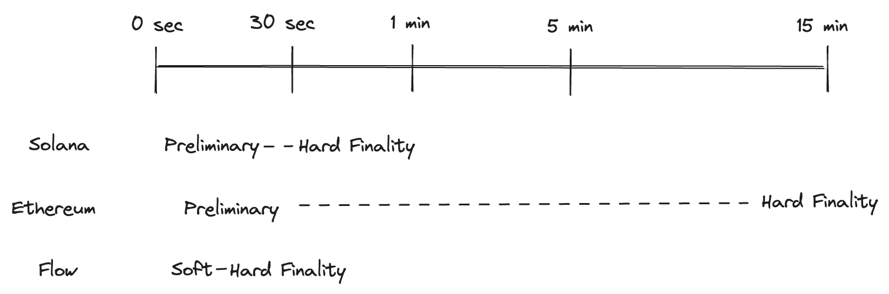

# Understanding Transaction Time

Understanding how transaction times work across different blockchains is crucial for developers and users to optimize their operations and expectations. Flow’s multi-node architecture allows for some of the fastest transaction times and finality times across chains. Read on for more detail on how it works and what it means for developers and users.

## Two Key Transaction Questions

Whenever a transaction is processed, two primary questions come to mind:

1. **Inclusion**: Will this transaction be included in the final chain?
2. **Result**: What is the outcome of the transaction?

Different blockchains tackle these questions in varied sequences. For instance, Bitcoin and Ethereum provide answers simultaneously. Layer 2 solutions (L2s) can sometimes address the outcome before confirming inclusion. But there's a catch: you can have an answer to those questions that might be wrong. Flow, on the other hand, prioritizes the inclusion question.

## **Transaction Finality Explained**

Drawing a parallel to traditional finance, a vendor might instantly know if Visa approves a transaction, but the possibility of chargebacks lingers for weeks. This uncertainty introduces the concept of "finality" in blockchain transactions.

In the dominant Proof-of-Stake (PoS) environment, which includes most chains except for Bitcoin, there are three key finality stages:

- **Preliminary result**: It's an initial answer to the aforementioned questions. The preliminary result doesn’t ensure correctness, and there are no economic penalties (like "slashing") if the informant provides false information.
- **Soft economic finality**: This stage provides an answer backed by cryptographic proof. If the informant is deceptive, they face economic repercussions or "slashing."
- **Hard economic finality**: The provided answer either holds true, or the entire blockchain requires a restart. The latter case sees at least one-third of the nodes facing economic penalties.

## Chain Comparisons

### Solana
Solana offers a preliminary result within approximately 100ms but takes around 30 seconds to achieve hard finality.

### Ethereum
Ethereum takes about 15 seconds to provide a preliminary result, reaching hard finality in approximately 15 minutes.

### Flow

Flow bypasses preliminary results entirely. It reaches soft finality ("Executed") in about 6 seconds and hard finality ("Sealed") in around 20 seconds. If an Access Node on Flow states a transaction has occurred, it's either correct or cryptographic proof exists that can lead to the node's slashing.

## Efficiency + Speed + Finality

Many blockchains offer quick preliminary results before achieving hard finality. Flow's unique multi-node architecture ensures it can process and finalize transactions more efficiently than many other blockchains. By separating tasks among specialized nodes, Flow can achieve faster transaction times, reaching soft finality in mere seconds and hard finality shortly thereafter.