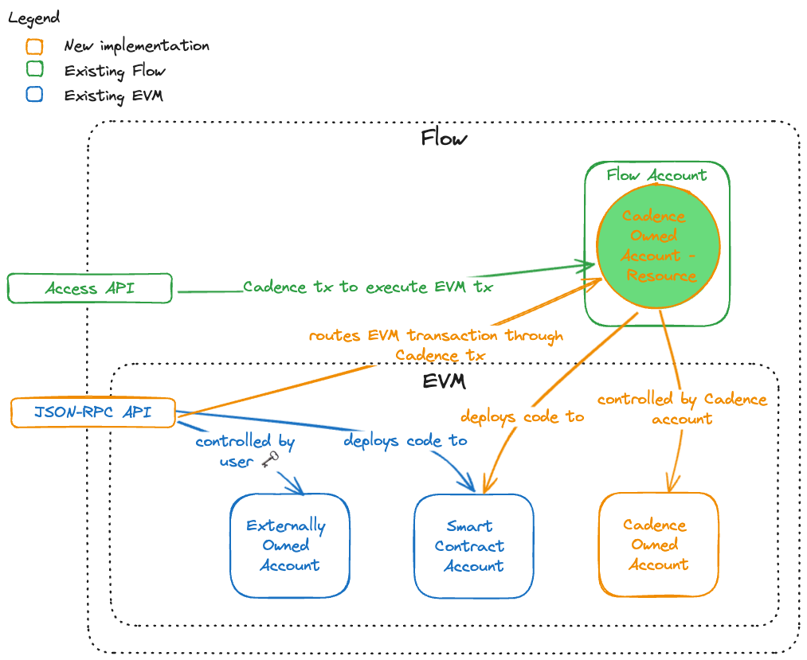

:::info

Are you a Cadence developer who wants information about Accounts on Cadence? If so, check out the Cadence specific documentation [here]

:::

# Accounts

There are three types of accounts used for Flow EVM.

1. **Externally Owned Accounts (EOA)**: EOAs are controlled by private individuals with cryptographic keys and can initiate transactions directly. They are the primary account type for users to interact with the blockchain, hold and send cryptocurrency, or call smart contract functions.
2. **Contract Accounts**: These accounts hold smart contract code and are governed by this code's logic. Unlike EOAs, Contract Accounts do not initiate transactions on their own but can execute transactions in response to calls they receive from EOAs or other contracts.
3. **Cadence Owned Accounts (COA)**: This is an account type unique to Flow EVM. These accounts are managed by [Cadence resources] and you can use them to interact with the Flow EVM from within the Cadence environment.

EOAs and Contract accounts function the same as on other EVM networks. Users may interact with these accounts with the standard EVM JSON-RPC API ([see endpoints here]). You can read more about EOAs and Contract accounts on the [Ethereum docs].

However, to leverage all the features of Cadence, developers will need to use Cadence Owned Accounts.

:::danger

🚨🚨🚨 **ASSET LOSS RISK** 🚨🚨🚨

Cadence-Owned Accounts, easily identifiable by the leading zeroes (`0x00000000000000000000000`) **only exist on Flow**. The keys to these addresses are generated in a way that is not compatible with other networks.

As a result, any assets sent to one of these addresses on another network **will be lost permanently!**

We're working with major wallet providers to block such transfers, and recommend that all app and wallet developers do the same.

:::

## Cadence Owned Accounts

A COA is a natively supported EVM smart contract wallet type that allows a Cadence resource to own and control an EVM address. This native wallet type provides the primitives needed to bridge or control assets across Flow EVM and Cadence, which facilitates composability between environments.

### Why use COAs?

COAs create powerful new opportunities to improve the UX, functionality and utility of EVM applications by taking advantage of Cadence. Key benefits include:

- **Enhanced Composability**: Within Cadence, developers can extend and compose upon applications written in Solidity. This allows developers to build upon current EVM applications and deliver a more feature-rich user experience.

- **Atomic Interactions**: Developers can execute multiple EVM transactions atomically from a COA. This is particularly useful for applications that require multiple transactions to be executed within a single block, or require all prior transactions' state changes to revert if a single transaction in the batch fails. This is not possible natively with EOAs or with `UserOperations` when they use the ERC-4337 standard. In both cases, each individual transaction is distinct and cannot be reverted back after state changes.

- **Native Account Abstraction**: COAs are controlled by Cadence resources, which are in turn owned by Flow accounts. [Flow accounts] have built-in support for multi-signature authentication, key rotation, and account recovery. As a Cadence resource, COAs naturally inherit [these features].

- **Fine-Grained Access Control**: As Cadence resources, access to a COA can be governed by more sophisticated policies than those available with basic EVM accounts. When developers use powerful Cadence access control primitives such as [capabilities and entitlements], they can restrict who can interact with a COA and what actions they can perform.

### Differences from traditional EVM accounts

COAs are smart contracts that are deployed to, and are fully accessible within, Flow EVM. However, unlike traditional EVM accounts (for example, EOAs or smart contract accounts), a Cadence resource owns COAs. This means that the Cadence execution can natively create and control COAs.

Unlike EOAs, COAs do not have an associated key, but are assigned a 20-byte EVM address when they're created from Cadence. This address is based on the UUID of the Cadence resource and is prefixed with `0x000000000000000000000002`. This address determines the location of the COA smart contract deployment and is the EVM address that is used to interact with the COA.

A COA may instantiate transactions itself (where the COA's EVM address acts as `tx.origin`). This behavior differs from other EVM environments, where only EOAs may instantiate transactions.

Because Cadence resources own COAs, an EVM transaction is not required to trigger a transaction from a COA (for example, a transaction to make a call to `execute` or EIP-4337's `validateUserOpMethod`). Instead, call transactions may be triggered directly from the Cadence resource that owns the COA. When developers invoke the `call` method on this resource, a transaction event will be emitted within the EVM environment.

### More information

To learn how to create and interact with COAs in Cadence, see the guide for [Interacting with COAs from Cadence].

For more information about Cadence Owned Accounts, see the [Flow EVM Support FLIP].

<!-- Reference-style links, will not render on page. -->

[here]: ../cadence/basics/accounts.md
[Cadence resources]: https://cadence-lang.org/docs/language/resources
[see endpoints here]: ./using.mdx)
[Ethereum docs]: https://ethereum.org/developers/docs/accounts
[Flow accounts]: ./accounts.md
[these features]: ../cadence/advanced-concepts/account-abstraction.md
[capabilities and entitlements]: https://cadence-lang.org/docs/language/access-control
[Interacting with COAs from Cadence]: ../../blockchain-development-tutorials/cross-vm-apps/interacting-with-coa.md
[Flow EVM Support FLIP]: https://github.com/onflow/flips/pull/225/files