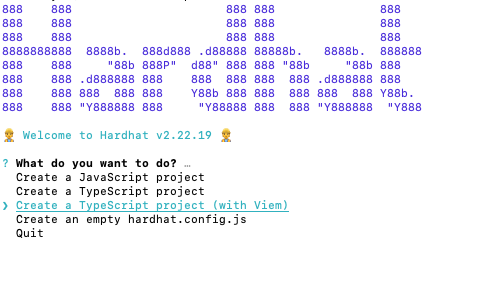
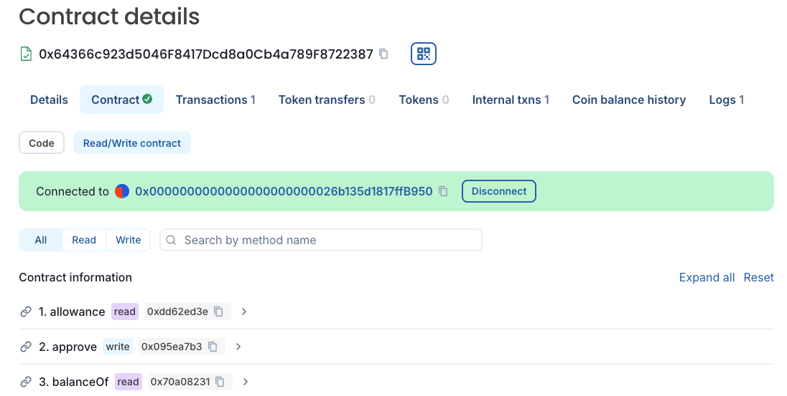
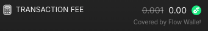

# EVM Quickstart

Flow EVM is an EVM-equivalent blockchain that combines the advantages of Flow, such as security, low-cost gas, and native VRF with compatibility with current blockchain applications tools and contracts. If it works on another EVM-equivalent blockchain, it should work on Flow EVM!

This guide is a self-contained quickstart that walks you through how to deploy a contract on Flow EVM testnet with [Hardhat] and test it with [testnet Flowscan].

If you prefer, check out our tutorials for [Remix] and [Foundry] for information on how to deploy a contract with those platforms.

To learn more about wallets and configurations, see [this article].

## Network information

Flow EVM has the following public RPC nodes available:

### Mainnet

| Name            | Value                                |
| --------------- | ------------------------------------ |
| Network Name    | Flow EVM Mainnet                     |
| Description     | The public RPC URL for Flow Mainnet  |
| RPC Endpoint    | https://mainnet.evm.nodes.onflow.org |
| Chain ID        | 747                                  |
| Currency Symbol | FLOW                                 |
| Block Explorer  | https://evm.flowscan.io              |

### Testnet

| Name            | Value                                |
| --------------- | ------------------------------------ |
| Network Name    | Flow EVM Testnet                     |
| Description     | The public RPC URL for Flow Testnet  |
| RPC Endpoint    | https://testnet.evm.nodes.onflow.org |
| Chain ID        | 545                                  |
| Currency Symbol | FLOW                                 |
| Block Explorer  | https://evm-testnet.flowscan.io      |


## Objectives

After you complete this guide, you'll be able to:

- Fund a wallet with testnet tokens from the [Flow Faucet].
- Deploy a contract on Flow EVM Testnet.
- Interact with a contract using [Flowscan].
- Use automatically sponsored gas with the [Flow Wallet] on testnet **and mainnet**.

## Prerequisites

### Traditional cryptocurrency wallet

EVM [Accounts] created by the Flow wallet have unique properties that allow for powerful features, but they do **not** have recovery phrases or private keys that you can export in a way that's compatible with [Hardhat]. As a result, you'll need to use a traditional EOA and [MetaMask] or the wallet of your choice to deploy your contracts.

## Deploy your contract

For this exercise, we'll use a [Button Clicker Contract] that's relatively simple, but includes several [OpenZeppelin] contracts. This way, we can walk through the process to configure your project to use these common imports.

:::info

If you **really** want to speedrun this tutorial:

1. Fork the [Button Clicker Contract] repo.
2. Run `npm install`.
3. Add a `.env` with your deploy wallet key as `DEPLOY_WALLET_1`.
4. Deploy with `npx hardhat ignition deploy ./ignition/modules/ClickToken.ts --network flowTestnet`.

When finished, skip to the frontend section.

:::

### Hardhat setup

Open a terminal window and navigate either to the folder where you wish to create your project folder or an empty project folder:

1. Run the following command:

   ```bash
   npx hardhat init
   ```

   

2. Select **Create a TypeScript project (with Viem)**.

3. Enter `.` if you ran the command from an empty folder, or enter a path.

4. Choose the defaults for the last options, then open the project in your editor.

### Environment setup

To set up an environment:

1. Add a `.env`.
2. Within it, add an environment variable called `DEPLOY_WALLET_1` with your deployment wallet's [private key]:

   ```text
   DEPLOY_WALLET_1=<YOUR_PRIVATE_KEY>
   ```

:::danger

The [private key] functions the same as the recovery phrase for a wallet. Anyone with the key can drain the wallet at any time! Use separate wallets for development and never commit a key to a repo.

:::

### Hardhat config

We'll use [OpenZeppelin Contracts] in the following steps:

1. Install them and then open the project in your editor:

   ```bash
   npm install --save-dev @openzeppelin/hardhat-upgrades
   npm install --save-dev @nomicfoundation/hardhat-ethers ethers # peer dependencies
   ```

2. Install the contracts themselves:

   ```bash
   npm install --save-dev @openzeppelin/contracts
   ```

3. To better protect your wallet key, add `dotenv`:

   ```bash
   npm install dotenv
   ```

4. Open `hardhat.config`. Below the imports, add the `require` statements for the contracts and `dotenv`:

   ```tsx
   require('@openzeppelin/hardhat-upgrades');
   require('dotenv').config();
   ```

   The default config is pretty bare. We'll need to add quite a few items. We'll do these one at a time, then provide a complete copy at the end.

5. Add a `networks` property that contains the network information for Flow Testnet and Mainnet:

   ```tsx
   networks: {
     flow: {
       url: 'https://mainnet.evm.nodes.onflow.org',
       accounts: [process.env.DEPLOY_WALLET_1 as string],
      },
      flowTestnet: {
        url: 'https://testnet.evm.nodes.onflow.org',
        accounts: [process.env.DEPLOY_WALLET_1 as string],
      },
   },
   ```

6. Add an entry for `etherscan`:

   ```tsx
   etherscan: {
   }
   ```

7. In it, add a property for `apiKey` and add keys for Flow Mainnet and Testnet. The Etherscan API requires this to be here, but currently, API keys aren't actually needed. You can use any text:

   ```tsx
   apiKey: {
     // Is not required by blockscout. Can be any non-empty string
     'flow': "abc",
     'flowTestnet': "abc"
   },
   ```

8. Add `customChains` and the network information for Flow:

   ```tsx
   customChains: [
     {
       network: 'flow',
       chainId: 747,
       urls: {
         apiURL: 'https://evm.flowscan.io/api',
         browserURL: 'https://evm.flowscan.io/',
       },
     },
     {
       network: 'flowTestnet',
       chainId: 545,
       urls: {
         apiURL: 'https://evm-testnet.flowscan.io/api',
         browserURL: 'https://evm-testnet.flowscan.io/',
      },
     },
   ];
   ```

You should end up with:

```tsx
import type { HardhatUserConfig } from 'hardhat/config';
import '@nomicfoundation/hardhat-toolbox-viem';

require('@openzeppelin/hardhat-upgrades');
require('dotenv').config();

const config: HardhatUserConfig = {
  solidity: '0.8.28',
  networks: {
    flow: {
      url: 'https://mainnet.evm.nodes.onflow.org',
      accounts: [process.env.DEPLOY_WALLET_1 as string],
    },
    flowTestnet: {
      url: 'https://testnet.evm.nodes.onflow.org',
      accounts: [process.env.DEPLOY_WALLET_1 as string],
    },
  },
  etherscan: {
    apiKey: {
      // Is not required by blockscout. Can be any non-empty string
      flow: 'abc',
      flowTestnet: 'abc',
    },
    customChains: [
      {
        network: 'flow',
        chainId: 747,
        urls: {
          apiURL: 'https://evm.flowscan.io/api',
          browserURL: 'https://evm.flowscan.io/',
        },
      },
      {
        network: 'flowTestnet',
        chainId: 545,
        urls: {
          apiURL: 'https://evm-testnet.flowscan.io/api',
          browserURL: 'https://evm-testnet.flowscan.io/',
        },
      },
    ],
  },
};

export default config;
```

### Contract setup

To set up the contract:

1. Delete `Lock.sol`.
2. Add `ClickToken.sol`.
3. Within it, add the [Button Clicker Contract].

:::warning

Hardhat only installs the most current version of Solidity. `^0.8.27` means that this contract requires 0.8.27 or **higher**. You generally **don't** want to include the `^` in your contracts unless you have a specific reason for doing so.

:::

We won't go into the details of the contract for this tutorial. It's a relatively simple [ERC-20] implementation that mints one token any time the `mintTo` function is called. Perfect for a Button Clicker game!

### Deployment setup

To set up the deployment:

1. Delete `Lock.ts` from the `ignition/modules` folder.
2. Add `ClickToken.ts`.
3. Within it, add the following:

```tsx
// This setup uses Hardhat Ignition to manage smart contract deployments.
// Learn more about it at https://hardhat.org/ignition

import { buildModule } from '@nomicfoundation/hardhat-ignition/modules';

const ClickerModule = buildModule('ClickTokenModule', (m) => {
  const clickToken = m.contract('ClickToken');

  return { clickToken };
});

export default ClickerModule;
```

### Obtain testnet funds

Visit the [Flow Faucet] and follow the instructions to add testnet funds. Compared to other networks, the [Flow Faucet] grants a vast amount of tokens — enough gas for millions of transactions.

:::warning

EVM accounts created by the [Flow Wallet] are [Cadence-Owned Accounts] or COAs — **Not** EOAs. COAs have many advantages over EOAs, but they are generated differently, which means they don't have a key that's compatible with Hardhat.

Use your [MetaMask] or similar EOA account to deploy contracts on Flow EVM.

:::

### Deploy the contract

Deploy the contract with:

```bash
npx hardhat ignition deploy ./ignition/modules/ClickToken.ts --network flowTestnet
```

You will see something similar to:

```bash
✔ Confirm deploy to network flowTestnet (545)? … yes
Hardhat Ignition 🚀

Deploying [ ClickTokenModule ]

Batch #1
  Executed ClickTokenModule#ClickToken

[ ClickTokenModule ] successfully deployed 🚀

Deployed Addresses

ClickTokenModule#ClickToken - 0x5Ff8221DfDD1F82fd538391D231502B4b927fbD7
```

### Verify the contract

Next, verify the contract with:

```bash
hardhat ignition verify chain-545 --include-unrelated-contracts
```

You'll see something similar to:

```bash
briandoyle@Mac button-clicker-contract % npx hardhat ignition verify chain-545 --include-unrelated-contracts
Verifying contract "contracts/ClickToken.sol:ClickToken" for network flowTestnet...
Successfully verified contract "contracts/ClickToken.sol:ClickToken" for network flowTestnet:
  - https://evm-testnet.flowscan.io//address/0x64366c923d5046F8417Dcd8a0Cb4a789F8722387#code
```

## Test the contract

To test the contract:

1. Click the link to open the contract in [testnet Flowscan].
2. Click the `Connect` button and connect your wallet, then navigate to the **Contract > Read/Write contract** tab:

   

3. Find the `mintTo` function and expand the UI to mint yourself a few tokens. You can click the `self` button to automatically add your address without the need to to copy and paste.

4. After you've "earned" a few tokens, use `balanceOf` to see how many tokens you have. You can also use `getAllScores` to get a list of everyone with the tokens, and how many they have.

### Test with free gas

If you don't have it yet, set up the [Flow Wallet], connect, and try to mint some more tokens. You'll see that the wallet automatically sponsors your gas:



Even better, the [Flow Wallet] currently **sponsors transactions on mainnet** too!

## Conclusion

In this tutorial, you learned how to:

- Fund a wallet with testnet tokens from the [Flow Faucet].
- Deploy a contract on Flow EVM Testnet with Hardhat.
- Interact with a contract using [Flowscan]
- Use automatically sponsored gas with the [Flow Wallet] on testnet and mainnet.

You've now mastered the basics of how to deploy and interact with EVM contracts on Flow. But this is just the beginning! Flow EVM's true power lies in its ability to combine the best of both worlds: EVM compatibility with Flow's native features.

In our [Cross-VM Apps] tutorial series, you'll learn how to supercharge your EVM applications when you integrate them with Flow Cadence. You'll discover how to:

- Build hybrid applications that seamlessly connect to both Flow EVM and Flow Cadence.
- Use Cadence's powerful features to enhance your EVM contracts.
- Enable multi-call contract writes with a single signature.
- Take advantage of Flow's native features like VRF and sponsored transactions.

Ready to unlock the full potential of Flow EVM? Start with our [Batched Transactions] tutorial to learn how to build your first cross-VM application.

<!-- Relative links. Will not render on the page -->

[Cadence]: https://cadence-lang.org/docs
[Next.js]: https://nextjs.org/docs/app/getting-started/installation
[wagmi]: https://wagmi.sh/
[viem]: https://viem.sh/
[rainbowkit]: https://www.rainbowkit.com/
[Hardhat]: https://hardhat.org/
[Remix]: ../../blockchain-development-tutorials/evm/development-tools/remix.md
[Foundry]: ../../blockchain-development-tutorials/evm/development-tools/foundry.md
[Flow Faucet]: https://faucet.flow.com/fund-account
[Flowscan]: https://evm-testnet.flowscan.io/
[Flow Wallet]: https://wallet.flow.com/
[Button Clicker Contract]: https://github.com/briandoyle81/button-clicker-contract/blob/main/contracts/ClickToken.sol
[OpenZeppelin]: https://www.openzeppelin.com/
[Ignition]: https://hardhat.org/ignition/docs/getting-started#overview
[Accounts]: ../evm/accounts.md
[MetaMask]: https://metamask.io
[private key]: https://support.metamask.io/configure/accounts/how-to-export-an-accounts-private-key/
[ERC-20]: https://ethereum.org/en/developers/docs/standards/tokens/erc-20/
[testnet Flowscan]: https://evm-testnet.flowscan.io/
[Cross-VM Apps]: ../../blockchain-development-tutorials/cross-vm-apps/introduction.md
[Batched Transactions]: ../../blockchain-development-tutorials/cross-vm-apps/introduction.md
[OpenZeppelin Contracts]: https://www.openzeppelin.com/contracts
[Cadence-Owned Accounts]: ./accounts.md#cadence-owned-accounts
[this article]: ../../blockchain-development-tutorials/evm/setup/integrating-metamask.mdx