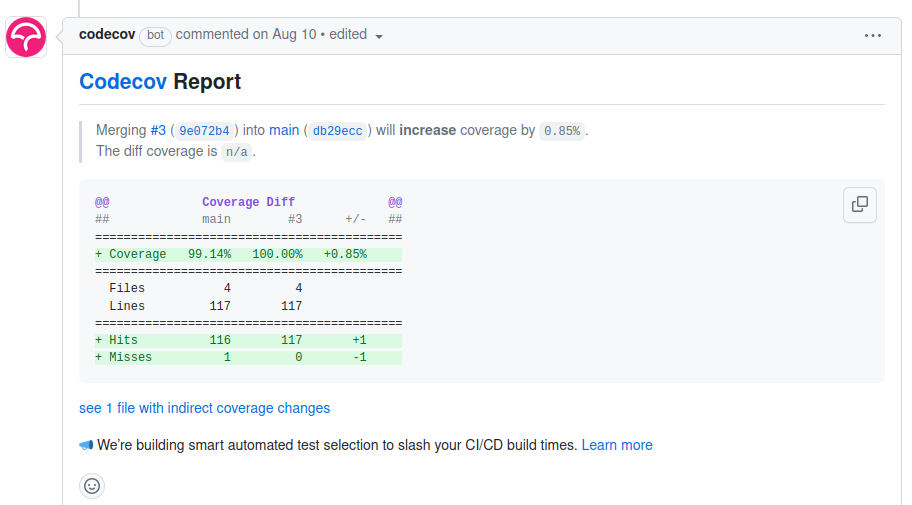
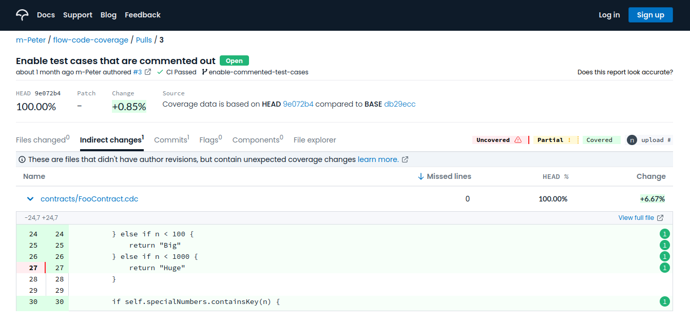

Testing is an essential part of the development workflow and code coverage is an important metric that can help developers view what percentage of all the possible code paths have been exercised during testing.
Good test coverage is vital for assuring code quality.

<Callout type="success">
Leverage [Flow emulator](../../../tools/emulator/index.md) to automate test runs. Test on Flow testnet. Include unit tests; to exercise each feature, and integration tests; to exercise the behavior of different parts of the project as a whole.
The emulator can also provide [code coverage](https://github.com/m-Peter/flow-code-coverage#for-emulator) insights.
</Callout>

Human-driven tests, in which individual testers work manually through user stories via the project's user interface or custom transactions, can also be performed locally. Tests with groups of testers can be performed similarly on testnet in a similar manner.

Finally, unstructured closed testing with a limited audience on testnet can gain valuable information about performance and security by capturing usage data from more organic interaction with the project's smart contracts over days or weeks.

## Testing Requirements

It is suggested to follow the following best practices:

- Every publicly exposed feature of a contract and its resources should have unit tests that check both for success with correct input _and_ for failure with incorrect input.
  These tests should be capable of being run locally with the Flow emulator, with no or minimal extra resources or configuration, and with a single command.
- Each user story or workflow that uses the smart contracts should have an integration test that ensures that the series of steps required to complete it does so successfully with test data.

Make sure you test all contracts - and the integration into your application extensively before proceeding to the mainnet.
You should aim to replicate all conditions as closely as possible to the usage patterns on mainnet.

## Writing Tests

There are official SDKs/frameworks for Flow in Cadence, Go and JavaScript.

In all three cases, the test code will need to deploy the contracts, configure accounts to interact with them and send transactions to them. It will then have to wait for the transactions to be sealed and check the results by catching exceptions, checking for events, and querying state using scripts.

### Cadence tests

Cadence comes with built-in support for code coverage, as well as a native testing framework which allows developers to write their tests using Cadence.
This framework is bundled with the [Flow CLI](../../../tools/flow-cli/index.md) tool, which includes a dedicated command for running tests (`flow test`).

You can find examples of Cadence tests in the following projects: [hybrid-custody](https://github.com/onflow/hybrid-custody/tree/main/test), [flow-nft](https://github.com/onflow/flow-nft/tree/master/tests), [flow-ft](https://github.com/onflow/flow-ft/tree/master/tests).
Visit the [documentation](../../../cadence/testing-framework.mdx) to view all the available features.

The [Hybrid Custody](https://github.com/onflow/hybrid-custody#readme) project is a prime example which utilizes both the Cadence testing framework and code coverage in its CI.

There is also a [repository](https://github.com/m-Peter/flow-code-coverage#readme) which contains some sample contracts and their tests.

<Callout type="info">
The Cadence testing framework utilizes the emulator under the hood.
</Callout>

### Go Tests

Tests in Go can be written using [flow-go-sdk](https://github.com/onflow/flow-go-sdk) and the go test command.

You can find examples of Go tests in the following projects: [flow-core-contracts](https://github.com/onflow/flow-core-contracts/tree/master/lib/go/test), [flow-nft](https://github.com/onflow/flow-nft/tree/master/lib/go/test), [flow-ft](https://github.com/onflow/flow-ft/tree/master/lib/go/test).

<Callout type="info">
These tests are tied to the emulator but can be refactored to run on testnet
</Callout>

### JavaScript Tests

Tests in JavaScript can be written using [flow-js-testing](https://github.com/onflow/flow-js-testing).

It is critical to test your applications and contracts thoroughly on the testnet as part of your road to the mainnet. Testing will help you understand how to create stable and robust applications using the Flow development stack.

## Testing Your Application

### Automated Testing of Contract Code

All contracts should include test coverage for _all contract functions_. Make sure you've accounted for success and failure cases appropriately.

Tests should also be runnable in automated environments (CI). You can use the [JavaScript testing framework](https://github.com/onflow/flow-js-testing) to create tests for your smart contract code.

### Stress Testing Live Applications Before Mainnet

Once you deployed your application to the testnet, you should record how your application handles non-trivial amounts of traffic to ensure there are no issues.

<Callout type="success">
Get familiar with the [Cadence anti-patterns](../../../cadence/anti-patterns.md) to avoid avoid problematic or unintended behavior.
</Callout>