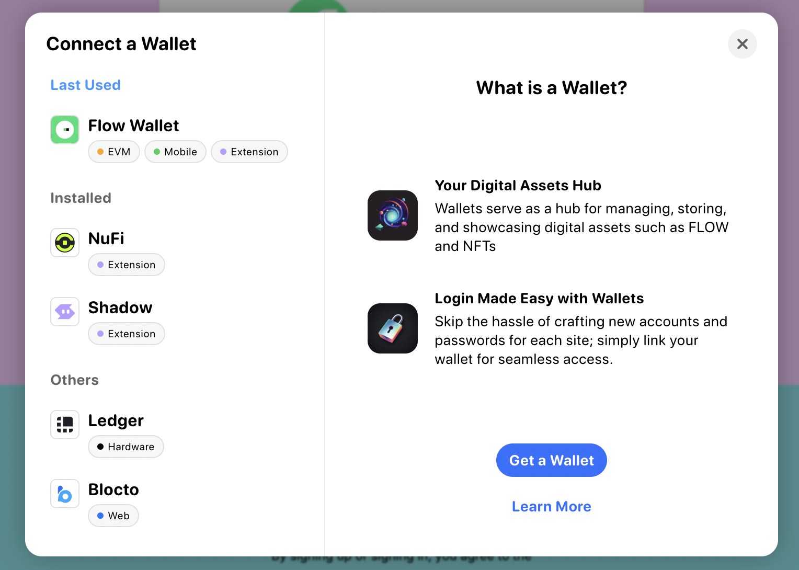

## Wallet Discovery

It's a challenge to know all the wallets available to users on a blockchain. Flow Client Library's (FCL) Discovery mechanism relieves much of the burden of Flow compatible wallet integration and lets developers focus on building their dApp and providing as many options as possible to their users.

There are two ways an app can use Discovery:

1.  The **UI version** which can be configured for display via iFrame, Popup, or Tab.
2.  The **API version** which allows you to access authentication services directly in your code via `fcl.discovery.authn` method which we'll describe below.

## UI version

When a user authenticates via FCL with Discovery UI, they receive a list of services they can use to login.



This method is the simplest way to integrate Discovery and its wallets and services into your app. All you have to do is configure `discovery.wallet` with the host endpoint for testnet or mainnet.

:::info

Opt-in wallets, like Ledger and Dapper Wallet, require you to explicitly state you'd like to use them. For more information on how to include opt-in wallets, [see these docs].

A [Dapper Wallet] developer account is required. To turn on Dapper Wallet inside FCL, you need to [follow this guide].

:::

```javascript
import { config } from '@onflow/fcl';

config({
  'accessNode.api': 'https://rest-testnet.onflow.org',
  'discovery.wallet': 'https://fcl-discovery.onflow.org/testnet/authn',
});
```

Any time you call `fcl.authenticate` the user will be presented with that screen.

To change the default view from iFrame to popup or tab set `discovery.wallet.method` to `POP/RPC` (opens as a popup) or `TAB/RPC` (opens in a new tab). For more info about service methods, see [here].

### Branding Discovery UI

As of version 0.0.79-alpha.4, dApps can now display an app title and app icon in the Discovery UI when you a few values in their FCL app config. This branding provides users with messaging that has clear intent before they authenticate to add a layer of trust.

All you have to do is set `app.detail.icon` and `app.detail.title` like this:

```javascript
import { config } from '@onflow/fcl';

config({
  'app.detail.icon': 'https://placekitten.com/g/200/200',
  'app.detail.title': 'Kitten Dapp',
});
```

:::info

If these configuration options aren't set, dApps that use the Discovery API will still display a default icon and "Unknown App" as the title when they attempt to authorize a user who is not logged in. We highly recommended that you set these values accurately before you go live.

## API version

If you want more control over your authentication UI, the Discovery API is also simple to use as it exposes Discovery directly in your code via `fcl`.

Setup still requires configuration of the Discovery endpoint, but when you use the API, it is set via `discovery.authn.endpoint` as shown below.

```javascript
import { config } from '@onflow/fcl';

config({
  'accessNode.api': 'https://rest-testnet.onflow.org',
  'discovery.authn.endpoint':
    'https://fcl-discovery.onflow.org/api/testnet/authn',
});
```

You can access services in your Dapp from `fcl.discovery`:

```javascript
import * as fcl from '@onflow/fcl';

fcl.discovery.authn.subscribe(callback);

// OR

fcl.discovery.authn.snapshot();
```

To authenticate with a service (for example, when a user click's "login"), pass the selected service to the `fcl.authenticate` method described in [the API reference]:

```jsx
fcl.authenticate({ service });
```

A simple React component may end up looking like this:

```jsx
import './config';
import { useState, useEffect } from 'react';
import * as fcl from '@onflow/fcl';

function Component() {
  const [services, setServices] = useState([]);
  useEffect(
    () => fcl.discovery.authn.subscribe((res) => setServices(res.results)),
    [],
  );

  return (
    <div>
      {services.map((service) => (
        <button
          key={service.provider.address}
          onClick={() => fcl.authenticate({ service })}
        >
          Login with {service.provider.name}
        </button>
      ))}
    </div>
  );
}
```

Helpful fields for your UI can be found in the `provider` object inside of the service. Fields include the following:

```json
{
  ...,
  "provider": {
    "address": "0xf086a545ce3c552d",
      "name": "Blocto",
      "icon": "/images/blocto.png",
      "description": "Your entrance to the blockchain world.",
      "color": "#afd8f7",
      "supportEmail": "support@blocto.app",
      "authn_endpoint": "https://flow-wallet-testnet.blocto.app/authn",
      "website": "https://blocto.portto.io"
    }
}
```

## Network configuration

### Discovery UI URLs

| Environment | Example                                          |
| ----------- | ------------------------------------------------ |
| Mainnet     | `https://fcl-discovery.onflow.org/authn`         |
| Testnet     | `https://fcl-discovery.onflow.org/testnet/authn` |
| Local       | `https://fcl-discovery.onflow.org/local/authn`   |

### Discovery API endpoints

| Environment | Example                                              |
| ----------- | ---------------------------------------------------- |
| Mainnet     | `https://fcl-discovery.onflow.org/api/authn`         |
| Testnet     | `https://fcl-discovery.onflow.org/api/testnet/authn` |
| Local       | `https://fcl-discovery.onflow.org/api/local/authn`   |

:::info

Local will return [Dev Wallet] on emulator for local development with the default port of 8701. If you'd like to override the default port, add `?port=0000` and set the port to whatever you'd like to override it to.

:::

## Other configuration

:::info

Configuration works across both UI and API versions of Discovery.

:::

### Include opt-in wallets

**Start in FCL v0.0.78-alpha.10**

Opt-in wallets are those that don't have support for authentication, authorization, and user signature services. Or, support only a limited set of transactions.

You can include opt-in wallets with either **wallet UIDs** (recommended) or service account addresses:

**Use wallet UIDs (recommended):**

```javascript
import * as fcl from '@onflow/fcl';

fcl.config({
  'discovery.wallet': 'https://fcl-discovery.onflow.org/testnet/authn',
  'discovery.authn.endpoint':
    'https://fcl-discovery.onflow.org/api/testnet/authn',
  'discovery.authn.include': ['dapper-wallet', 'ledger'], // Wallet UIDs
});
```

**Use service Aacount addresses:**

```javascript
import * as fcl from '@onflow/fcl';

fcl.config({
  'discovery.wallet': 'https://fcl-discovery.onflow.org/testnet/authn',
  'discovery.authn.endpoint':
    'https://fcl-discovery.onflow.org/api/testnet/authn',
  'discovery.authn.include': ['0x82ec283f88a62e65', '0x9d2e44203cb13051'], // Testnet addresses
});
```

**Opt-In Wallet Identifiers**

| Wallet        | Wallet UID      | Mainnet Address    | Testnet Address    |
| ------------- | --------------- | ------------------ | ------------------ |
| Dapper Wallet | `dapper-wallet` | 0xead892083b3e2c6c | 0x82ec283f88a62e65 |
| Ledger        | `ledger`        | 0xe5cd26afebe62781 | 0x9d2e44203cb13051 |

To learn more about other possible configurations, check out the [Discovery Github Repo].

### Exclude wallets

To exclude wallets from FCL Discovery, you can use the `discovery.authn.exclude` configuration option. You can specify wallets with either **wallet UIDs** (recommended) or service account addresses:

**Use wallet UIDs (recommended):**

```javascript
import * as fcl from '@onflow/fcl';

fcl.config({
  'discovery.wallet': 'https://fcl-discovery.onflow.org/testnet/authn',
  'discovery.authn.endpoint':
    'https://fcl-discovery.onflow.org/api/testnet/authn',
  'discovery.authn.exclude': ['nufi'], // Wallet UIDs to exclude
});
```

**Use service account addresses:**

```javascript
import * as fcl from '@onflow/fcl';

fcl.config({
  'discovery.wallet': 'https://fcl-discovery.onflow.org/testnet/authn',
  'discovery.authn.endpoint':
    'https://fcl-discovery.onflow.org/api/testnet/authn',
  'discovery.authn.exclude': ['0x123', '0x456'], // Service account addresses to exclude
});
```

**Available wallet UIDs**

You can use any of the following wallet identifiers with `discovery.authn.include` or `discovery.authn.exclude`:

| Wallet        | UID             | Mainnet Address    | Testnet Address    | Type    |
| ------------- | --------------- | ------------------ | ------------------ | ------- |
| Flow Wallet   | `flow-wallet`   | 0x33f75ff0b830dcec | 0x33f75ff0b830dcec | Default |
| NuFi          | `nufi`          | 0x95b85a9ef4daabb1 | -                  | Default |
| Blocto        | `blocto`        | 0x55ad22f01ef568a1 | 0x55ad22f01ef568a1 | Default |
| Dapper Wallet | `dapper-wallet` | 0xead892083b3e2c6c | 0x82ec283f88a62e65 | Opt-in  |
| Ledger        | `ledger`        | 0xe5cd26afebe62781 | 0x9d2e44203cb13051 | Opt-in  |

:::info

Default wallets appear in Discovery by default. Opt-in wallets must be explicitly included with `discovery.authn.include`. You can use either the wallet UID or the service account address to filter.

For the most up-to-date list of available wallets, see the [fcl-discovery wallet data] in the official repository.

:::

### WalletConnect configuration

To configure WalletConnect, add a WalletConnect project ID to the FCL config:

```javascript
import * as fcl from '@onflow/fcl';

fcl.config({
  'walletconnect.projectId': 'YOUR_WALLETCONNECT_PROJECT_ID',
});
```

<!-- Reference-style links, will not render on page. -->

[see these docs]: ./packages-docs/fcl/index.md#configuration
[Dapper Wallet]: https://meetdapper.com/developers
[follow this guide]: https://docs.meetdapper.com/quickstart
[here]: https://github.com/onflow/fcl-js/blob/9bce741d3b32fde18b07084b62ea15f9bbdb85bc/packages/fcl/src/wallet-provider-spec/draft-v3.md
[the API reference]: ./packages-docs/fcl/authenticate.md
[Dev Wallet]: https://github.com/onflow/fcl-dev-wallet
[Discovery Github Repo]: https://github.com/onflow/fcl-discovery
[fcl-discovery wallet data]: https://github.com/onflow/fcl-discovery/tree/master/data/wallets