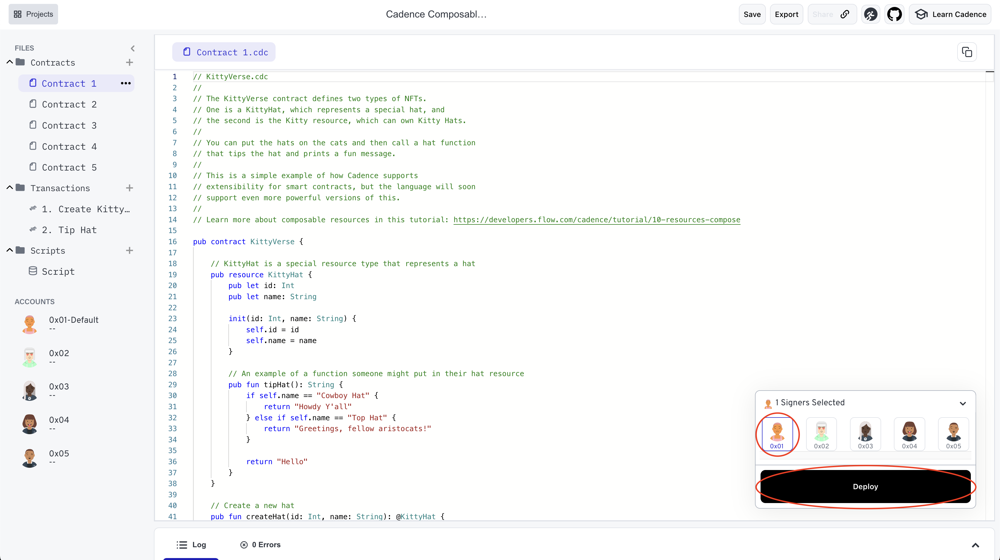

In this tutorial, we're going to walk through how resources can own other resources by creating, deploying, and moving composable NFTs.

---

<Callout type="success">
  Open the starter code for this tutorial in the Flow Playground:
  <a
    href="https://play.onflow.org/01f812d7-799a-42fd-b9cb-9ffe556e02ad"
    target="_blank"
  >
    https://play.onflow.org/01f812d7-799a-42fd-b9cb-9ffe556e02ad
  </a>
  <br/>
  The tutorial will be asking you do take various actions to interact with this code.
</Callout>

<Callout type="info">
Instructions that require you to take action are always included in a callout box like this one.
These highlighted actions are all that you need to do to get your code running,
but reading the rest is necessary to understand the language's design.
</Callout>

Resources owning other resources is a powerful feature in the world of blockchain and smart contracts.
To showcase how this feature works on Flow, this tutorial will take you through these steps with a composable NFT:

1. Deploy the `Kitty` and `KittyHat` definitions to account `0x01`
2. Create a `Kitty` and two `KittyHat`s and store them in your account
3. Move the Kitties and Hats around to see how composable NFTs function on Flow

**Before proceeding with this tutorial**, we recommend following the instructions in [Getting Started](./01-first-steps.mdx)
and [Hello, World!](./02-hello-world.mdx) to learn about the Playground and Cadence.


## Resources Owning Resources

---

The NFT collections talked about in [Non-Fungible Tokens](./05-non-fungible-tokens-1.mdx) are examples of resources that own other resources.
We have a resource, the NFT collection, that has ownership of the NFT resources that are stored within it.
The owner and anyone with a reference can move these resources around,
but they still belong to the collection while they are in it and the code defined in the collection has ultimate control over the resources.

When the collection is moved or destroyed, all of the NFTs inside of it are moved or destroyed with it.

If the owner of the collection transferred the whole collection resource to another user's account,
all of the tokens will move to the other user's account with it. The tokens don't stay in the original owner's account.
This is like handing someone your wallet instead of just a dollar bill. It isn't a common action, but certainly is possible.

References cannot be created for resources that are stored in other resources.
The owning resource has control over it and therefore controls the type of access that external calls have on the stored resource.

## Resources Owning Resources: An Example

---

The NFT collection is a simple example of how resources can own other resources, but innovative and more powerful versions can be made.

An important feature of CryptoKitties (and other applications on the Ethereum blockchain) is that any developer can make new experiences around the existing application.
Even though the original contract didn't include specific support for CryptoKitty accessories (like hats), an independent developer was still able to make hats that Kitties from the original contract could use.

Here is a basic example of how we can replicate this feature in Cadence:


<Callout type="info">

1. Open Contract 1, the `KittyVerse.cdc` contract<br/>
2. In the bottom right deployment modal, press the arrow to expand and make sure account `0x01` is selected as the signer.<br/>
3. Click the Deploy button to deploy the contract to account `0x01`

</Callout>



The deployed contract should have the following contents:

```cadence KittyVerse.cdc
// KittyVerse.cdc
//
// The KittyVerse contract defines two types of NFTs.
// One is a KittyHat, which represents a special hat, and
// the second is the Kitty resource, which can own Kitty Hats.
//
// You can put the hats on the cats and then call a hat function
// that tips the hat and prints a fun message.
//
// This is a simple example of how Cadence supports
// extensibility for smart contracts, but the language will soon
// support even more powerful versions of this.
//

access(all) contract KittyVerse {

    // KittyHat is a special resource type that represents a hat
    access(all) resource KittyHat {
        access(all) let id: Int
        access(all) let name: String

        init(id: Int, name: String) {
            self.id = id
            self.name = name
        }

        // An example of a function someone might put in their hat resource
        access(all) fun tipHat(): String {
            if self.name == "Cowboy Hat" {
                return "Howdy Y'all"
            } else if self.name == "Top Hat" {
                return "Greetings, fellow aristocats!"
            }

            return "Hello"
        }
    }

    // Create a new hat
    access(all) fun createHat(id: Int, name: String): @KittyHat {
        return <-create KittyHat(id: id, name: name)
    }

    access(all) resource Kitty {

        access(all) let id: Int

        // place where the Kitty hats are stored
        access(all) var items: @{String: KittyHat}

        init(newID: Int) {
            self.id = newID
            self.items <- {}
        }

        access(all) fun getKittyItems(): @{String: KittyHat} {
            var other: @{String:KittyHat} <- {}
            self.items <-> other
            return <- other
        }

        access(all) fun setKittyItems(items: @{String: KittyHat}) {
            var other <- items
            self.items <-> other
            destroy other
        }

        access(all) fun removeKittyItem(key: String): @KittyHat? {
            var removed <- self.items.remove(key: key)
            return <- removed
        }

        destroy() {
            destroy self.items
        }
    }

    access(all) fun createKitty(): @Kitty {
        return <-create Kitty(newID: 1)
    }

}

```

These definitions show how a Kitty resource could own hats.

The hats are stored in a variable in the Kitty resource.

```cadence
    // place where the Kitty hats are stored
    access(all) var items: <-{String: KittyHat}
```

A Kitty owner can take the hats off the Kitty and transfer them individually. Or the owner can transfer a Kitty that owns a hat, and the hat will go along with the Kitty.

Here is a transaction to create a `Kitty` and a `KittyHat`, store the hat in the Kitty, then store it in your account storage.

1. Open `Transaction1.cdc`.
1. Select account `0x01` as the only signer.
1. Send the transaction by clicking the Send button.

The transaction you sent just executed the following code:

```cadence Transaction1.cdc
import KittyVerse from 0x01

// This transaction creates a new kitty, creates two new hats and
// puts the hats on the cat. Then it stores the kitty in account storage.
transaction {
    prepare(acct: AuthAccount) {

        // Create the Kitty object
        let kitty <- KittyVerse.createKitty()

        // Create the KittyHat objects
        let hat1 <- KittyVerse.createHat(id: 1, name: "Cowboy Hat")
        let hat2 <- KittyVerse.createHat(id: 2, name: "Top Hat")

        let kittyItems <- kitty.getKittyItems()

        // Put the hat on the cat!
        let oldCowboyHat <- kittyItems["Cowboy Hat"] <- hat1
        destroy oldCowboyHat
        let oldTopHat <- kittyItems["Top Hat"] <- hat2
        destroy oldTopHat

        kitty.setKittyItems(items: <-kittyItems)

        log("The cat has the hats")

        // Store the Kitty in storage
        acct.storage.save(<-kitty, to: /storage/kitty)
    }
}
```

You should see an output that looks something like this:

```
> "The Cat has the Hats"
```

Now we can run a transaction to move the Kitty along with its hat, remove the cowboy hat from the Kitty, then make the Kitty tip its hat.


<Callout type="info">

1. Open `Transaction2.cdc`.<br/>
2. Select account `0x01` as the only signer.<br/>
3. Send the transaction.

</Callout>

In this transaction, we executed the following code:

```cadence Transaction2.cdc
import KittyVerse from 0x01

// This transaction moves a kitty out of storage, takes the cowboy hat off of the kitty,
// calls its tip hat function, and then moves it back into storage.
transaction {
    prepare(acct: AuthAccount) {

        // Move the Kitty out of storage, which also moves its hat along with it
        let kitty <- acct.storage.load<@KittyVerse.Kitty>(from: /storage/kitty)
            ?? panic("Kitty doesn't exist!")

        // Take the cowboy hat off the Kitty
        let cowboyHat <- kitty.removeKittyItem(key: "Cowboy Hat")
            ?? panic("cowboy hat doesn't exist!")

        // Tip the cowboy hat
        log(cowboyHat.tipHat())
        destroy cowboyHat

        // Tip the top hat that is on the Kitty
        log(kitty.items["Top Hat"]?.tipHat())

        // Move the Kitty to storage, which
        // also moves its hat along with it.
        acct.storage.save(<-kitty, to: /storage/kitty)
    }
}
```

You should see something like this output:

```
> "Howdy Y'all"
> "Greetings, fellow aristocats!"
```

Whenever the Kitty is moved, its hats are implicitly moved along with it. This is because the hats are owned by the Kitty.

## The Future is Meow! Extensibility is coming!

---

The above is a simple example of composable resources. We had to explicitly say that a Kitty could own a Hat in this example, but in the near future, Cadence will support more powerful ways of achieving resource extensibility where developers can declare types that separate resources can own even if the owning resource never specified the ownership possibility in the first place. This is a very complex problem to solve in a safe way, and the Flow community is working very hard to design a solution for this, but it is coming.

Practice what you're learned in the Flow Playground!
