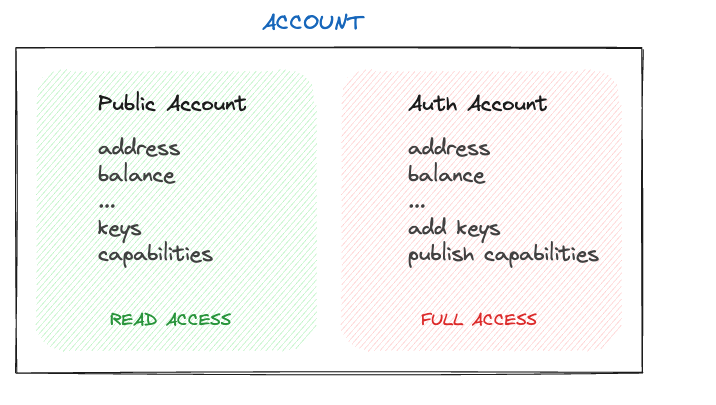
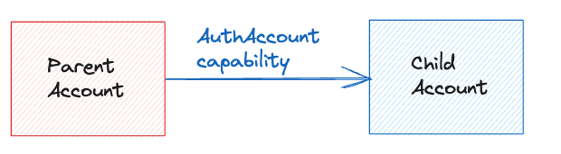
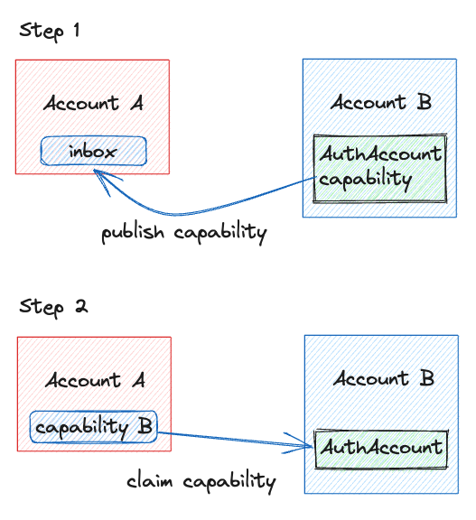
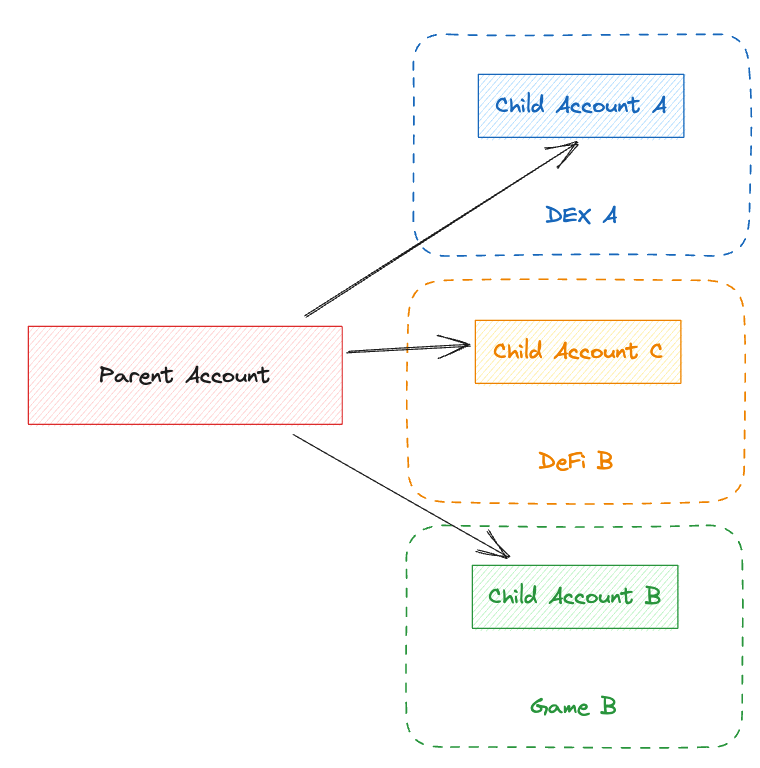

# Account Linking

Account linking is a unique Flow concept that enables sharing ownership over accounts. In order to understand how we can achieve that we must first understand how accounts on Flow are accessed.

Each account on flow can be accessed in Cadence through two types, `PublicAccount` and `AuthAccount`. As the name implies the public account type gives access to all public account information such as address, balance, storage capacity, etc., but doesn’t allow changing the account, whereas the auth account type allows the same access the public account has but also allows changing the account, which includes changing the account keys, managing the deployed contracts, and managing account capabilities.



## Accessing AuthAccount

Accessing the auth account allows for account modification, so it's essential to safeguard this access by mandating that transactions are signed by the account being accessed. A transaction can list multiple auth accounts it wants to access as part of the `pre` section of the transaction. Read more about transaction signing in the transaction documentation.

Since access to the `AuthAccount` object enables state change, the idea of account ownership actually translates to the ability to access the auth account. Traditionally, you might consider this the same as having key access on an account, but we'll see in just a minute how programmatic, ownership-level access is unlocked with Capabilities on Flow.

## AuthAccount Capabilities

Before proceeding the reader will need a clear understanding of [Cadence capabilities](../../cadence/language/capability-based-access-control) to follow this section. Advanced features such as AuthAccount Capabilities are powerful but if used incorrectly can put your app or users at risk.

Cadence allows the creation of capabilities to delegate access to account storage, meaning any account that has a valid capability to another account object in the storage can access it. This is a powerful feature on its own. The access to the object can be limited when creating a capability so only intended functions or fields can be accessed.

What makes account linking possible is an extension of the capabilities. Similar to how storage capabilities allow gaining access to a value stored in an account's storage, AuthAccount capabilities allow gaining access to an AuthAccount.

### Creating Account Links

When referring to 'account linking' we mean that an AuthAccount capability is created by the parent account and published to another account. The account owning the `AuthAccount` capability which was made available to another account is the parent account. The account in possession of the capability given by the parent account becomes its child account.



A link between two existing accounts on Flow can be created in two steps:

1. a child account creates an `AuthAccount` capability and publishes it to the parent account.
2. The parent account, claims that capability and can access the child's account through it.



These two steps are implemented in Cadence as two transactions:

************************************Create capability************************************

The account B creates and publishes the `AuthAccount` capability to the account A at the address `0x01`

```json
#allowAccountLinking

transaction {
    prepare(signer: AuthAccount) {
        let capability = signer.linkAccount(/private/accountCapA)!
        signer.inbox.publish(capability, name: "accountCapA", recipient: 0x1)
    }
}
```

****************************Claim capability****************************

The account A claims the capability published by account B.

```json
transaction {
    prepare(signer: AuthAccount) {
        let capability = signer.inbox.claim<&AuthAccount>("accountCapB", provider: 0x2)!
        let accountRef = capability.borrow()!
    }
}
```

## What is account linking most useful for?

Account linking was specifically designed to enable smooth and seamless onboarding of users to your Flow based application without them first requiring a wallet to do so. This pattern overcomes both the technical hurdle, as well as user's reluctance to install a wallet, and opens access to apps on Flow to every user. Users can experience an app without any delay while still offering a path to self-sovreign ownership. 

Naturally, users may expect to use their account with another application, or otherwise move assets stored in that account elsewhere. When an app initially leverages account linking it creates the account instead of the user and is where that user's specific state is stored. At a later point, users can take ownership of the app account providing they possess a full Flow account, typically by installing a wallet app.

Account linking enables users to possess multiple linked child accounts from different apps. Complexities associated with accessing those child accounts are eliminated by abstracting access to them through the user's parent account. Simply put, child accounts are accessed and treated as a seamless part of the parent account.

All assets in the app account can now jump the walled garden to play in the rest of the Flow ecosystem. No transactions are needed to move assets from the child account to the parent account, as the parent account already has full access to the assets in the child account.



This shared control over the digital items in the in-app account enables users to establish real ownership of the items beyond the context of the app, where they can use their parent account to view inventory, take the items to other apps in the ecosystem, such as a marketplace or a game.

Most importantly, users are able to do this without the need to transfer the digital items between accounts, making it seamless to continue using the original app while also using other apps.

## Security Consideration with Account Linking

Account linking is a very powerful feature of Cadence and thus it must be treated with care. In this document, we’ve always talked about account linking between two accounts we own, even if the child account is managed by a third-party application, that we access through an authentication mechanism, it’s still treated as our account.

Creating an `AuthAccount` capability and publishing it to an account we don’t own means we are giving that account full access to our account. This should be seen as an anti-pattern.

<aside>
❗ Creating an `AuthAccount` capability and sharing it with another person account is in concept the same as giving that person your accounts private keys.

</aside>

Because pure account linking can be dangerous Flow introduces a Hybrid Custody contract that helps manage child accounts and access.

## Hybrid Custody and Account Linking

Apps need assurances that their own resources are safe from malicious actors, so giving out full access might not be the form they want. Using hybrid custody contracts, the app still maintains control of their managed accounts, but they can:

1. Share capabilities freely, with a few built-in controls over the types of capabilities that can be returned with some helper contracts (the `CapabilityFactory`, and `CapabilityFilter`)
2. Share additional capabilities (public or private) with a parent account via a `CapabilityDelegator` resource

Learn more about it in the Hybrid Custody documentation.

### Guides[](https://developers.flow.com/concepts/account-linking#guides)

- [Building Walletless Applications Using Child Accounts](https://developers.flow.com/concepts/account-linking/child-accounts) covers how apps can leverage Account Linking to create a seamless user experience and enable future self-custody.
- [Working With Parent Accounts](https://developers.flow.com/concepts/account-linking/parent-accounts) covers features enabled by the core `HybridCustody` contract to access child account assets from parent accounts. This is useful for apps like marketplaces or wallets that are working with accounts that have potential child accounts.

### Resources[](https://developers.flow.com/concepts/account-linking#resources)

- [Forum Post](https://forum.onflow.org/t/hybrid-custody/4016) where core concepts were introduced and discussed.
- [GitHub repository](https://github.com/onflow/hybrid-custody) where `HybridCustody` core contract is maintained. Check out the repository for more advanced script or transaction examples.
- [Example](https://github.com/jribbink/magic-link-hc-sample/) Account Linking project with [Magic](https://magic.link/).
- [Starter template](https://github.com/Niftory/niftory-samples/tree/main/walletless-onboarding) for [Niftory](https://niftory.com/) Account Linking API.
- [Scaffold](https://github.com/onflow/hybrid-custody-scaffold) to start a new Account Linking project. Check out Flow CLI [Scaffolds](https://developers.flow.com/tooling/flow-cli/super-commands#using-scaffolds) to get started.
- [Wallet API](https://github.com/flow-hydraulics/flow-wallet-api/) is a microservice that enables apps to custody accounts. This is useful if you don't want to use a third-party service to manage user accounts.
- [Walletless Arcade](https://github.com/onflow/walletless-arcade-example) example demonstrates Account Linking with a local key management solution.