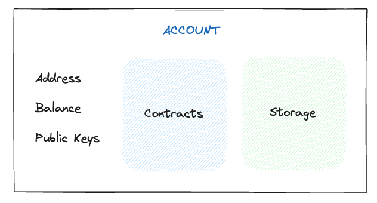
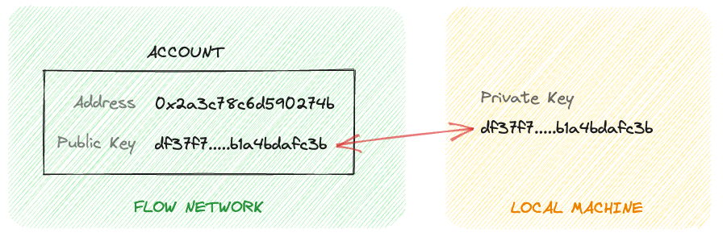

# Accounts

An account on Flow is a record in the chain state that holds the following information:
• Address: unique identifier for the account
• Public Keys: public keys authorized on the account
• Code: Cadence contracts deployed to the account
• Storage: area of the account used to store resource assets.

Accounts and their keys are needed to sign transactions that change the Flow blockchain state. To execute a transaction, a small amount of Flow, called a “Fee” must be paid by the account or subsidized by a wallet or service. Flow allocates a fixed amount of storage to each account for saving data structures and Resources. Flow allocates a fixed amount of storage to each account for saving data structures and Resources.
An account may also contain contract code which transactions and scripts can interact with to query or mutate the state of the blockchain.

A simple representation of an account:



**Address**

A Flow address is represented as 16 hex-encoded characters (usually prefixed with `0x` to indicate hex encoding). Unlike Bitcoin and Ethereum, Flow addresses are not derived from cryptographic public keys. Instead, each Flow address is assigned by an on-chain function that follows a deterministic addressing sequence.

This decoupling is a unique advantage of Flow, allowing for multiple public keys to be associated with one account, or for a single public key to be used across several accounts.

**Balance**

Each Flow account created on Mainnet will by default [hold a Flow vault that holds a balance and is part of the FungibleToken standard](./flow-token). This balance is used to pay for transaction fees and storage fees. More on that in the fees document.

<Callout type="warning">
The minimum amount of FLOW an account can have is **0.001**.

</Callout>

This minimum storage fee is provided by the account creator and covers the cost of storing up to 100kB of data in perpetuity. This fee is applied only once and can be "topped up" to add additional storage to an account. The minimum account reservation ensures that most accounts won't run out of storage capacity if anyone deposits anything (like an NFT) to the account. 

**Contracts**

An account can optionally store multiple Cadence contracts. The code is stored as a human-readable UTF-8 encoded string which makes it easy for anyone to inspect the contents.

**Storage**
Each Flow account has an associated storage and capacity. The account's storage used is the byte size of all the data stored in the account's storage. An account's storage capacity is directly tied to the balance of Flow tokens an account has. An account can, without any additional cost, use any amount of storage up to its storage capacity. If a transaction puts an account over storage capacity or drops an account's balance below the minimum 0.001 Flow tokens, that transaction fails and is reverted.

## Account **Keys**

Flow accounts can be configured with multiple public keys that are used to control access. Owners of the associated private keys can sign transactions to mutate the account's state.

During account creation, public keys can be provided which will be used when interacting with the account. Account keys can be added, removed, or revoked by sending a transaction. This is radically different from blockchains like Ethereum where an account is tied to a single public/private key pair.

Each account key has a weight that determines the signing power it holds.

<Callout type="warning">
A transaction is not authorized to access an account unless it has a total signature weight greater than or equal to **1000**, the weight threshold.

</Callout>

For example, an account might contain 3 keys, each with 500 weight:


This represents a 2-of-3 multi-sig quorum, in which a transaction is authorized to access the account if it receives signatures from *at least* 2 out of 3 keys.

An account key contains the following attributes:

- **ID** used to identify keys within an account
- **Public Key** raw public key (encoded as bytes)
- **Signature algorithm** (see below)
- **Hash algorithm** (see below)
- **Weight** integer between 0-1000
- **Revoked** whether the key has been revoked or it’s active
- **Sequence Number** is a number that increases with each submitted transaction signed by this key

### Signature and Hash Algorithms

The signature and hashing algorithms are used during the transaction signing process and can be set to certain predefined values.

There are two curves commonly used with the ECDSA algorithm, secp256r1 ([OID 1.2.840.10045.3.1.7](http://oid-info.com/get/1.2.840.10045.3.1.7), also called the "NIST P-256." this curve is common for mobile secure enclave support), and secp256k1 ([OID 1.3.132.0.10](http://oid-info.com/get/1.3.132.0.10), the curve used by "Bitcoin"). Please be sure to double-check which parameters you are using before registering a key, as presenting a key using one of the curves under the code and format of the other will generate an error.

| Algorithm | Curve     | ID              | Code |
| --------- | --------- | --------------- | ---- |
| ECDSA     | P-256     | ECDSA_P256      | 2    |
| ECDSA     | secp256k1 | ECDSA_secp256k1 | 3    |

*Please note that the codes listed here are for the signature algorithms as used by the node API, and they are different from the ones [defined in Cadence](../cadence/language/crypto.mdx#signing-algorithms)*

| Algorithm | Output Size | ID       | Code |
| --------- | ----------- | -------- | ---- |
| SHA-2     | 256         | SHA2_256 | 1    |
| SHA-3     | 256         | SHA3_256 | 3    |

Both hashing and signature algorithms are compatible with each other, so you can freely choose from the set.

### **Locked / Keyless Accounts**

An account on Flow doesn’t require keys in order to exist, but this makes the account immutable since no transaction can be signed that can change the account. This can be useful if we want to freeze an account contract code and it elegantly solves the problem of having multiple account types (as that is the case for Ethereum).



You can achieve keyless accounts by either removing an existing public key from an account signing with that same key and repeating that action until an account has no keys left, or you can create a new account that has no keys assigned. With account linking you can also have a child account that has no keys but is controlled by the parent.

<Callout type="danger">
Be careful when removing keys from an existing account, because once an account’s total key weights sum to less than 1000, it can no longer be modified.

</Callout>

### **Multi-Sig Accounts**

Creating a multi-signature account is easily done by managing the account keys and their corresponding weight. To repeat, in order to sign a transaction the keys used to sign it must have weights that sum up to at least 1000. Using this information we can easily see how we can achieve the following cases:

#### 2-of-3 multi-sig quorum


#### 3-of-3 multi-sig quorum


#### 1-of-2 signature


## Account Creation

Accounts are created on the Flow blockchain by calling a special [create account Cadence function](../cadence/language/accounts.mdx#account-creation). Once an account is created we can associate a new key with that account. Of course, all that can be done within a single transaction. Keep in mind that there is an account creation fee that needs to be paid. Account creation fees are relatively low, and we expect that wallet providers and exchanges will cover the cost when a user converts fiat to crypto for the first time.

For development purposes, [you can use Flow CLI to easily create emulator, testnet and mainnet accounts.](../tools/toolchains/flow-cli/accounts/create-accounts.md) The account creation fee is paid by a funding wallet so you don’t need a pre-existing account to create it.

### **Key Generation**

Keys should be generated in a secure manner. Depending on the purpose of the keys different levels of caution need to be taken.

<Callout type="warning">
Anyone obtaining access to a private key can modify the account the key is associated with (assuming it has enough weight). Be very careful how you store the keys.

</Callout>

For secure production keys, we suggest using key management services such as [Google key management](https://cloud.google.com/security-key-management) or [Amazon KMS](https://docs.aws.amazon.com/AmazonRDS/latest/UserGuide/Overview.Encryption.Keys.html), which are also supported by our CLI and SDKs. Those services are mostly great when integrated into your application. However, for personal use, you can securely use any [existing wallets](../tools/wallets.md) as well as a [hardware Ledger wallet](./flow-token/available-wallets.md#how-to-use-ledger).

## Service Accounts

The Flow Service Account is an account like any other on Flow except it is responsible for managing core network operations. You can think of the Service Account as the keeper of core network parameters which will be managed algorithmically over time but are currently set by a group of core contributors to ensure ease of updates to the network in this early stage of its development.

The service account is the account that manages the core protocol requirements of Flow. 
FlowServiceAccount deployed on the service account tracks transaction fees, and deployment permissions, and provides some convenience methods for Flow Token operations.
Source: [FlowServiceAccount.cdc](../building-on-flow/core-contracts/service-account#docusaurus_skipToContent_fallback)

## Accounts Retrieval

You can use the Flow CLI to get account data by running:

```sh
flow accounts get 0xf919ee77447b7497 -n mainnet
```

Find [more about the command in the CLI docs](../tools/toolchains/flow-cli/accounts/get-accounts.md).

Accounts can be obtained from the access node APIs, currently, there are two gRPC and REST APIs. You can find more information about them here:

**gRPC API** [concepts/nodes/access-api#accounts](../building-on-flow/nodes/access-api.mdx#accounts)

**REST API** [http-api#tag/Accounts](/http-api#tag/Accounts)

There are multiple SDKs implementing the above APIs for different languages:

**Javascript SDK** [tooling/fcl-js](../tools/clients/fcl-js/index.md)

**Go SDK** [tooling/flow-go-sdk](../tools/clients/flow-go-sdk/index.mdx)

Find a list of all SDKs here: [tools#sdks](../tools/clients/index.md)
