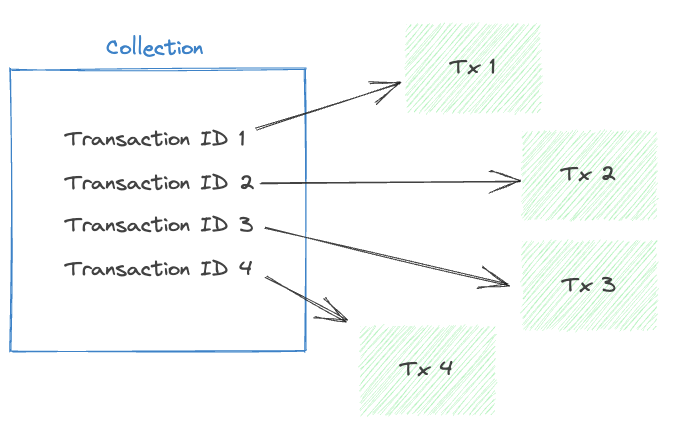

# Collections

Collections are a connecting link between blocks and transactions. They make an ordered list of one or more hashes of signed transactions. These are formed by collection node clusters. Why blocks don’t directly include transactions (as they do on Ethereum) is due to the optimization of data that needs to be transferred on the network. Consensus nodes need to only agree on the order of transactions to be executed, they don’t need to know the transaction payload, thus making blocks and collections lightweight. Collection nodes hold transaction payloads for anyone that requests them (e.g. execution nodes). 



## Collection Retrieval

You can use the Flow CLI to get the collection data by running:

```
flow collections get caff1a7f4a85534e69badcda59b73428a6824ef8103f09cb9eaeaa216c7d7d3f -n mainnet
```

Find [more about the command in the CLI docs](https://developers.flow.com/next/tools/toolchains/flow-cli/get-flow-data/get-collections).

Blocks can be obtained from the access node APIs, currently, there are two gRPC and REST APIs. You can find more information about them here:

**gRPC Block API** [https://developers.flow.com/concepts/nodes/access-api#collection](https://developers.flow.com/concepts/nodes/access-api#collection)

****************REST Block API**************** [https://developers.flow.com/http-api#tag/Collections](https://developers.flow.com/http-api#tag/Collections)

There are multiple SDKs implementing the above APIs for different languages:

******************************Javascript SDK****************************** [https://developers.flow.com/tooling/fcl-js](https://developers.flow.com/tooling/fcl-js)

**************Go SDK************** [https://developers.flow.com/tooling/flow-go-sdk](https://developers.flow.com/tooling/flow-go-sdk)

Find a list of all SDKs here: [https://developers.flow.com/tools#sdks](https://developers.flow.com/tools#sdks)