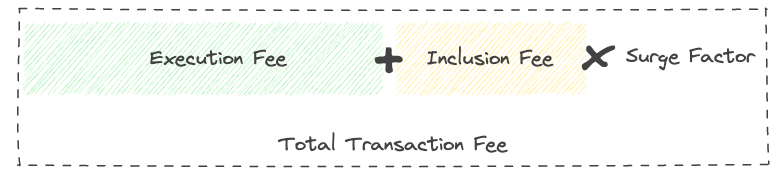

# Fees

## Transaction Fees

A transaction fee is a cost paid in Flow by the payer account required for a transaction to be included in the Flow blockchain. Fees are necessary for protecting the network against spam, and infinite running transactions and to provide monetary incentives for participants that make up the Flow network.

A transaction fee is paid regardless of whether a transaction succeeds or fails. If the payer account doesn’t have sufficient Flow balance to pay for the transaction fee, the transaction will fail. We can limit the transaction fee to some extent by providing the gas limit value when submitting the transaction.

### **************************Fee Structure**************************

Each transaction fee is a sum of three components: execution fee, inclusion fee, and network surge factor.

**************************Execution Fee**************************

The execution effort for a transaction is determined by the code path the transaction takes and the actions it does. The actions that have an associated execution effort cost can be separated into four broad buckets:

- Normal lines of cadence, loops, or function calls
- Reading data from storage, charged per byte read
- Writing data to storage, charged per byte written
- Account creation

| Transaction Type | Estimated cost (FLOW) |
| --- | --- |
| FT transfer | 0.00000185 |
| Mint a small NFT (heavily depends on the NFT size) | 0.0000019 |
| Empty Transaction | 0.000001 |
| Add key to an account | 0.000001 |
| Create 1 Account | 0.00000315 |
| Create 10 accounts | 0.00002261 |
| Deploying a contract that is ~50kb | 0.00002965 |

**************************Inclusion Fee**************************

The inclusion effort of a transaction represents the work needed for:

- Including the transaction in a block
- Transporting the transaction information from node to node
- Verifying transaction signatures

Right now, the inclusion effort is always 1.0 and the inclusion effort cost is fixed to `0.000001`. 

************************Surge Factor************************

In the future, a network surge will be applied when the network is busy due to an increased influx of transactions required to be processed or a decrease in the ability to process transactions. Right now, the network surge is fixed to `1.0`.

Currently, both the inclusion fee and surge factor don’t represent any significant Flow fees, however, keep in mind this can change in the future.

## Storage

Each Flow account has associated storage used. The account's storage used is the byte size of all the data stored in the account's storage. Accounts also have a storage capacity, which is directly tied to the amount of Flow tokens an account has. The account can, without any additional cost, use any amount of storage up to its storage capacity. 

<aside>
⚠️ If a transaction puts an account over storage capacity, that transaction fails and is reverted. Likewise, if a transaction would drop an account's balance below 0.001 Flow tokens, which is the minimum an account can have, the transaction would also fail.

</aside>

********************************Storage Capacity********************************

The storage capacity of an account is dictated by the amount of FLOW it has. 

<aside>
❗ The **minimum amount of FLOW an account can have is 0.001**. This minimum is provided by the account creator at account creation.

</aside>

The minimum account reservation ensures that most accounts won't run out of storage capacity if anyone deposits anything (like an NFT) to the account.

Currently, the amount required to store 100 MB in account storage is 1 Flow. 

Please note that storing data in an account on Flow doesn’t charge tokens from the account, it just makes sure you will keep the tokens as a reserve. Once the storage is freed up you can transfer the Flow tokens. 

### Storage Capacity of the Payer

The storage capacity of the Payer of a transaction is generally computed the same way as the capacity of any other account, however, the system needs to account for the transaction fees the payer will incur at the end of the transaction. The final amount of transaction fees is not yet fully known at the step when accounts are being checked for storage compliance (if their storage used is below their storage capacity). 

Because of this, the payer's balance is conservatively considered to be lower by the maximum possible transaction fees, when checking for storage compliance. The maximum transaction fee of a specific transaction is the transaction fee as if the transaction would have used up all of its execution effort limit.

### Storage Used

All data that is in an account's storage counts towards storage used. Even when an account is newly created it is not empty. There are already some items in its storage:

- Metadata that marks that the account exists.
- An empty FLOW vault, and stored receiver capability.
- Public keys to the account if the account was created with keys.
- Smart contracts deployed on the account if the account was created with contracts.
- The value of the account’s storage used as an unsigned integer.

Adding additional keys, smart contracts, capabilities, resources, etc. to the account counts towards storage used.

Data stored on the Flow blockchain is stored in a key-value ledger. Each item’s key contains the address that owns the item and the path to the item. Just as the shipping cost of a box of things you send to a friend includes the weight of the carton box itself, storing items on flow takes into account the key it is stored with. This means that the storage used by each item is the byte length of the item plus the byte length of the item’s key.