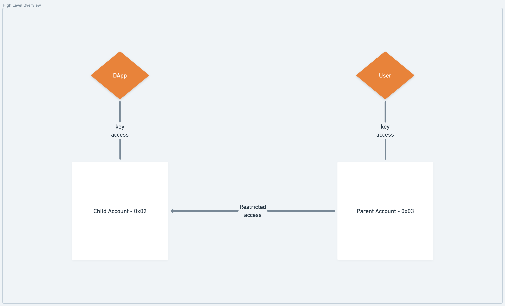

If you’ve built dApps on Flow, or any blockchain for that matter, you’re painfully aware of the user onboarding process and successive pain of prompting user signatures for on-chain interactions. As a developer, this leaves you with two options - handle custody and act on the user's behalf or go with the self-custodial status quo, hope your new users are Web3 native and authenticate them via their existing wallet. Either choice will force significant compromise, fragmenting user experience and leaving much to be desired compared to the broader status quo of Web2 identity authentication and single-click onboarding flow.

In this doc, we’ll dive into a progressive onboarding flow, including the Cadence scripts & transactions that go into its implementation in your dApp. These components will enable any implementing dApp to create a custodial account, mediate the user’s on-chain actions on their behalf, and later delegate access of that dApp-created account to the user’s wallet. We’ll refer to this custodial pattern as the Hybrid Account Model and the process of delegating control of the dApp account as Account Linking.

<Callout type="warning">

Note that the documentation on Hybrid Custody covers the current state and will likely differ from the final implementation. Builders should be aware that breaking changes may follow before reaching a final consensus on implementation. Interested in shaping the conversation? [Join in!](https://github.com/onflow/flips/pull/72)

</Callout>

# Objectives

- Create a [walletless onboarding](https://flow.com/post/flow-blockchain-mainstream-adoption-easy-onboarding-wallets) transaction
- Link an existing app account as a child to a newly authenticated parent account
- Get your dApp to recognize “parent” accounts along with any associated “child” accounts
- Put it all together to create a blockchain-native onboarding transaction
- View fungible and non-fungible Token metadata relating to assets across all of a user’s associated accounts - their wallet-mediated “parent” account and any hybrid custody model “child” accounts
- Facilitate transactions acting on assets in child accounts

# Point of Clarity

Before diving in, let's make a distinction between **"account linking"** and **"linking accounts"**.

## Account Linking

Very simply, account linking is a [feature in Cadence](https://github.com/onflow/flips/pull/53) that let's an [AuthAccount](../../../cadence/language/accounts.mdx#authaccount) create a [Capability](../../../cadence/language/capability-based-access-control.md) on itself. You can do so in the following transaction:

```cadence link_account.cdc
#allowAccountLinking

transaction(linkPathSuffix: String) {
    prepare(account: AuthAccount) {
        // Create the PrivatePath where we'll create the link
        let linkPath = PrivatePath(identifier: linkPathSuffix)
            ?? panic("Could not construct PrivatePath from given identifier: ".concat(linkPathSuffix))
        // Check if an AuthAccount Capability already exists at the specified path
        if !account.getCapability<&AuthAccount>(linkPath).check() {
            // If not, unlink anything that may be there and link the AuthAccount Capability
            account.unlink(linkpath)
            account.linkAccount(linkPath)
        }
    }
}
```

From there, the signing account can retrieve the privately linked AuthAccount Capability and delegate it to another account, unlinking the Capability if they wish to revoke delegated access.

Note that in order to link an account, a transaction must state the `#allowAccountLinking` pragma in the top line of the transaction. This is an interim safety measure so that wallet providers can notify users they're about to sign a transaction that may create a Capability on their AuthAccount.

<Callout type="info">

If you haven't yet, it may be helpful to checkout the [Account Model](./account-model.md) to get a mental model of the objects and account relationships discussed in this doc.

</Callout>

## Linking Accounts

Linking accounts leverages this account link, otherwise known as an **AuthAccount Capability**, and encapsulates it. The [components and actions](https://github.com/onflow/flips/pull/72) involved in this process - what the Capabity is encapsulated in, the collection that holds those encapsulations, etc. is what we'll dive into in this doc.

# Terminology

**Parent-Child accounts** - For the moment, we’ll call the account created by the dApp the “child” account and the account receiving its AuthAccount Capability the “parent” account. Existing methods of account access & delegation (i.e. keys) still imply ownership over the account, but insofar as linked accounts are concerned, the account to which both the user and the dApp share access via AuthAccount Capability will be considered the “child” account. This naming is a topic of community discussion and may be subject to change.

**Walletless onboarding** - An onboarding flow whereby a dApp creates an account for a user, onboarding them to the dApp, obviating the need for user wallet authentication.

**Blockchain-native onboarding** - Similar to the already familiar Web3 onboarding flow where a user authenticates with their existing wallet, a dApp onboards a user via wallet authentication while additionally creating a dApp account and linking it with the authenticated account, resulting in a hybrid custody model.

**Hybrid Custody Model** - A custodial pattern in which a dApp and a user maintain access to a dApp created account and user access to that account has been mediated by account linking.

**Account Linking** - Technically speaking, account linking in our context consists of giving some other account an AuthAccount Capability from the granting account. This Capability is maintained in standardized resource called a `HybridCustody.Manager`, providing its owning user access to any and all of their linked accounts.

**Progressive Onboarding** - An onboarding flow that walks a user up to self-custodial ownership, starting with walletless onboarding and later linking the dApp account with the user’s authenticated wallet once the user chooses to do so.

**Restricted Child Account** - An account delegation where the access on the delegating account is restricted according to rules set by the linking child account. The distinctions between this and the subsequent term ("owned" account) will be expanding on later.

**Owned Account** - An account delegation where the delegatee has unrestricted access on the delegating child account, thereby giving the delegatee presiding authority superseding any other "restricted" parent accounts.

# Account Linking

Linking an account is the process of delegating account access via AuthAccount Capability. Of course, we want to do this in a way that allows the receiving account to maintain that Capability and allows easy identification of the accounts on either end of the linkage - the user's main "parent" account and the linked "child" account. This is accomplished in the (still in flux) `HybridCustody` contract which we'll continue to use in this guidance.

## Pre-requisites

Since account delegation is mediated by developer-defined rules, you should make sure to first configure the resources that contain those rules. Those are [`CapabilityFilter`](https://github.com/Flowtyio/restricted-child-account/blob/main/contracts/CapabilityFilter.cdc) and [`CapabilityFactory`](https://github.com/Flowtyio/restricted-child-account/blob/main/contracts/CapabilityFactory.cdc). The former enumerates those types that are/aren't accessible from a child account while the latter enables the access of those allowable Capabilities such that the returned values can be properly typed - e.g. retrieving a Capability that can be cast to `Capability<&NonFungibleToken.Collection>` for example.

Here's how you would configure an `AllowAllFilter`:

```cadence setup_allow_all_filter.cdc
import "CapabilityFilter"

transaction {

    prepare(acct: AuthAccount) {
        // Check for a stored AllowAllFilter, saving if not found
        if acct.borrow<&CapabilityFilter.AllowAllFilter>(from: CapabilityFilter.StoragePath) == nil {
            acct.save(<- CapabilityFilter.create(Type<@CapabilityFilter.AllowAllFilter>()), to: CapabilityFilter.StoragePath)
        }
        // Link a Capability to the AllowAllFilter
        acct.unlink(CapabilityFilter.PublicPath)
        let linkRes = acct.link<&CapabilityFilter.AllowAllFilter{CapabilityFilter.Filter}>(CapabilityFilter.PublicPath, target: CapabilityFilter.StoragePath)
            ?? panic("link failed")
        assert(linkRes.check(), message: "failed to setup filter")
    }
}
```

And this transaction configures a `CapabilityFactory.Manager` and adds NFT related `Factory` objects:

<Callout type="info">

Note that the Manager configured here enables retrieval of castable Capabilities. It's recommended that you implement Factory resource definitions to support any NFT Collections related with the use of your application so that users can retrieve Typed Capabilities from accounts linked from your app.

</Callout>

```cadence setup_factory.cdc
import "CapabilityFactory"
import "NFTCollectionPublicFactory"
import "NFTProviderAndCollectionFactory"
import "NFTProviderFactory"

import "NonFungibleToken"

transaction {

    prepare(acct: AuthAccount) {
        // Check for a stored Manager, saving if not found
        if acct.borrow<&AnyResource>(from: CapabilityFactory.StoragePath) == nil {
            let f <- CapabilityFactory.createFactoryManager()
            acct.save(<-f, to: CapabilityFactory.StoragePath)
        }
        // Check for Capabilities where expected, linking if not found
        if !acct.getCapability<&CapabilityFactory.Manager{CapabilityFactory.Getter}>(CapabilityFactory.PrivatePath).check() {
            acct.unlink(CapabilityFactory.PublicPath)
            acct.link<&CapabilityFactory.Manager{CapabilityFactory.Getter}>(CapabilityFactory.PublicPath, target: CapabilityFactory.StoragePath)
        }

        assert(
            acct.getCapability<&CapabilityFactory.Manager{CapabilityFactory.Getter}>(CapabilityFactory.PublicPath).check(),
            message: "CapabilityFactory is not setup properly"
        )

        let manager = acct.borrow<&CapabilityFactory.Manager>(from: CapabilityFactory.StoragePath)
            ?? panic("manager not found")
        
        /// Add generic NFT-related Factory implementations to enable castable Capabilities from this Manager
        manager.addFactory(Type<&{NonFungibleToken.CollectionPublic}>(), NFTCollectionPublicFactory.Factory())
        manager.addFactory(Type<&{NonFungibleToken.Provider, NonFungibleToken.CollectionPublic}>(), NFTProviderAndCollectionFactory.Factory())
        manager.addFactory(Type<&{NonFungibleToken.Provider}>(), NFTProviderFactory.Factory())
    }
}
```

<Callout type="info">

Note that since account linking is a sensitive action, transactions where an account may be linked are designated by a topline pragma `#allowAccountLinking`. This lets wallet providers inform users that their account may be linked in the signing transaction.

</Callout>



*In this scenario, a user custodies a key for their main account which maintains access to a wrapped AuthAccount Capability, providing the user restricted access on the app account. The dApp maintains custodial access to the account and regulates the access restrictions to delegatee "parent" accounts.*

Linking accounts can be done in one of two ways. Put simply, the child account needs to get the parent account an AuthAccount Capability, and the parent needs to save that Capability so they can retain access in a manner that also represents each side of the link and safeguards the integrity of any access restrictions an application puts in place on delegated access.

We can achieve issuance from the child account and claim from the parent account pattern in either:

1. Multisig transaction signed by both the the accounts on either side of the link
2. We can leverage [Cadence’s `AuthAccount.Inbox`](../../../cadence/language/accounts.mdx#account-inbox) to publish the Capability from the child account & have the parent claim the Capability in a separate transaction.

Let’s take a look at both.

<Callout type="info">

You'll want to consider whether you would like the parent account to be configured with some app-specific resources or Capabilities and compose you multisig or claim transactions to include such configurations.

For example, if your dApp deals with specific NFTs, you may want to configure the parent account with Collections for those NFTs so the user can easily transfer them between their linked accounts.

</Callout>

## Publish & Claim

### Publish

Here, the account delegating access to itself links its AuthAccount Capability, and publishes it to be claimed by the account it will be linked to.

```cadence publish_to_parent.cdc
#allowAccountLinking

import "HybridCustody"
import "CapabilityFactory"
import "CapabilityFilter"
import "CapabilityProxy"

transaction(parent: Address, factoryAddress: Address, filterAddress: Address) {

    prepare(acct: AuthAccount) {
        // This account has conceivably already configured a ChildAccount resource
        let child = acct.borrow<&HybridCustody.ChildAccount>(from: HybridCustody.ChildStoragePath)
            ?? panic("child account not found")
        // Get the CapabilityFactory Manager Capability
        let factory = getAccount(factoryAddress).getCapability<&CapabilityFactory.Manager{CapabilityFactory.Getter}>(CapabilityFactory.PublicPath)
        assert(factory.check(), message: "factory address is not configured properly")

        let filter = getAccount(filterAddress).getCapability<&{CapabilityFilter.Filter}>(CapabilityFilter.PublicPath)
        assert(filter.check(), message: "capability filter is not configured properly")

        child.publishToParent(parentAddress: parent, factory: factory, filter: filter)
    }
}
```

### Claim

On the other side, the receiving account claims the published AuthAccount Capability, adding it to the signer's `HybridCustody.Manager`.

```cadence redeem_account.cdc
import "MetadataViews"

import "HybridCustody"
import "CapabilityFilter"

transaction(childAddress: Address, filterAddress: Address?, filterPath: PublicPath?) {
    
    prepare(acct: AuthAccount) {
        // Assign a Capability Filter for the Manager if defined
        var filter: Capability<&{CapabilityFilter.Filter}>? = nil
        if filterAddress != nil && filterPath != nil {
            filter = getAccount(filterAddress!).getCapability<&{CapabilityFilter.Filter}>(filterPath!)
        }
        // Configure a Manager if none found in storage
        if acct.borrow<&HybridCustody.Manager>(from: HybridCustody.ManagerStoragePath) == nil {
            let m <- HybridCustody.createManager(filter: filter)
            acct.save(<- m, to: HybridCustody.ManagerStoragePath)

            acct.unlink(HybridCustody.ManagerPublicPath)
            acct.unlink(HybridCustody.ManagerPrivatePath)

            acct.link<&HybridCustody.Manager{HybridCustody.ManagerPrivate, HybridCustody.ManagerPublic}>(HybridCustody.ManagerPrivatePath, target: HybridCustody.ManagerStoragePath)
            acct.link<&HybridCustody.Manager{HybridCustody.ManagerPublic}>(HybridCustody.ManagerPublicPath, target: HybridCustody.ManagerStoragePath)
        }
        // Derive the published Capability name & claim from Inbox
        let inboxName = HybridCustody.getProxyAccountIdentifier(acct.address)
        let cap = acct.inbox.claim<&HybridCustody.ProxyAccount{HybridCustody.AccountPrivate, HybridCustody.AccountPublic, MetadataViews.Resolver}>(inboxName, provider: childAddress)
            ?? panic("proxy account cap not found")
        // Reference the Manager
        let manager = acct.borrow<&HybridCustody.Manager>(from: HybridCustody.ManagerStoragePath)
            ?? panic("manager no found")
        // Add the claimed ProxyAccount Capability
        manager.addAccount(cap)
    }
}

```

### Multisig Transaction

We can combine the two transactions in [Publish](#publish) and [Claim](#claim) into a single multi-signed transaction to achieve Hybrid Custody in a single step.

```cadence
#allowAccountLinking

import "HybridCustody"
import "CapabilityFactory"
import "CapabilityFilter"
import "CapabilityProxy"

transaction(
    factoryAddress: Address,
    childFilterAddress: Address,
    managerFilterAddress: Address?,
    managerFilterPath: PublicPath?
) {

    prepare(parent: AuthAccount, child: AuthAccount) {
        /* --- Child account configuration --- */
        //
        // This account has conceivably already configured a ChildAccount resource
        let childAccount = acct.borrow<&HybridCustody.ChildAccount>(from: HybridCustody.ChildStoragePath)
            ?? panic("ChildAccount not found in signing child account")
        // Get the CapabilityFactory Manager Capability
        let factory = getAccount(factoryAddress).getCapability<&CapabilityFactory.Manager{CapabilityFactory.Getter}>(CapabilityFactory.PublicPath)
        assert(factory.check(), message: "factory address is not configured properly")
        // Get the CapabilityFactory Manager Capability
        let childFilter = getAccount(childFilterAddress).getCapability<&{CapabilityFilter.Filter}>(CapabilityFilter.PublicPath)
        assert(childFilter.check(), message: "capability filter is not configured properly")
        // Configure the account for hybrid custody
        childAccount.publishToParent(parentAddress: parent, factory: factory, filter: childFilter)

        /* --- Parent account configuration --- */
        //
        // Assign a Capability Filter for the Manager if defined
        var managerFilter: Capability<&{CapabilityFilter.Filter}>? = nil
        if managerFilterAddress != nil && managerFilterPath != nil {
            filter = getAccount(managerFilterAddress!).getCapability<&{CapabilityFilter.Filter}>(managerFilterPath!)
        }
        // Configure a Manager if none found in storage
        if acct.borrow<&HybridCustody.Manager>(from: HybridCustody.ManagerStoragePath) == nil {
            let m <- HybridCustody.createManager(filter: managerFilter)
            acct.save(<- m, to: HybridCustody.ManagerStoragePath)

            acct.unlink(HybridCustody.ManagerPublicPath)
            acct.unlink(HybridCustody.ManagerPrivatePath)

            acct.link<&HybridCustody.Manager{HybridCustody.ManagerPrivate, HybridCustody.ManagerPublic}>(HybridCustody.ManagerPrivatePath, target: HybridCustody.ManagerStoragePath)
            acct.link<&HybridCustody.Manager{HybridCustody.ManagerPublic}>(HybridCustody.ManagerPublicPath, target: HybridCustody.ManagerStoragePath)
        }
        // Derive the published Capability name & claim from Inbox
        let inboxName = HybridCustody.getProxyAccountIdentifier(acct.address)
        // **NOTE** - we're claiming here since the Capability is published in publishToParent() above, though we could've
        // retrieved the ProxyAccount Capability from the signing child account
        let cap = acct.inbox.claim<&HybridCustody.ProxyAccount{HybridCustody.AccountPrivate, HybridCustody.AccountPublic, MetadataViews.Resolver}>(inboxName, provider: childAddress)
            ?? panic("proxy account cap not found")
        // Reference the Manager
        let manager = acct.borrow<&HybridCustody.Manager>(from: HybridCustody.ManagerStoragePath)
            ?? panic("manager no found")
        // Add the claimed ProxyAccount Capability
        manager.addAccount(cap)
    }
}
```

# Onboarding Flows

Given the ability to establish an account and later delegate access to a user, dApps are freed from the constraints of dichotomous custodial & self-custodial paradigms. A developer can choose to onboard a user via traditional Web2 identity and later delegate access to the user’s wallet account. Alternatively, a dApp can enable wallet authentication at the outset, creating a dApp-specific account & linking with the user’s wallet account. As specified above, these two flows are known as walletless and blockchain-native respectively. Developers can choose to implement one for simplicity or both for maximum flexibility.

## Walletless Onboarding

### Account Creation

The following transaction creates an account, funding creation via the signer and adding the provided public key. You'll notice this transaction is pretty much your standard account creation. The magic for you will be how you custody the key for this account (locally, KMS, wallet service, etc.) in a manner that allows your dapp to mediate on-chain interactions on behalf of your user.

```cadence walletless_onboarding
import "FlowToken"
import "FungibleToken"

/// Taken from the onflow/linked-accounts repo
/// https://github.com/onflow/linked-accounts
///
transaction(pubKey: String, initialFundingAmt: UFix64) {
	
	prepare(signer: AuthAccount) {

		/* --- Account Creation --- */
		//
		// Create the child account, funding via the signer
		let newAccount = AuthAccount(payer: signer)
		// Create a public key for the proxy account from string value in the provided arg
		// **NOTE:** You may want to specify a different signature algo for your use case
		let key = PublicKey(
			publicKey: pubKey.decodeHex(),
			signatureAlgorithm: SignatureAlgorithm.ECDSA_P256
		)
		// Add the key to the new account
		// **NOTE:** You may want to specify a different hash algo & weight best for your use case
		newAccount.keys.add(
			publicKey: key,
			hashAlgorithm: HashAlgorithm.SHA3_256,
			weight: 1000.0
		)

		/* --- (Optional) Additional Account Funding --- */
		//
		// Fund the new account if specified
		if initialFundingAmt > 0.0 {
			// Get a vault to fund the new account
			let fundingProvider = signer.borrow<&FlowToken.Vault{FungibleToken.Provider}>(
					from: /storage/flowTokenVault
				)!
			// Fund the new account with the initialFundingAmount specified
			newAccount.getCapability<&FlowToken.Vault{FungibleToken.Receiver}>(/public/flowTokenReceiver)
                .borrow()!
			    .deposit(
                    from: <-fundingProvider.withdraw(
                        amount: initialFundingAmt
                    )
                )
		}

		/* Continue with use case specific setup */
		//
		// At this point, the newAccount can further be configured as suitable for
		// use in your dapp (e.g. Setup a Collection, Mint NFT, Configure Vault, etc.)
		// ...
	}
}
```

## Blockchain-Native Onboarding

This onboarding flow is really a single-transaction composition of the steps covered above. This is a testament to the power of the complex transactions you can compose on Flow with Cadence!

<Callout type="info">

Recall the [pre-requisites](#pre-requisites) needed to be satisfied before linking an account: <br/>

1. CapabilityFilter Filter saved and linked <br/>
1. CapabilityFactory Manager saved and linked as well as Factory implementations supporting the Capability Types you'll want accessible from linked child accounts as Typed Capabilities.

</Callout>

### Account Creation & Linking

Compared to walletless onboarding where a user does not have a Flow account, blockchain-native onboarding assumes a user already has a wallet configured and immediately links it with a newly created dApp account. This enables the dApp to sign transactions on the user's behalf via the new child account while immediately delegating control of that account to the onboarding user's main account.

After this transaction, both the custodial party (presumably the client/dApp) and the signing parent account will have access to the newly created account - the custodial party via key access and the parent account via their `HybridCustody.Manager` maintaining the new account's `ProxyAccount` Capability.

```cadence blockchain_native_onboarding.cdc
#allowAccountLinking

import "HybridCustody"
import "CapabilityFactory"
import "CapabilityFilter"
import "CapabilityProxy"

transaction(parent: Address, factoryAddress: Address, filterAddress: Address) {
    prepare(parent: AuthAccount, app: AuthAccount) {
        /* --- Account Creation --- */
		//
		// Create the child account, funding via the signer
		let newAccount = AuthAccount(payer: app)
		// Create a public key for the proxy account from string value in the provided arg
		// **NOTE:** You may want to specify a different signature algo for your use case
		let key = PublicKey(
			publicKey: pubKey.decodeHex(),
			signatureAlgorithm: SignatureAlgorithm.ECDSA_P256
		)
		// Add the key to the new account
		// **NOTE:** You may want to specify a different hash algo & weight best for your use case
		newAccount.keys.add(
			publicKey: key,
			hashAlgorithm: HashAlgorithm.SHA3_256,
			weight: 1000.0
		)

		/* --- (Optional) Additional Account Funding --- */
		//
		// Fund the new account if specified
		if initialFundingAmt > 0.0 {
			// Get a vault to fund the new account
			let fundingProvider = signer.borrow<&FlowToken.Vault{FungibleToken.Provider}>(
					from: /storage/flowTokenVault
				)!
			// Fund the new account with the initialFundingAmount specified
			newAccount.getCapability<&FlowToken.Vault{FungibleToken.Receiver}>(/public/flowTokenReceiver)
                .borrow()!
			    .deposit(
                    from: <-fundingProvider.withdraw(
                        amount: initialFundingAmt
                    )
                )
		}

		/* Continue with use case specific setup */
		//
		// At this point, the newAccount can further be configured as suitable for
		// use in your dapp (e.g. Setup a Collection, Mint NFT, Configure Vault, etc.)
		// ...

        /* --- Link the AuthAccount Capability --- */
        //
        var acctCap = newAccount.linkAccount(HybridCustody.LinkedAccountPrivatePath)

        // Create a ChildAccount & link Capabilities
        let ChildAccount <- HybridCustody.createChildAccount(acct: acctCap)
        newAccount.save(<-ChildAccount, to: HybridCustody.ChildStoragePath)
        newAccount.link<&HybridCustody.ChildAccount{HybridCustody.BorrowableAccount, HybridCustody.ChildAccountPublic, HybridCustody.ChildAccountPrivate}>(
            HybridCustody.ChildPrivatePath,
            target: HybridCustody.ChildStoragePath
        )
        newAccount.link<&HybridCustody.ChildAccount{HybridCustody.ChildAccountPublic}>(
            HybridCustody.ChildPublicPath, 
            target: HybridCustody.ChildStoragePath
        )

        // Get a reference to the ChildAccount resource
        let child = acct.borrow<&HybridCustody.ChildAccount>(from: HybridCustody.ChildStoragePath)!

        // Get the CapabilityFactory.Manager Capability
        let factory = getAccount(factoryAddress).getCapability<&CapabilityFactory.Manager{CapabilityFactory.Getter}>(CapabilityFactory.PublicPath)
        assert(factory.check(), message: "factory address is not configured properly")

        // Get the CapabilityFilter.Filter Capability
        let filter = getAccount(filterAddress).getCapability<&{CapabilityFilter.Filter}>(CapabilityFilter.PublicPath)
        assert(filter.check(), message: "capability filter is not configured properly")

        // Configure access for the delegatee parent account
        child.publishToParent(parentAddress: parent, factory: factory, filter: filter)

        /* --- Add delegation to parent account --- */
        //
        // Configure HybridCustody.Manager if needed
        if parent.borrow<&HybridCustody.Manager>(from: HybridCustody.ManagerStoragePath) == nil {
            let m <- HybridCustody.createManager(filter: filter)
            acct.save(<- m, to: HybridCustody.ManagerStoragePath)
        }

        // Link Capabilities
        parent.unlink(HybridCustody.ManagerPublicPath)
        parent.unlink(HybridCustody.ManagerPrivatePath)
        parent.link<&HybridCustody.Manager{HybridCustody.ManagerPrivate, HybridCustody.ManagerPublic}>(
            HybridCustody.ManagerPrivatePath,
            target: HybridCustody.ManagerStoragePath
        )
        parent.link<&HybridCustody.Manager{HybridCustody.ManagerPublic}>(
            HybridCustody.ManagerPublicPath,
            target: HybridCustody.ManagerStoragePath
        )
        
        // Claim the ProxyAccount Capability
        let inboxName = HybridCustody.getProxyAccountIdentifier(acct.address)
        let cap = acct.inbox.claim<&HybridCustody.ProxyAccount{HybridCustody.AccountPrivate, HybridCustody.AccountPublic, MetadataViews.Resolver}>(
                inboxName,
                provider: childAddress
            ) ?? panic("proxy account cap not found")
        
        // Get a reference to the Manager and add the account
        let managerRef = parent.borrow<&HybridCustody.Manager>(from: HybridCustody.ManagerStoragePath)
            ?? panic("manager no found")
        managerRef.addAccount(cap)
    }
}
```

# Funding & Custody Patterns

Aside from implementing onboarding flows & account linking, you'll want to also consider the account funding & custodial pattern appropriate for the dApp you're building. The only one compatible with walletless onboarding (and therefore the only one showcased above) is one in which the dApp custodies the child account's key and funds account creation.

In general, the funding pattern for account creation will determine to some extent the backend infrastructure needed to support your dApp and the onboarding flow your dApp can support. For example, if you want to to create a service-less client (a totally local dApp without backend infrastructure), you could forego walletless onboarding in favor of a user-funded blockchain-native onboarding to achieve a hybrid custody model. Your dApp maintains the keys to the dApp account to sign on behalf of the user, and the user funds the creation of the the account, linking to their main account on account creation. This would be a **user-funded, dApp custodied** pattern.

Again, custody may deserve some regulatory insight depending on your jurisdiction. If building for production, you'll likely want to consider these non-technical implications in your technical decision-making. Such is the nature of building in crypto.

Here are the patterns you might consider:

## DApp-Funded, DApp-Custodied

If you want to implement walletless onboarding, you can stop here as this is the only compatible pattern. In this scenario, a backend dApp account funds the creation of a new account and the dApp custodies the key for said account either on the user's device or some backend KMS.

## DApp-Funded, User-Custodied

In this case, the backend dApp account funds account creation, but adds a key to the account which the user custodies. In order for the dApp to act on the user's behalf, it has to be delegated access via AuthAccount Capability which the backend dApp account would maintain in a `HybridCustody.Manager`. This means that the new account would have two parent accounts - the user's and the dApp. While not comparatively useful now, once [`SuperAuthAccount`](https://forum.onflow.org/t/super-user-account/4088) is ironed out and implemented, this pattern will be the most secure in that the custodying user will have ultimate authority over the child account. Also note that this and the following patterns are incompatible with walletless onboarding in that the user must have a wallet.

## User-Funded, DApp-Custodied

As mentioned above, this pattern unlocks totally service-less architectures - just a local client & smart contracts. An authenticated user signs a transaction creating an account, adding the key provided by the client, and linking the account as a child account. At the end of the transaction, hybrid custody is achieved and the dApp can sign with the custodied key on the user's behalf using the newly created account.

## User-Funded, User-Custodied

While perhaps not useful for most dApps, this pattern may be desirable for advanced users who wish to create a shared access account themselves. The user funds account creation, adding keys they custody, and delegates secondary access to some other account. As covered above in account linking, this can be done via multisig or the publish & claim mechanism.

# Additional Resources

You can find additional Cadence examples in context at the following repos:

- [LinkedAccounts contract & supporting scripts & transactions](https://github.com/onflow/linked-accounts)
- [Using ChildAccount paradigm in an on-chain Rock, Paper, Scissors game](https://github.com/onflow/sc-eng-gaming/tree/sisyphusSmiling/child-account-auth-acct-cap)