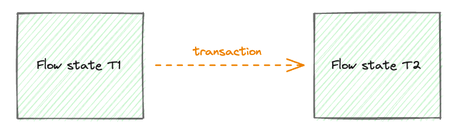
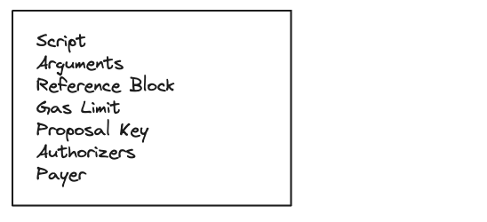
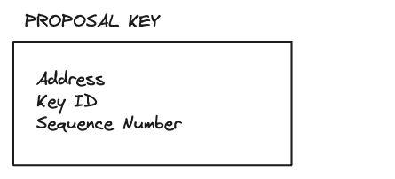
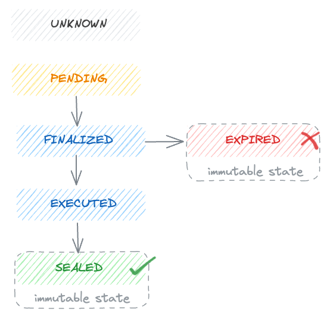
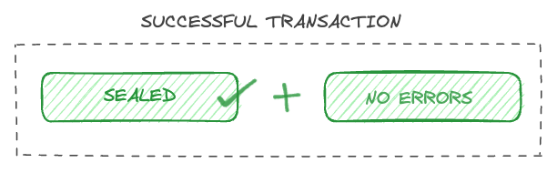
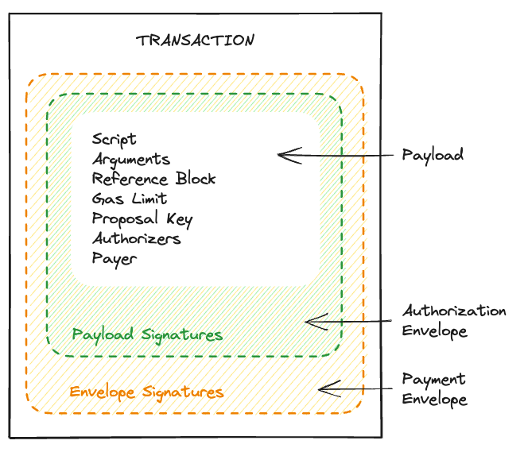

# Transactions

Transactions are cryptographically signed data messages that contain a set of instructions that update the Flow state. They are a basic unit of computation that gets executed by execution nodes. In order for a transaction to be included in the Flow blockchain a fee is required from the payer. 



<Callout type="tip">
Transactions on Flow are fundamentally different from those on Ethereum. The main purpose of a transaction is not to send funds but to contain code that gets executed. This makes transactions very flexible and powerful. In addition to being able to access the authorizing accounts private assets, transactions can also read and call functions in public contracts, and access public domains in other users' accounts Transactions on Flow also feature different roles, such as defining third-party payer accounts, proposer accounts, and authorizers, which we will talk about in detail soon.

</Callout>

In order for a transaction to be valid and executed it must contain signatures from accounts involved as well as some other information, let’s take a look at all the required fields.



**Script**

The script section contains instructions for transaction execution. This is a Cadence program in source code form (human-readable), and encoded as UTF-8. The transaction program must contain a `transaction` declaration. 

A transaction includes multiple optional phases `prepare`, `pre`, `execute`, and `post` phase. You can read more about it in the [Cadence reference document on transactions](../cadence/language/transactions.md). Each phase has a purpose, the two most important phases are `prepare` and `execute`. 

In the `prepare` phase, we have access to `AuthAccount` objects, which gives us the power to interact with those accounts. The accounts are called authorizers of transactions, so each account we want to interact with in the `prepare` phase must sign the transaction as an authorizer. 
The `execute` phase does exactly what it says, it executes the main logic of the transaction. This phase is optional, but it is a best practice to add your main transaction logic in the section, so it is explicit. 

Again make sure to read Cadence [documentation on transactions](../cadence/language/transactions.md)

This is an example of a transaction script:

```cadence
transaction(greeting: String) {
  execute {
    log(greeting.concat(", World!"))
  }
}
```

**Arguments**

Transactions may declare parameters it needs during execution, these must be provided as input arguments when sending a transaction. You can think of them as function arguments. Currently, we provide [arguments in the JSON-Cadence Data Interchange Format](../cadence/json-cadence-spec.md#docusaurus_skipToContent_fallback). Which is a human-readable JSON format. The sample script from above accepts a single `String` argument.

**Reference Block**

A reference to a recent block used for expiry. A transaction is considered expired if it is submitted to Flow after reference block height + N, where N is a constant defined by the network. On mainnet current setting for N is 600 which amounts to approximately 10 minutes for expiry (please note this is subject to change).

**Gas Limit**

When a transaction is executed each operation consumes a predefined amount of computational units (we define more about that in the Fees documentation). This defines the maximum amount of computation that is allowed to be done during this transaction. If a transaction completes execution using fewer computational units than the limit, it remains unaffected. However, if it hits this limit during execution, the transaction will fail, its changes will be reverted, but fees will still be applied. The maximum computational limit for Flow mainnet is currently at 9999, but this might change. The maximum network limit is defined to protect the network from transactions that would run forever. 

**Proposal Key**

Each transaction must declare a proposal key, which can be an account key from any Flow account (App, User or Wallet). The account that owns the proposal key is referred to as the *proposer*. 

Proposer is a role in a transaction that defines who is proposing the transaction, the effect of the transaction being submitted on the proposer is that it will increment the sequence number for the provided proposer key. This is done to ensure transactions are not resubmitted (replay attack) and thus sequencing actions. 

A proposal key definition declares the address, key ID, and up-to-date sequence number for the account key. A single proposer can have many transactions executed in parallel only limited by the key they use to propose the transaction.



- Address identifies the account that will act as a proposer of this transaction.
- Key ID is an index number (starting at 0) that identifies the key on the account provided in the address.
- Sequence Number is a number on each key that increments by 1 with each transaction. This ensures that each transaction executes at most once and prevents many unwanted situations, such as [transaction replay attacks](https://en.wikipedia.org/wiki/Replay_attack). Each key in an account has a dedicated sequence number associated with it. Unlike Ethereum, there is no sequence number for the entire account.

**Authorizers**

Authorizers are accounts that authorize a transaction to read and mutate their state. A transaction can specify zero or more authorizers, depending on how many accounts the transaction needs to access.

The number of authorizers on the transaction must match the number of AuthAccount parameters declared in the prepare statement of the Cadence script.

Example transaction with multiple authorizers:

```cadence
transaction {
  prepare(authorizer1: AuthAccount, authorizer2: AuthAccount) { }
}
```

Each account defined as an authorizer must sign the transaction with its own key, and by doing so it acknowledges the transaction it signed will have access to that account and may modify it. How it will modify it is understood from reading the transaction script.

**Payer**

A payer is the account that pays the fees for the transaction. A transaction must specify exactly one payer. The payer is only responsible for paying the network and gas fees; the transaction is not authorized to access resources or code stored in the payer account. 

By explicitly specifying a payer a transaction can be paid by third-party services such as wallet providers.

## Transaction Lifecycle

Once a transaction has been submitted to the Flow network using the Access node APIs, it will begin its lifecycle and eventually reach a finality. Each submitted transaction can be identified with an ID. 

**Transaction ID**

A transaction ID is a hash of the encoded transaction payload and can be calculated at any time. We don’t submit transaction ID as part of the transaction payload as it can be derived from the data and thus would mean duplication of data.

### Transaction Status

The transaction status represents the state of a transaction on the Flow blockchain. Some statuses are mutable and some are immutable, they usually follow a timeline like so:



- Unknown - The transaction has not yet been seen by the section of the network you communicate with.
- Pending - The transaction has been received by a collection node but has not yet been finalized in a block.
- Finalized - The consensus nodes have included the transaction in a block, but it has not been executed by execution nodes.
- Executed - Execution nodes have produced a result for the transaction. 
- Sealed - The verification nodes have verified and agreed on the result of the transaction and the consensus node has included the seal in the latest block.
- Expired - The transaction was submitted past its expiration block height.

<Callout type="danger">
It is **important to differentiate the transaction status and transaction result**. Transaction status will only provide you with information about the inclusion of the transaction in the blockchain, not whether the transaction was executed the way you intended. **A transaction can still fail to execute the way you intended and be sealed.**

</Callout>

### Transaction Result

Once a transaction is executed, its result will be available, providing details on its success or any errors encountered during execution. It also includes events the transaction may have emitted. 



<Callout type="danger">
From a developer perspective, a transaction is only successful if:

- It is sealed
- It didn’t encounter errors
</Callout>

## Signing a Transaction

Due to the existence of **weighted keys** and **split signing roles**, Flow transactions sometimes need to be signed multiple times by one or more parties. That is, multiple unique signatures may be needed to authorize a single transaction.

A transaction can contain two types of signatures: **payload signatures** and **envelope signatures**.



### Payload[](../concepts/start-here/transaction-signing.md#payload)

The transaction payload is the innermost portion of a transaction and contains the data that uniquely identifies the operations applied by the transaction as we have defined them above. In Flow, two transactions with the same payload will never be executed more than once.

<Callout type="warning">
⚠️ The transaction proposer and authorizer are only required to sign the transaction payload. These signatures are the payload signatures.

</Callout>

### Authorization Envelope[](../concepts/start-here/transaction-signing.md#authorization-envelope)

The transaction authorization envelope contains both the transaction payload and the payload signatures.

The transaction payer is required to sign the authorization envelope. These signatures are **envelope signatures**.

<Callout type="danger">
Special case: if an account is both the payer and either a proposer or authorizer, it is required only to sign the envelope.

</Callout>

### Payment Envelope[](../concepts/start-here/transaction-signing.md#payment-envelope)

The outermost portion of the transaction, which contains the payload and envelope signatures, is referred to as the payment envelope.

<Callout type="danger">
Special case: if an account is both the payer and either a proposer or authorizer, it is required only to sign the envelope.

</Callout>

### Payer Signs Last[](../concepts/start-here/transaction-signing.md#payer-signs-last)

The payer must sign the portion of the transaction that contains the payload signatures, which means that the payer must always sign last. This ensures the payer that they are signing a valid transaction with all of the required payload signatures.

<Callout type="danger">
Special case: if an account is both the payer and either a proposer or authorizer, it is required only to sign the envelope.

</Callout>

### Signature Structure[](../concepts/start-here/transaction-signing.md#signature-structure)

A transaction signature is a composite structure containing three fields:

- Address
- Key ID
- Signature Data

The *address* and *key ID* fields declare the account key that generated the signature, which is required in order to verify the signature against the correct public key.

### Sequence Numbers[](../concepts/start-here/transaction-signing.md#sequence-numbers)

Flow uses sequence numbers to ensure that each transaction executes at most once. This prevents many unwanted situations such as [transaction replay attacks](https://en.wikipedia.org/wiki/Replay_attack).

Sequence numbers work similarly to transaction nonces in Ethereum, but with several key differences:

- **Each key in an account has a dedicated sequence number** associated with it. Unlike Ethereum, there is no sequence number for the entire account.
- When creating a transaction, only the **proposer must specify a sequence number**. Payers and authorizers are not required to.

<Callout type="tip">
The transaction proposer is only required to specify a sequence number for a single account key, even if it signs with multiple keys. This key is referred to as the proposal key.

</Callout>

Each time an account key is used as a proposal key, its sequence number is incremented by 1. The sequence number is updated after execution, even if the transaction fails (reverts) during execution.

A transaction is failed if its proposal key does not specify a sequence number equal to the sequence number stored on the account *at execution time.*

## Common Signing Scenarios[](../concepts/start-here/transaction-signing.md#common-signing-scenarios)

Below are several scenarios in which different signature combinations are required to authorize a transaction.

### Single party, single signature[](../concepts/start-here/transaction-signing.md#single-party-single-signature)

The simplest Flow transaction declares a single account as the proposer, payer and authorizer. In this case, the account can sign the transaction with a single signature.

This scenario is only possible if the signature is generated by a key with full signing weight.

| Account | Key ID | Weight |
| ------- | ------ | ------ |
| 0x01    | 1      | 1000   |

```json
{	
  "payload": {
    "proposalKey": {
      "address": "0x01",
      "keyId": 1,
      "sequenceNumber": 42
    },
    "payer": "0x01",
    "authorizers": [ "0x01" ]
  },
  "payloadSignatures": [], // 0x01 is the payer, so only needs to sign envelope
  "envelopeSignatures": [
    {
      "address": "0x01",
      "keyId": 1,
      "sig": "0xabc123"
    }
  ]
}
```

### Single party, multiple signatures[](../concepts/start-here/transaction-signing.md#single-party-multiple-signatures)

A transaction that declares a single account as the proposer, payer and authorizer may still specify multiple signatures if the account uses weighted keys to achieve multi-sig functionality.

| Account | Key ID | Weight |
| ------- | ------ | ------ |
| 0x01    | 1      | 500    |
| 0x01    | 2      | 500    |

```json
{	
  "payload": {
    "proposalKey": {
      "address": "0x01",
      "keyId": 1,
      "sequenceNumber": 42
    },
    "payer": "0x01",
    "authorizers": [ "0x01" ]
  },
  "payloadSignatures": [], // 0x01 is the payer, so only needs to sign envelope
  "envelopeSignatures": [
    {
      "address": "0x01",
      "keyId": 1,
      "sig": "0xabc123"
    },
    {
      "address": "0x01",
      "keyId": 2,
      "sig": "0xdef456"
    }
  ]
}
```

### Multiple parties[](../concepts/start-here/transaction-signing.md#multiple-parties)

A transaction that declares different accounts for each signing role will require at least one signature from each account.

| Account | Key ID | Weight |
| --- | --- | --- |
| 0x01 | 1 | 1000 |
| 0x02 | 1 | 1000 |

```json
{	
  "payload": {
    "proposalKey": {
      "address": "0x01",
      "keyId": 1,
      "sequenceNumber": 42
    },
    "payer": "0x02",
    "authorizers": [ "0x01" ]
  },
  "payloadSignatures": [
    {
      "address": "0x01", // 0x01 is not payer, so only signs payload
      "keyId": 1,
      "sig": "0xabc123"
    }
  ],
  "envelopeSignatures": [
    {
      "address": "0x02",
      "keyId": 1,
      "sig": "0xdef456"
    },
  ]
}
```

### Multiple parties, multiple signatures[](../concepts/start-here/transaction-signing.md#multiple-parties-multiple-signatures)

A transaction that declares different accounts for each signing role may require more than one signature per account if those accounts use weighted keys to achieve multi-sig functionality.

| Account | Key ID | Weight |
| --- | --- | --- |
| 0x01 | 1 | 500 |
| 0x01 | 2 | 500 |
| 0x02 | 1 | 500 |
| 0x02 | 2 | 500 |

```json
{	
  "payload": {
    "proposalKey": {
      "address": "0x01",
      "keyId": 1,
      "sequenceNumber": 42
    },
    "payer": "0x02",
    "authorizers": [ "0x01" ]
  },
  "payloadSignatures": [
    {
      "address": "0x01", // 0x01 is not payer, so only signs payload
      "keyId": 1,
      "sig": "0xabc123"
    },
        {
      "address": "0x01", // 0x01 is not payer, so only signs payload
      "keyId": 2,
      "sig": "0x123abc"
    }
  ],
  "envelopeSignatures": [
    {
      "address": "0x02",
      "keyId": 1,
      "sig": "0xdef456"
    },
    {
      "address": "0x02",
      "keyId": 2,
      "sig": "0x456def"
    },
  ]
}
```

## Transaction Submission and Retrieval

You can use the Flow CLI to get an existing transaction by ID:

```sh
flow transactions get 1ec90051e3bc74fc36cbd16fc83df08e463dda8f92e8e2193e061f9d41b2ad92 -n mainnet
```

Find [more about the command in the CLI docs](../tools/toolchains/flow-cli/get-flow-data/get-blocks.md).

A user can define their own transactions or it can use already defined transactions by the contract authors that can be found by using the FLIX service.

Transactions can be submitted and obtained from the access node APIs, currently, there are two gRPC and REST APIs. You can find more information about them here:

[**gRPC Transaction API**](../building-on-flow/nodes/access-api.mdx#transactions)

[**REST Transaction API**](/http-api#tag/Transactions)

There are multiple SDKs implementing the above APIs for different languages:

[**Javascript SDK**](../tools/clients/fcl-js/index.md)

[**Go SDK**](../tools/clients/flow-go-sdk/index.mdx)

Find a list of all SDKs [here](../tools/clients/index.md)
