# Architecture Overview

ALP is built on a modular architecture with several core components that work together to provide a secure and efficient lending protocol.

## Core Components

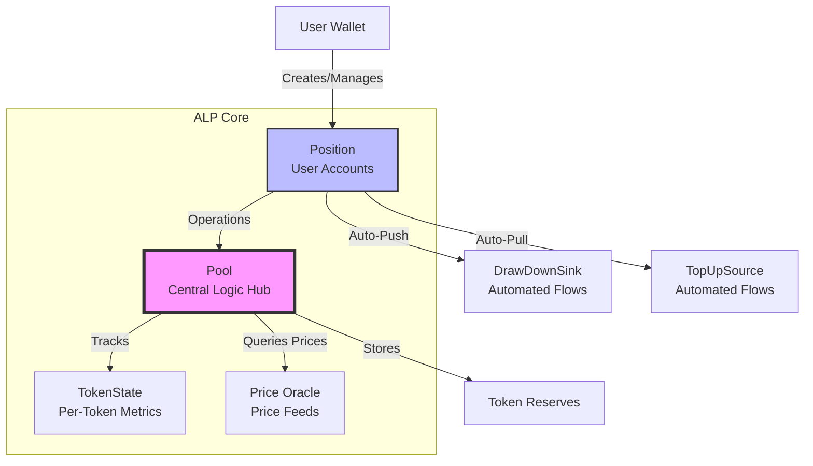

### Pool

The **Pool** is the central smart contract that manages all protocol operations. It serves as the primary logic hub for:

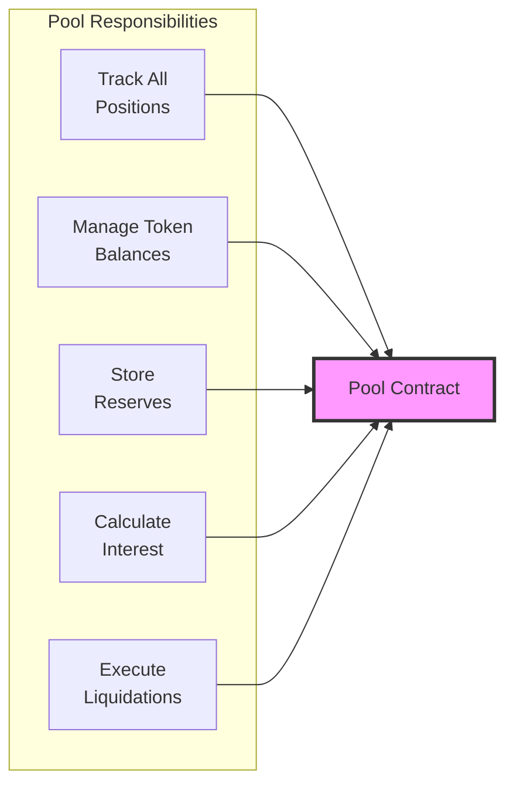

The Pool tracks global state for all positions, manages credit and debit balances for each supported token, stores reserves as they are deposited, coordinates interest rate calculations, and executes liquidations and rebalancing operations. It maintains a global ledger that tracks the state of each token type, including interest indices, total deposits, total borrows, and reserve factors.

### Position

A **Position** represents a user's credit account within the protocol. Each position tracks:

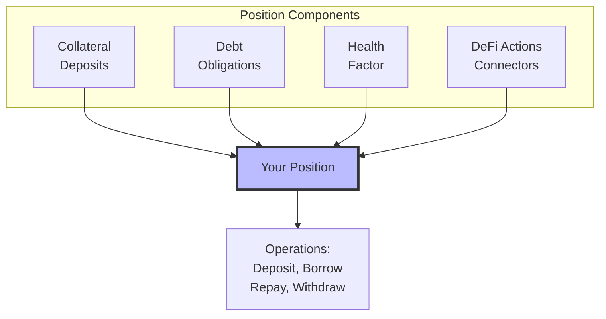

- **Collateral deposits**: Assets deposited to back borrowing
- **Debt obligations**: Amount borrowed against collateral
- **Health factor**: Ratio of collateral value to debt (must stay above 1.0)
- **DeFi Actions connectors**: Optional Sink and Source for automated flows

Positions are external objects representing ownership of deposited value, with each position capable of holding multiple token balances (both deposits and borrows). They can be configured with different min/max health targets and support composability through DeFi Actions interfaces.

### TokenState

Each supported token in the protocol has an associated **TokenState** that tracks per-token metrics:

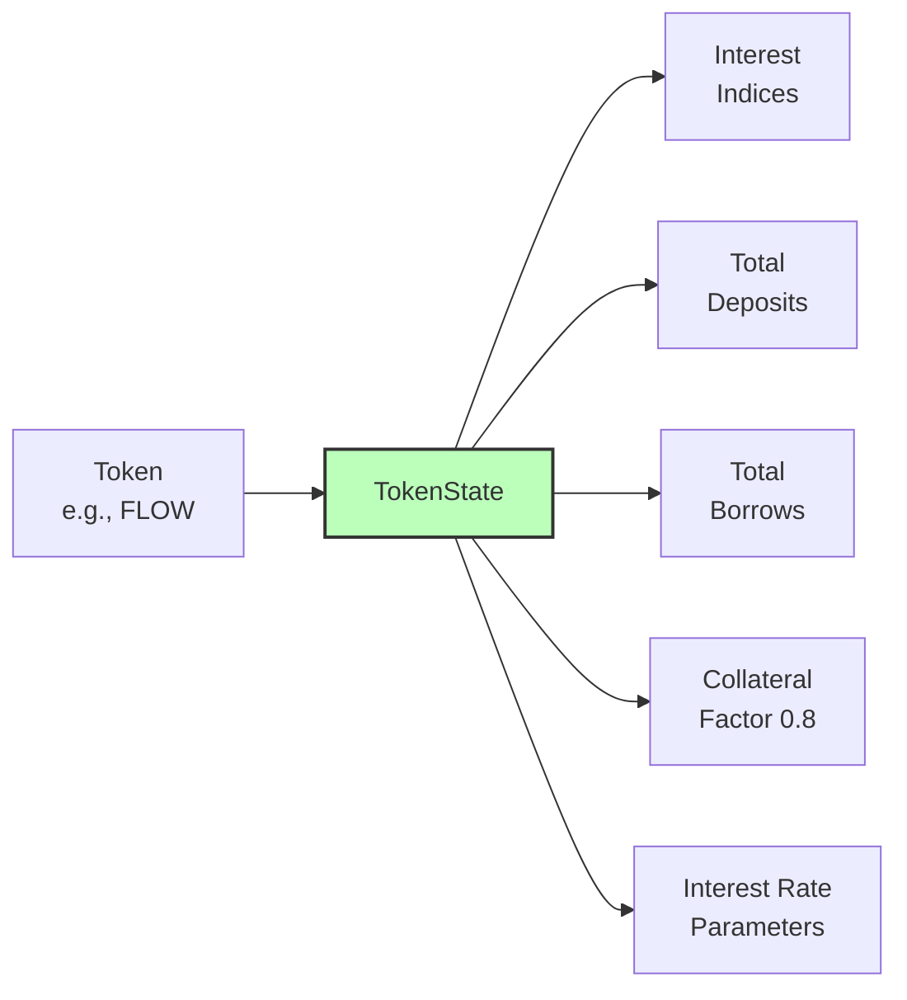

TokenState maintains interest indices for scaled balance calculations, tracks total deposits and borrows for each token, stores the collateral factor (percentage of token value usable as collateral, e.g., 0.8 = 80%), applies borrow factors as multipliers to borrowed amounts, and configures interest rate parameters for rate curves.

### Scaled Balance System

ALP uses a **scaled balance** system to track user balances efficiently:

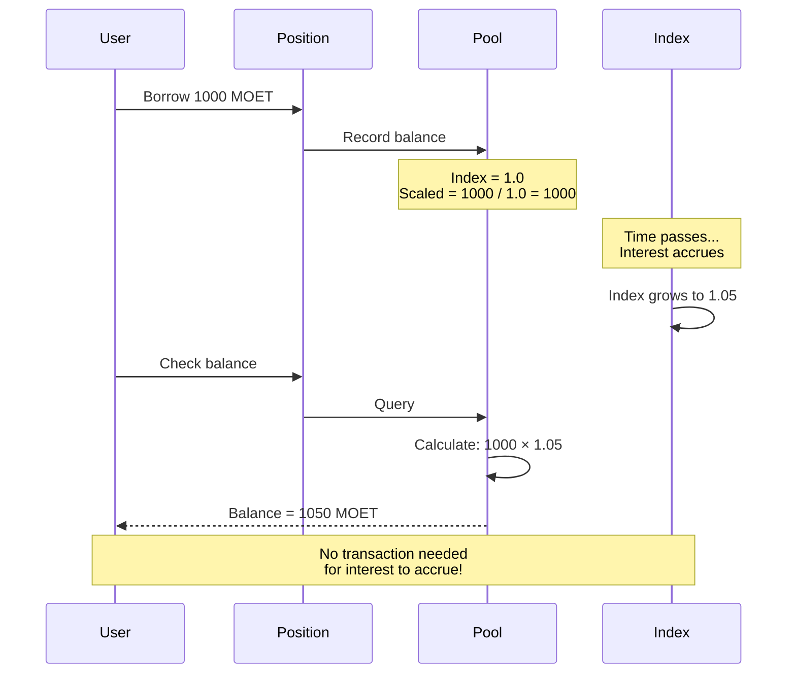

Instead of updating every user's balance when interest accrues, the protocol:

1. Tracks each user's "scaled balance" (actual balance / interest index)
2. Updates the global interest index as time passes
3. Calculates true balance on-demand as: scaled balance × current interest index

This means balances grow automatically without requiring transactions, as the interest index increases over time.

This system is highly gas efficient since it eliminates per-user balance updates, enables automatic compounding for all users simultaneously, provides precise calculations using UFix128 precision, and scales to unlimited users without additional overhead. See [FCM Mathematical Foundations](../fcm/math.md#interest-mathematics) for detailed formulas.

### Price Oracle

The **Price Oracle** provides token prices in terms of the default token (MOET):

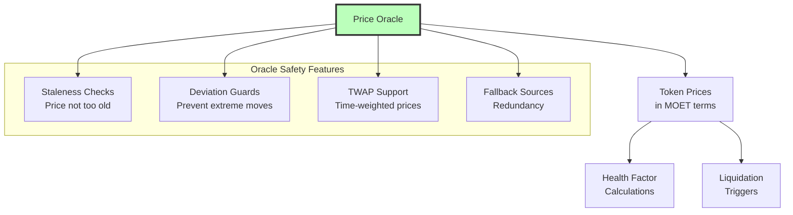

The oracle implements the DeFi Actions PriceOracle interface, enabling standardized price queries across the protocol.

The oracle includes multiple safety features: configurable staleness thresholds per token (typically 5 minutes), maximum deviation checks against the last price snapshot, additional DEX price deviation checks during liquidations, and TWAP (Time-Weighted Average Price) support for manipulation resistance.

## Key Interfaces

### FungibleToken.Vault

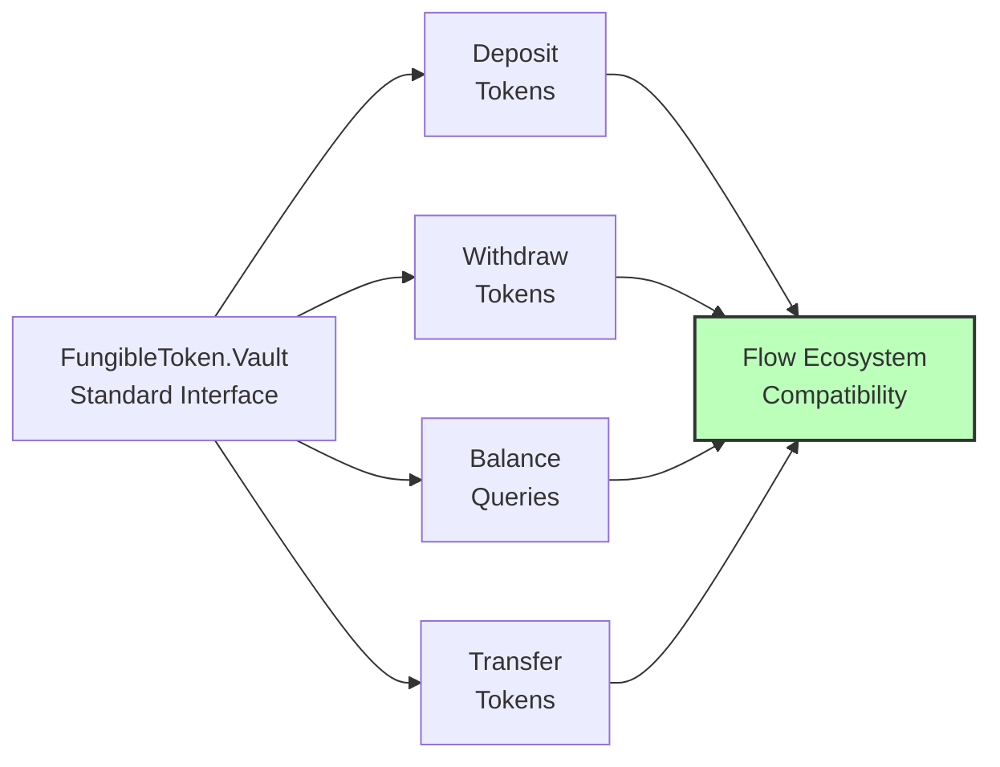

ALP integrates with Flow's standard `FungibleToken.Vault` interface for token operations, ensuring compatibility with all Flow fungible tokens and wallets.

### DeFi Actions Framework

ALP implements the **DeFi Actions** framework for protocol composability:

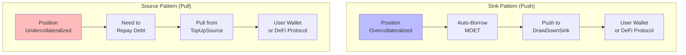

The **Sink Interface** receives tokens when positions are overcollateralized, automatically pushing borrowed funds to user wallets or other protocols through the `drawDownSink` configuration on positions, enabling automated value flows out of positions. The **Source Interface** provides tokens when positions need rebalancing, automatically pulling funds to repay debt when undercollateralized through the `topUpSource` configuration, enabling automated value flows into positions.

Learn more: [DeFi Actions Integration](./defi-actions.md)

### ViewResolver

The **ViewResolver** interface provides metadata for wallet integration, including position details and balance sheets, supported token types, protocol parameters and configuration, and user-friendly data formatting. This enables wallets and dApps to display ALP positions with rich, contextual information.

## System Architecture Diagram

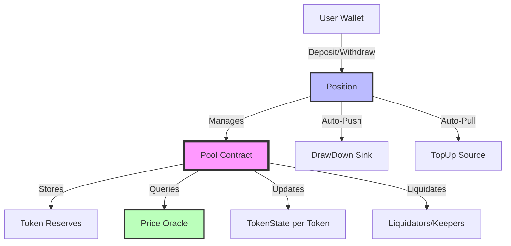

## Data Flow

### Deposit Flow

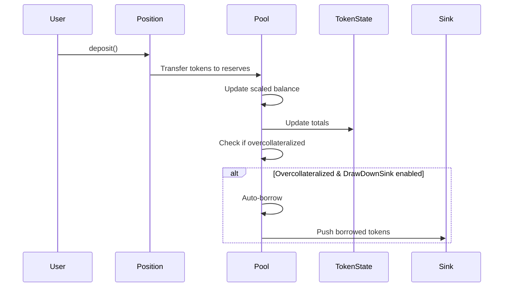

**Steps**:
1. User calls `deposit()` on their Position
2. Position transfers tokens to Pool reserves
3. Pool updates user's scaled balance
4. Pool updates global TokenState
5. If `drawDownSink` enabled and overcollateralized → auto-borrow

### Borrow Flow

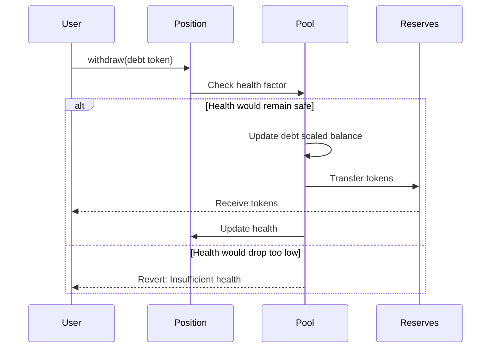

**Steps**:
1. User calls `withdraw()` for debt token
2. Pool checks health factor would remain above minimum
3. Pool updates user's debt scaled balance
4. Pool transfers tokens from reserves to user
5. Position health is recalculated

### Interest Accrual

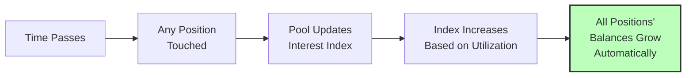

**Process**:
1. Time passes, interest accumulates
2. When any position is touched, Pool updates interest indices
3. Interest index increases based on utilization and rates
4. All positions' true balances grow automatically via scaled balance math

## Security Architecture

ALP includes multiple layers of security:

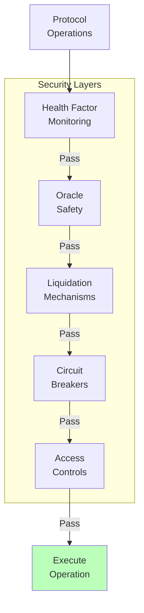

1. **Health factor monitoring**: Continuous tracking of position solvency
2. **Oracle safety**: Staleness and deviation checks
3. **Liquidation mechanisms**: Multiple paths to resolve undercollateralized positions
4. **Circuit breakers**: Ability to pause operations in emergencies
5. **Access controls**: Permissioned functions for admin operations

## Gas Optimization

The architecture is optimized for gas efficiency:

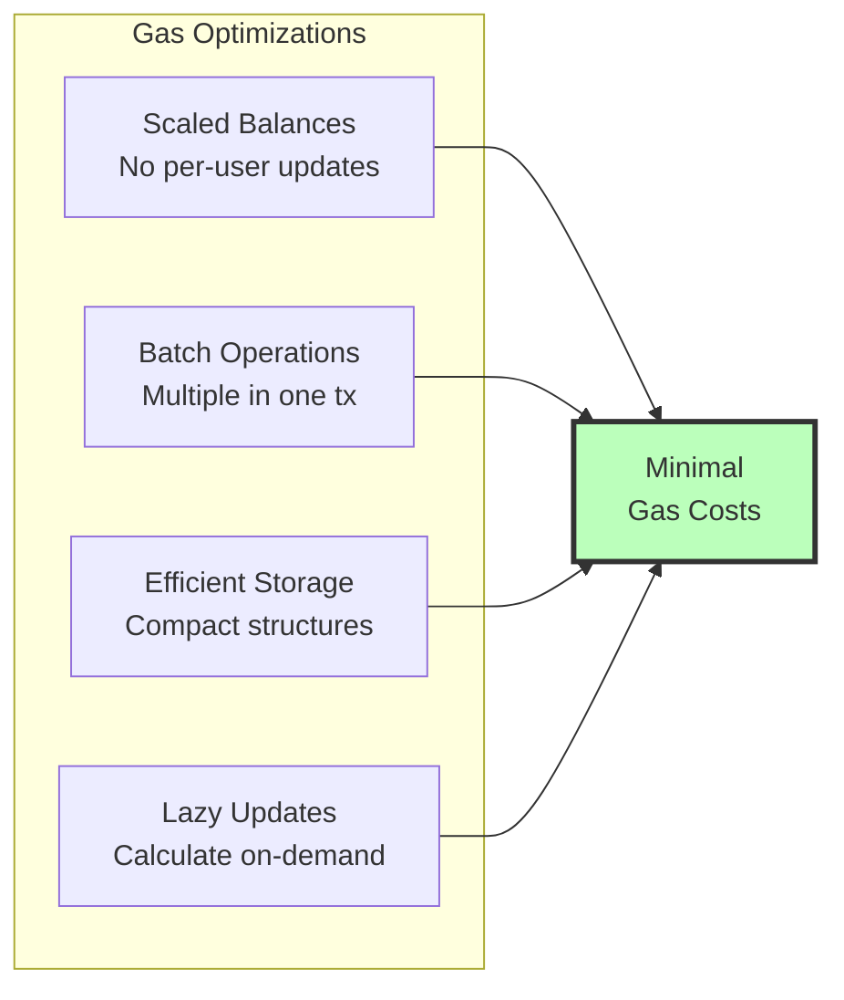

The architecture is optimized for gas efficiency through scaled balances that eliminate per-user interest updates, batch operations that allow single transactions to update multiple positions, efficient storage using compact data structures for on-chain state, and lazy updates that only calculate interest when needed.

## Upgradability

The protocol includes mechanisms for upgrades and parameter adjustments:

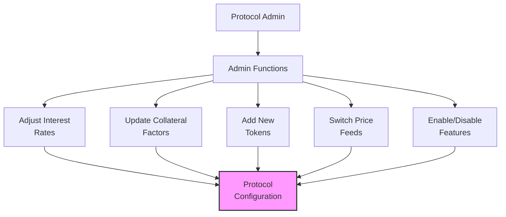

The protocol supports admin functions to adjust interest rates and collateral factors, dynamic token addition to support new tokens, oracle updates to switch price feed sources, and feature flags to enable or disable features like liquidations.

## Summary

**Core Architecture**:
- 🏗️ Modular design with Pool, Position, TokenState, and Oracle
- 🔗 DeFi Actions framework for composability
- 📊 Scaled balance system for efficiency
- 🛡️ Multiple security layers

**Key Benefits**:
- ✅ Gas efficient scaled balance system
- ✅ Automated flows via Sink/Source interfaces
- ✅ Robust oracle safety features
- ✅ Multi-layer security architecture
- ✅ Flexible and upgradable design

**Integration Points**:
- Flow FungibleToken standard
- DeFi Actions Sink/Source
- ViewResolver for wallets
- Price Oracle interface

## Mathematical Foundation

The architecture implements these mathematical principles:
- **Scaled Balances**: [Interest Mathematics](../fcm/math.md#scaled-balance-system)
- **Health Calculations**: [Health Factor Formula](../fcm/math.md#health-factor)
- **Effective Collateral**: [Collateral Calculation](../fcm/math.md#effective-collateral)
- **Multi-Token Support**: [Multi-Collateral Math](../fcm/math.md#multi-collateral-mathematics)

See [FCM Mathematical Foundations](../fcm/math.md) for complete formulas and proofs.

## Next Steps

- **Understand operations**: [Credit Market Mechanics](./credit-market-mechanics.md)
- **Learn about safety**: [Liquidation System](./liquidation-system.md)
- **Explore automation**: [Position Lifecycle](./position-lifecycle.md)
- **See the big picture**: [FCM Architecture](../fcm/architecture.md)

---

:::tip Key Takeaway
ALP's modular architecture combines efficiency with security. The scaled balance system eliminates gas overhead, DeFi Actions enable composability, and multiple security layers protect users. This design makes ALP both powerful for developers and accessible for users.
:::
