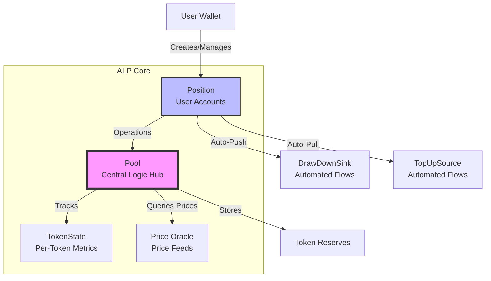
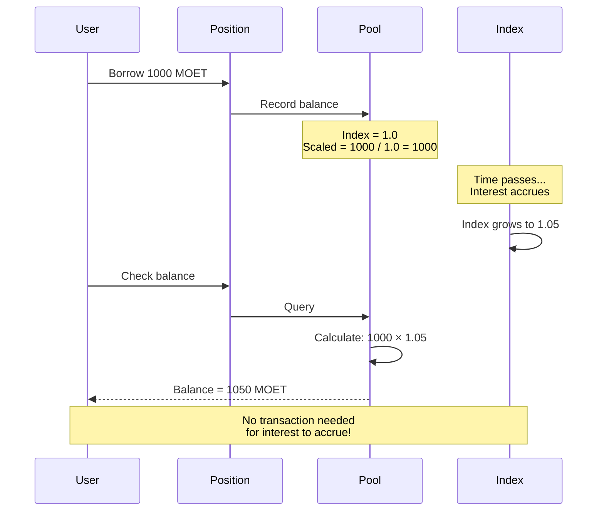
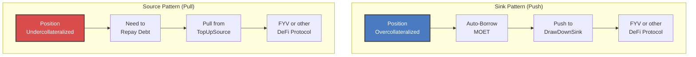
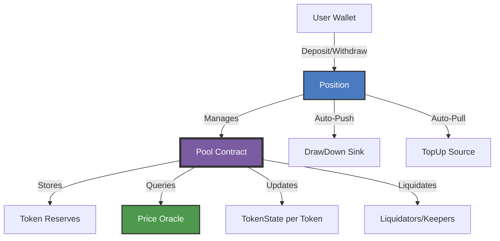
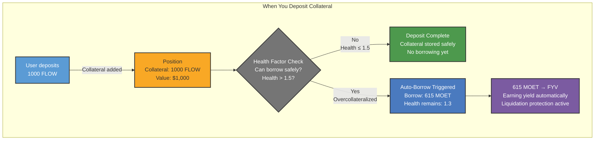
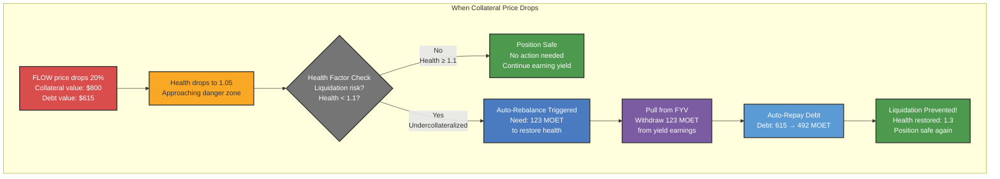
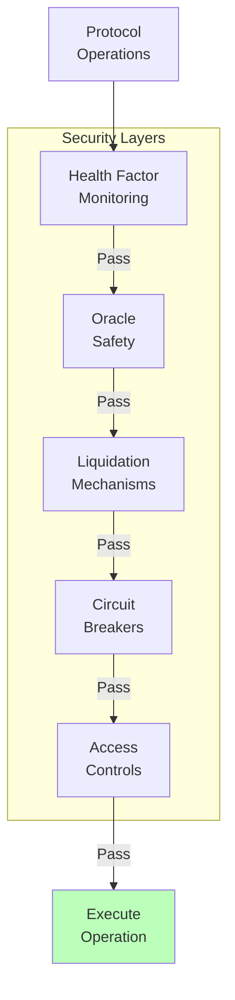

# ALP Architecture Overview

ALP is built on a modular architecture with several core components that work together to provide a secure and efficient lending protocol with efficiency and security. The scaled balance system eliminates gas overhead, DeFi Actions enable composability, and multiple security layers protect users. This design makes ALP both powerful for developers and accessible for users.

## Core Components

### Pool

The **Pool** is the central smart contract that manages all protocol operations. Its core responsibilities include:

- **Track All Positions**: Maintains a global registry of every user position with unique IDs and capabilities for position access and management
- **Manage Token Balances**: Tracks credit (deposits) and debit (borrows) balances for each supported token type, ensuring accurate accounting across all positions
- **Store Reserves**: Holds deposited collateral and borrowed assets in secure vaults, maintaining the protocol's liquidity pool
- **Calculate Interest**: Coordinates interest rate calculations using scaled balance indexing for gas-efficient compounding across all positions
- **Execute Liquidations**: Manages the liquidation process when positions become undercollateralized, coordinating with keepers and the DEX liquidation system

The Pool maintains a global ledger that tracks the state of each token type, including interest indices, total deposits, total borrows, and reserve factors.

### Position

A **Position** represents a user's credit account within the protocol. Each position tracks and manages several key components:

- **Collateral Deposits**: Assets deposited by the user that serve as backing for borrowing capacity. Each position can hold multiple token types as collateral (FLOW, stFLOW, USDC, wBTC, wETH), with each token having its own collateral factor that determines how much can be borrowed against it. The total collateral value is continuously monitored and updated based on oracle price feeds to maintain accurate position health.

- **Debt Obligations**: The total amount borrowed against the deposited collateral, denominated in MOET. Debt accrues interest over time through scaled balance indexing, automatically compounding without requiring explicit updates. The protocol tracks both the principal borrowed and the accumulated interest, ensuring users always know their exact repayment obligations.

- **Health Factor**: The critical safety metric calculated as the ratio of effective collateral (collateral value × collateral factor) to total debt value. This must remain above 1.0 at all times to avoid liquidation. Users can configure target health ranges (min/max) for their positions, enabling automated rebalancing through DeFi Actions to maintain optimal leverage while staying within safe bounds.

- **DeFi Actions Connectors**: Optional Sink and Source interfaces that enable automated capital flows for sophisticated yield strategies. DrawDownSink allows the position to automatically borrow more MOET when conditions are favorable (e.g., when health factor exceeds maximum target), while TopUpSource enables automatic debt repayment using external yield sources (e.g., FYV vaults) to prevent liquidation when collateral prices drop.

Positions support core operations including deposit (add collateral), borrow (take debt against collateral), repay (reduce debt), and withdraw (remove collateral while maintaining safe health factor).

Positions are external objects representing ownership of deposited value, with each position capable of holding multiple token balances (both deposits and borrows). They can be configured with different min/max health targets and support composability through DeFi Actions interfaces.

### TokenState

Each [supported token](../flow-yield-vaults/index.md#supported-tokens) in the protocol (FLOW, stFLOW, USDC, wBTC, wETH) has an associated **TokenState** that maintains comprehensive per-token metrics and parameters:

- **Interest Indices**: Cumulative scaling factors that track interest accrual over time for both deposits and borrows. These indices enable gas-efficient interest calculations without updating every individual position, as each user's balance is multiplied by the current index to determine their actual balance with accrued interest.

- **Total Deposits**: Aggregated sum of all deposits for this token across all positions in the protocol. This global metric helps determine overall liquidity availability and is used in utilization rate calculations that drive interest rates.

- **Total Borrows**: Aggregated sum of all outstanding borrows for this token across all positions. Together with total deposits, this determines the utilization rate (borrows/deposits) which directly influences the current interest rate according to the token's rate curve.

- **Collateral Factor**: The percentage of a token's value that can be used as effective collateral for borrowing (e.g., 0.8 means 80% of deposited FLOW value counts toward borrowing capacity). Higher quality assets typically have higher collateral factors, while more volatile assets have lower factors to account for price risk.

- **Borrow Factor**: A multiplier applied to borrowed amounts that adjusts the effective debt value for risk management purposes. This factor works inversely to collateral factor, increasing the effective debt to maintain protocol safety margins.

- **Interest Rate Parameters**: Configuration values that define the interest rate curve for this token, including base rate, multiplier, kink point, and jump multiplier. These parameters determine how interest rates respond to changes in utilization, typically with low rates at low utilization and sharply increasing rates at high utilization to incentivize repayment.

### Scaled Balance System

ALP uses a **scaled balance** system to track user balances efficiently:

Instead of updating every user's balance when interest accrues, the protocol:

1. Tracks each user's "scaled balance" (actual balance / interest index)
2. Updates the global interest index as time passes
3. Calculates true balance on-demand as: scaled balance × current interest index

This means balances grow automatically without requiring transactions, as the interest index increases over time.

This system is highly gas efficient since it eliminates per-user balance updates, enables automatic compounding for all users simultaneously, provides precise calculations using UFix128 precision, and scales to unlimited users without additional overhead. See [FCM Mathematical Foundations](../fcm/math.md#interest-mathematics) for detailed formulas.

### Price Oracle

The **Price Oracle** provides real-time token prices denominated in [MOET](../moet/index.md) terms, implementing the [DeFi Actions PriceOracle interface](../../blockchain-development-tutorials/forte/flow-actions/intro-to-flow-actions.md) for standardized price queries across the protocol. The oracle is critical for accurate health factor calculations, liquidation triggers, and collateral valuations.

**Core Functionality:**

The oracle returns prices for any supported token type (FLOW, stFLOW, USDC, wBTC, wETH) with all values expressed in MOET, creating a unified pricing framework. For example, if FLOW is trading at $1.00 and the system assumes 1 MOET = $1 USD, the oracle returns 1.0 for FLOW/MOET. This MOET-denominated pricing eliminates the need for complex cross-currency conversions when calculating health factors across multi-collateral positions.

**Safety Features:**

The oracle incorporates multiple layers of protection to prevent manipulation and ensure accurate pricing:

- **Staleness Checks**: Each price feed includes a timestamp, and the oracle rejects any price data older than a configurable threshold (typically 5 minutes per token). This prevents the protocol from using outdated prices during periods of high volatility or oracle downtime, ensuring position health calculations always reflect current market conditions.

- **Deviation Guards**: The oracle tracks the last accepted price for each token and compares new prices against it, flagging any deviation exceeding a configured percentage (e.g., ±20% within one update). Extreme price movements trigger additional validation steps or temporary pauses, protecting against oracle manipulation attempts or data errors.

- **TWAP Support**: Time-Weighted Average Price calculations smooth out short-term price volatility and make manipulation more expensive by requiring sustained price distortions rather than brief spikes. The oracle can aggregate prices over configurable time windows (e.g., 10-30 minutes) to provide manipulation-resistant pricing for critical operations like liquidations.

- **Fallback Sources**: The protocol supports multiple oracle providers (IncrementFi, Band Protocol, Pyth Network) and can aggregate prices from these sources using median calculations. If the primary oracle fails or returns suspicious data, the system automatically falls back to alternative sources, ensuring continuous operation even during individual oracle outages.

**Usage in Protocol:**

Oracle prices directly impact two critical protocol functions. First, health factor calculations query the oracle for each collateral token's current price to determine if positions are adequately collateralized (HF = Effective Collateral Value / Debt Value). Second, liquidation triggers rely on oracle prices to identify underwater positions (HF < 1.0) and calculate fair collateral seizure amounts during liquidations, ensuring liquidators receive appropriate compensation while protecting borrowers from excessive penalties.

## Key Interfaces

### FungibleToken.Vault

ALP uses Flow's standard `FungibleToken.Vault` interface for all token operations, enabling it to accept any Flow-compatible token as collateral or debt without custom integration code. This means ALP can support FLOW, USDC, wBTC, stFLOW, and MOET through a single unified interface, and any new Flow token can be added to the protocol simply by configuration rather than code changes. This architectural choice explains why ALP can handle multiple collateral types efficiently and integrate seamlessly with other Flow DeFi protocols like FYV.

### DeFi Actions Framework

ALP implements the **[DeFi Actions](../../blockchain-development-tutorials/forte/flow-actions/intro-to-flow-actions.md)** framework for protocol composability:

The **Sink Interface** receives tokens when positions are overcollateralized, automatically pushing borrowed funds to user wallets or other protocols through the `drawDownSink` configuration on positions, enabling automated value flows out of positions. The **Source Interface** provides tokens when positions need rebalancing, automatically pulling funds to repay debt when undercollateralized through the `topUpSource` configuration, enabling automated value flows into positions.

Learn more: [DeFi Actions Integration](./defi-actions.md)

### ViewResolver

The **ViewResolver** interface provides metadata for wallet integration, including position details and balance sheets, supported token types, protocol parameters and configuration, and user-friendly data formatting. This enables wallets and dApps to display ALP positions with rich, contextual information.

## System Architecture Diagram

## Data Sequence

### Deposit & Auto-Borrow Sequence

**What happens:**
1. **Deposit**: User deposits 1000 FLOW as collateral (worth $1,000)
2. **Health Check**: System calculates if position can safely borrow more
3. **Decision Point**:
   - If health ≤ 1.5: Just hold collateral safely
   - If health > 1.5: Automatically borrow MOET
4. **Auto-Borrow**: System borrows 615 MOET while keeping health at 1.3
5. **Deploy to Yield**: Borrowed MOET automatically sent to FYV to earn yield

### Price Drop & Auto-Rebalancing Sequence

**What happens:**
1. **Price Shock**: FLOW price drops 20%, collateral value falls from $1,000 to $800
2. **Health Warning**: Health factor drops to 1.05 (dangerous territory)
3. **Risk Check**: System detects health < 1.1 (below safety threshold)
4. **Rebalance Trigger**: System calculates need to repay 123 MOET to restore health to 1.3
5. **Pull from Yield**: TopUpSource withdraws 123 MOET from FYV (your yield earnings)
6. **Auto-Repay**: System automatically repays 123 MOET debt (615 → 492 MOET)
7. **Recovery Complete**: Health restored to 1.3, liquidation prevented without manual intervention

### Interest Accrual

Interest in ALP accumulates continuously but is calculated efficiently using lazy evaluation. Instead of updating every position constantly, the system uses an interest index that updates only when positions are accessed (deposits, withdrawals, or balance checks).

When any position is touched, the Pool updates its interest indices based on current utilization rates and elapsed time. Each position stores a "scaled balance" (fixed shares), and the interest index acts as a multiplier to calculate the actual token amount. As the index grows, all positions' real balances increase proportionally without individual updates.

**Time-weighted fairness:** The interest index is cumulative and time-weighted, ensuring fair accrual regardless of when you check your position. You cannot game the system by checking only during high utilization periods. The Pool calculates interest for the entire elapsed time, accounting for all historical rate changes. For example, 3% APR for 5 days plus 7% APR for 5 days yields the same total interest whether you check once at day 10 or multiple times throughout. Lazy evaluation is purely a gas optimization with no impact on economic outcomes.

## Security Architecture

ALP includes multiple layers of security:

1. **Health factor monitoring**: Continuous tracking of position solvency
2. **Oracle safety**: Staleness and deviation checks
3. **Liquidation mechanisms**: Multiple paths to resolve undercollateralized positions
4. **Circuit breakers**: Ability to pause operations in emergencies
5. **Access controls**: Permissioned functions for admin operations

These layered security checks work together to protect user funds and ensure the protocol operates within safe parameters. By validating each operation against multiple security criteria before execution, ALP prevents users from taking actions that would put their positions at risk, blocks transactions when price data is unreliable, and maintains protocol solvency even during market volatility or unexpected conditions.

## Mathematical Foundation

The architecture implements these mathematical principles:
- **Scaled Balances**: [Interest Mathematics](../fcm/math.md#scaled-balance-system)
- **Health Calculations**: [Health Factor Formula](../fcm/math.md#health-factor)
- **Effective Collateral**: [Collateral Calculation](../fcm/math.md#effective-collateral)
- **Multi-Token Support**: [Multi-Collateral Math](../fcm/math.md#multi-collateral-mathematics)

See [FCM Mathematical Foundations](../fcm/math.md) for complete formulas and proofs.

## Next Steps

- **Understand operations**: [Credit Market Mechanics](./credit-market-mechanics.md)
- **Learn about safety**: [Liquidation System](./liquidation-system.md)
- **Explore automation**: [Position Lifecycle](./position-lifecycle.md)
- **See the big picture**: [FCM Architecture](../fcm/architecture.md)