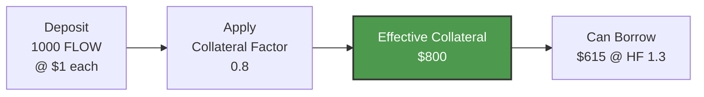
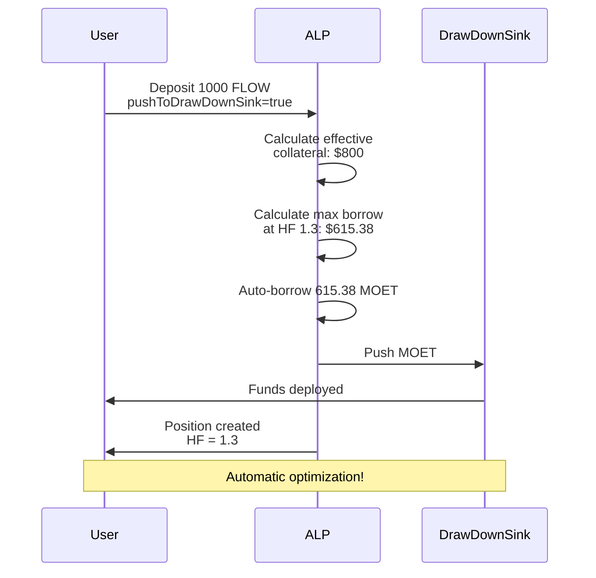
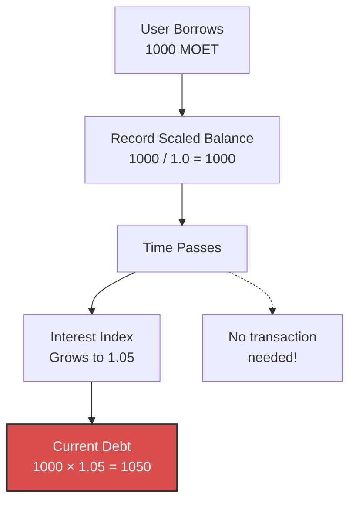
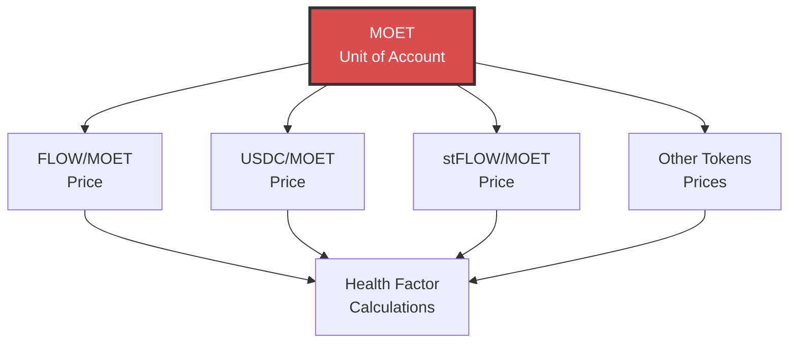
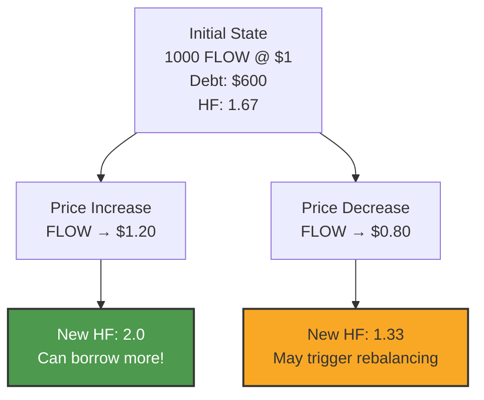
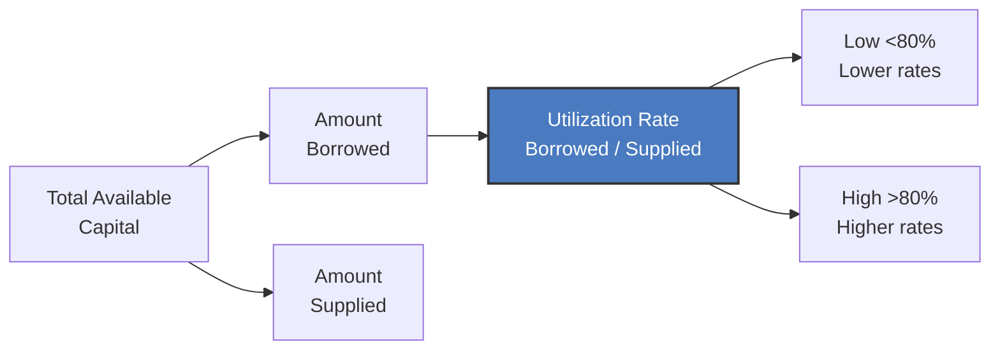
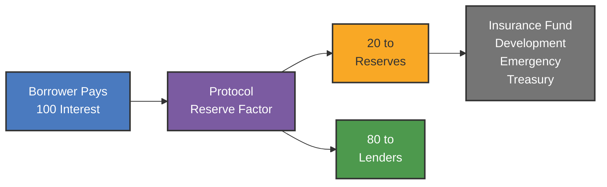

# Credit Market Mechanics

ALP operates as a decentralized lending protocol where users can deposit collateral and borrow assets. Understanding the core mechanics is essential for effectively managing positions and maximizing capital efficiency. The auto-borrowing feature, scaled interest system, and multi-token support create a powerful yet accessible lending platform.

## Basic Lending Mechanics

### Collateral Deposits

When you deposit tokens into ALP, they become **collateral** that backs your borrowing capacity. However, not all collateral value is usable for borrowing.



Each token has a **collateral factor** that determines what percentage of its value can be used. For example, depositing 1,000 FLOW worth $1,000 with a collateral factor of 0.8 results in $800 of effective collateral. This safety buffer protects the protocol against price volatility and ensures positions remain solvent even with market fluctuations.

### Borrowing Limits

Your borrowing capacity depends on two key factors:

1. **Effective Collateral**: Total collateral value × collateral factor
2. **Target Health Ratio**: Minimum ratio of collateral to debt

**Formula**:

```math
\text{Maximum Borrow} = \frac{\text{Effective Collateral}}{\text{Target Health Ratio}}
```

See [FCM Mathematical Foundations](../fcm/math.md#auto-borrowing-mathematics) for detailed formulas and derivations.

**Example with target health of 1.3**:
- Effective collateral: $800 (from 1,000 FLOW at 0.8 factor)
- Target health: 1.3
- Maximum borrow: $800 / 1.3 ≈ $615.38

### Health Factor

The **health factor** is the most important metric for your position:

```math
\text{Health Factor} = \frac{\text{Effective Collateral Value}}{\text{Effective Debt Value}}
```

**Health Factor States:**

- **HF > 1.5 (Overcollateralized)**: Your position can safely borrow more. This is the trigger point for auto-borrowing.
- **HF: 1.3 - 1.5 (Healthy)**: Optimal state with good safety margin. Position is balanced and secure.
- **HF: 1.1 - 1.3 (Below Target)**: Below the target health factor. Consider repaying debt or adding collateral.
- **HF: 1.0 - 1.1 (At Risk)**: Approaching liquidation threshold. Urgent action needed to avoid liquidation.
- **HF < 1.0 (Liquidatable)**: Position is underwater and can be liquidated. Immediate action required.

## Auto-Borrowing Feature

ALP includes an innovative **auto-borrowing** feature that automatically manages your position to maintain optimal health ratios.

### How Auto-Borrowing Works



When you create a position with `pushToDrawDownSink=true`, you deposit collateral (e.g., 1,000 FLOW), the system calculates your maximum safe borrowing capacity, automatically borrows MOET to reach target health (1.3), and sends the borrowed MOET to your DrawDown Sink.

**Example**:

```
Deposit 1000 Flow with collateralFactor=0.8
Target health = 1.3

Effective collateral = 1000 * 1.0 (price) * 0.8 = 800
Auto-borrow amount = 800 / 1.3 ≈ 615.38 MOET

Result:
- Position health: 1.3 (at target)
- User receives: ~615.38 MOET via DrawDownSink
- Collateral locked: 1000 FLOW
```

### Opting Out of Auto-Borrowing

You can disable auto-borrowing by setting `pushToDrawDownSink=false` when creating your position. With auto-borrowing disabled, your collateral is deposited without any automatic borrowing occurring, your health factor starts very high (>1.5), and you manually borrow when needed.

### Benefits of Auto-Borrowing

Auto-borrowing maximizes capital efficiency by automatically using your available borrowing capacity without requiring manual calculations of safe borrow amounts. When you deposit collateral, the system immediately provides liquidity by borrowing on your behalf, then maintains optimal position health through automated rebalancing as market conditions change. This approach ensures your position always operates at peak efficiency while staying within safe health factor ranges.

## Interest System

ALP uses an interest system based on **scaled balances** and **interest indices**.



Instead of updating every user's balance constantly, ALP:

1. Tracks your **scaled balance**: `actual balance / interest index at deposit`
2. Updates a global **interest index** as time passes
3. Calculates your current balance: `scaled balance × current interest index`

This means your debt and deposits grow automatically without requiring transactions.

See [FCM Mathematical Foundations](../fcm/math.md#interest-mathematics) for detailed formulas.

### Interest Rates

Interest rates in ALP are determined by the utilization rate (percentage of available capital currently borrowed), a base rate (minimum interest rate when utilization is low), slope rates (how quickly rates increase as utilization rises), and optimal utilization (target utilization for balanced rates).

**Interest Rate Curve by Utilization:**

| Utilization Range | Interest Rate Behavior | Purpose |
|------------------|------------------------|---------|
| **0% - 80%** (Low) | Gradual, slow increase | Encourages borrowing while maintaining liquidity |
| **80%** (Optimal) | Target balance point | Ideal equilibrium between lenders and borrowers |
| **80% - 100%** (High) | Steep, rapid increase | Incentivizes debt repayment and new deposits |

**Example rates:**
- At 40% utilization: ~5% APR (gentle slope)
- At 80% utilization: ~15% APR (optimal point)
- At 95% utilization: ~50% APR (steep slope to protect liquidity)

### Compound Interest

Interest in ALP compounds continuously as the interest index grows, with borrowers paying compound interest on debt, lenders earning compound interest on deposits, and interest index updates reflecting accumulated compounding.

## Price Oracle System

Accurate pricing is critical for maintaining protocol solvency. ALP uses a price oracle with multiple safety features.

### Price Feeds

All token prices are quoted in terms of the **default token** (MOET):



All token prices are quoted in terms of MOET (FLOW/MOET, USDC/MOET, and other token prices), which simplifies calculations and ensures consistency across the protocol.

The oracle employs staleness checks to ensure prices are recent (typically < 5 minutes old), deviation guards that reject or flag large price jumps, fallback mechanisms providing alternative price sources if the primary fails, and TWAP support using time-weighted average prices to reduce manipulation risk.

### How Prices Affect Positions

Price changes directly impact your health factor:



**Collateral price increases**: Health improves, can borrow more

```
Before: 1000 FLOW @ $1 = $1000, Debt = $600, HF = 1.67
After: 1000 FLOW @ $1.20 = $1200, Debt = $600, HF = 2.0
→ Can borrow additional ~$200 MOET to have HF = 1.5
```

**Collateral price decreases**: Health worsens, may need to repay

```
Before: 1000 FLOW @ $1 = $1000, Debt = $600, HF = 1.67
After: 1000 FLOW @ $0.80 = $800, Debt = $600, HF = 1.33
→ Close to target health, rebalancing may trigger up to 66.67 MOET for HF = 1.5
```

## Multi-Token Support

ALP supports multiple token types as both collateral and debt.


### Collateral Tokens

Any supported token can be used as collateral, including Flow, stFlow, USDC, and other allowlisted tokens. Each token has its own collateral factor, price feed, and interest rate parameters.

### Debt Tokens

MOET is the primary debt token in ALP. All borrowing positions are denominated in MOET, which serves as the unit of account for the protocol. This ensures consistent pricing and health factor calculations across all positions.

When you have multiple tokens, ALP converts all collateral and debt to the default token (MOET) value, calculates a single health factor across all positions, and ensures the total position remains solvent.

**Example**:

```
Collateral:
- 1000 FLOW @ $1 each, factor 0.8 = $800 effective
- 500 USDC @ $1 each, factor 0.9 = $450 effective
Total effective collateral: $1,250

Debt:
- 800 MOET @ $1 each = $800 debt
Health Factor = 1,250 / 800 = 1.56
```

## Utilization and Protocol Dynamics

### Utilization Rate



The protocol tracks **utilization** for each token:

```math
\text{Utilization} = \frac{\text{Total Borrowed}}{\text{Total Supplied + Reserves}}
```

Higher utilization leads to higher interest rates for borrowers, higher yields for lenders, and incentives to add liquidity or repay loans.

### Reserve Factor

A portion of interest goes to protocol reserves:

```math
\text{Lender Interest} = \text{Borrower Interest} \times (1 - \text{Reserve Factor})
```



Reserves are used for the protocol insurance fund, development and maintenance, emergency situations, and the governance-controlled treasury.

## Mathematical Foundation

For detailed formulas underlying credit market mechanics:
- **Effective Collateral**: [Collateral Calculation](../fcm/math.md#effective-collateral)
- **Health Factor**: [Health Factor Formula](../fcm/math.md#health-factor)
- **Maximum Borrowing**: [Max Borrow Capacity](../fcm/math.md#maximum-borrowing-capacity)
- **Interest Calculations**: [Interest Mathematics](../fcm/math.md#interest-mathematics)
- **Multi-Collateral**: [Multi-Collateral Mathematics](../fcm/math.md#multi-collateral-mathematics)

## Next Steps

- **Learn about protection**: [Liquidation System](./liquidation-system.md)
- **Understand the lifecycle**: [Position Lifecycle](./position-lifecycle.md)
- **Explore automation**: [Rebalancing Mechanics](./rebalancing.md)
- **See complete formulas**: [FCM Mathematical Foundations](../fcm/math.md)