# Credit Market Mechanics

ALP operates as a decentralized lending protocol where users can deposit collateral and borrow assets. Understanding the core mechanics is essential for effectively managing positions and maximizing capital efficiency.

## Basic Lending Mechanics

### Collateral Deposits

When you deposit tokens into ALP, they become **collateral** that backs your borrowing capacity. However, not all collateral value is usable for borrowing.


Each token has a **collateral factor** that determines what percentage of its value can be used. For example, depositing 1,000 FLOW worth $1,000 with a collateral factor of 0.8 results in $800 of effective collateral. This safety buffer protects the protocol against price volatility and ensures positions remain solvent even with market fluctuations.

### Borrowing Limits

Your borrowing capacity depends on two key factors:

1. **Effective Collateral**: Total collateral value × collateral factor
2. **Target Health Ratio**: Minimum ratio of collateral to debt

**Formula**:
```
Maximum Borrow = Effective Collateral / Target Health Ratio
```

See [FCM Mathematical Foundations](../fcm/math.md#auto-borrowing-mathematics) for detailed formulas and derivations.

**Example with target health of 1.3**:
- Effective collateral: $800 (from 1,000 FLOW at 0.8 factor)
- Target health: 1.3
- Maximum borrow: $800 / 1.3 ≈ $615.38

### Health Factor

The **health factor** is the most important metric for your position:

```
Health Factor = Effective Collateral Value / Effective Debt Value
```


Your position's health can be understood across a spectrum: when HF > 1.5 you're overcollateralized and can borrow more; HF between 1.3 and 1.5 represents the healthy range; HF between 1.1 and 1.3 means you're below target and should repay or add collateral; HF between 1.0 and 1.1 puts you at risk of liquidation; and HF < 1.0 means your position is liquidatable and requires immediate action.

## Auto-Borrowing Feature

ALP includes an innovative **auto-borrowing** feature that automatically manages your position to maintain optimal health ratios.

### How Auto-Borrowing Works


When you create a position with `pushToDrawDownSink=true`, you deposit collateral (e.g., 1,000 FLOW), the system calculates your maximum safe borrowing capacity, automatically borrows MOET to reach target health (1.3), and sends the borrowed MOET to your DrawDown Sink.

**Example**:
```
Deposit 1000 Flow with collateralFactor=0.8
Target health = 1.3

Effective collateral = 1000 * 1.0 (price) * 0.8 = 800
Auto-borrow amount = 800 / 1.3 ≈ 615.38 MOET

Result:
- Position health: 1.3 (at target)
- User receives: ~615.38 MOET via DrawDownSink
- Collateral locked: 1000 FLOW
```

### Opting Out of Auto-Borrowing

You can disable auto-borrowing by setting `pushToDrawDownSink=false` when creating your position. With auto-borrowing disabled, your collateral is deposited without any automatic borrowing occurring, your health factor starts very high (>1.5), and you manually borrow when needed.

### Benefits of Auto-Borrowing


1. **Maximized Capital Efficiency**: Automatically uses available borrowing capacity
2. **Simplified Position Management**: No need to manually calculate safe borrow amounts
3. **Immediate Liquidity**: Receive borrowed funds instantly upon deposit
4. **Automated Rebalancing**: System maintains optimal health as market conditions change

### When to Use Auto-Borrowing

**Use auto-borrowing when**:
- You want to maximize capital efficiency
- You're comfortable with leveraged positions
- You trust automated position management
- You want immediate access to borrowed funds

**Don't use auto-borrowing when**:
- You want conservative collateralization
- You prefer manual position control
- You're testing or learning the protocol
- You don't need immediate borrowing

## Interest System

ALP uses a sophisticated interest system based on **scaled balances** and **interest indices**.

### How Interest Accrues

```mermaid
graph TD
    User[User Borrows<br/>1000 MOET] --> Scaled[Record Scaled Balance<br/>1000 / 1.0 = 1000]
    Scaled --> Time[Time Passes]
    Time --> Index[Interest Index<br/>Grows to 1.05]
    Index --> Current[Current Debt<br/>1000 × 1.05 = 1050]

    Note1[No transaction<br/>needed!]
    Time -.-> Note1

    style Current fill:#fbb
```



Instead of updating every user's balance constantly, ALP:

1. Tracks your **scaled balance**: `actual balance / interest index at deposit`
2. Updates a global **interest index** as time passes
3. Calculates your current balance: `scaled balance × current interest index`

This means your debt and deposits grow automatically without requiring transactions.

See [FCM Mathematical Foundations](../fcm/math.md#interest-mathematics) for detailed formulas.

### Interest Rates

Interest rates in ALP are determined by the utilization rate (percentage of available capital currently borrowed), a base rate (minimum interest rate when utilization is low), slope rates (how quickly rates increase as utilization rises), and optimal utilization (target utilization for balanced rates).


**Typical Rate Curve**:
```
Low Utilization (0-80%): Gradual rate increase
Optimal Zone (80%): Target balance point
High Utilization (80-100%): Steep rate increase to encourage repayment
```

### Compound Interest

Interest in ALP compounds continuously as the interest index grows, with borrowers paying compound interest on debt, lenders earning compound interest on deposits, and interest index updates reflecting accumulated compounding.

**Example**:
```
Initial borrow: 1000 MOET
Interest index at borrow: 1.0
After 1 year at 10% APY:
- New interest index: ~1.105 (continuous compounding)
- Debt owed: 1000 * 1.105 = 1,105 MOET
```

## Price Oracle System

Accurate pricing is critical for maintaining protocol solvency. ALP uses a price oracle with multiple safety features.

### Price Feeds

All token prices are quoted in terms of the **default token** (MOET):


All token prices are quoted in terms of MOET (FLOW/MOET, USDC/MOET, and other token prices), which simplifies calculations and ensures consistency across the protocol.

### Oracle Safety Features


The oracle employs staleness checks to ensure prices are recent (typically < 5 minutes old), deviation guards that reject or flag large price jumps, fallback mechanisms providing alternative price sources if the primary fails, and TWAP support using time-weighted average prices to reduce manipulation risk.

### How Prices Affect Positions

Price changes directly impact your health factor:


**Collateral price increases**: Health improves, can borrow more
```
Before: 1000 FLOW @ $1 = $1000, Debt = $600, HF = 1.67
After: 1000 FLOW @ $1.20 = $1200, Debt = $600, HF = 2.0
→ Can borrow additional ~$108 MOET
```

**Collateral price decreases**: Health worsens, may need to repay
```
Before: 1000 FLOW @ $1 = $1000, Debt = $600, HF = 1.67
After: 1000 FLOW @ $0.80 = $800, Debt = $600, HF = 1.33
→ Close to target health, rebalancing may trigger
```

## Multi-Token Support

ALP supports multiple token types as both collateral and debt.

### Token Configuration


### Collateral Tokens

Any supported token can be used as collateral, including Flow, stFlow, USDC, and other allowlisted tokens. Each token has its own collateral factor, price feed, and interest rate parameters.

### Debt Tokens

You can borrow multiple token types including MOET (the primary borrowed asset), Flow, USDC, and other allowlisted tokens. Each position can have multiple simultaneous borrows, with health calculated across all assets.

### Cross-Token Calculations

When you have multiple tokens, ALP converts all collateral and debt to the default token (MOET) value, calculates a single health factor across all positions, and ensures the total position remains solvent.

**Example**:
```
Collateral:
- 1000 FLOW @ $1 each, factor 0.8 = $800 effective
- 500 USDC @ $1 each, factor 0.9 = $450 effective
Total effective collateral: $1,250

Debt:
- 800 MOET @ $1 each = $800 debt
Health Factor = 1,250 / 800 = 1.56 ✓ Healthy
```

## Utilization and Protocol Dynamics

### Utilization Rate


The protocol tracks **utilization** for each token:

```
Utilization = Total Borrowed / (Total Deposited + Reserves)
```

Higher utilization leads to higher interest rates for borrowers, higher yields for lenders, and incentives to add liquidity or repay loans.

### Reserve Factor

A portion of interest goes to protocol reserves:

```
Lender Interest = Borrower Interest × (1 - Reserve Factor)
```


Reserves are used for the protocol insurance fund, development and maintenance, emergency situations, and the governance-controlled treasury.

## Risk Management

### For Borrowers


Borrowers should monitor their health factor by setting up alerts for HF < 1.5, keeping a buffer above the minimum (1.1), and watching for price volatility. Manage collateral wisely by diversifying across multiple tokens, using stable assets for lower risk, and considering collateral factors when depositing.

### For Lenders

Lenders should understand the risks including smart contract risk, liquidation risk (if the protocol becomes undercollateralized), and interest rate volatility. To maximize returns, monitor utilization rates, deposit when rates are high, and consider different tokens for better yields.

## Summary

**Core Mechanics**:
- 💰 Collateral with safety factors (e.g., 0.8 = 80% usable)
- 📊 Health factor = Effective Collateral / Debt
- 🤖 Auto-borrowing optimizes capital efficiency
- 📈 Scaled balance system for efficient interest

**Key Formulas**:
- Max Borrow = Effective Collateral / Target Health
- Health Factor = Effective Collateral / Effective Debt
- Utilization = Total Borrowed / Total Available

**Safety Features**:
- ✅ Oracle staleness checks and deviation guards
- ✅ Multi-token support with unified health calculation
- ✅ Reserve factor for protocol insurance
- ✅ Continuous interest compounding

## Mathematical Foundation

For detailed formulas underlying credit market mechanics:
- **Effective Collateral**: [Collateral Calculation](../fcm/math.md#effective-collateral)
- **Health Factor**: [Health Factor Formula](../fcm/math.md#health-factor)
- **Maximum Borrowing**: [Max Borrow Capacity](../fcm/math.md#maximum-borrowing-capacity)
- **Interest Calculations**: [Interest Mathematics](../fcm/math.md#interest-mathematics)
- **Multi-Collateral**: [Multi-Collateral Mathematics](../fcm/math.md#multi-collateral-mathematics)

## Next Steps

- **Learn about protection**: [Liquidation System](./liquidation-system.md)
- **Understand the lifecycle**: [Position Lifecycle](./position-lifecycle.md)
- **Explore automation**: [Rebalancing Mechanics](./rebalancing.md)
- **See complete formulas**: [FCM Mathematical Foundations](../fcm/math.md)

---

:::tip Key Takeaway
ALP's credit market mechanics combine automated efficiency with robust safety features. The auto-borrowing feature, scaled interest system, and multi-token support create a powerful yet accessible lending platform. Understanding these mechanics helps you manage positions effectively and maximize your DeFi strategy.
:::
