# DeFi Actions Integration

DeFi Actions is a composability framework that enables ALP to integrate seamlessly with other DeFi protocols like [Flow Yield Vaults (FYV)](#). This powerful abstraction allows for automated value flows and complex strategy compositions.

## Understanding DeFi Actions

### What are DeFi Actions?

**DeFi Actions** is a composability framework that provides standardized interfaces for DeFi protocols to interact. Think of it as "LEGO blocks" for DeFi - each protocol provides compatible pieces that snap together.

**Key concepts**:
- **Source**: An interface for withdrawing/pulling funds (like a faucet)
- **Sink**: An interface for depositing/pushing funds (like a drain)
- **Composability**: Ability to combine protocols seamlessly

### Why DeFi Actions Matter

**Without DeFi Actions**, integrating protocols is complex:
1. Withdraw from position manually
2. Check balance
3. Calculate amounts
4. Approve tokens
5. Call other protocol
6. Handle errors
7. Return funds

**With DeFi Actions**, it's simple and automated:
```
Position (Source) → Auto-flow → Yield Farm (Sink)
```

**Benefits**: DeFi Actions provides simplified integrations through standard interfaces for all protocols, automated flows for set-and-forget value movements, composable strategies that chain multiple protocols together, reduced errors via standardized error handling, and gas efficiency through optimized execution paths.

## Core Concepts

### The Sink Pattern (Push)

A **Sink** receives tokens - it's where funds flow TO.

**How it works**:


**Common Sink examples**: Common sink destinations include a user's wallet (simple, default), yield farming protocols (earn returns), liquidity pools (provide liquidity), and other ALP positions (leverage strategies).

**What ALP's PositionSink does**: The PositionSink receives tokens from external protocols, deposits them into your ALP position as collateral, updates your position balances, and may trigger rebalancing if the position becomes overcollateralized.

:::info For Developers
ALP implements the Sink interface via `PositionSink`:

```cadence
// Create a sink that deposits into your position
let sink = position.createSink(type: Type<@MOET.Vault>())

// Any MOET sent to this sink goes to your position
externalProtocol.send(to: sink, amount: 100.0)
```

See [GitHub](https://github.com/onflow/FlowCreditMarket) for full API documentation.
:::

### The Source Pattern (Pull)

A **Source** provides tokens - it's where funds flow FROM.

**How it works**:


**Common Source examples**: Common source origins include a user's wallet (manual funding), yield farming protocols (auto-withdrawal), liquidity pools (exit liquidity), and other ALP positions (cross-position management).

**What ALP's PositionSource does**: The PositionSource provides tokens to external protocols, may borrow from ALP if withdrawing debt tokens, can pull from TopUpSource if configured, and updates your position balances accordingly.

**Advanced: TopUpSource Integration**

A PositionSource can be configured to pull from an external TopUpSource for automatic liquidation prevention:

1. External protocol requests funds from PositionSource
2. If position has insufficient funds, pulls from TopUpSource
3. TopUpSource might be FYV (yield from your farming)
4. Funds used to repay debt and restore health
5. **Result**: Automatic liquidation protection using your yield!

:::info For Developers
Create a Source with TopUpSource integration:

```cadence
// Create source that can pull from TopUpSource for rebalancing
let source = position.createSourceWithOptions(
    type: Type<@MOET.Vault>(),
    pullFromTopUpSource: true  // Enable auto-pull
)
```

This enables the yield-powered liquidation prevention that makes [FCM unique](../fcm/basics.md#yield-powered-liquidation-prevention).
:::

## How ALP Uses DeFi Actions

### DrawDownSink (When Overcollateralized)

When your position has **excess borrowing capacity** (health > 1.5), ALP can automatically push funds to a DrawDownSink.

**The flow**:


**Common DrawDownSink configurations**: Borrowed funds can flow to your wallet for manual control, be automatically deployed to FYV strategies for yield farming, be added as liquidity to LP pools, or be sent to another position to create leveraged strategies.

### TopUpSource (When Undercollateralized)

When your position's health drops **below minimum** (health < 1.1), ALP can automatically pull funds from a TopUpSource.

**The flow**:


```mermaid
sequenceDiagram
    participant FYV
    participant TopUpSource
    participant Position

    Position->>Position: Price drops! Health = 1.05
    Position->>Position: Calculate needed: $150 MOET
    Position->>TopUpSource: Request $150 MOET
    TopUpSource->>FYV: Withdraw from yield
    FYV->>TopUpSource: Return $150 MOET
    TopUpSource->>Position: Provide $150 MOET
    Position->>Position: Repay debt, Health = 1.3 ✓
```

**Common TopUpSource configurations**: Funds can be pulled from your wallet for manual liquidation protection, from FYV strategies for automatic liquidation protection using yield, from LP pools to exit liquidity when needed, or from another position for cross-position risk management.

:::tip Key Innovation
The **TopUpSource from FYV** is what enables FCM's unique yield-powered liquidation prevention. Your yield automatically protects your position without manual intervention!

Learn more: [FCM Basics - Yield-Powered Liquidation Prevention](../fcm/basics.md#1-yield-powered-liquidation-prevention)
:::

## Integration Patterns

### Pattern 1: Simple Auto-Borrowing

**Use case**: Borrow against collateral, receive funds in wallet.

**Setup**:
- DrawDownSink: Your wallet
- TopUpSource: None (manual management)

**Flow**:
```
Deposit FLOW → ALP auto-borrows MOET → Funds to your wallet
```

**Best for**: Users who want manual control over borrowed funds.

### Pattern 2: Full FCM Integration

**Use case**: Maximum automation with yield-powered liquidation prevention.

**Setup**:
- DrawDownSink: FYV yield strategy
- TopUpSource: FYV yield strategy

**Flow**:
```
Deposit FLOW → Auto-borrow MOET → Deploy to FYV → Generate yield
Price drops → FYV provides funds → Repay debt → Health restored
```

**Best for**: Users who want set-and-forget yield generation with automatic protection.

### Pattern 3: Liquidity Provision

**Use case**: Automatically provide liquidity with borrowed funds.

**Setup**:
- DrawDownSink: DEX liquidity pool
- TopUpSource: DEX liquidity pool

**Flow**:
```
Deposit collateral → Borrow MOET → Add to LP → Earn trading fees
Needs rebalancing → Exit LP position → Repay debt
```

**Best for**: Users wanting to earn trading fees on borrowed capital.

### Pattern 4: Cross-Position Leverage

**Use case**: Lever position across multiple accounts.

**Setup**:
- Position 1 DrawDownSink: Position 2 Sink
- Position 2 TopUpSource: Position 1 Source

**Flow**:
```
Position 1 borrows → Flows to Position 2 → Position 2 borrows → Repeat
Creates leveraged exposure with automatic risk management
```

**Best for**: Advanced users creating complex strategies.

## Real-World Example: FCM with FYV

Let's see how a complete FCM setup works with DeFi Actions:

### Initial Setup

**You deposit**: 1000 FLOW into ALP position

**Configuration**:
```
Position.DrawDownSink = FYV Strategy Sink
Position.TopUpSource = FYV Strategy Source
```

### Auto-Borrowing (Overcollateralized)

```
1. ALP calculates: Can safely borrow 615 MOET
2. ALP auto-borrows: 615 MOET
3. ALP pushes via DrawDownSink: 615 MOET → FYV
4. FYV swaps: 615 MOET → 615 YieldToken
5. FYV holds: YieldToken, generating yield
```

### Price Drop Response (Undercollateralized)

```
1. FLOW price drops 20%
2. ALP detects: Health = 1.04 (below 1.1 minimum)
3. ALP calculates: Need to repay 123 MOET
4. ALP pulls via TopUpSource: Request 123 MOET from FYV
5. FYV swaps: 123 YieldToken → 123 MOET
6. FYV provides: 123 MOET to ALP
7. ALP repays: 123 MOET debt
8. Health restored: 1.3 ✓
```

**Result**: Your yield automatically prevented liquidation!

## Safety & Best Practices

### Built-in Safety Features

1. **Access Control**: Only position owner can create Sources/Sinks
2. **Type Validation**: Ensures token types match
3. **Balance Checks**: Validates sufficient funds before operations
4. **Error Handling**: Graceful failures with clear messages

### Best Practices

**Do**:
- ✅ Always configure both DrawDownSink AND TopUpSource for full automation
- ✅ Ensure TopUpSource has sufficient liquidity
- ✅ Monitor your position health regularly
- ✅ Test with small amounts first
- ✅ Understand the external protocol you're integrating with

**Don't**:
- ❌ Leave TopUpSource empty if you want liquidation protection
- ❌ Assume TopUpSource has unlimited funds
- ❌ Create circular dependencies between positions
- ❌ Ignore gas costs of complex strategies

### Common Pitfalls

1. **Insufficient TopUpSource Liquidity**
   - **Problem**: TopUpSource runs dry during rebalancing
   - **Solution**: Monitor TopUpSource balance, add buffer funds

2. **Token Type Mismatches**
   - **Problem**: Sink expects MOET but receives FLOW
   - **Solution**: Always verify token types match

3. **Gas Limitations**
   - **Problem**: Complex DeFi Actions chains hit gas limits
   - **Solution**: Simplify strategies or split into multiple transactions

## Advanced Topics

:::info For Developers
Looking to build complex strategies? Here are advanced patterns:

### Multi-Protocol Stacks
Chain multiple protocols together for sophisticated strategies:
```
ALP → Swap → Farm → Stake → Compound
```

### Yield Optimization
Automatically rebalance between multiple positions based on yield:
```
Monitor yields → Move funds from low-yield → Deploy to high-yield
```

### Flash Loan Integration
Use ALP with flash loans for arbitrage opportunities (advanced).

See [GitHub examples](https://github.com/onflow/FlowCreditMarket/tree/main/examples) for code samples.
:::

## Summary

**DeFi Actions enables**:
- 🔗 Seamless protocol integration
- 🤖 Automated value flows
- 🛡️ Liquidation protection via yield
- 🎯 Complex strategy composition

**Key patterns**:
- **Sink**: Where funds go (DrawDownSink)
- **Source**: Where funds come from (TopUpSource)
- **Integration**: Connect ALP with FYV, DEXs, farms, etc.

**FCM's innovation**: Using FYV as both DrawDownSink AND TopUpSource creates yield-powered liquidation prevention - the yield you earn automatically protects your position!

## Mathematical Foundation

DeFi Actions enable automated position management based on mathematical rules:
- **Auto-Borrowing Triggers**: [Auto-Borrowing Mathematics](../fcm/math.md#auto-borrowing-mathematics)
- **Rebalancing Calculations**: [Rebalancing Mathematics](../fcm/math.md#rebalancing-mathematics)
- **Health Factor Monitoring**: [Health Factor Formula](../fcm/math.md#health-factor)

## Next Steps

- **Learn about MOET**: [MOET's Role](./moet-role.md)
- **Explore rebalancing**: [Rebalancing Mechanics](./rebalancing.md)
- **See the big picture**: [FCM Architecture](../fcm/architecture.md)
- **Understand position lifecycle**: [Position Lifecycle](./position-lifecycle.md)

---

:::tip Key Takeaway
DeFi Actions is the "glue" that makes FCM work. It connects ALP's automated lending with FYV's yield strategies, enabling the unique liquidation prevention mechanism that sets FCM apart from traditional lending protocols.
:::
