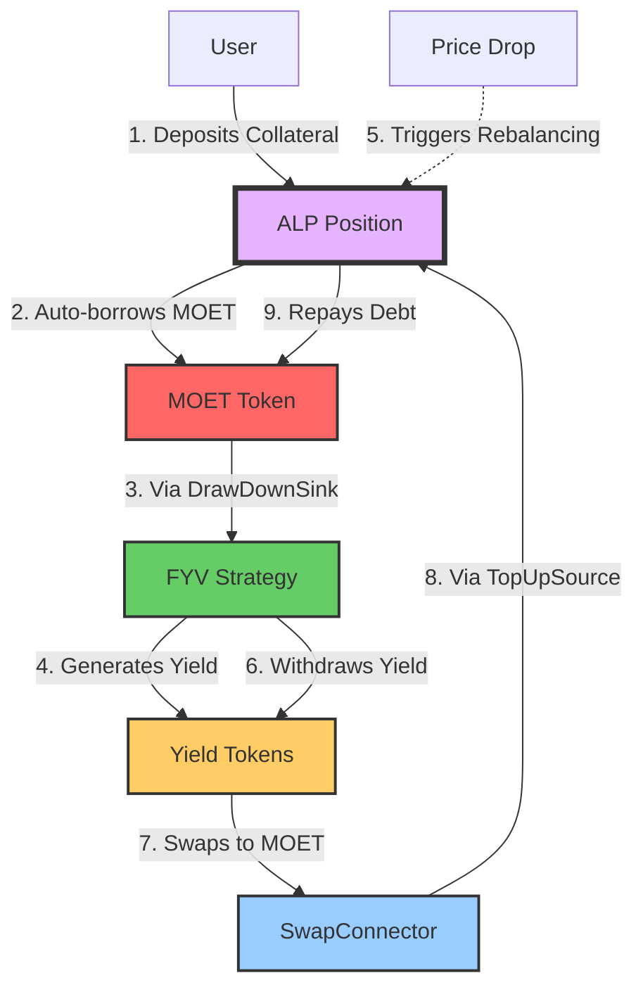

# Automated Lending Platform (ALP)

The Automated Lending Platform (ALP) is the core lending protocol component of [Flow Credit Market (FCM)](../fcm/index.md). ALP provides the foundational lending and borrowing infrastructure with automated position management and liquidation protection.

:::info
ALP is one of three core components that make up FCM: ALP (Automated Lending Platform) provides the lending/borrowing engine, [Flow Yield Vaults (FYV)](../flow-yield-vaults/index.md) handles yield aggregation strategies, and [MOET](../moet/index.md) serves as the synthetic stablecoin and unit of account.
:::

ALP is a decentralized lending protocol that enables users to deposit collateral to create lending positions, borrow assets against their collateral up to their borrowing limit, earn interest on deposits, and maintain positions through automated rebalancing.

The protocol uses MOET as its primary unit of account and default borrowed asset, with all prices quoted in MOET terms.

## Automated Rebalancing

ALP's standout feature is its **automated rebalancing** system that uses [DeFi Actions](../../blockchain-development-tutorials/forte/flow-actions/index.md) to maintain optimal position health. When overcollateralized (health > 1.5), the system automatically borrows more to maximize capital efficiency. When undercollateralized (health < 1.1), it automatically repays debt using yield from FYV. The protocol targets a health range of 1.1 to 1.5 for balanced risk/reward, and prevents liquidations by pulling from TopUpSource (often FYV strategies) when needed.

### Integration with FYV

ALP's unique liquidation prevention mechanism leverages yield from Flow Yield Vaults:

1. User deposits collateral into ALP position
2. ALP auto-borrows MOET to reach target health
3. Borrowed MOET flows into FYV strategy (via DrawDownSink)
4. FYV generates yield on the borrowed MOET
5. If collateral price drops, ALP pulls from FYV (via TopUpSource) to prevent liquidation
6. If collateral price increases and health factor exceeds 1.5, ALP borrows more MOET (via DrawDownSink) to maximize capital efficiency
7. **Result**: Yield helps maintain position health automatically while optimizing leverage

## Core Components

The protocol consists of four key components: the **Pool** serves as the central contract managing all positions and reserves; each **Position** represents a user's credit account tracking collateral and debt; **TokenState** maintains per-token state including interest indices; and the **Health Factor** measures the ratio of collateral to debt (which must stay above 1.0).

Learn more in [Architecture Overview](./architecture.md).

## How ALP Fits into FCM

## Resources

- [ALP GitHub Repository](https://github.com/onflow/FlowCreditMarket) (FlowCreditMarket contract)
- [Flow Credit Market (FCM)](../fcm/index.md) - The complete product
- [MOET Token Documentation](#)
- [Flow Documentation](https://developers.flow.com)

## Security Considerations

ALP includes multiple safety features to protect users and the protocol. The system implements oracle staleness checks and deviation guards to ensure price accuracy, enforces warm-up periods after unpausing liquidations to prevent immediate exploits, provides slippage protection for DEX routes during trades, and continuously monitors health factors with alerts. Always monitor your position health and ensure sufficient collateral to avoid liquidation.
