# Liquidation System

Liquidations are a critical safety mechanism in ALP that protect the protocol from insolvency. When a position becomes undercollateralized, it can be liquidated to restore the protocol's health and protect lenders.

## Understanding Liquidations

### What is Liquidation?

Liquidation is the process of forcibly closing or partially closing an undercollateralized position by:

1. Seizing some of the borrower's collateral
2. Using it to repay outstanding debt
3. Returning the position to a healthy state
4. Incentivizing the liquidator with a bonus

```mermaid
graph LR
    A[Position<br/>HF < 1.0] --> B[Liquidator<br/>Detected]
    B --> C[Seize<br/>Collateral]
    C --> D[Repay<br/>Debt]
    D --> E[Position<br/>HF = 1.05 ✓]
    D --> F[Liquidator<br/>Gets Bonus]

    style A fill:#fbb
    style E fill:#bfb
    style F fill:#bfb
```



### Why Liquidations are Necessary

Liquidations protect the protocol by preventing insolvency through ensuring debt is always backed by sufficient collateral, protecting lenders by guaranteeing depositors can withdraw their funds, maintaining stability by keeping the system solvent during market volatility, and incentivizing monitoring by rewarding participants who help maintain protocol health.

## Liquidation Triggers

### Health Factor Threshold

A position becomes **liquidatable** when its health factor falls below the trigger threshold:

```
Liquidation Trigger: Health Factor < 1.0
```


**What causes health factor to drop**:

1. **Collateral price decreases**
   - Your FLOW drops from $1 to $0.80
   - Effective collateral value falls
   - Health factor decreases proportionally

2. **Debt accumulation**
   - Interest accrues on borrowed amount
   - Debt grows over time
   - Health factor gradually decreases

3. **Combination of factors**
   - Collateral price drops while interest accrues
   - Multiple collateral types move differently
   - Debt token price increases relative to collateral

### Liquidation Target Health

When a position is liquidated, it's brought to a **target health factor**:

```
Liquidation Target Health: 1.05
```

This means not all collateral is seized—only enough to restore the position to a health factor of 1.05. The position remains open after partial liquidation, and the borrower retains their remaining collateral.

### Example Liquidation Scenario

```mermaid
sequenceDiagram
    participant Price
    participant Position
    participant Liquidator
    participant Protocol

    Note over Position: Initial: HF = 1.30 ✓<br/>1000 FLOW @ $1<br/>Debt: 615 MOET

    Price->>Position: FLOW drops to $0.75
    Position->>Position: HF = 0.975 ✗

    Liquidator->>Liquidator: Detect HF < 1.0!
    Liquidator->>Protocol: Liquidate position
    Protocol->>Position: Seize ~$146 collateral
    Protocol->>Position: Repay debt
    Protocol->>Liquidator: Transfer collateral + bonus

    Note over Position: After: HF = 1.05 ✓<br/>Remaining collateral<br/>Debt partially repaid
```



**Numeric example**:
```
Initial State (Healthy):
- Collateral: 1000 FLOW @ $1 = $1000, factor 0.8 = $800 effective
- Debt: 615.38 MOET @ $1 = $615.38
- Health Factor: 800 / 615.38 = 1.30 ✓

After FLOW Price Drops to $0.75:
- Collateral: 1000 FLOW @ $0.75 = $750, factor 0.8 = $600 effective
- Debt: 615.38 MOET @ $1 = $615.38
- Health Factor: 600 / 615.38 = 0.975 ✗ LIQUIDATABLE

After Liquidation to Target HF 1.05:
- Required effective collateral: 615.38 * 1.05 = $646.15
- Collateral seized: ~$146.15 worth at market price
- Remaining collateral: ~$453.85 effective
- Health Factor: 646.15 / 615.38 = 1.05 ✓
```

## Liquidation Mechanisms

ALP implements three distinct liquidation paths to ensure positions can always be liquidated efficiently.

```mermaid
graph TB
    Liquidatable[Position HF < 1.0]

    Liquidatable --> Path1[Keeper<br/>Repay-for-Seize]
    Liquidatable --> Path2[Protocol<br/>DEX Liquidation]
    Liquidatable --> Path3[Auto-Liquidation]

    Path1 --> K1[Keeper repays debt]
    K1 --> K2[Receives collateral<br/>+ bonus]

    Path2 --> D1[Protocol seizes<br/>collateral]
    D1 --> D2[Swaps via DEX<br/>for debt token]
    D2 --> D3[Repays position debt]

    Path3 --> A1[Scheduled scan]
    A1 --> A2[Batch liquidates<br/>multiple positions]
    A2 --> A3[Uses DEX path]

    K2 --> Result[Position HF = 1.05 ✓]
    D3 --> Result
    A3 --> Result

    style Liquidatable fill:#fbb
    style Result fill:#bfb
```



### 1. Keeper Repay-for-Seize

**How it works**:
1. A keeper (third-party participant) detects an undercollateralized position
2. Keeper repays debt with their own funds
3. Protocol calculates collateral to seize (debt repaid + liquidation bonus)
4. Keeper receives seized collateral
5. Position is brought to target health factor (1.05)

```mermaid
sequenceDiagram
    participant Keeper
    participant Protocol
    participant Position

    Keeper->>Keeper: Detect position #42<br/>HF = 0.98
    Keeper->>Protocol: Repay 100 MOET debt
    Protocol->>Position: Reduce debt by 100
    Protocol->>Protocol: Calculate:<br/>100 + 10% bonus = 110 value
    Protocol->>Position: Seize equivalent collateral
    Position->>Keeper: Transfer ~108 FLOW
    Protocol->>Position: Update HF = 1.05 ✓

    Note over Keeper,Position: Keeper profits ~8 MOET value
```



**Key characteristics**: The system is permissionless—anyone can act as a keeper—and incentivized, with keepers earning a liquidation bonus (typically 5-10%). It's precise, using only the exact amount needed, and instant, with a single transaction resolving the liquidation.

**Benefits**: This approach enables fast response to undercollateralization, distributed monitoring through many keepers, market-driven efficiency, and eliminates protocol DEX dependency.

### 2. Protocol DEX Liquidation

**How it works**:
1. Protocol detects undercollateralized position
2. Protocol seizes collateral from position
3. Protocol swaps collateral via allowlisted DEX
4. Swap output is used to repay debt
5. Any remainder is returned appropriately
6. Position is brought to target health factor

```mermaid
sequenceDiagram
    participant Protocol
    participant Position
    participant DEX
    participant Oracle

    Protocol->>Position: Detect HF = 0.98
    Protocol->>Oracle: Get FLOW price
    Oracle-->>Protocol: $0.98 per FLOW
    Protocol->>Position: Seize 150 FLOW
    Protocol->>DEX: Swap 150 FLOW
    DEX-->>Protocol: Return ~147 MOET
    Protocol->>Protocol: Check slippage<br/>vs oracle price
    Protocol->>Position: Repay 147 MOET
    Position->>Position: HF = 1.05 ✓

    Note over Protocol,Position: Slippage protection ensures<br/>fair liquidation price
```



**Key characteristics**: Protocol DEX liquidation is protocol-executed (no external keeper needed), integrates with decentralized exchanges for swaps, includes slippage protection through maximum deviation checks versus oracle prices, and can be automated by either the protocol or keepers.

**Slippage Protection**:

The protocol ensures the DEX price doesn't deviate too much from the oracle price, preventing manipulation and unfair liquidations.

**Example Flow**:
```
Position #42: 1000 FLOW collateral, 650 MOET debt, HF = 0.98
↓
Protocol seizes 150 FLOW
↓
Swaps via DEX: 150 FLOW → ~147 MOET (with slippage check)
↓
Repays 147 MOET to position debt
↓
Position: 850 FLOW collateral, 503 MOET debt, HF = 1.05 ✓
```

### 3. Auto-Liquidation

**How it works**:
1. Scheduled automation or keeper triggers scan
2. System identifies all undercollateralized positions
3. For each position, executes DEX liquidation path
4. Subject to same oracle and DEX safety checks
5. Events emitted for each liquidation


**Key characteristics**: Auto-liquidation can run on a scheduled timer (e.g., every block or every minute), handle multiple positions through batch processing, apply the same warm-up and deviation safety checks, and provide detailed event logging per position.

**Benefits**: This mechanism provides hands-free liquidation protection, guaranteed execution that's not dependent on keeper availability, integration capability with off-chain automation, and serves as a protocol safety net.

## Safety Features

ALP includes multiple safety mechanisms to ensure liquidations are fair and protect against manipulation.


### Oracle Staleness Checks

Prices must be recent and valid:

```
- Maximum age: staleThreshold (typically 5 minutes)
- If price is too old: liquidation reverts
- Per-token configuration: different tokens can have different thresholds
```

**Why this matters**:
- Prevents liquidations based on stale/incorrect prices
- Ensures fairness during oracle downtime
- Protects borrowers from false liquidations

### Oracle Deviation Guards

Large price movements are checked:

```
maxDeviationBps: Maximum change vs last price snapshot
Example: 1000 bps = 10% maximum deviation

If price moves >10% in single update:
- Liquidation may be paused or rejected
- Additional verification required
- Protects against oracle manipulation
```

### DEX Price Deviation

For DEX-based liquidations, the swap price must align with oracle:

```
dexOracleDeviationBps: Maximum deviation between DEX and oracle

Example:
- Oracle price: 1 FLOW = 1 MOET
- DEX swap: 150 FLOW → 145 MOET
- Deviation: ~3.3% ≈ 333 bps

If deviation > dexOracleDeviationBps:
- Liquidation reverts
- Prevents MEV exploitation
- Ensures fair liquidation prices
```

### Liquidation Warm-up Period

After the protocol is unpaused, liquidations have a warm-up delay:


**Configuration**:
```
liquidationWarmupSec: Delay after unpause before liquidations enabled
Example: 300 seconds (5 minutes)

Why:
- Gives borrowers time to add collateral
- Prevents immediate liquidations after downtime
- Allows prices to stabilize
```

### Circuit Breakers

Protocol can pause liquidations in emergencies:

```
liquidationsPaused: Boolean flag

When true:
- All liquidation functions revert
- Positions cannot be liquidated
- Borrowing may also be restricted
- Used during emergencies, upgrades, or oracle issues
```

## Liquidation Incentives

### Liquidation Bonus

Keepers earn a bonus for performing liquidations:


**Example**:
```
Typical bonus: 5-10% of repaid debt

- Keeper repays: 100 MOET
- Collateral value at liquidation bonus: ~108 MOET equivalent
- Keeper profit: ~8 MOET (8% bonus)

Formula:
Collateral Seized = (Debt Repaid * (1 + Liquidation Bonus)) / Collateral Price
```

### Economic Dynamics


**Considerations**:
- **Gas Costs**: Profitability = Liquidation Bonus - Gas Costs
- **Position Size**: Small positions may not be profitable to liquidate
- **Competition**: Multiple keepers compete for liquidations (first come, first served)
- **MEV**: Sophisticated keepers may use advanced techniques
- **Safety Net**: Auto-liquidation provides backup for unprofitable liquidations

## Liquidation Events and Monitoring

### Monitoring Your Position


To avoid liquidation, you should set up alerts to monitor when health factor drops below 1.3, watch collateral token prices closely, monitor interest accrual since debt grows over time, use automation through auto-rebalancing or auto-repayment, and maintain a safety buffer by keeping your health factor well above 1.1.

### Liquidation Warning Signs

**Early warnings** (HF = 1.3 → 1.1):
- Time to add collateral or repay debt
- Rebalancing may trigger automatically
- Still safe but approaching risk zone

**Urgent warnings** (HF = 1.1 → 1.0):
- Immediate action required
- Liquidation imminent if health continues to drop
- Add substantial collateral or repay significant debt

**Critical** (HF < 1.0):
- Position is liquidatable
- May be liquidated at any moment
- Severe consequences (loss of collateral with liquidation penalty)

## Protecting Against Liquidation

### Protection Strategies


1. **Conservative collateralization**:
   - Target health factor > 1.5
   - Provides buffer against price drops
   - Reduces liquidation risk

2. **Diversified collateral**:
   - Use multiple token types
   - Reduces impact of single token price drop
   - Improves overall stability

3. **Regular monitoring**:
   - Check health factor daily
   - Set up alerts and notifications
   - Use automation tools

4. **Quick response capability**:
   - Keep liquid funds available
   - Set up TopUpSource for auto-repayment
   - Have repayment transactions ready

5. **Use stable collateral**:
   - Stablecoins have lower volatility
   - Higher collateral factors
   - More predictable liquidation risk

### Recovery from Near-Liquidation

If your health factor is approaching 1.0, you have three options:


:::info For Developers
```cadence
// Option 1: Add collateral
position.deposit(collateralVault: <-additionalFLOW)

// Option 2: Repay debt
position.repay(repaymentVault: <-moetRepayment)

// Option 3: Trigger rebalancing (if TopUpSource configured)
pool.rebalancePosition(pid: yourPositionID, force: true)
```

See [GitHub](https://github.com/onflow/FlowCreditMarket) for complete API documentation.
:::

## Advanced Topics

### Partial vs Full Liquidation


- **Partial liquidation**: Position brought to target health (1.05), remains open (most common)
- **Full liquidation**: Rare; only if position value can't cover debt + bonus

### Multi-Collateral Liquidations

When position has multiple collateral types:
- Liquidation logic prioritizes based on configuration
- May seize from multiple collateral types
- Calculation ensures fair distribution

### Flash Loan Liquidations

Advanced keepers may use flash loans for zero-capital liquidations:

```mermaid
sequenceDiagram
    participant Keeper
    participant FlashLoan
    participant Protocol
    participant DEX

    Keeper->>FlashLoan: Flash borrow MOET
    FlashLoan-->>Keeper: 100 MOET (+ fee)
    Keeper->>Protocol: Liquidate with borrowed MOET
    Protocol-->>Keeper: Receive collateral
    Keeper->>DEX: Swap collateral → MOET
    DEX-->>Keeper: ~108 MOET
    Keeper->>FlashLoan: Repay 100 MOET + fee
    Keeper->>Keeper: Keep profit!

    Note over Keeper: No upfront capital needed!
```



This allows liquidations without upfront capital.

## Summary

**Liquidation Triggers**:
- 🚨 Health Factor < 1.0 (undercollateralized)
- 📉 Collateral price drops or interest accrual
- 🎯 Target: Restore HF to 1.05 after liquidation

**Three Liquidation Paths**:
1. **Keeper Repay-for-Seize**: Third parties repay debt, earn bonus
2. **Protocol DEX Liquidation**: Automated swap and repayment
3. **Auto-Liquidation**: Scheduled batch processing

**Safety Features**:
- ✅ Oracle staleness checks
- ✅ Oracle deviation guards
- ✅ DEX price deviation limits
- ✅ Liquidation warm-up periods
- ✅ Circuit breakers for emergencies

**Protection Strategies**:
- Maintain HF > 1.5 for safety buffer
- Set up TopUpSource for auto-protection
- Monitor positions regularly
- Use stable collateral when possible
- Diversify collateral types

## Mathematical Foundation

For detailed liquidation formulas and calculations:
- **Liquidation Trigger Math**: [Liquidation Mathematics](../fcm/math.md#liquidation-mathematics)
- **Collateral Seized Calculation**: [Collateral Seized Formula](../fcm/math.md#collateral-seized-calculation)
- **Health Factor Formulas**: [Health Factor Definition](../fcm/math.md#health-factor)
- **Maximum Price Drop**: [Safe Price Drop Calculations](../fcm/math.md#maximum-safe-price-drop)

## Next Steps

- **Understand automation**: [Rebalancing Mechanics](./rebalancing.md)
- **See the big picture**: [Position Lifecycle](./position-lifecycle.md)
- **Explore credit mechanics**: [Credit Market Mechanics](./credit-market-mechanics.md)
- **Learn prevention strategies**: [FCM Yield-Powered Protection](../fcm/basics.md#yield-powered-liquidation-prevention)

---

:::tip Key Takeaway
Liquidations are a last resort safety mechanism. With proper monitoring, conservative collateralization, and automation (especially [FCM's yield-powered protection](../fcm/basics.md#yield-powered-liquidation-prevention)), you can avoid liquidation entirely. The system is designed to give you ample warning and multiple recovery options before liquidation occurs.
:::
