# MOET's Role in ALP

MOET plays a central role in ALP as the default token and primary unit of account. Understanding MOET's function is essential for effectively using ALP and [Flow Credit Market (FCM)](../fcm/index.md).

## What is MOET?

**MOET** is a fungible token on Flow that serves as:
- 💰 **The primary borrowed asset** - What you borrow from ALP
- 📊 **The unit of account** - All prices quoted in MOET terms
- 🔄 **The rebalancing medium** - Used for all automated operations
- 🌉 **The value bridge** - Flows between ALP and FYV

For more about MOET tokenomics, see the [MOET documentation](../moet/index.md).

## MOET as Unit of Account

Think of MOET as the "common language" for all value in ALP - like how everything in a store is priced in dollars.

### All Prices in MOET Terms


**Why this matters**: Using MOET as the unit of account simplifies calculations by expressing all values in one currency, standardizes pricing consistently across all tokens, enables multi-collateral positions by making it easy to compare different assets, and provides unified risk management through a single health metric.

**Health factor calculation example**:
```
Collateral: 1000 FLOW @ 1.0 MOET each × 0.8 factor = 800 MOET value
Debt: 615.38 MOET
Health Factor = 800 / 615.38 = 1.30

All in MOET terms = Simple and consistent!
```

:::tip Why Not Just Use USD?
MOET is designed specifically for Flow DeFi, ensuring deep on-chain liquidity, native protocol integration, optimized performance for Flow operations, and better composability with FYV and other protocols.
:::

## MOET in the Auto-Borrowing Flow

When you deposit collateral with auto-borrowing enabled, MOET is what you borrow:


**Why MOET?**
1. **Standardization**: One primary asset simplifies everything
2. **Liquidity**: MOET designed for high liquidity
3. **Predictability**: You always know what you'll receive
4. **Efficiency**: No token choice complexity

## MOET in Rebalancing

### Overcollateralized: Borrow More MOET

When health rises above 1.5 (too safe), ALP automatically borrows more MOET:

```mermaid
graph LR
    A[Health > 1.5<br/>Too Safe] --> B[Calculate Excess]
    B --> C[Auto-borrow MOET]
    C --> D[Push to DrawDownSink]
    D --> E[Health = 1.3 ✓]

    style A fill:#bfb
    style E fill:#bfb
```



**Example**:
```
State: $1000 effective collateral, $400 MOET debt
Health: 1000 / 400 = 2.5 (way too high!)

Action: Borrow 769.23 - 400 = 369.23 more MOET
Result: $1000 / $769.23 = 1.3 (perfect!)
```

### Undercollateralized: Repay MOET

When health drops below 1.1 (risky), ALP automatically repays MOET debt:

```mermaid
graph LR
    A[Health < 1.1<br/>Risky!] --> B[Calculate Shortfall]
    B --> C[Pull from TopUpSource]
    C --> D[Repay MOET debt]
    D --> E[Health = 1.3 ✓]

    style A fill:#fbb
    style E fill:#bfb
```



**Example**:
```
State: $640 effective collateral (price dropped!), $615.38 MOET debt
Health: 640 / 615.38 = 1.04 (danger zone!)

Action: Repay 615.38 - 492.31 = 123.07 MOET
Result: $640 / $492.31 = 1.3 (safe again!)
```

**Math reference**: See [FCM Mathematical Foundations](../fcm/math.md#auto-borrowing-mathematics) for auto-borrowing formulas and [Rebalancing Mathematics](../fcm/math.md#rebalancing-mathematics) for rebalancing calculations.

## MOET Flow Patterns

### Pattern 1: Simple Borrowing

**Use case**: Borrow MOET, use it yourself


**Flow**: Collateral → Borrow MOET → You control it

### Pattern 2: FCM Integration (Full Automation)

**Use case**: Maximum automation with FYV

```mermaid
graph TB
    User[Deposit FLOW] --> ALP[ALP Position]
    ALP -->|Auto-borrow| MOET[MOET]
    MOET -->|DrawDownSink| FYV[FYV Strategy]
    FYV -->|Generate Yield| Yield[Yield Tokens]

    Price[Price Drop] -.->|Triggers| Rebal[Rebalancing]
    Rebal -->|Pull via TopUpSource| FYV
    FYV -->|Provide MOET| ALP
    ALP -->|Repay| MOET
    ALP -->|Health Restored| Safe[Health = 1.3 ✓]

    style ALP fill:#f9f,stroke:#333,stroke-width:3px
    style FYV fill:#bfb,stroke:#333,stroke-width:3px
    style MOET fill:#fbb,stroke:#333,stroke-width:2px
```



**Flow**: Collateral → Auto-borrow MOET → FYV → Yield protects position!

:::tip FCM's Innovation
This is why FCM is unique: Your MOET earnings from FYV automatically repay debt when needed. **Yield-powered liquidation prevention!**

Learn more: [FCM Basics](../fcm/basics.md#1-yield-powered-liquidation-prevention)
:::

### Pattern 3: Liquidity Provision

**Use case**: Earn trading fees with borrowed MOET


**Flow**: Collateral → Borrow MOET → LP Pool → Earn trading fees

### Pattern 4: Yield Arbitrage

**Use case**: Profit from rate differentials


**Flow**: Borrow MOET cheap → Lend MOET expensive → Keep spread

## MOET in Liquidations

### Keeper Liquidations

Keepers repay MOET debt to seize collateral:


### Protocol DEX Liquidations

Protocol swaps collateral to MOET automatically:

```mermaid
graph LR
    A[Liquidatable Position] --> B[Seize FLOW Collateral]
    B --> C[Swap FLOW → MOET<br/>via DEX]
    C --> D[Repay MOET Debt]
    D --> E[Health Restored]

    style A fill:#fbb
    style E fill:#bfb
```



**Example**:
```
Position: 1000 FLOW, 650 MOET debt, HF = 0.98
↓
Seize: 150 FLOW
↓
Swap: 150 FLOW → 147 MOET (via DEX)
↓
Repay: 147 MOET debt
↓
Result: 850 FLOW, 503 MOET debt, HF = 1.05 ✓
```

## MOET Economics

### Supply & Demand


### Interest Rate Dynamics

```
Utilization = Total MOET Borrowed / Total MOET Available

┌─────────────────┬──────────────────┬───────────────────┐
│ Utilization     │ Interest Rate    │ Result            │
├─────────────────┼──────────────────┼───────────────────┤
│ 0-80% (Low)     │ 2-8% APY         │ Cheap borrowing   │
│ 80-90% (Medium) │ 8-20% APY        │ Balanced          │
│ 90-100% (High)  │ 20-50%+ APY      │ Discourages borrow│
└─────────────────┴──────────────────┴───────────────────┘
```

**Why it matters**: Low utilization makes MOET cheap to borrow, while high utilization makes borrowing expensive and encourages repayment. This dynamic allows the system to self-balance supply and demand.

## Why MOET vs Other Tokens?

### Comparison Table

| Feature | MOET | FLOW | USDC |
|---------|------|------|------|
| Primary borrowed asset | ✅ Yes | ⚠️ Possible | ⚠️ Possible |
| Unit of account | ✅ Yes | ❌ No | ❌ No |
| Auto-borrow default | ✅ Yes | ❌ No | ❌ No |
| Rebalancing token | ✅ Yes | ❌ No | ❌ No |
| FCM integration | ✅ Deep | ⚠️ Moderate | ⚠️ Moderate |
| FYV integration | ✅ Native | ⚠️ Limited | ⚠️ Limited |

### MOET Advantages

1. **Designed for DeFi**: Built specifically for Flow DeFi operations
2. **High Liquidity**: Deep markets ensure efficient operations
3. **Composability**: Works seamlessly with FYV and other protocols
4. **Predictability**: Standard token across all FCM operations
5. **Efficiency**: Single token simplifies everything

### Can I Use Other Tokens?

Yes, but with limitations:

:::info For Developers
You can manually borrow other tokens:
```cadence
// Borrow FLOW instead of MOET
let flowBorrowed <- position.borrow(
    type: Type<@FlowToken.Vault>(),
    amount: 100.0
)
```

However:
- Auto-borrowing always uses MOET
- Rebalancing always uses MOET
- Health calculations still in MOET terms
- FYV integration requires MOET
:::

## Best Practices

### For Borrowers

✅ **Do**:
- Maintain MOET buffer in wallet for emergencies
- Set up TopUpSource with MOET for auto-protection
- Monitor MOET interest rates
- Diversify yield strategies with borrowed MOET

❌ **Don't**:
- Assume MOET will always be cheap to borrow
- Put all borrowed MOET in one place
- Ignore MOET balance in TopUpSource
- Forget MOET debt accumulates interest

### For Yield Seekers

✅ **Do**:
- Use full FCM integration (ALP + FYV)
- Let MOET flow automatically to FYV
- Let yield protect your position
- Monitor FYV MOET liquidity

❌ **Don't**:
- Manually manage MOET if using FYV
- Interrupt the automated flow
- Remove MOET from FYV when position needs it

## Real-World Example

### Complete MOET Lifecycle

```mermaid
graph TB
    Start[User deposits<br/>1000 FLOW] --> Calc[ALP calculates:<br/>Can borrow 615 MOET]
    Calc --> Borrow[Auto-borrow<br/>615 MOET]
    Borrow --> Deploy[MOET → FYV<br/>via DrawDownSink]
    Deploy --> Earn[FYV generates<br/>yield in MOET]

    Price[FLOW price<br/>drops 20%] -.-> Detect[ALP detects<br/>HF = 1.04]
    Detect --> Need[Need 123 MOET<br/>to rebalance]
    Need --> Pull[Pull from FYV<br/>via TopUpSource]
    Pull --> Repay[Repay 123 MOET]
    Repay --> Safe[Health = 1.3 ✓<br/>Liquidation avoided]

    style Start fill:#bbf
    style Earn fill:#bfb
    style Price fill:#fbb
    style Safe fill:#bfb
```



**What happened**:
1. Deposited FLOW → Auto-borrowed 615 MOET
2. MOET deployed to FYV → Earned yield
3. Price dropped → Position at risk
4. FYV provided 123 MOET → Debt repaid
5. **Result**: Your MOET yield prevented liquidation!

## Summary

**MOET's Three Roles**:
1. 💰 **Borrowed Asset**: What you borrow from ALP
2. 📊 **Unit of Account**: How all prices are quoted
3. 🔄 **Rebalancing Medium**: Flows between ALP and FYV

**Key Points**:
- All auto-borrowing is in MOET
- All rebalancing uses MOET
- All health calculations in MOET terms
- MOET enables FCM's yield-powered liquidation prevention

**Why MOET Matters**:
Without MOET as the standard, FCM's automation wouldn't work. MOET is the "common currency" that lets ALP and FYV communicate seamlessly, enabling the unique liquidation prevention mechanism.

## Mathematical Foundation

MOET is central to all FCM calculations:
- **Unit of Account**: All prices quoted in MOET terms - [Price Oracle](../fcm/math.md#core-variables)
- **Auto-Borrowing**: MOET amounts calculated from collateral - [Auto-Borrowing Math](../fcm/math.md#auto-borrowing-mathematics)
- **Rebalancing**: MOET flows restore health factor - [Rebalancing Math](../fcm/math.md#rebalancing-mathematics)
- **Health Factor**: All calculations in MOET terms - [Health Factor Formula](../fcm/math.md#health-factor)

## Next Steps

- **Understand automation**: [Rebalancing Mechanics](./rebalancing.md)
- **See the big picture**: [FCM Architecture](../fcm/architecture.md)
- **Deep dive on MOET**: [MOET Documentation](../moet/index.md)
- **Explore position management**: [Position Lifecycle](./position-lifecycle.md)

---

:::tip Key Takeaway
MOET isn't just another token - it's the **backbone** of FCM. It standardizes pricing, enables automation, and makes yield-powered liquidation prevention possible. Think of it as the "blood" flowing through FCM's veins, carrying value between ALP and FYV.
:::
