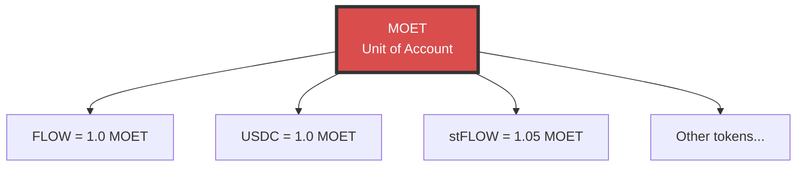
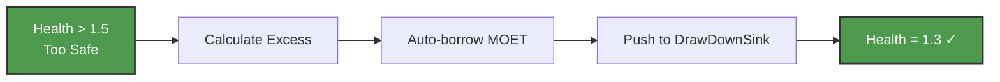
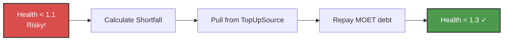
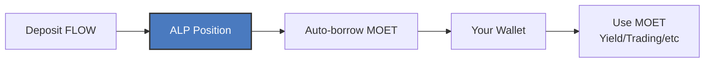
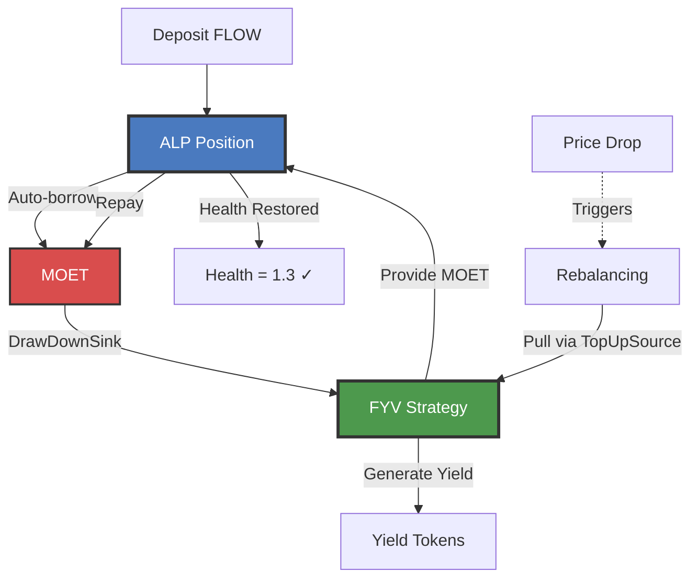
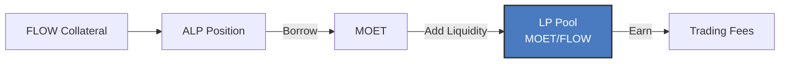
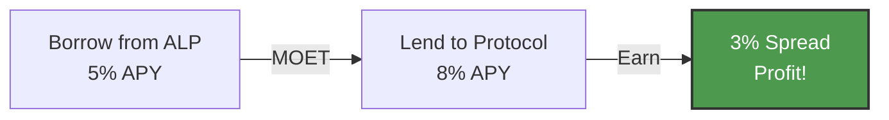
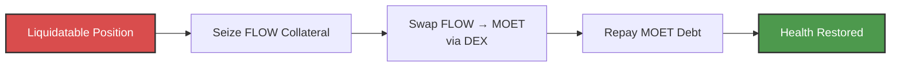
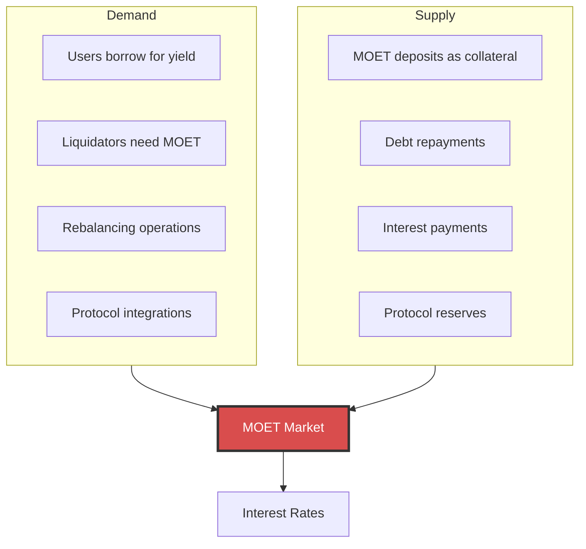

# MOET's Role in ALP

MOET plays a central role in ALP as the default token and primary unit of account. Understanding MOET's function is essential for effectively using ALP and [Flow Credit Market (FCM)](../fcm/index.md). It standardizes pricing, enables automation, and makes yield-powered liquidation prevention possible. 

**MOET** is a fungible token on Flow that serves as:

- **The primary borrowed asset** - What you borrow from ALP
- **The unit of account** - All prices quoted in MOET terms
- **The rebalancing medium** - Used for all automated operations
- **The value bridge** - Flows between ALP and FYV

For more about MOET tokenomics, see the [MOET documentation](../moet/index.md).

## MOET as Unit of Account

Think of MOET as the "common language" for all value in ALP - like how everything in a store is priced in dollars.

### All Prices in MOET Terms



Using MOET as the unit of account simplifies calculations by expressing all values in one currency, standardizes pricing consistently across all tokens, enables multi-collateral positions by making it easy to compare different assets, and provides unified risk management through a single health metric.

**Health factor calculation example**:

```
Collateral: 1000 FLOW @ 1.0 MOET each × 0.8 factor = 800 MOET value
Debt: 615.38 MOET
Health Factor = 800 / 615.38 = 1.30

Both collateral and debt in terms of MOET.
```

## MOET in the Auto-Borrowing Flow

When you deposit collateral with auto-borrowing enabled, MOET is what you borrow:


**Why MOET?**
1. **Standardization**: One primary asset simplifies everything
2. **Liquidity**: MOET designed for high liquidity
3. **Predictability**: You always know what you'll receive
4. **Efficiency**: No token choice complexity

## MOET in Rebalancing

### Overcollateralized: Borrow More MOET

When health rises above 1.5 (too safe), ALP automatically borrows more MOET:



**Example**:
```
State: $1000 effective collateral, $400 MOET debt
Health: 1000 / 400 = 2.5 (way too high!)

Action: Borrow 769.23 - 400 = 369.23 more MOET
Result: $1000 / $769.23 = 1.3 (perfect!)
```

### Undercollateralized: Repay MOET

When health drops below 1.1 (risky), ALP automatically repays MOET debt:



**Example**:
```
State: $640 effective collateral (price dropped!), $615.38 MOET debt
Health: 640 / 615.38 = 1.04 (danger zone!)

Action: Repay 615.38 - 492.31 = 123.07 MOET
Result: $640 / $492.31 = 1.3 (safe again!)
```

**Math reference**: See [FCM Mathematical Foundations](../fcm/math.md#auto-borrowing-mathematics) for auto-borrowing formulas and [Rebalancing Mathematics](../fcm/math.md#rebalancing-mathematics) for rebalancing calculations.

## MOET Flow Patterns

### Pattern 1: Simple Borrowing

**Use case**: Borrow MOET, use it yourself



**Flow**: Collateral → Borrow MOET → You control it

### Pattern 2: FCM Integration (Full Automation)

**Use case**: Maximum automation with FYV



**Flow**: Collateral → Auto-borrow MOET → FYV → Yield protects position!

:::tip FCM's Innovation
This is why FCM is unique: Your MOET earnings from FYV automatically repay debt when needed. **Yield-powered liquidation prevention!**

Learn more: [FCM Basics](../fcm/basics.md#1-yield-powered-liquidation-prevention)
:::

### Pattern 3: Liquidity Provision

**Use case**: Earn trading fees with borrowed MOET



**Flow**: Collateral → Borrow MOET → LP Pool → Earn trading fees

### Pattern 4: Yield Arbitrage

**Use case**: Profit from rate differentials



**Flow**: Borrow MOET cheap → Lend MOET expensive → Keep spread

## MOET in Liquidations

### Keeper Liquidations

Keepers repay MOET debt to seize collateral:


### Protocol DEX Liquidations

Protocol swaps collateral to MOET automatically:



**Example**:
```
Position: 1000 FLOW, 650 MOET debt, HF = 0.98
↓
Seize: 150 FLOW
↓
Swap: 150 FLOW → 147 MOET (via DEX)
↓
Repay: 147 MOET debt
↓
Result: 850 FLOW, 503 MOET debt, HF = 1.05 ✓
```

## MOET Economics

### Supply & Demand



### Interest Rate Dynamics

```
Utilization = Total MOET Borrowed / Total MOET Available

┌─────────────────┬──────────────────┬───────────────────┐
│ Utilization     │ Interest Rate    │ Result            │
├─────────────────┼──────────────────┼───────────────────┤
│ 0-80% (Low)     │ 2-8% APY         │ Cheap borrowing   │
│ 80-90% (Medium) │ 8-20% APY        │ Balanced          │
│ 90-100% (High)  │ 20-50%+ APY      │ Discourages borrow│
└─────────────────┴──────────────────┴───────────────────┘
```

**Why it matters**: Low utilization makes MOET cheap to borrow, while high utilization makes borrowing expensive and encourages repayment. This dynamic allows the system to self-balance supply and demand.

## Why MOET vs Other Tokens?

### Comparison Table

| Feature | MOET | FLOW | USDC |
|---------|------|------|------|
| Primary borrowed asset | ✅ Yes | ⚠️ Possible | ⚠️ Possible |
| Unit of account | ✅ Yes | ❌ No | ❌ No |
| Auto-borrow default | ✅ Yes | ❌ No | ❌ No |
| Rebalancing token | ✅ Yes | ❌ No | ❌ No |
| FCM integration | ✅ Deep | ⚠️ Moderate | ⚠️ Moderate |
| FYV integration | ✅ Native | ⚠️ Limited | ⚠️ Limited |

### MOET Advantages

1. **Designed for DeFi**: Built specifically for Flow DeFi operations
2. **High Liquidity**: Deep markets ensure efficient operations
3. **Composability**: Works seamlessly with FYV and other protocols
4. **Predictability**: Standard token across all FCM operations
5. **Efficiency**: Single token simplifies everything

## Best Practices

### For Borrowers

When borrowing MOET, always maintain a buffer in your wallet for emergencies and set up a TopUpSource with sufficient MOET for automatic liquidation protection. Actively monitor MOET interest rates as they fluctuate with utilization, and diversify your yield strategies to spread risk across multiple opportunities. Avoid assuming MOET will always be cheap to borrow, concentrating all borrowed funds in one place, neglecting your TopUpSource balance, or forgetting that MOET debt continuously accumulates interest over time.

### For Yield Seekers

For optimal yield generation, use the full FCM integration with ALP and FYV to enable complete automation. Allow MOET to flow automatically to FYV strategies and let the accumulated yield protect your position from liquidation. Monitor FYV's MOET liquidity to ensure adequate funds are available for rebalancing. Once you've enabled FYV integration, avoid manually managing MOET, interrupting the automated flow, or removing MOET from FYV when your position might need it for rebalancing.

## Mathematical Foundation

MOET is central to all FCM calculations:
- **Unit of Account**: All prices quoted in MOET terms - [Price Oracle](../fcm/math.md#core-variables)
- **Auto-Borrowing**: MOET amounts calculated from collateral - [Auto-Borrowing Math](../fcm/math.md#auto-borrowing-mathematics)
- **Rebalancing**: MOET flows restore health factor - [Rebalancing Math](../fcm/math.md#rebalancing-mathematics)
- **Health Factor**: All calculations in MOET terms - [Health Factor Formula](../fcm/math.md#health-factor)

## Next Steps

- **Understand automation**: [Rebalancing Mechanics](./rebalancing.md)
- **See the big picture**: [FCM Architecture](../fcm/architecture.md)
- **Deep dive on MOET**: [MOET Documentation](../moet/index.md)
- **Explore position management**: [Position Lifecycle](./position-lifecycle.md)