# Position Lifecycle

A Position in ALP represents your lending account. Understanding the complete lifecycle from creation to closure helps you manage your positions effectively and maximize your DeFi strategy. A position's lifecycle is all about managing the health factor. Stay in the healthy range (1.1-1.5), use automation for hands-free management, and always have a plan for when prices move against you.

A **Position** tracks everything about your lending activity. It maintains a complete record of your collateral deposits (the assets you've deposited), debt obligations (the amounts you've borrowed), health metrics (your current safety status), and DeFi connectors (automation via Sinks and Sources that enable seamless integration with other protocols).

## Position Lifecycle Overview

```mermaid
stateDiagram-v2
    [*] --> Created: Deposit Collateral
    Created --> Healthy: Auto-borrow (optional)
    Healthy --> Overcollateralized: Add Collateral / Repay Debt
    Overcollateralized --> Healthy: Auto-borrow More
    Healthy --> Undercollateralized: Price Drop / Interest
    Undercollateralized --> Healthy: Auto-repay / Add Collateral
    Undercollateralized --> AtRisk: Further Price Drop
    AtRisk --> Undercollateralized: Emergency Action
    AtRisk --> Liquidatable: HF < 1.0
    Liquidatable --> Undercollateralized: Partial Liquidation
    Healthy --> [*]: Close Position
    Overcollateralized --> [*]: Close Position

    note right of Created
        Initial deposit
        HF = ∞ (no debt)
    end note

    note right of Healthy
        HF: 1.1 - 1.5
        Target: 1.3
    end note

    note right of AtRisk
        HF: 1.0 - 1.1
        Urgent action needed!
    end note
```



## Creating a Position

### The Creation Flow


### Option 1: With Auto-Borrowing (Recommended for FCM)

**Setup**:
- `pushToDrawDownSink = true`
- Automatically borrows to target health (1.3)
- Funds flow to your configured destination

**What happens**:
```
1. You deposit: 1000 FLOW
2. ALP calculates: 1000 × 0.8 = 800 effective collateral
3. ALP auto-borrows: 800 / 1.3 = 615.38 MOET
4. Funds flow: Via DrawDownSink (to FYV, wallet, etc.)
5. Final state: Health = 1.3, fully optimized
```

**Best for**: FCM users who want maximum automation and capital efficiency

### Option 2: Without Auto-Borrowing (Conservative)

**Setup**:
- `pushToDrawDownSink = false`
- No automatic borrowing
- You control when to borrow

**What happens**:
```
1. You deposit: 1000 FLOW
2. Position created with collateral only
3. Health factor: Infinite (no debt)
4. You manually borrow when ready
```

**Best for**: Users who want full manual control

## Health States Through Lifecycle

### State 1: Overcollateralized (HF > 1.5)


**Characteristics**: This state is very safe from liquidation and allows you to borrow significantly more. However, it's not capital efficient if you're not using auto-borrowing.

**Actions available**: You can borrow additional funds, withdraw excess collateral, or let the system auto-borrow to reach the target health factor.

**Example**:
```
Collateral: $2000 effective
Debt: $800 MOET
HF: 2000 / 800 = 2.5

Can borrow additional: ~$731 MOET (to reach HF 1.3)
```

### State 2: Healthy (HF 1.1 - 1.5)


**Characteristics**: This is the target operational range with balanced risk/reward and no automatic actions triggered.

**Actions available**: You can perform normal deposits and withdrawals, borrow within limits, and make repayments as desired.

**Example**:
```
Collateral: $800 effective
Debt: $615.38 MOET
HF: 800 / 615.38 = 1.30 ✓

Status: Perfect! At target health
```

### State 3: Undercollateralized (HF < 1.1)


**Characteristics**: This position is below target and needs attention. Auto-rebalancing may trigger, and risk increases significantly if the price continues dropping.

**Urgent actions**: You should add more collateral, repay some debt, and ensure TopUpSource has sufficient funds available.

**Example**:
```
Collateral: $680 effective (price dropped!)
Debt: $615.38 MOET
HF: 680 / 615.38 = 1.10

Status: At minimum threshold
Action: Consider rebalancing
```

### State 4: At Risk (HF 1.0 - 1.1)


**Characteristics**:
- 🔴 High liquidation risk
- 🔴 Immediate action required
- 🔴 May be liquidated very soon

**Immediate actions**:
1. Add substantial collateral immediately
2. Repay significant portion of debt
3. Trigger emergency rebalancing
4. Monitor constantly

**Example**:
```
Collateral: $640 effective
Debt: $615.38 MOET
HF: 640 / 615.38 = 1.04

Status: CRITICAL - 4% from liquidation!
```

### State 5: Liquidatable (HF < 1.0)


**What happens**:
- ⛔ Position can be liquidated by anyone
- ⛔ Collateral seized with penalty
- ⛔ Partial or full liquidation

**The process**:
```
1. Keeper/Protocol detects HF < 1.0
2. Seizes portion of collateral
3. Repays debt (with liquidation bonus)
4. Position brought to HF = 1.05
5. You keep remaining collateral (if any)
```

Learn more: [Liquidation System](./liquidation-system.md)

## Position Operations

### Depositing More Collateral

```mermaid
graph LR
    A[Deposit<br/>More Collateral] --> B[Effective<br/>Collateral ↑]
    B --> C[Health<br/>Factor ↑]
    C --> D{HF > 1.5?}
    D -->|Yes| E[Auto-borrow<br/>if enabled]
    D -->|No| F[Stay in range]

    style A fill:#bbf
    style C fill:#bfb
```



**Effects**: Depositing more collateral increases your effective collateral and improves your health factor. It may trigger auto-borrowing if enabled and provides an additional safety buffer.

### Withdrawing Collateral

```mermaid
graph LR
    A[Withdraw<br/>Collateral] --> B[Effective<br/>Collateral ↓]
    B --> C[Health<br/>Factor ↓]
    C --> D{HF < 1.1?}
    D -->|Yes| E[Blocked or<br/>Liquidation Risk]
    D -->|No| F[Withdrawal<br/>Succeeds]

    style A fill:#ffa
    style E fill:#fbb
```



**Conditions**: Withdrawals must maintain your health factor above the minimum threshold, cannot cause undercollateralization, and may be blocked if deemed unsafe by the protocol.

### Borrowing Funds

```mermaid
graph LR
    A[Borrow<br/>MOET] --> B[Debt ↑]
    B --> C[Health<br/>Factor ↓]
    C --> D{HF > min?}
    D -->|Yes| E[Borrow<br/>Succeeds]
    D -->|No| F[Borrow<br/>Blocked]
    E --> G[Interest<br/>Starts]

    style A fill:#bbf
    style F fill:#fbb
```



**Effects**: Borrowing funds increases your debt and decreases your health factor. Interest starts accruing immediately, and you must ensure your position stays above the minimum health threshold.

### Repaying Debt

```mermaid
graph LR
    A[Repay<br/>MOET] --> B[Debt ↓]
    B --> C[Health<br/>Factor ↑]
    C --> D[More Safety<br/>Buffer]
    D --> E[Can Borrow<br/>More if Needed]

    style A fill:#bfb
    style C fill:#bfb
```



**Effects**: Repaying debt decreases your total debt, improves your health factor, reduces ongoing interest payments, and increases your safety margin against liquidation.

## Closing a Position

### Requirements

To fully close a position:

```mermaid
graph TD
    A[Want to Close] --> B{All debt<br/>repaid?}
    B -->|No| C[Repay all debt first]
    B -->|Yes| D{All collateral<br/>withdrawn?}
    D -->|No| E[Withdraw all collateral]
    D -->|Yes| F[Position Closed ✓]
    C --> B
    E --> D

    style F fill:#bfb
```



**Steps**:
1. **Repay all debt**: Zero MOET debt
2. **Withdraw all collateral**: Remove all deposited assets
3. **Clean state**: Position now empty

**Example**:
```
1. Check debt: 492.31 MOET
2. Repay: 492.31 MOET → Debt = 0
3. Check collateral: 1000 FLOW
4. Withdraw: 1000 FLOW → Collateral = 0
5. Position closed ✓
```

## Advanced: Multiple Positions

You can have multiple positions for different strategies:


**Benefits**: Multiple positions allow you to maintain separate risk profiles, use different collateral types, isolate liquidation risk, and implement diverse strategies simultaneously.

**Example uses**:
- **Position 1**: Conservative (HF 2.0) with stablecoin collateral
- **Position 2**: Balanced (HF 1.3) with FLOW, deployed to FYV
- **Position 3**: Aggressive (HF 1.1) with volatile assets, manual management

## Automation with DeFi Actions

### Full FCM Automation Setup


**Configuration**:
```
Position.DrawDownSink = FYV Strategy Sink
Position.TopUpSource = FYV Strategy Source
Position.minHealth = 1.1
Position.maxHealth = 1.5
```

**Result**:
- ✅ Automatic borrowing when overcollateralized
- ✅ Automatic repayment when undercollateralized
- ✅ Yield protects your position
- ✅ True set-and-forget experience

Learn more: [DeFi Actions Integration](./defi-actions.md)

## Best Practices

### Position Creation
- ✅ Start with conservative health targets (1.5+) if learning
- ✅ Test with small amounts first
- ✅ Understand auto-borrowing before enabling
- ✅ Set up monitoring from day one

### Ongoing Management
- ✅ Check health factor daily
- ✅ Set up automated alerts for HF < 1.3
- ✅ Keep liquid funds for emergencies
- ✅ Monitor collateral token prices

### Risk Management
- ✅ Maintain health buffer above 1.3
- ✅ Diversify collateral types when possible
- ✅ Use stable assets for lower risk
- ✅ Have emergency repayment plan ready

### Before Closing
- ✅ Track total debt including accrued interest
- ✅ Plan repayment timeline
- ✅ Understand any fees or penalties
- ✅ Withdraw collateral promptly after repayment

## Common Scenarios

### Scenario 1: Price Drop Response


### Scenario 2: Price Recovery

```mermaid
sequenceDiagram
    participant Price
    participant Position
    participant FYV

    Price->>Position: FLOW recovers to $1
    Position->>Position: HF: 1.3 → 1.625
    Position->>Position: Above max (1.5)!
    Position->>Position: Borrow 123 MOET
    Position->>FYV: Push MOET
    FYV->>FYV: Deploy to yield
    Position->>Position: HF: 1.625 → 1.3 ✓

    Note over Position,FYV: Automatic capital optimization!
```



## Mathematical Foundation

For detailed mathematical formulas and proofs underlying position operations:
- **Health Factor Calculations**: [FCM Math - Health Factor](../fcm/math.md#health-factor)
- **Auto-Borrowing Math**: [Auto-Borrowing Mathematics](../fcm/math.md#auto-borrowing-mathematics)
- **Rebalancing Formulas**: [Rebalancing Mathematics](../fcm/math.md#rebalancing-mathematics)
- **Price Impact Analysis**: [Price Impact on Health](../fcm/math.md#price-impact-analysis)
- **Complete Lifecycle Example**: [Position Lifecycle Math](../fcm/math.md#complete-position-lifecycle-math)

## Next Steps

- **Understand rebalancing**: [Rebalancing Mechanics](./rebalancing.md)
- **Set up automation**: [DeFi Actions Integration](./defi-actions.md)
- **Protect against liquidation**: [Liquidation System](./liquidation-system.md)
- **Learn credit mechanics**: [Credit Market Mechanics](./credit-market-mechanics.md)