# Rebalancing Mechanics

Rebalancing is ALP's automated position management system that maintains positions within target health ranges. This powerful feature eliminates manual management and optimizes capital efficiency.

## Understanding Rebalancing

### What is Rebalancing?

**Rebalancing** is the automatic adjustment of a position's debt to maintain its health factor within a target range. When overcollateralized (HF > maxHealth), the system automatically borrows more. When undercollateralized (HF < minHealth), it automatically repays debt. When in range (minHealth ≤ HF ≤ maxHealth), no action is needed.

The goal is to keep positions at the **target health factor** (typically 1.3), maximizing capital efficiency while maintaining safety.


### Target Health Range

Each position has configurable health bounds:

```
minHealth: 1.1 (minimum before rebalancing up)
targetHealth: 1.3 (optimal target)
maxHealth: 1.5 (maximum before rebalancing down)
```

**Visual representation**:
```
0.0 ---- 1.0 ---- 1.1 ---- 1.3 ---- 1.5 ---- 2.0+
         |        |        |        |
    Liquidation  Min    Target    Max
                 (Repay zone)    (Borrow zone)
```

## Rebalancing Decision Logic

```mermaid
flowchart TD
    Start[Check Position Health] --> GetHF[Get Current HF]
    GetHF --> Check{HF vs Range?}

    Check -->|HF < minHealth<br/>1.1| Low[Undercollateralized]
    Check -->|minHealth ≤ HF ≤ maxHealth<br/>1.1 - 1.5| Good[Healthy]
    Check -->|HF > maxHealth<br/>1.5| High[Overcollateralized]

    Low --> CalcRepay[Calculate<br/>Required Repayment]
    CalcRepay --> PullFunds[Pull from<br/>TopUpSource]
    PullFunds --> Repay[Repay Debt]
    Repay --> Restored[HF = 1.3 ✓]

    Good --> NoAction[No Action Needed]

    High --> CalcBorrow[Calculate<br/>Additional Borrowable]
    CalcBorrow --> Borrow[Borrow MOET]
    Borrow --> PushFunds[Push to<br/>DrawDownSink]
    PushFunds --> Restored

    style Low fill:#fbb
    style Good fill:#bfb
    style High fill:#bbf
    style Restored fill:#bfb,stroke:#333,stroke-width:3px
```



### When Rebalancing Triggers

**Automatic triggers** occur when position health moves outside the min/max range, after deposits that cause overcollateralization, following price changes via oracle updates, and through scheduled checks by keepers or the protocol.

**Manual triggers** include user-forced rebalancing, protocol maintenance calls, and integration with external automation.

## Overcollateralized Rebalancing

### When It Occurs

Rebalancing down (borrowing more) happens when:
```
Current Health Factor > maxHealth (1.5)
```

This means you have "excess" collateral that could be used to borrow more.

### The Mathematics

The system calculates how much additional debt can be safely taken:

```
Current State:
- Effective collateral: EC
- Effective debt: ED
- Current health: HF = EC / ED
- Target health: TH = 1.3

Additional borrowable amount:
additionalBorrow = (EC / TH) - ED

New state after borrowing:
- New debt: ED + additionalBorrow = EC / TH
- New health: EC / (EC / TH) = TH ✓
```

See [FCM Mathematical Foundations](../fcm/math.md#rebalancing-mathematics) for detailed formulas and step-by-step derivations.

### Overcollateralized Flow


**Example**:
```
Current State:
- Collateral: 1000 FLOW @ $1 = $1000, factor 0.8 = $800 effective
- Debt: 400 MOET @ $1 = $400
- Health: 800 / 400 = 2.0 (above maxHealth of 1.5)

Calculation:
- Target debt for HF=1.3: 800 / 1.3 ≈ 615.38 MOET
- Additional borrow: 615.38 - 400 = 215.38 MOET

After Rebalancing:
- Collateral: $800 effective (unchanged)
- Debt: 615.38 MOET
- Health: 800 / 615.38 = 1.3 ✓
- User receives: 215.38 MOET via DrawDownSink
```

### DrawDownSink Integration

When borrowing during rebalancing, funds are pushed to the **DrawDownSink**:


**Benefits**: Funds are automatically deployed to the user's wallet or DeFi strategy without requiring manual claims, ensuring seamless capital efficiency. The system can integrate with yield farms, LP pools, and other DeFi protocols.

## Undercollateralized Rebalancing

### When It Occurs

Rebalancing up (repaying debt) happens when:
```
Current Health Factor < minHealth (1.1)
```

This means your position is approaching liquidation risk and needs debt reduction.

### The Mathematics

The system calculates how much debt must be repaid:

```
Current State:
- Effective collateral: EC
- Effective debt: ED
- Current health: HF = EC / ED
- Target health: TH = 1.3

Required repayment:
requiredPaydown = ED - (EC / TH)

New state after repayment:
- New debt: EC / TH
- New health: EC / (EC / TH) = TH ✓
```

See [FCM Mathematical Foundations](../fcm/math.md#rebalancing-mathematics) for detailed formulas and proofs.

### Undercollateralized Flow


**Example**:
```
Initial State:
- Collateral: 1000 FLOW @ $1 = $1000, factor 0.8 = $800 effective
- Debt: 615.38 MOET
- Health: 800 / 615.38 = 1.3

After FLOW Price Drops 20% to $0.80:
- Collateral: 1000 FLOW @ $0.80 = $800, factor 0.8 = $640 effective
- Debt: 615.38 MOET (unchanged)
- Health: 640 / 615.38 = 1.04 (below minHealth of 1.1)

Calculation:
- Target debt for HF=1.3: 640 / 1.3 ≈ 492.31 MOET
- Required paydown: 615.38 - 492.31 = 123.07 MOET

After Rebalancing:
- Collateral: $640 effective (unchanged)
- Debt: 492.31 MOET
- Health: 640 / 492.31 = 1.3 ✓
- User paid: 123.07 MOET via TopUpSource
```

### TopUpSource Integration

When repaying during rebalancing, funds are pulled from the **TopUpSource**:


**Benefits**: The TopUpSource integration provides automatic liquidation protection without requiring manual monitoring. Funds are sourced from the user's chosen location and can integrate with yield farms to automatically exit positions when needed.

:::tip FCM's Innovation
When TopUpSource is connected to FYV, your **yield automatically protects your position** from liquidation. This is the core innovation of [Flow Credit Market](../fcm/basics.md#yield-powered-liquidation-prevention)!
:::

## Rebalancing Scenarios

### Scenario 1: Initial Position with Auto-Borrow


**What happens**:
1. Initial health: Infinite (no debt)
2. System detects health > maxHealth
3. Calculates borrowable: 800 / 1.3 ≈ 615.38 MOET
4. Auto-borrows 615.38 MOET
5. Pushes to DrawDownSink
6. Final health: 1.3 ✓

### Scenario 2: Price Increase Creates Opportunity

```mermaid
graph TD
    Start[Initial State<br/>1000 FLOW @ $1<br/>Debt: 615 MOET<br/>HF: 1.3] --> PriceUp[FLOW → $1.25]
    PriceUp --> NewState[New Collateral: $1000<br/>Debt: 615 MOET<br/>HF: 1.625]
    NewState --> Detect[HF > maxHealth!]
    Detect --> Calc[Target Debt:<br/>1000 / 1.3 = 769 MOET]
    Calc --> Borrow[Borrow Additional:<br/>769 - 615 = 154 MOET]
    Borrow --> Push[Push to DrawDownSink]
    Push --> Final[Final HF: 1.3 ✓]

    style Start fill:#bbf
    style NewState fill:#bfb
    style Final fill:#bfb
```



**Example**:
```
Initial: 1000 FLOW @ $1, debt 615.38 MOET, health 1.3
FLOW price increases to $1.25

New state:
- Collateral: 1000 FLOW @ $1.25 = $1250, factor 0.8 = $1000 effective
- Debt: 615.38 MOET
- Health: 1000 / 615.38 = 1.625 (above maxHealth)

Rebalancing triggers:
- Target debt: 1000 / 1.3 ≈ 769.23 MOET
- Additional borrow: 769.23 - 615.38 = 153.85 MOET
- User receives: 153.85 MOET via DrawDownSink
- New health: 1.3 ✓
```

### Scenario 3: Price Decrease Requires Repayment

```mermaid
graph TD
    Start[Initial State<br/>1000 FLOW @ $1<br/>Debt: 615 MOET<br/>HF: 1.3] --> PriceDown[FLOW → $0.80]
    PriceDown --> NewState[New Collateral: $640<br/>Debt: 615 MOET<br/>HF: 1.04]
    NewState --> Detect[HF < minHealth!]
    Detect --> Calc[Target Debt:<br/>640 / 1.3 = 492 MOET]
    Calc --> Repay[Repay:<br/>615 - 492 = 123 MOET]
    Repay --> Pull[Pull from TopUpSource]
    Pull --> Final[Final HF: 1.3 ✓]

    style Start fill:#bbf
    style NewState fill:#fbb
    style Final fill:#bfb
```



**Example**:
```
Initial: 1000 FLOW @ $1, debt 615.38 MOET, health 1.3
FLOW price decreases to $0.80

New state:
- Collateral: 1000 FLOW @ $0.80 = $800, factor 0.8 = $640 effective
- Debt: 615.38 MOET
- Health: 640 / 615.38 = 1.04 (below minHealth)

Rebalancing triggers:
- Target debt: 640 / 1.3 ≈ 492.31 MOET
- Required repayment: 615.38 - 492.31 = 123.07 MOET
- System pulls: 123.07 MOET from TopUpSource
- New health: 1.3 ✓
```

### Scenario 4: Interest Accrual Over Time

```mermaid
graph LR
    Start[Initial<br/>HF: 1.3] --> Time[6 Months<br/>10% APY]
    Time --> Interest[Interest Accrues<br/>Debt ↑ 5%]
    Interest --> Check{HF < 1.1?}
    Check -->|Yes| Trigger[Trigger<br/>Rebalancing]
    Check -->|No| Monitor[Continue<br/>Monitoring]
    Trigger --> Repay[Repay from<br/>TopUpSource]
    Repay --> Restored[HF = 1.3 ✓]

    style Interest fill:#ffa
    style Restored fill:#bfb
```



**Example**:
```
Initial: 1000 FLOW @ $1, debt 615.38 MOET, health 1.3
After 6 months at 10% APY:

New state:
- Collateral: $800 effective (unchanged)
- Debt: 615.38 * 1.05 ≈ 646.15 MOET (5% accrued interest)
- Health: 800 / 646.15 = 1.238 (approaching minHealth)

If health drops below 1.1:
- Rebalancing triggers
- Repays enough to restore health to 1.3
- Funds pulled from TopUpSource
```

## Rebalancing Strategies

### Strategy Comparison

```mermaid
graph TD
    subgraph Conservative
        C1[minHealth: 1.2<br/>target: 1.5<br/>maxHealth: 2.0]
        C2[✅ Stable<br/>✅ Low gas<br/>❌ Low efficiency]
    end

    subgraph Balanced
        B1[minHealth: 1.1<br/>target: 1.3<br/>maxHealth: 1.5]
        B2[✅ Efficient<br/>✅ Reasonable gas<br/>✅ Good safety]
    end

    subgraph Aggressive
        A1[minHealth: 1.1<br/>target: 1.2<br/>maxHealth: 1.3]
        A2[✅ Max efficiency<br/>❌ High gas<br/>❌ Risky]
    end

    style Balanced fill:#bfb,stroke:#333,stroke-width:3px
```



### Conservative Strategy

**Configuration**:
```
minHealth: 1.2
targetHealth: 1.5
maxHealth: 2.0
```

**Characteristics**: Conservative strategy offers less frequent rebalancing, lower gas costs, more stable positions, and a buffer against volatility. However, it results in lower capital efficiency and less borrowed funds.

**Best for**: Risk-averse users, volatile collateral, learning the system

### Balanced Strategy (Recommended)

**Configuration**:
```
minHealth: 1.1
targetHealth: 1.3
maxHealth: 1.5
```

**Characteristics**: Balanced strategy provides good capital efficiency, reasonable rebalancing frequency, balanced risk/reward ratios, and serves as the standard configuration.

**Best for**: Most users, general purpose lending

**This is the default and most common configuration.**

### Aggressive Strategy

**Configuration**:
```
minHealth: 1.1
targetHealth: 1.2
maxHealth: 1.3
```

**Characteristics**: Aggressive strategy offers maximum capital efficiency, more borrowed funds, and higher yield potential. However, it requires frequent rebalancing, incurs higher gas costs, is more sensitive to volatility, and requires a reliable TopUpSource.

**Best for**: Experienced users, stable collateral, maximum leverage

:::warning Important
Aggressive strategy requires **reliable TopUpSource** with sufficient liquidity. If TopUpSource runs dry during a price drop, liquidation risk increases significantly!
:::

## Helper Functions for Rebalancing

ALP provides two key functions to check rebalancing status:

### Checking Borrowable Amount

**Purpose**: See how much can be borrowed without triggering rebalancing

**Formula**: `(effectiveCollateral / targetHealth) - effectiveDebt`

**Returns**: Amount that can be borrowed while maintaining target health (0 if already at/below target)

### Checking Required Repayment

**Purpose**: See how much must be repaid to restore health

**Formula**: `effectiveDebt - (effectiveCollateral / targetHealth)`

**Returns**: Amount that must be repaid to reach target health (0 if already at/above target)

:::info For Developers
```cadence
// Check borrowable amount above target health
let available = position.fundsAvailableAboveTargetHealth()
if available > 0.0 {
    // Can borrow 'available' amount without triggering rebalancing
}

// Check required repayment for target health
let required = position.fundsRequiredForTargetHealth()
if required > 0.0 {
    // Must repay 'required' amount to restore health
}
```

See [GitHub](https://github.com/onflow/FlowCreditMarket) for complete API documentation.
:::

## Manual vs Automatic Rebalancing

```mermaid
graph TB
    subgraph Automatic
        A1[DrawDownSink<br/>Configured] --> A2[TopUpSource<br/>Configured]
        A2 --> A3[✅ Auto-borrow<br/>✅ Auto-repay<br/>✅ Hands-free]
    end

    subgraph Manual
        M1[User Monitors<br/>Health] --> M2[User Triggers<br/>Rebalance]
        M2 --> M3[❌ Manual work<br/>✅ Full control<br/>⚠️ Risk if delayed]
    end

    style Automatic fill:#bfb
    style Manual fill:#bbf
```



### Automatic Rebalancing

**Advantages**: Automatic rebalancing requires no user intervention, maintains optimal capital efficiency, provides protection against liquidation, and enables integration with DeFi strategies.

**Requirements**: To enable automatic rebalancing, you must configure DrawDownSink for borrowing and TopUpSource for repayment, ensure sufficient funds in TopUpSource, and set up proper automation (keepers or protocol).

### Manual Rebalancing

**When to use**: Manual rebalancing is suitable for testing and learning, conservative management approaches, situations where manual control is preferred, and complex strategy execution.

**Process**:
1. Monitor position health factor regularly
2. Detect when health moves outside range
3. Manually trigger rebalancing
4. Verify new health factor

## Rebalancing Best Practices

### Setup

1. **Configure both Sink and Source**: Ensures full automation
2. **Test with small amounts**: Verify rebalancing works as expected
3. **Monitor initial rebalancing**: Watch first few cycles
4. **Fund TopUpSource adequately**: Ensure sufficient repayment capacity

### Monitoring

1. **Track rebalancing events**: Log when rebalancing occurs
2. **Monitor gas costs**: Frequent rebalancing costs gas
3. **Watch health factor trends**: Identify patterns
4. **Alert on failures**: Know if TopUpSource runs dry

### Optimization

1. **Adjust health ranges**: Based on volatility and strategy
2. **Choose appropriate tokens**: Stable collateral = less rebalancing
3. **Balance efficiency vs stability**: Find your risk tolerance
4. **Consider timing**: Some times have better gas prices

### Risk Management

1. **Ensure TopUpSource liquidity**: Always have funds available
2. **Monitor collateral prices**: Know when to add collateral manually
3. **Have backup plans**: What if automation fails?
4. **Regular health checks**: Even with automation, monitor positions

## Troubleshooting Rebalancing

### Rebalancing Not Triggering


**Possible causes**:
1. Health within min/max range (working as intended)
2. DrawDownSink not configured
3. TopUpSource not configured or empty
4. Automation not running

**Solutions**: Verify the health factor is outside the target range, check Sink/Source configuration, ensure sufficient funds in Source, and manually trigger with `force: true` if needed.

### Rebalancing Fails

**Possible causes**:
1. TopUpSource has insufficient funds
2. Oracle price stale or unavailable
3. Gas limit exceeded
4. Smart contract error

**Solutions**: Add funds to TopUpSource, wait for fresh oracle updates, increase the gas limit, and check contract logs for specific errors.

### Excessive Rebalancing

**Possible causes**:
1. Health range too narrow
2. Highly volatile collateral
3. Oracle price updates too frequent

**Solutions**: Widen the health range (increase maxHealth - minHealth), use more stable collateral, adjust target health to the middle of the range, and consider switching to a conservative strategy.

## Summary

**Rebalancing Mechanics**:
- 📊 Maintains health factor in target range (1.1 - 1.5)
- 🔄 Automatic borrowing when overcollateralized (HF > 1.5)
- 🛡️ Automatic repayment when undercollateralized (HF < 1.1)
- 🎯 Targets optimal health factor (1.3)

**Key Integrations**:
- **DrawDownSink**: Where borrowed funds go (overcollateralized)
- **TopUpSource**: Where repayment funds come from (undercollateralized)
- **DeFi Actions**: Framework enabling automated flows

**Strategy Selection**:
- **Conservative**: Wide range (1.2-2.0), stable, low efficiency
- **Balanced**: Moderate range (1.1-1.5), recommended for most
- **Aggressive**: Narrow range (1.1-1.3), risky, max efficiency

**Best Practices**:
- Configure both Sink and Source for full automation
- Ensure TopUpSource has sufficient liquidity
- Monitor rebalancing events and health trends
- Choose strategy based on collateral volatility

## Mathematical Foundation

For detailed rebalancing formulas and calculations:
- **Overcollateralized Math**: [Overcollateralized Rebalancing](../fcm/math.md#overcollateralized-rebalancing-hf--hf_max)
- **Undercollateralized Math**: [Undercollateralized Rebalancing](../fcm/math.md#undercollateralized-rebalancing-hf--hf_min)
- **Health Factor Formulas**: [Health Factor Mathematics](../fcm/math.md#health-factor)
- **Price Impact on Rebalancing**: [Price Impact Analysis](../fcm/math.md#price-impact-analysis)

## Next Steps

- **Understand automation**: [DeFi Actions Integration](./defi-actions.md)
- **See the big picture**: [Position Lifecycle](./position-lifecycle.md)
- **Explore liquidation protection**: [Liquidation System](./liquidation-system.md)
- **Learn credit mechanics**: [Credit Market Mechanics](./credit-market-mechanics.md)

---

:::tip Key Takeaway
Rebalancing is ALP's secret weapon for capital efficiency. By automatically adjusting debt based on collateral value changes, it keeps positions optimized while protecting against liquidation. Combined with FYV as TopUpSource, you get truly hands-free DeFi lending!
:::
